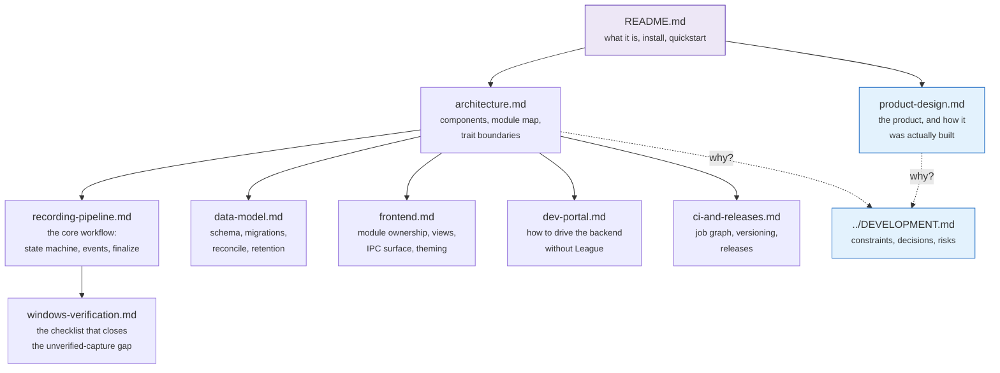

# Documentation

Two kinds of document live here, and the split matters:

- **[product-design.md](product-design.md)** is the *what and why, at product
  level* — the problem, the decisions that shaped the build, and the
  implementation history phase by phase. It also holds the project's phase
  numbering, which no longer appears in source comments.
- **[DEVELOPMENT.md](../DEVELOPMENT.md)** (repo root) is the *why* — hard
  constraints, decisions, alternatives rejected, risks. Its section numbers
  (`§2.2`, `§3.4`, …) are referenced from ~35 source comments, so **do not
  renumber them**.
- **These files** are the *what and how* — diagrams, module maps, runtime
  flows. Update them when behaviour changes.

## Map

| Read this | If you are |
|---|---|
| [architecture.md](architecture.md) | New to the codebase, or looking for where something lives |
| [recording-pipeline.md](recording-pipeline.md) | Touching `state_machine/`, `lcu/`, `live_client/` or `recorder/` |
| [data-model.md](data-model.md) | Touching `db/` or `retention.rs`, or adding a migration |
| [frontend.md](frontend.md) | Touching anything under `src/` |
| [dev-portal.md](dev-portal.md) | Trying to exercise the backend without League running |
| [ci-and-releases.md](ci-and-releases.md) | Touching `.github/workflows/`, or cutting a release |
| [windows-verification.md](windows-verification.md) | Sitting in front of the Windows box |
| [product-design.md](product-design.md) | Asking what this product is, or how and in what order it got built |
| [DEVELOPMENT.md](../DEVELOPMENT.md) | About to argue with a decision |

## Keeping these current

[CLAUDE.md](../CLAUDE.md) maps each area of the codebase to the documents that
describe it. A change to behaviour and the doc update that reflects it belong
in the **same commit** — a diagram that lies is worse than no diagram.

Diagrams are [Mermaid](https://mermaid.js.org/) in fenced code blocks, which
GitHub renders natively. No image files, no external tooling, and a diagram
diffs as text in review.
