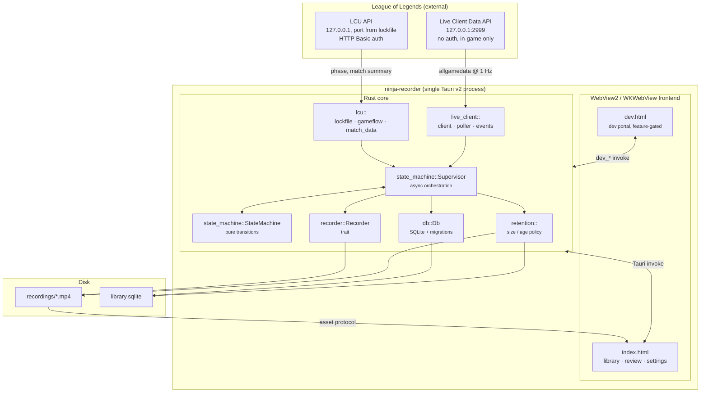
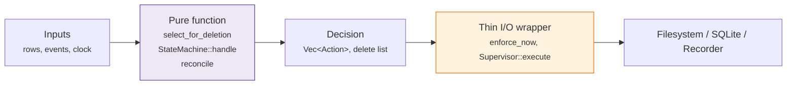
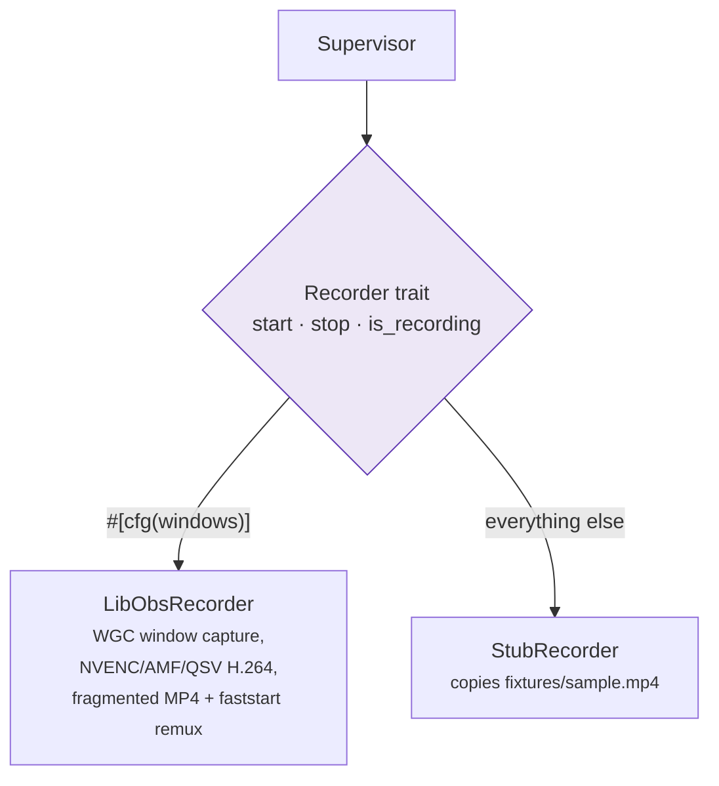
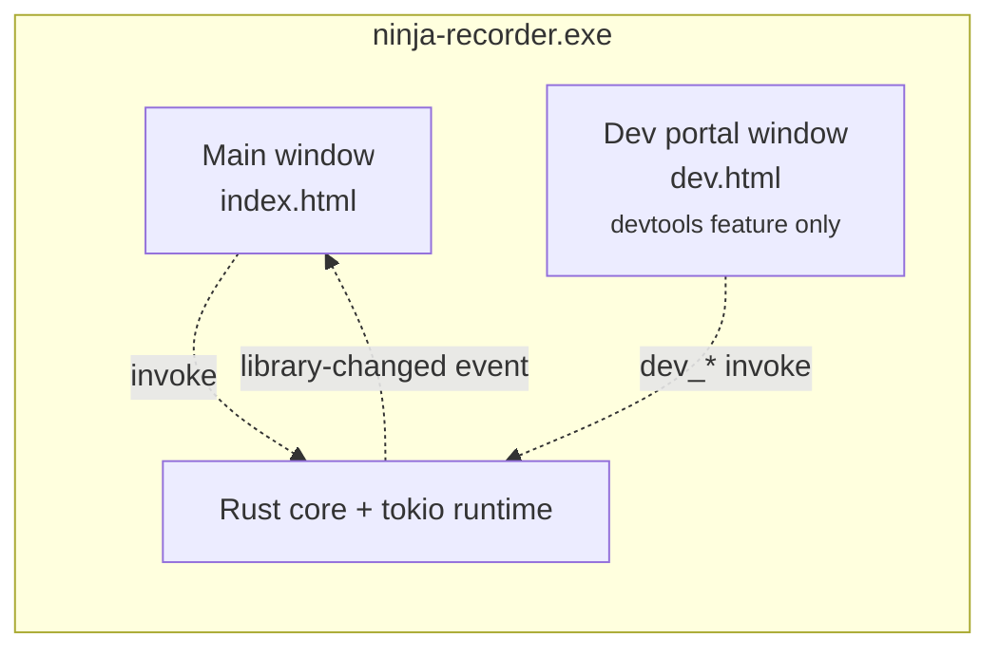

# Architecture

How the pieces fit together, what owns what, and where a given behaviour
lives in the tree. Start here; [recording-pipeline.md](recording-pipeline.md)
then walks the runtime path end to end.

For the *reasoning* behind these choices — why libobs, why no injection, why
Tauri — read [DEVELOPMENT.md](../DEVELOPMENT.md). This file describes the
shape; that one defends it.

---

## The whole system at a glance

One process, two windows, three external interfaces (two local HTTP APIs and
the filesystem).

## Rust module map

| Module | Owns | Key entry points |
|---|---|---|
| `lcu/lockfile.rs` | Finding the running client and its credentials | `discover`, `watch` |
| `lcu/gameflow.rs` | Phase changes (WebSocket, polling fallback) | `watch` |
| `lcu/match_data.rs` | Post-game summary (champion, KDA, win) | `fetch_match_summary` |
| `lcu/client.rs` | HTTPS + Basic auth against the client's self-signed cert | `LcuHttpClient` |
| `live_client/client.rs` | Port 2999 HTTPS client | `fetch_all_game_data` |
| `live_client/poller.rs` | 1 Hz poll loop with exponential backoff (cap 10 s) | `watch` |
| `live_client/events.rs` | Snapshot → markers, team-advantage samples, video-time alignment | `MarkerTracker`, `TimeAlignment`, `team_diff` |
| `state_machine/machine.rs` | The pure `(state, event) → (state, actions)` function | `StateMachine::handle` |
| `state_machine/supervisor.rs` | Spawning/aborting watchers, driving the recorder, finalizing | `Supervisor` |
| `recorder/mod.rs` | The `Recorder` trait and its config/error types | `Recorder`, `RecordConfig` |
| `recorder/libobs/` | Windows capture backend (WGC + hardware encode) | `LibObsRecorder` |
| `recorder/stub.rs` | Dev/macOS backend that copies a fixture MP4 | `StubRecorder` |
| `db/mod.rs` | Schema, migrations, every query | `Db` |
| `db/reconcile.rs` | Reconciling DB rows against files on disk | `reconcile` |
| `retention.rs` | Deletion policy and free-space preflight | `select_for_deletion`, `enforce_now`, `has_room_to_record` |
| `fixtures.rs` | Capturing live API responses to `fixtures/` | `enabled`, `record` |
| `dev/` | Dev portal backend, compiled out without `--features devtools` | `dev_*` commands |
| `lib.rs` | Tauri setup, app state, the command surface | `run` |

The consistent shape across `state_machine`, `db::reconcile` and `retention`
is **a pure decision function plus a thin I/O wrapper**. The decision is unit
tested directly; the wrapper is deliberately kept too small to hide a bug.

## The `Recorder` trait boundary

Capture is the only genuinely platform-specific part of the app, so it sits
behind a three-method trait and nothing above it knows libobs exists.

The stub is not a mock — it writes a real, playable file into the real
recordings directory and takes a real amount of time to do it. That is what
keeps the library, retention, review player and the whole state machine
developable on macOS with no Windows box in the loop.

## Frontend

Vanilla TypeScript, no framework, split by **state ownership** rather than by
widget — see [frontend.md](frontend.md) for the module graph and the IPC
surface.

## Process and window model

Both windows talk to the same Rust state and the same database. The dev
portal is a second Vite entry point gated on the `NINJA_DEVTOOLS` env var and
a second command set gated on the `devtools` Cargo feature — a plain
`npm run build` cannot emit it, and a default `cargo build` cannot register
its commands. See [dev-portal.md](dev-portal.md).
