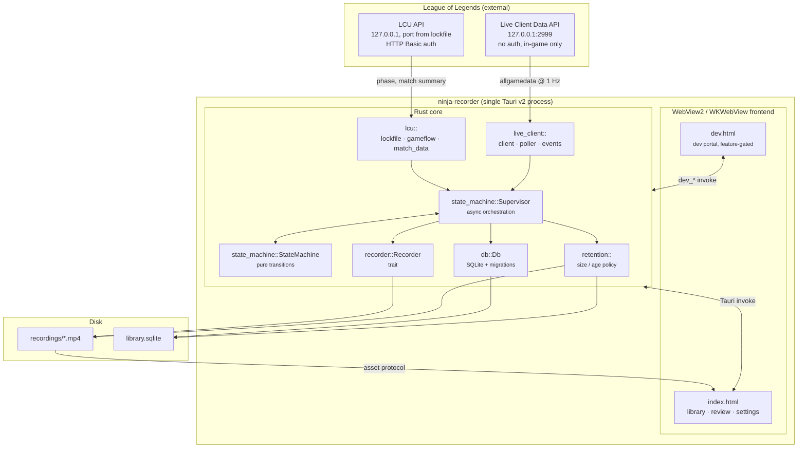
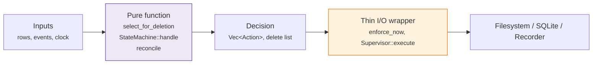
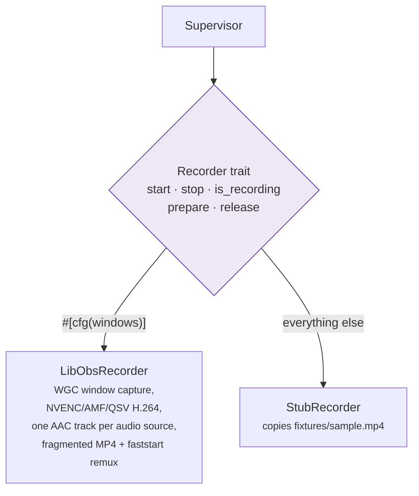
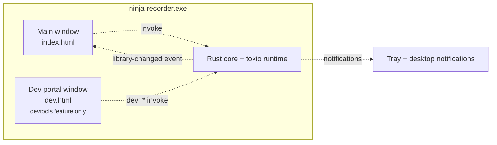

# Architecture

How the pieces fit together, what owns what, and where a given behaviour
lives in the tree. Start here; [recording-pipeline.md](recording-pipeline.md)
then walks the runtime path end to end.

For the *reasoning* behind these choices — why libobs, why no injection, why
Tauri — read [DEVELOPMENT.md](../DEVELOPMENT.md). This file describes the
shape; that one defends it.

---

## The whole system at a glance

One process, two windows, three external interfaces (two local HTTP APIs and
the filesystem).

## Rust module map

| Module | Owns | Key entry points |
|---|---|---|
| `lcu/lockfile.rs` | Finding the running client and its credentials | `discover`, `watch` |
| `lcu/gameflow.rs` | Phase changes (WebSocket, polling fallback), and which game is running | `watch`, `fetch_session` |
| `lcu/match_data.rs` | Post-game summary (champion, KDA, win) | `fetch_match_summary` |
| `lcu/client.rs` | HTTPS + Basic auth against the client's self-signed cert | `LcuHttpClient` |
| `live_client/client.rs` | Port 2999 HTTPS client | `fetch_all_game_data` |
| `live_client/poller.rs` | 1 Hz poll loop with exponential backoff (cap 10 s) | `watch` |
| `live_client/events.rs` | Snapshot → markers, team-advantage samples, the match summary, video-time alignment | `MarkerTracker`, `TimeAlignment`, `team_diff`, `self_summary` |
| `state_machine/machine.rs` | The pure `(state, event) → (state, actions)` function | `StateMachine::handle` |
| `state_machine/supervisor.rs` | Spawning/aborting watchers, driving the recorder, finalizing | `Supervisor` |
| `recorder/mod.rs` | The `Recorder` trait and its config/error types | `Recorder`, `RecordConfig` |
| `recorder/libobs/` | Windows capture backend (WGC + hardware encode) | `LibObsRecorder` |
| `recorder/stub.rs` | Dev/macOS backend that copies a fixture MP4 | `StubRecorder` |
| `db/mod.rs` | Schema, migrations, every query | `Db` |
| `db/reconcile.rs` | Reconciling DB rows against files on disk | `reconcile` |
| `retention.rs` | Deletion policy and free-space preflight | `select_for_deletion`, `enforce_now`, `has_room_to_record` |
| `fixtures.rs` | Capturing live API responses to `fixtures/` | `enabled`, `record` |
| `dev/` | Dev portal backend, compiled out without `--features devtools` | `dev_*` commands |
| `core/mod.rs` | Every command's logic, with no `tauri` types in any signature | `Ctx`, the command free functions |
| `launch.rs` | Which mode argv asked for (`--daemon`, `--hidden`), and the flag constants autostart registers | `Launch::from_env`, `HIDDEN_FLAG` |
| `tray.rs` | The tray icon and its Open / Settings / Quit menu. No tests, deliberately | `build`, `request_quit` |
| `notify.rs` | Desktop notifications, best-effort. No tests, deliberately | `notify`, `close_to_tray_notice` |
| `lib.rs` | Tauri setup, app state, the `rpc` command, and main-window creation | `run` |

`core` exists because Tauri v2 cannot invoke a registered command by name from
Rust, so a windowless recorder daemon could not reuse `#[tauri::command]`
functions at all ([DEVELOPMENT.md §12](../DEVELOPMENT.md#12-process-model-a-recorder-daemon-and-a-ui-that-can-leave)).
`AppState` is a newtype that `Deref`s to `core::Ctx`. Two commands stay in
`lib.rs` rather than moving down — `open_recordings_folder` and
`dev_open_portal` — because they drive the desktop shell.

Anything `core` needs that only an `AppHandle` can do crosses the same way: a
trait object or a closure held by `Ctx` and installed from `lib.rs`'s `setup`.
There are two — `set_library_changed_notifier` (emitting the Tauri event) and
`set_autostart` (the `Autostart` trait over `tauri-plugin-autostart`). Both are
`None` in a unit test, which for autostart is load-bearing: `cargo test` has no
way to write a real login entry.

The consistent shape across `state_machine`, `db::reconcile` and `retention`
is **a pure decision function plus a thin I/O wrapper**. The decision is unit
tested directly; the wrapper is deliberately kept too small to hide a bug.

## The `Recorder` trait boundary

Capture is the only genuinely platform-specific part of the app, so it sits
behind a three-method trait and nothing above it knows libobs exists.

The stub is not a mock — it writes a real, playable file into the real
recordings directory and takes a real amount of time to do it. That is what
keeps the library, retention, review player and the whole state machine
developable on macOS with no Windows box in the loop.

`prepare`/`release` exist because the Windows backend is expensive to hold:
bringing it up spawns the out-of-process worker *and* initializes libobs, so a
warm backend is a GPU device and every plugin resident in another process. The
supervisor warms it when the League client appears and drops it when the client
goes away, off the resulting state rather than off individual actions
([DEVELOPMENT.md §2.2](../DEVELOPMENT.md#22-the-recorder-trait)). Both default
to no-ops, so `StubRecorder` ignores them entirely.

`start` takes the user's audio preset and `stop` reports the track layout it
actually wrote — reported, not assumed, because a microphone can be unplugged
mid-game and the library row has to describe the file that exists
([DEVELOPMENT.md §2.5](../DEVELOPMENT.md#25-multi-track-audio)). Both types are
plain Rust in `recorder/audio.rs`; the libobs vocabulary stops at
`to_obs_tracks`, so nothing above the trait grows a libobs dependency.

## Frontend

Vanilla TypeScript, no framework, split by **state ownership** rather than by
widget — see [frontend.md](frontend.md) for the module graph and the IPC
surface.

## Process and window model

The main window is built in `lib.rs`'s `setup` rather than declared in
`tauri.conf.json`, whose `app.windows` is empty — Tauri creates config windows
automatically before `setup`, and a `--hidden` start needs to create none at
all ([DEVELOPMENT.md §12](../DEVELOPMENT.md#12-process-model-a-recorder-daemon-and-a-ui-that-can-leave)).

Neither child process the app spawns shows a window of its own: the fork
builds `extprocess_recorder.exe` as a Windows-subsystem binary for release,
and every launch of the bundled ffmpeg goes through `lib.rs`'s
`ffmpeg_command`, which sets `CREATE_NO_WINDOW`
([DEVELOPMENT.md §2.2](../DEVELOPMENT.md#22-the-recorder-trait)).

Both windows talk to the same Rust state and the same database. The dev
portal is a second Vite entry point gated on the `NINJA_DEVTOOLS` env var and
a second command set gated on the `devtools` Cargo feature — a plain
`npm run build` cannot emit it, and a default `cargo build` cannot register
its commands. See [dev-portal.md](dev-portal.md).
