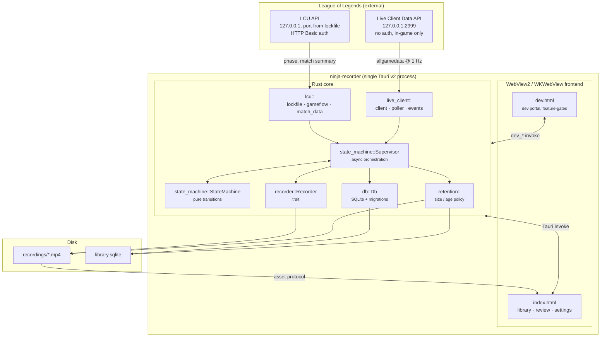
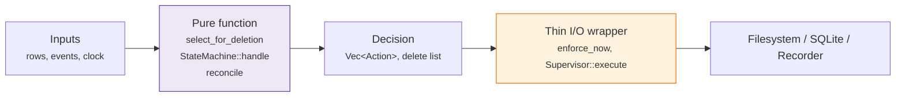
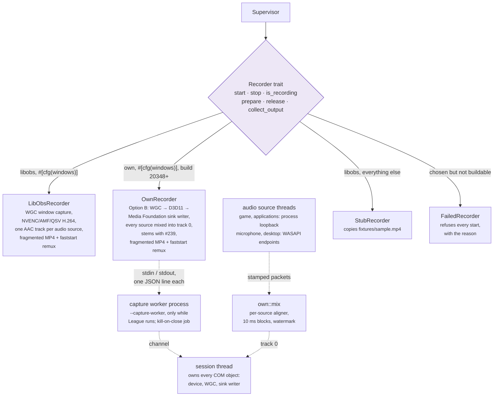
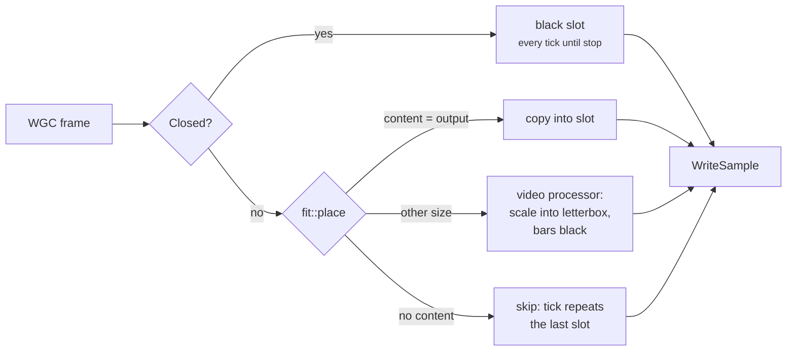
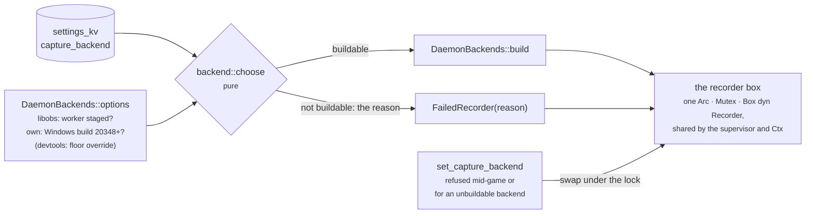
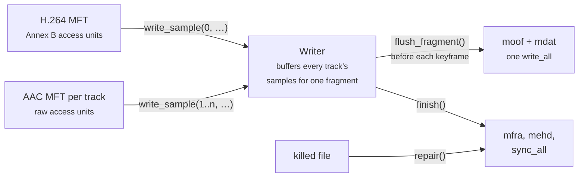
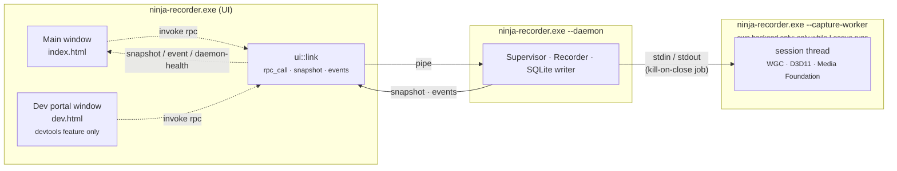
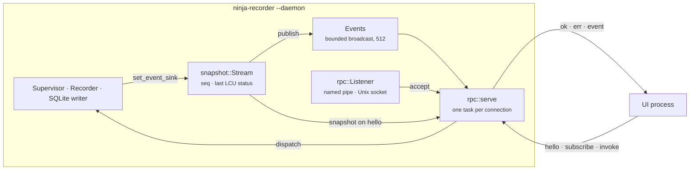

# Architecture

How the pieces fit together, what owns what, and where a given behaviour
lives in the tree. Start here; [recording-pipeline.md](recording-pipeline.md)
then walks the runtime path end to end.

For the *reasoning* behind these choices: why libobs, why no injection, why
Tauri: read [DEVELOPMENT.md](../DEVELOPMENT.md). This file describes the
shape; that one defends it.

---

## The whole system at a glance

One process, two windows, three external interfaces (two local HTTP APIs and
the filesystem).



## Rust module map

| Module | Owns | Key entry points |
|---|---|---|
| `lcu/lockfile.rs` | Finding the running client and its credentials | `discover`, `watch` |
| `lcu/gameflow.rs` | Phase changes (WebSocket, polling fallback), and which game is running | `watch`, `fetch_session` |
| `lcu/match_data.rs` | Post-game summary from the end-of-game block, then match history (win, KDA, champion id, queue, role, patch) | `fetch_match_summary` |
| `lcu/champions.rs` | Champion id → display name, from the client's asset store, cached per client session | `champion_name` |
| `lcu/client.rs` | HTTPS + Basic auth against the client's self-signed cert | `LcuHttpClient` |
| `live_client/client.rs` | Port 2999 HTTPS client | `fetch_all_game_data` |
| `live_client/poller.rs` | 1 Hz poll loop with exponential backoff (cap 10 s) | `watch` |
| `live_client/events.rs` | Snapshot → markers, team-advantage samples, the match summary, video-time alignment | `MarkerTracker`, `TimeAlignment`, `team_diff`, `self_summary` |
| `state_machine/machine.rs` | The pure `(state, event) → (state, actions)` function | `StateMachine::handle` |
| `state_machine/supervisor.rs` | Spawning/aborting watchers, driving the recorder, finalizing | `Supervisor` |
| `recorder/mod.rs` | The `Recorder` trait and its config/error types | `Recorder`, `RecordConfig` |
| `recorder/backend.rs` | The `capture_backend` setting, and the pure choice of which backend to build from it | `CaptureBackend`, `choose`, `construct`, `Backends` |
| `recorder/libobs/` | Windows capture backend (WGC + hardware encode) | `LibObsRecorder` |
| `recorder/window.rs` | Finding the League game window and its client size, for both Windows backends | `find_window`, `find_by_class`, `client_size` |
| `recorder/own/` | Option B, the target backend (WGC → D3D11 → Media Foundation), being built through WS1.6. Constructible since #236 on Windows build 20348+: the game window's video and every source the audio preset names (the game by process loopback since #237; the microphone, the desktop and applications since #238), through Media Foundation's sink writer. Track 0 only, the mix, until the stems arrive with #239; selected only by a devtools build until #243 | `OwnRecorder` |
| `recorder/own/clock.rs` | The video tick grid on QPC, and placing audio packets on it: drift measured, corrected by slipping frames, or trusted from the device count when a source has no QPC stamps. Which of the two a source gets is decided from its first packet's stamp | `tick_time`, `ticks_due`, `Aligner`, `check_stamp`, `Stamper`, `DeviceTimeline` |
| `recorder/own/feed.rs` | One audio source's packets through its own `Aligner` into the mixer: never past the video, held with silence to the mixer's watermark while the source is quiet, padded to the last tick at stop | `Feed`, `Packet` |
| `recorder/own/fit.rs` | Where a frame from a resized game window goes in the fixed-size output: scaled with its aspect kept, centred, black around it, even dimensions and offsets; and whether a frame is copied, scaled or skipped | `letterbox`, `place`, `Placement` |
| `recorder/own/mix.rs` | Track 0: every source's aligned stream summed in fixed 10 ms blocks, clamped, then i16. A block is mixed once every source has delivered it or a watermark 150 ms behind now has passed it, so a silent, missing or unplugged source is silence and never a stall; never past the video, and ended on the last tick | `Mixer`, `Mixdown`, `LATENCY` |
| `recorder/own/pcm.rs` | Endpoint sample formats to stereo f32 for the mixer (or i16), and the mix back to i16 | `to_stereo_f32`, `f32_to_i16` |
| `recorder/own/plan.rs` | A preset's `AudioLayout` to a `CapturePlan`: the sources to open, each once, and what each written track sums (track 0 only until #239; the Desktop mix is the desktop alone). `realised_layout` drops a source that failed to open with its stem and reindexes, so `stop` reports the file that exists | `plan`, `CapturePlan`, `realised_layout`, `TRACKS_WRITTEN` |
| `recorder/own/root.rs` | Which process tree a process-loopback capture targets, from a process snapshot: the game (the window's owner, checked against `League of Legends.exe`), or the top of an application's tree (Discord, since #238). Reused parent PIDs are caught by creation time | `game_root`, `application_root` |
| `recorder/own/select.rs` | Which H.264 encoder: hardware by adapter vendor (NVIDIA → AMD → Intel), the software MFT only as a marked fallback; the Windows build floor (20348) and its devtools-only override; a preset's checked audio layout (every preset since #238) | `rank`, `Choice`, `availability`, `floor_ignored`, `audio_layout` |
| `recorder/own/status.rs` | The even frame size, whether the encoder Media Foundation loaded is the one `rank` chose, and the backend's name (`own (ready: …)`, `own (software encoding: …)`, `own (unavailable: …)`) | `even_size`, `check_loaded`, `Status` |
| `recorder/own/win/` | Everything that calls Windows, and the only part of `own/` gated to it: the adapters and D3D11 device, the WGC capture with its border off, `scale` (frames into the fixed-size slots: a copy, or the D3D11 video processor when the window has been resized; the processor is shared with #239's BGRA → NV12), the process table, one thread per audio source (the game and applications by process loopback, include mode; the microphone and the desktop from their endpoints, the desktop with a silent keep-alive; all 48 kHz stereo float), track 0's `MixTrack`, the sink writer (H.264 8 Mbps CBR, GOP 120, AAC 160 kbps, fragmented MP4), and the session thread that owns them, which runs in the capture worker (`host`: the session as the worker's `Host`). `OwnRecorder` is the daemon's thin client of that worker | `OwnRecorder`, `session::run`, `host::SessionHost`, `audio::start`, `audio::MixTrack`, `scale::Processor`, `scale::Fitter` |
| `recorder/own/worker/` | The capture worker, `ninja-recorder --capture-worker` (#241): the process the session thread runs in, spawned only while League runs. The line protocol both sides share, the worker's loop (EOF is a shutdown), the pure lifetime rule, and the daemon's client with its timeouts and its kill-on-close job object | `run`, `protocol::{Request, Reply}`, `serve::serve`, `lifetime::Lifetime`, `client::Worker` |
| `recorder/stub.rs` | Non-Windows dev backend that copies a fixture MP4 | `StubRecorder` |
| `recorder/remux.rs` | The faststart remux, a `-c copy` through `ffmpeg_command` that moves the index to the front so a fragmented file scrubs. Shared by both Windows backends' `stop` and startup recovery; the argument list is pure | `faststart_args`, `remux_faststart` |
| `mp4/read.rs` | Reading an MP4's top-level boxes directly, no ffmpeg: fragmented or not, how many whole fragments, how many audio tracks, and what a kill cut short | `summarize`, `Summary` |
| `mp4/write.rs` | The own backend's fragmented-MP4 muxer: one H.264 track and any number of AAC tracks, a `moof`+`mdat` per flush, an `mfra` at the end, and `repair` for a killed file. Pure Rust, no ffmpeg; nothing calls it until #239 ([DEVELOPMENT.md §2.5](../DEVELOPMENT.md#25-multi-track-audio)) | `Writer`, `Track`, `repair` |
| `ddragon.rs` | Champion art from Data Dragon, fetched on first use and cached on disk | `champion_icon` |
| `db/mod.rs` | Schema, migrations, every query | `Db` |
| `db/reconcile.rs` | Reconciling DB rows against files on disk, and finishing and remuxing the recordings a dead daemon left open | `reconcile`, `recover_unfinished`, `recovery_action` |
| `probe.rs` | Reading a container's duration back out with ffmpeg, for files `reconcile` imported | `duration_s` |
| `match_summary.rs` | Waiting out the LCU after a finalize, then patching the row with what it eventually says | `patch`, `next_delay` |
| `retention.rs` | Deletion policy and free-space preflight | `select_for_deletion`, `enforce_now`, `has_room_to_record` |
| `log.rs` | The log file under `app_data_dir()/logs/`, which is `ui.log` or `daemon.log` depending on which process is writing (`ui-devtools.log` and `daemon-devtools.log` in a devtools build, #202), kept in release builds too, and the `error!`/`warn!`/`info!`/`debug!` macros everything else writes through | `init`, `write`, `Process` |
| `fixtures.rs` | Capturing live API responses to `fixtures/` | `enabled`, `record` |
| `dev/` | Dev portal backend, compiled out without `--features devtools` | `dev_*` commands |
| `dev/dispatch.rs` | Name-and-JSON dispatch over the `dev_*` commands that run in the daemon | `dispatch_dev`, `is_async_dev_command` |
| `core/mod.rs` | Every command's logic, with no `tauri` types in any signature | `Ctx`, the command free functions |
| `launch.rs` | Which mode argv asked for (`--daemon`, or nothing), and the flag constant autostart registers | `Launch::from_env`, `DAEMON_FLAG` |
| `daemon/mod.rs` | The headless process: paths without an `AppHandle`, the startup and shutdown order, and everything the UI's `setup` does minus the window | `run`, `Paths`, `IDENTIFIER` |
| `daemon/rpc.rs` | The wire protocol, the endpoint's name, the listener that owns it, and the client's way in | `serve`, `endpoint`, `Listener`, `connect` |
| `daemon/snapshot.rs` | The event stream's position and the state a `hello` is answered with | `Stream`, `Stream::source` |
| `daemon/spawn.rs` | Connecting to the daemon, and starting one when nothing answers; and the reverse, the daemon starting a UI | `connect_or_start`, `start_ui` |
| `daemon/pump.rs` | The tray and the Win32 message loop it needs | `run`, `should_confirm_quit` |
| `daemon/notify.rs` | Desktop notifications, from the process that noticed | `notify`, `on_supervisor_event` |
| `daemon/log_bridge.rs` | The receiver for the `log` facade the capture crates write through: libobs's info and warnings, which arrive as `ipc-link`'s `[rec]:` lines, go to the libobs log file, the capture crates' other records to `daemon.log`, and anything else only at warn or above | `install`, `route` |
| `daemon/update.rs` | The update check, and the download-verify-install path | `spawn_checks`, `install` |
| `ui/client.rs` | The UI's side of the pipe: reply routing, reconnect, version-skew refusal | `spawn`, `Client` |
| `ui/link.rs` | That client hung off a Tauri app: the `rpc_call` proxy, and the daemon's pushes re-emitted to the webview | `attach`, `rpc_call`, `rpc_subscribe` |
| `tray.rs` | The tray icon and its Open / Settings / Quit menu. No tests, deliberately | `build`, `request_quit` |
| `notify.rs` | Desktop notifications, best-effort. No tests, deliberately | `notify`, `close_to_tray_notice` |
| `lib.rs` | Tauri setup, app state, the `rpc` command, and main-window creation | `run` |

`core` exists because Tauri v2 cannot invoke a registered command by name from
Rust, so a windowless recorder daemon could not reuse `#[tauri::command]`
functions at all ([DEVELOPMENT.md §12](../DEVELOPMENT.md#12-process-model-a-recorder-daemon-and-a-ui-that-can-leave)).
`AppState` is a newtype that `Deref`s to `core::Ctx`. Two commands stay in
`lib.rs` rather than moving down: `open_recordings_folder` and
`dev_open_portal`: because they drive the desktop shell.

Anything `core` needs that only an `AppHandle` can do crosses the same way: a
trait object or a closure held by `Ctx` and installed from `lib.rs`'s `setup`.
There are two: `set_library_changed_notifier` (emitting the Tauri event) and
`set_autostart` (the `Autostart` trait over `tauri-plugin-autostart`). Both are
`None` in a unit test, which for autostart is load-bearing: `cargo test` has no
way to write a real login entry. The daemon fills the first with a publish onto
the wire instead of a Tauri emit, which is what those seams were shaped for, and
leaves the second unset until 3.5 moves autostart out of the UI.

The consistent shape across `state_machine`, `db::reconcile` and `retention`
is **a pure decision function plus a thin I/O wrapper**. The decision is unit
tested directly; the wrapper is deliberately kept too small to hide a bug.



## The `Recorder` trait boundary

Capture is the only genuinely platform-specific part of the app, so it sits
behind a three-method trait and nothing above it knows libobs exists.



The stub is not a mock: it writes a real, playable file into the real
recordings directory and takes a real amount of time to do it. That is what
keeps the library, retention, review player and the whole state machine
developable away from Windows, with no Windows box in the loop.

`prepare`/`release` exist because the Windows backend is expensive to hold:
bringing it up spawns the out-of-process worker *and* initializes libobs, so a
warm backend is a GPU device and every plugin resident in another process. The
supervisor warms it when the League client appears and drops it when the client
goes away, off the resulting state rather than off individual actions
([DEVELOPMENT.md §2.2](../DEVELOPMENT.md#22-the-recorder-trait)). Both default
to no-ops, so `StubRecorder` ignores them entirely.

The own backend keeps the same shape, with its worker spawned on demand too.
`OwnRecorder` holds the capture worker's child process, its job object and its
pipes, and nothing else; the session thread runs in the worker
(`ninja-recorder --capture-worker`, #241) and owns the D3D11 device, the WGC
capture and the sink writer, so the recorder stays `Send` under the
supervisor's mutex and a driver fault in an encoder ends the worker rather than
the daemon. `prepare` spawns the worker and warms the thread (COM, Media
Foundation, `select::rank`, the device), `start` plans the sources the preset
names (`select::audio_layout`, `plan::plan`, sent to the worker with the path),
spawns the worker if `prepare` did not, waits at most about three seconds for
the game window's first frame, starts the audio sources, and then takes the
file's t = 0 as its last act, `stop` finalizes and
remuxes, and `release` ends the worker (after the `stop`, if a recording is in
flight). A worker that dies mid-recording is logged with its exit code, and
`stop` hands over what reached the disk, remuxed, rather than an error; the
next `prepare` spawns a fresh one
([DEVELOPMENT.md §12](../DEVELOPMENT.md#the-capture-worker-a-third-mode-and-only-while-league-runs-241)).

The game's audio has a thread of its own, started for each recording. It
finds the process tree to capture from the window being recorded
(`root::game_root` over a Toolhelp snapshot), captures it by process loopback,
stamps each packet (`clock::Stamper`: QPC if the first packet's stamp is real,
the sample count if not, logged either way), and sends it to the session
thread, whose `feed::Feed` writes it into the sink writer's AAC stream no
further than the video has got. A capture that cannot start leaves the
recording video only, and `stop` reports no audio track
([DEVELOPMENT.md §2.5](../DEVELOPMENT.md#the-own-backend-captures-each-source-itself),
[§16](../DEVELOPMENT.md#the-qpc-question-and-how-a-recording-answers-it)).

```mermaid
sequenceDiagram
    participant S as Supervisor
    participant R as OwnRecorder
    participant W as capture worker
    participant T as session thread
    participant A as game audio thread
    S->>R: prepare() (the client opened)
    R->>W: spawn --capture-worker, into the job; hello
    W-->>R: hello (protocol, pid)
    R->>T: Prepare (a line on stdin, then the channel)
    T-->>R: status (ranked encoder)
    S->>R: start(config)
    Note over R: preset must be Game
    R->>T: Start { path }
    Note over T: find window, WGC first frame
    T->>A: start (root::game_root of the window's owner)
    A-->>T: process loopback running
    Note over T: sink writer up (H.264 + AAC),<br/>loaded encoder checked
    T-->>R: status (loaded encoder), game audio on
    R->>T: origin = QPC now (last act of start)
    R-->>S: Ok, record_started_at stamped
    loop every tick due on the 60 fps grid
        T->>T: newest WGC frame → slot → WriteSample
        A-->>T: packets, stamped qpc or device
        T->>T: Feed: packets up to the last tick → AAC
    end
    S->>R: stop()
    R->>T: Stop
    T->>A: stop (after the last tick's packets, 200 ms at most)
    Note over T: audio padded to the last tick,<br/>clock line logged, finalized
    T-->>R: finalized
    R->>R: faststart remux (1 audio track)
    R-->>S: RecordingOutput (Game track, or none)
    S->>R: release() (the client closed)
    R->>W: Release
    W->>T: Release: finalize anything in flight, tear down
    W-->>R: exits 0
```

The output size is fixed at `start` and the game window is not (#240). Each
WGC frame goes through `scale::Fitter`, which asks `fit::place` what to do
with it: the recording's own size (give or take the pixel an odd window was
rounded down by) is a plain GPU copy, any other size is scaled by the D3D11
video processor into `fit::letterbox`'s rectangle with black bars around it,
and a frame with no content is skipped. A minimised window sends no frames,
so the ticks repeat the last one. WGC's `Closed` (the game ended or crashed)
does not end the loop: it writes black until the supervisor's `stop`, which
comes when the Live Client API goes away, and the game audio carries on under
it, held with silence once the game has gone. A lost GPU device
(`DXGI_ERROR_DEVICE_REMOVED`, `_RESET`) does end it, with what was written
finalized, and `stop` waits at most 20 s for the capture worker whatever
happens: a worker wedged in a driver past that is killed and its file kept, so
it cannot hold the supervisor.



`collect_output` is the third default no-op, and the supervisor calls it every
fifth Live Client poll while a recording runs. The libobs worker's info and
warnings come up its IPC pipe and are only read while a command waits for a
reply, so the libobs backend answers it with an `IsRecording` round trip: that
moves them into the libobs log mid-game, and a worker that says it has stopped
gets one warning. `try_lock`, so a recorder busy starting or stopping is
skipped rather than waited for (#221).

`start` takes the user's audio preset and `stop` reports the track layout it
actually wrote: reported, not assumed, because a microphone can be unplugged
mid-game and the library row has to describe the file that exists
([DEVELOPMENT.md §2.5](../DEVELOPMENT.md#25-multi-track-audio)). Both types are
plain Rust in `recorder/audio.rs`; the libobs vocabulary stops at
`to_obs_tracks`, so nothing above the trait grows a libobs dependency.

### Which backend is behind it

The daemon decides, from the `capture_backend` setting (`libobs` or `own`,
in `settings_kv`), and nothing above the trait can tell which one it got. The
UI process never links any of them: it holds a `FailedRecorder` whose reason
is that it does not record.



- **At startup** the daemon reads the setting once, `choose`s, and builds.
  The log's `[recorder] backend:` line names the result and the setting.
- **A change** through `set_capture_backend` is saved and swapped into the
  shared box at once, so it is the **next recording** that uses it. It is
  refused while a game is loading, recording or finalizing, by the same rule
  the updater uses, and the swap happens under the recorder lock that `start`
  takes, so a recording is never switched under.
- **The default is `libobs` until #243**, WS1.6's last piece, which flips it
  to `own`. Since #236 `DaemonBackends` offers `own` wherever
  `select::availability` passes (Windows build 20348 or newer) and builds an
  `OwnRecorder` for it; off Windows it is listed as unavailable, with the
  reason. Whether the machine has an encoder is the backend's own answer, in
  its name, once `prepare` has run. A **devtools** build started with
  `NINJA_OWN_IGNORE_OS_FLOOR=1` offers `own` below the floor too, with a
  warning in `daemon.log`, for #237's Windows 10 test; a release build never
  reads the variable.
- **A chosen backend that cannot be built is refused, never replaced by the
  other one.** The UI shows it disabled with the daemon's reason, so in
  practice this is only reached by a row written some other way.
- **The Settings row is devtools-only until #243**, which un-hides it. The
  setting and the commands are live in every build.

The reasoning is
[DEVELOPMENT.md §16, "The switch, and when it applies"](../DEVELOPMENT.md#the-switch-and-when-it-applies).

### The own backend's file writer

Media Foundation's MP4 sinks hold one audio stream, so the own backend writes
its files with `mp4::write` ([DEVELOPMENT.md §2.5](../DEVELOPMENT.md#decision-the-own-backend-writes-its-own-mp4)).
It has no caller until #239. The caller buffers samples and flushes one
fragment per keyframe interval; each flush leaves a playable file on disk.



| On disk | When | Plays? |
|---|---|---|
| `ftyp` `moov` | after `Writer::create` | yes, empty |
| … `moof` `mdat` × n | after each `flush_fragment` | yes; seeks by scanning |
| … `mfra` | after `finish` or `repair` | yes; seeks by index |

- **Timescales**: video 90 kHz; audio its sample rate, so an AAC frame is
  exactly 1024 ticks; the movie (`mehd`) 1 kHz.
- **Track flags**: video and the first audio track are enabled, the stems are
  not, and all audio shares one alternate group, so a plain player picks
  track 0, the combined mix. This matches the default disposition the libobs
  remux sets.
- **B-frames** are written with signed composition offsets (`trun` version 1).
  Media Foundation's low-latency encoder emits none. The module header covers
  a one-frame presentation shift ffmpeg applies to such streams.
- **Durability**: a fragment reaches the OS before `flush_fragment` returns,
  so it survives the process being killed. There is no `fsync` per fragment;
  `finish` does one.

## Frontend

Vanilla TypeScript, no framework, split by **state ownership** rather than by
widget: see [frontend.md](frontend.md) for the module graph and the IPC
surface.

## Process and window model



The daemon may have a third process under it. With the own capture backend
selected, it spawns `ninja-recorder.exe --capture-worker` when the League client
opens and ends it when the client closes, so the session thread that holds the
capture's COM objects runs outside the daemon: a driver fault in an encoder
costs the worker and the recording keeps what reached the disk, but the daemon
carries on. It is a mode of the same binary, not a second bin target, and it
builds none of what the other two modes do: no lock, no tray, no database, no
pipe. The job object it sits in closes when the daemon does, so it cannot
outlive it. The libobs backend has had a worker process all along
(`extprocess_recorder.exe`), with its own lifetime
([DEVELOPMENT.md §12](../DEVELOPMENT.md#the-capture-worker-a-third-mode-and-only-while-league-runs-241)).

Since WS3.4 the window is a client. `invoke('rpc', ...)` reaches `ui::link`,
which forwards the name and arguments over the pipe and returns what the daemon
answered; nothing the frontend sends changed shape, which is what let every view
survive the move. In the other direction the daemon pushes: a snapshot on every
handshake and a stream of events after it, re-emitted to the webview as
`snapshot`, `event` and `daemon-health`.

**What the UI process no longer does.** It builds no capture backend, starts no
supervisor, runs no lockfile or gameflow watch, and performs no startup
reconcile or retention pass. Those all write or record, and both belong to the
process that outlives the window. Killing the UI now stops nothing.

It also cannot write to the library: `Db::open_read_only` gives it connections
with `query_only = ON`, including the one `write()` hands out, so a write path
that appeared in the wrong process would be refused by SQLite rather than
quietly racing the daemon. It runs no migrations either, for the same reason
and because migrations are a write.

The main window is built in `lib.rs`'s `setup` rather than declared in
`tauri.conf.json`, whose `app.windows` is empty. Tauri creates config windows
automatically before `setup`, so declaring one there would build it before the
code that decides its size and destination URL has run
([DEVELOPMENT.md §12](../DEVELOPMENT.md#12-process-model-a-recorder-daemon-and-a-ui-that-can-leave)).
The original reason was a windowless `--hidden` start, which #71 removed; the
tray's Open and the dev portal both build windows after startup too, so the
seam is still load-bearing.

### The daemon, and what of it exists

WS3 splits that one process in two. The daemon now runs: `--daemon` opens the
library, brings up the supervisor and the capture backend, binds the endpoint
and serves clients until it is asked to stop. The tray and its message pump
the updater (3.6) is not in it yet, and nothing starts it automatically: the
Run key still launches the UI.
[DEVELOPMENT.md §12](../DEVELOPMENT.md#12-process-model-a-recorder-daemon-and-a-ui-that-can-leave)
says what has to be true before that changes.

**The tray runs on the daemon's own message loop** (3.3). A tray icon's
messages arrive on the thread that created it, so the daemon's main thread
belongs to Win32 and the tokio runtime lives beside it; that is the concrete
reason `daemon::run` is not a `#[tokio::main]`. Open and Settings have to reach
a window in another process, which they do by publishing `Event::ShowUi` when a
UI is connected and starting one when none is. Quit asks first if a recording is
in flight, because that is the one thing quitting can lose.



**Startup order, and why it is that order.** The endpoint is bound before
anything else is opened, because binding it is also the single-instance check:
a second `--daemon` finds it owned and exits 0 without having touched the log
or the database. Only then does the daemon open `daemon.log`, open the library,
run the startup reconcile and retention passes, start the supervisor, and begin
accepting. Shutdown reverses it: stop accepting, publish `DaemonShuttingDown`,
then finalize whatever recording is in flight, because a game is worth more
than a fast exit.

**One endpoint, no separate mutex.** `rpc::Listener::bind` returns
`Ok(None)` when a daemon already owns the address: `first_pipe_instance` says so
on Windows, and on Unix a failed `bind` followed by a probe distinguishes a live
daemon from a socket file its owner left behind. The address itself is
`rpc::endpoint`, scoped by build identity, because a devtools build and a
release build must not share a pipe. It is `ninja-recorder.com.ninjarecorder.app.release`
or `...devtools`, the same names every shipped build has bound.

**No Tauri in the daemon.** It builds no `App`, so `daemon::Paths::resolve`
answers what the UI would ask an `AppHandle`: `dirs::data_dir()` joined with the
identifier, which is what Tauri's own `app_data_dir()` does, and the executable's
directory for bundled resources. **The UI resolves its data paths through the
same function**, not through `app.path()`, so one build's two processes cannot
disagree about where the library is.

**Each build has its own data folder** (#222). `daemon::IDENTIFIER` is
`com.ninjarecorder.app` in a release build and `com.ninjarecorder.app.devtools`
under `--features devtools`, matching `identifier` in `tauri.conf.json` and in
the `tauri.devtools.conf.json` overlay. A test pins both, because a mismatch
would not crash: the asset-protocol scope (`$APPDATA/recordings/*`) would name
a folder the library is not in, and the player could load nothing. Everything
under the folder is per build:

| Path, under `%APPDATA%\<identifier>\` | What |
|---|---|
| `library.sqlite3` | the database, and with it the resume sweep's rows |
| `recordings/` | every recording, and `recordings/audio-tracks/` |
| `fixtures/` | captured LCU / Live Client responses |
| `ddragon/` | the Data Dragon art cache |
| `logs/` | `daemon.log` / `ui.log` (release), `daemon-devtools.log` / `ui-devtools.log` (devtools), the own backend's capture worker's `worker.log` / `worker-devtools.log`, and the libobs worker's log |
| `daemon.<build>.sock` | the endpoint, on Unix only |

The recordings folder is not configurable, so the two builds cannot be pointed
at one folder by a setting. Tauri also keys the WebView2 profile
(`%LOCALAPPDATA%\<identifier>`), the id toasts are attributed to and the
uninstaller's "delete app data" option off the identifier, so those split too.

| Frame | Direction | Carries |
|---|---|---|
| `hello` | in | protocol version; must come first |
| `subscribe` | in | the topics this session wants, replacing what it had |
| `invoke` | in | a command name and its args, with an id |
| `hello` | out | the daemon's protocol version |
| `ok` / `err` | out | the reply, echoing the request's id |
| `event` | out | a contract event, with no id because nothing asked for it |

**It is generic over the stream, and that is the point.** Production is a
Windows named pipe and a Unix socket on a dev box; the tests drive the same
`serve` over a loopback socket in milliseconds, and over the real endpoint on
whichever platform they run. A protocol exercised only on the Windows box is one that gets
tested once a week, and the transport is the one part of the daemon that can be
checked honestly without Windows. Loopback rather than a Unix socket so the
tests also run in CI, which is Windows-only; one Unix-socket test is kept to
prove `serve` really is generic.

The reasoning behind the framing, the per-request ids, the bounded broadcast and
the version refusal is in
[DEVELOPMENT.md §17](../DEVELOPMENT.md#17-contract-and-transport).

Neither child process the app spawns shows a window of its own: the fork
builds `extprocess_recorder.exe` as a Windows-subsystem binary for release,
and every launch of the bundled ffmpeg goes through `lib.rs`'s
`ffmpeg_command`, which sets `CREATE_NO_WINDOW`
([DEVELOPMENT.md §2.2](../DEVELOPMENT.md#22-the-recorder-trait)).

Both windows talk to the same Rust state and the same database. The dev
portal is a second Vite entry point gated on the `NINJA_DEVTOOLS` env var and
a second command set gated on the `devtools` Cargo feature: a plain
`npm run build` cannot emit it, and a default `cargo build` cannot register
its commands. See [dev-portal.md](dev-portal.md).
