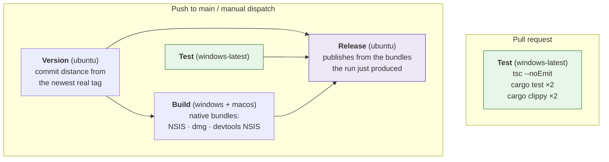
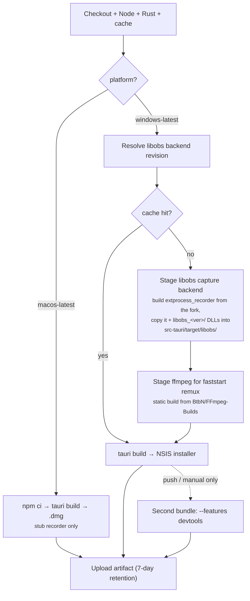
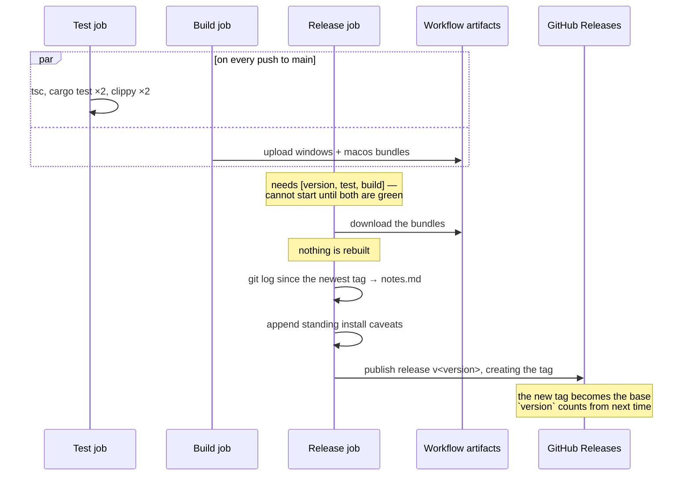

# CI and releases

One workflow, [`.github/workflows/ci.yml`](../.github/workflows/ci.yml), four
jobs. Installers are produced by CI, never built locally, and never
cross-compiled.

**Pull requests run `test` and nothing else.** Everything below the test job
is skipped until a commit reaches `main`.

---

## Job graph



### Why pull requests don't build

Three Tauri bundles — two of them Windows, each around six minutes — are the
overwhelming majority of this workflow's minute spend and its artifact
storage. Nothing consumes a PR's bundles: they are never released, and the
review that matters happens in the diff and in `test`.

A branch that genuinely needs an installer can still get the full matrix:

```bash
gh workflow run ci.yml --ref <branch>
```

### Why `build` doesn't need `test`

`build` deliberately does **not** `needs: test`. The two share no output, and
gating cost the whole test job in latency on every push to main before the
slow Windows bundle even started. Nothing unreviewed escapes, because
`release` needs both.

## Test

Windows only. The Rust half runs **twice**, once with `--features devtools`
and once without: an off-by-default feature is otherwise never compiled by CI,
and a broken `#[cfg]` would stay green until someone opened the portal. Same
for clippy, which runs with `-D warnings`.

macOS was dropped from this job — the work is platform-independent and GitHub
bills macOS runners at 10× against the free plan. `build` still compiles macOS
natively, so cfg'd breakage is still caught before a release.

## Version

The release version is minted **before anything compiles**, because it is
baked into the binary, the installer filename and the About block.

It is the commit's **distance from the newest real tag**, not "highest seen
plus one" — a pure function of the commit. Two consequences: simultaneous
pushes cannot claim the same version, and re-running a commit updates its own
release rather than minting a second one.

Publishing creates the tag, which becomes the base the next commit counts
from — so the minor version advances by one per commit on `main`, and the
sequence stays monotonic even if a run fails and never reaches `release`.

## Build



**Why the libobs runtime is staged outside Cargo.** The upstream reference
project pulls its recorder binary in through Cargo's artifact-dependency
feature (`artifact = "bin:..."`), which needs nightly Rust and the unstable
`bindeps` flag. `-Z bindeps` syntax in `Cargo.toml` breaks manifest parsing
*for every platform* — it would force every macOS developer's `cargo check`
onto nightly just to support an optional Windows-only binary. So CI builds the
fork's `extprocess_recorder` as a separate, ordinary `cargo build` and copies
the result into place. No Cargo dependency-graph involvement, stable Rust
throughout.

`tauri.windows.conf.json` bundles `src-tauri/target/libobs/` as a resource;
`LibObsRecorder::new` resolves it at runtime via Tauri's path resolver.
ffmpeg is resolved with `.ok()` — optional, so a failed download degrades to
unseekable-but-playable recordings rather than a broken build.

> Working on the capture backend locally on the Windows box means running the
> same clone-build-copy sequence by hand before `cargo run`. It is not
> scripted for local use yet.

## Release

Runs for every commit that lands on `main`, and for a manual dispatch that
opts in via the `publish_release` input.



**It publishes rather than drafts.** The `needs: [version, test, build]` gate
already withholds this job until `tsc`, `cargo test` and `clippy` have all
gone green on that exact commit, so "published" already means "tested". A
human clicking Publish afterwards added latency, not a check.

**Release notes** come from `git log` over the range since the previous
release, not GitHub's own generator — that one lists merged PRs only, and this
repo mixes PRs with commits pushed straight to `main`, which would silently go
unlisted. Merge commits and old version-bump commits are filtered out.

Because every successful run now creates a tag, each release's notes cover
exactly one commit's worth of changes — unless a run failed before reaching
this job, in which case the next one picks up the whole range since the last
tag.

**The devtools installer is never attached** to a release. See
[dev-portal.md](dev-portal.md).

## Signing

Neither build is code-signed — no certificate is configured. Windows
SmartScreen and macOS Gatekeeper both warn on first run. The standing caveat
block appended to every release's notes says so; keep it in sync with the real
status.

## macOS builds are a dev convenience

They exercise the stub recorder only. Real game capture is Windows-only, and
that is a hard constraint, not a gap — see
[DEVELOPMENT.md §1.1](../DEVELOPMENT.md#11-riot-vanguard-the-constraint-that-shapes-everything).
