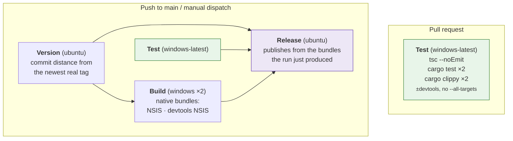
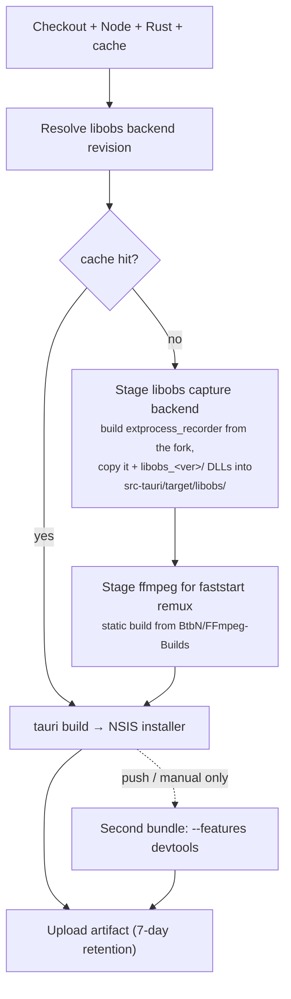
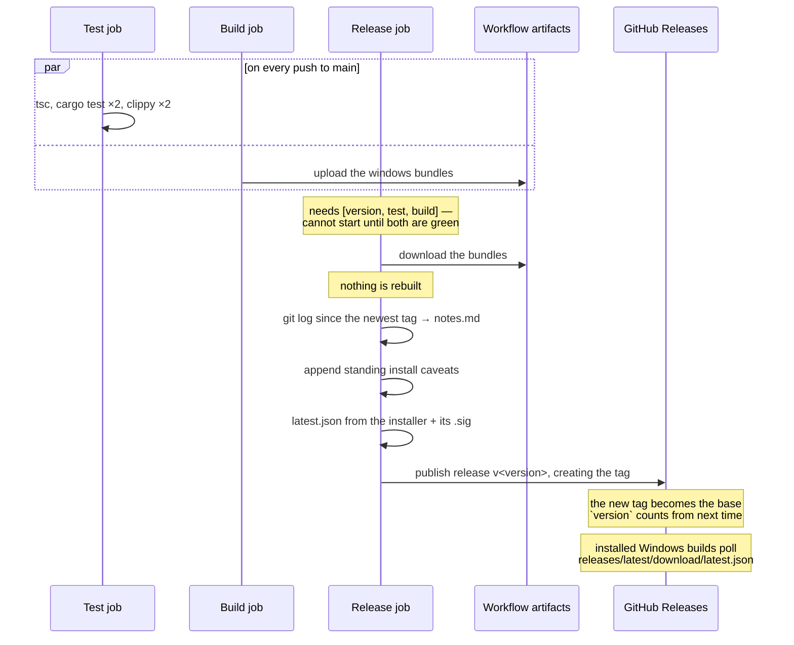

# CI and releases

One workflow, [`.github/workflows/ci.yml`](../.github/workflows/ci.yml), four
jobs. Installers are produced by CI, never built locally, and never
cross-compiled.

**Pull requests run `test` and nothing else.** Everything below the test job
is skipped until a commit reaches `main`.

---

## Job graph



### What `test` runs

`tsc --noEmit`, then the Rust half twice — with and without `--features
devtools` — for both `cargo test` and `cargo clippy -- -D warnings`. An
off-by-default feature is otherwise never compiled by CI, and a broken
`#[cfg]` would stay green until someone opened the dev portal
([DEVELOPMENT.md §9](../DEVELOPMENT.md#9-development-workflow)).

Clippy is **not** passed `--all-targets`, so the test targets are never
compiled and anything only the tests call is dead code under `-D warnings`.
A local run that adds `--all-targets` will not reproduce that failure.

### Why pull requests don't build

Three Tauri bundles — two of them Windows, each around six minutes — are the
overwhelming majority of this workflow's minute spend and its artifact
storage. Nothing consumes a PR's bundles: they are never released, and the
review that matters happens in the diff and in `test`.

A branch that genuinely needs an installer can still get the full matrix:

```bash
gh workflow run ci.yml --ref <branch>
```

### Why `build` doesn't need `test`

`build` deliberately does **not** `needs: test`. The two share no output, and
gating cost the whole test job in latency on every push to main before the
slow Windows bundle even started. Nothing unreviewed escapes, because
`release` needs both.

## Test

Windows only. The Rust half runs **twice**, once with `--features devtools`
and once without: an off-by-default feature is otherwise never compiled by CI,
and a broken `#[cfg]` would stay green until someone opened the portal. Same
for clippy, which runs with `-D warnings`.

Windows is now the only platform in the whole workflow. **Nothing in CI
compiles the non-Windows code paths any more** — `StubRecorder` and everything
behind `cfg(not(target_os = "windows"))` are what make `cargo test` work on a
dev box, and a break in them surfaces there rather than here. Accepted rather
than overlooked: the dev loop hits it within seconds of the change.

## Version and channels

Settled **before anything compiles**, because the version is baked into the
binary, the installer filename and the About block.

`package.json`'s version is what the project is *building toward*, and only
`npm run release -- next <x.y.z>` moves it. CI never invents one — see
[DEVELOPMENT.md §15](../DEVELOPMENT.md) for the reasoning.

| Trigger | Version | Published as |
|---|---|---|
| push to `main` | `<declared>-alpha.<commits since newest stable tag>` | prerelease |
| push of a `v*` tag | the tag, cross-checked against `package.json` | stable release |
| manual dispatch | the alpha form | nothing, unless `publish_release` |

Still a pure function of the commit: the base comes from a file, the counter
from `git rev-list --count`. Simultaneous pushes cannot claim the same version
and re-running a commit updates its own release.

**Alphas are prereleases, and that is load-bearing.** GitHub excludes
prereleases from `/releases/latest/download/`, which is the stable channel's
endpoint — so stable installs ignore alphas with no filtering of our own. The
channels *cannot* be separated by version comparison, because semver says
`1.1.0-alpha.1 > 1.0.0`; they are separated by endpoint.

| Channel | Manifest |
|---|---|
| stable | `releases/latest/download/latest.json` |
| alpha | `releases/download/alpha/alpha.json`, a permanent prerelease whose single asset is replaced each build |

### Cutting a release

```bash
npm run release -- cut              # tags the declared version; CI ships it
npm run release -- next 1.0.0       # start building toward the next one
```

The script only moves a number and pushes a tag — it never builds. Forgetting
`next` leaves `package.json` on a released version, and alphas of it sort
*below* it, so the `version` job fails rather than publishing invisible
builds.

## Build



**Why the libobs runtime is staged outside Cargo.** The upstream reference
project pulls its recorder binary in through Cargo's artifact-dependency
feature (`artifact = "bin:..."`), which needs nightly Rust and the unstable
`bindeps` flag. `-Z bindeps` syntax in `Cargo.toml` breaks manifest parsing
*for every platform* — it would force a dev box's `cargo check` onto nightly
just to support an optional Windows-only binary. So CI builds the
fork's `extprocess_recorder` as a separate, ordinary `cargo build` and copies
the result into place. No Cargo dependency-graph involvement, stable Rust
throughout.

`tauri.windows.conf.json` bundles `src-tauri/target/libobs/` as a resource;
`LibObsRecorder::new` resolves it at runtime via Tauri's path resolver.
ffmpeg is resolved with `.ok()` — optional, so a failed download degrades to
unseekable-but-playable recordings rather than a broken build.

> Working on the capture backend locally on the Windows box means running the
> same clone-build-copy sequence by hand before `cargo run`. It is not
> scripted for local use yet.

## Release

Runs for every commit that lands on `main`, and for a manual dispatch that
opts in via the `publish_release` input.



**It publishes rather than drafts.** The `needs: [version, test, build]` gate
already withholds this job until `tsc`, `cargo test` and `clippy` have all
gone green on that exact commit, so "published" already means "tested". A
human clicking Publish afterwards added latency, not a check.

**Release notes** come from `git log` over the range since the previous
release, not GitHub's own generator — that one lists merged PRs only, and this
repo mixes PRs with commits pushed straight to `main`, which would silently go
unlisted. Merge commits and old version-bump commits are filtered out.

Because every successful run now creates a tag, each release's notes cover
exactly one commit's worth of changes — unless a run failed before reaching
this job, in which case the next one picks up the whole range since the last
tag.

**The devtools installer is never attached** to a release. See
[dev-portal.md](dev-portal.md).

## The update manifest

Windows builds update themselves from these releases
([DEVELOPMENT.md §14](../DEVELOPMENT.md)). What makes that work is one extra
asset, `latest.json`, written by the `Build update manifest` step from the
artifacts the run just produced:

```json
{
  "version": "0.9.0",
  "notes": "<the same changelog the release carries>",
  "pub_date": "2026-09-08T01:20:53.897Z",
  "platforms": {
    "windows-x86_64": {
      "signature": "<contents of the installer's .sig>",
      "url": "https://github.com/…/releases/download/v0.9.0/…-setup.exe"
    }
  }
}
```

Three things about it are load-bearing.

**The endpoint floats; the URL inside does not.** Installed builds poll
`releases/latest/download/latest.json`, which GitHub always resolves to the
newest non-draft, non-prerelease release — so the endpoint in
`tauri.conf.json` never needs rewriting. But the `url` *inside* the manifest
is the tagged asset path. If it floated too, a download would follow the next
release and stop matching the signature sitting beside it.

**`windows-x86_64` is the only platform key**, because Windows is the only
platform that ships. A build made anywhere else finds no entry and reports
that updates are unavailable — intended behaviour, not a gap.

**The devtools bundle is excluded by config, not by omission.**
`tauri.devtools.conf.json` sets `createUpdaterArtifacts: false`, so it neither
signs nor emits a `.sig`. A dev bundle that updated itself would replace
itself with the production app — the opposite of what renaming the product was
for.

The step fails loudly if the installer or its signature is missing, rather
than publishing a release whose manifest points at nothing.

## Signing

Two different things share the word, and only one of them is configured.

**Update signing** — configured. `TAURI_SIGNING_PRIVATE_KEY` and
`TAURI_SIGNING_PRIVATE_KEY_PASSWORD` are repository secrets; the matching
public key is in `src-tauri/tauri.conf.json` under `plugins.updater.pubkey`,
and every installed build checks each download against it. **The pair is
permanent** — the public half ships inside every installer ever built, so
losing the private half strands every install in the field
([DEVELOPMENT.md §14](../DEVELOPMENT.md)).

**Code signing** — not configured, no certificate. Windows SmartScreen warns
on first run. The standing caveat block appended to every release's notes says
so; keep it in sync with the real status. The `.sig` file attached to a
release is an update signature and does nothing about this.

## Windows is the only platform that builds

A macOS `.dmg` was produced here as a dev convenience until it was dropped. It
shipped the stub recorder and could not capture a game, so it cost a
10×-billed runner to produce an installer nobody could record with.

Real game capture is Windows-only, and that is a hard constraint rather than a
gap — see
[DEVELOPMENT.md §1.1](../DEVELOPMENT.md#11-riot-vanguard-the-constraint-that-shapes-everything).
The cross-platform code stays: it is what keeps the app developable and
testable away from the Windows box.
