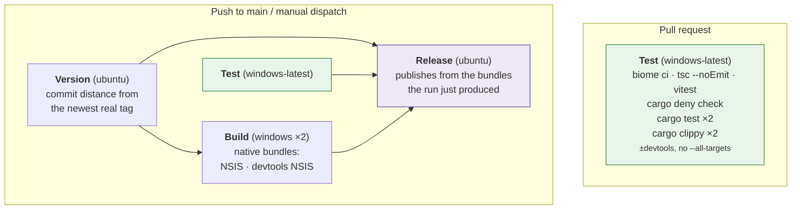
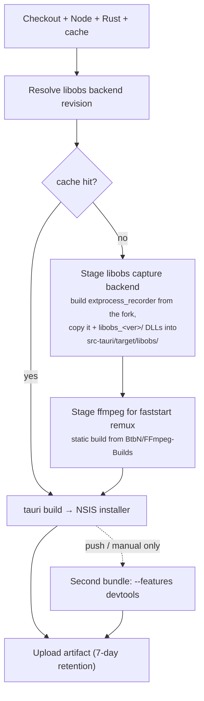
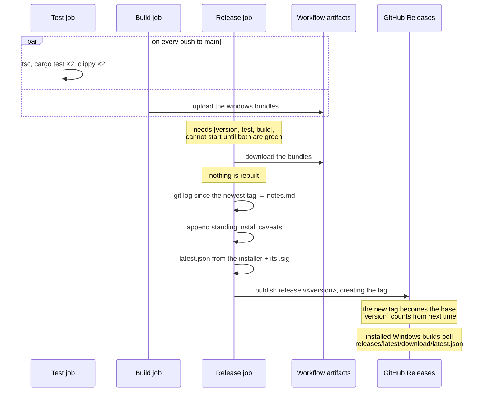

# CI and releases

One workflow, [`.github/workflows/ci.yml`](../.github/workflows/ci.yml), four
jobs. Installers are produced by CI, never built locally, and never
cross-compiled.

**Pull requests run `test` and nothing else.** Everything below the test job
is skipped until a commit reaches `main`.

---

## Job graph



### What `test` runs

Nine steps, and the order is part of the design: the cheap gates run first, so
a formatting mistake fails in seconds rather than after a four-minute compile.

| # | Step | Gate | Added by |
|---|---|---|---|
| 1 | `npm ci` | none | v1 |
| 2 | `npx biome ci .` | lint + format, one binary | WS5.4 |
| 3 | `npx tsc --noEmit` | TypeScript types | v1 |
| 4 | *(`npx svelte-check`)* | types `tsc` cannot see | **WS4.1: commented** |
| 5 | `npx vitest run` | frontend unit tests | WS5.5 |
| 6 | `cargo deny check` | licences + advisories | WS5.3 |
| 7 | *(`cargo run --bin gen-contract -- --check`)* | contract drift | **WS2.5: commented** |
| 8 | `cargo test`, `cargo test --features devtools` | Rust tests, both feature sets | v1 |
| 9 | `cargo clippy -- -D warnings`, and again with `--features devtools` | Rust lints, both feature sets | v1 |

Steps 4 and 7 are commented placeholders in `ci.yml`, sitting in their final
position so that turning them on is uncommenting a block rather than deciding
where it goes.

**Why each of the new ones is there.**

- **Biome** replaces nothing, because nothing existed. v1 shipped 12,797 lines
  of TypeScript with no linter and no formatter. `ci` is the non-writing mode:
  it reports what `npm run format` would change and fails instead of changing
  it.
- **`svelte-check`** is not optional once WS4 starts. `tsc` does not look
  inside `.svelte` files at all, so without it the type gate silently narrows
  to "whatever TypeScript is left" as the migration proceeds: the gate would
  appear to keep passing while covering less each week.
- **Vitest** likewise: 0 tests against 447 on the Rust side is most of why the
  frontend is the half being replaced, and a strangler migration needs tests on
  the code being strangled.
- **cargo-deny** is the instrument of the v2.1 licence exit, not hygiene. See
  [the licences and advisories gate](#licences-and-advisories) below.
- **`gen-contract --check`** replaces `every_command_round_trips` in
  `core/dispatch.rs` *and* the dev portal's drift banner. Both stay until it
  exists; none of the three overlaps the others until then.

The Rust half runs twice: with and without `--features devtools`: for both
`cargo test` and `cargo clippy -- -D warnings`. An off-by-default feature is
otherwise never compiled by CI, and a broken `#[cfg]` would stay green until
someone opened the dev portal
([DEVELOPMENT.md §9](../DEVELOPMENT.md#9-development-workflow)).

Clippy is **not** passed `--all-targets`, so the test targets are never
compiled and anything only the tests call is dead code under `-D warnings`.
A local run that adds `--all-targets` will not reproduce that failure.

### The compiler is pinned

`src-tauri/rust-toolchain.toml` names an exact stable version, and both
`dtolnay/rust-toolchain` steps take **no version argument** so they read it.
That missing argument is load-bearing: `@stable` would win, and the pin would
be a file in the tree that looked like it was in force and was not.

Two CI runs a week apart now use the same compiler, which is the whole point
a build that breaks on Tuesday and not on Monday has one candidate cause
instead of two. Bump it in its own PR; new lints are the expected content of
that diff.

### Licences and advisories

`cargo deny check` runs all four of cargo-deny's checks against
[`src-tauri/deny.toml`](../src-tauri/deny.toml).

The licence half is **the mechanism of the v2.1 relicence, not hygiene.** This
project is GPL-2.0 because libobs is, and only because libobs is. Every licence
not on the allow list fails, with exactly two GPL exceptions: this crate, and
the libobs fork: one dependency that resolves to five crates
(`libobs-recorder`, `intprocess-recorder`, `ipc-link`, `libobs-sys`,
`build-helper`). WS8 deletes them as a block, and that deletion is what proves
no other copyleft dependency arrived in the five months in between. **A third
exception needs a conversation, not a commit.**

The graph is pinned to `x86_64-pc-windows-msvc`, the only target that ships.
Without that pin a developer on macOS and a CI run on Windows resolve different
dependency graphs, and "cargo deny is green" would mean two different things
depending on who said it.

See [docs/provenance.md](provenance.md) for the debt the exceptions record
including that the fork is pinned to a *branch*, because it has no tags, which
is why `[bans] wildcards` is `warn` rather than `deny` until WS1.7.

### Why pull requests don't build

Three Tauri bundles (two of them Windows, each around six minutes) are the
overwhelming majority of this workflow's minute spend and its artifact
storage. Nothing consumes a PR's bundles: they are never released, and the
review that matters happens in the diff and in `test`.

A branch that genuinely needs an installer can still get the full matrix:

```bash
gh workflow run ci.yml --ref <branch>
```

### Why `build` doesn't need `test`

`build` deliberately does **not** `needs: test`. The two share no output, and
gating cost the whole test job in latency on every push to main before the
slow Windows bundle even started. Nothing unreviewed escapes, because
`release` needs both.

## Test

Windows only. The Rust half runs **twice**, once with `--features devtools`
and once without: an off-by-default feature is otherwise never compiled by CI,
and a broken `#[cfg]` would stay green until someone opened the portal. Same
for clippy, which runs with `-D warnings`.

Windows is now the only platform in the whole workflow. **Nothing in CI
compiles the non-Windows code paths any more**: `StubRecorder` and everything
behind `cfg(not(target_os = "windows"))` are what make `cargo test` work on a
dev box, and a break in them surfaces there rather than here. Accepted rather
than overlooked: the dev loop hits it within seconds of the change.

Windows is now the only platform in the whole workflow, which has one
consequence worth stating for the gates above: **the Windows-only Rust code is
the code CI compiles, and the Windows-only Rust code is also the only code a
Linux or macOS dev box does not.** `recorder/devices.rs`, `recorder/libobs/`
and anything else behind `cfg(target_os = "windows")` are checked here and
nowhere else. A change to them that compiles locally has been checked by
nothing.

**Node is 22**, not 20: Vitest 5 refuses to start below 22.12, and Node 20 left
maintenance in April 2026. Both jobs move together so there is one Node in this
workflow rather than two.

## Version and channels

Settled **before anything compiles**, because the version is baked into the
binary, the installer filename and the About block.

`package.json`'s version is what the project is *building toward*, and only
`npm run release -- next <x.y.z>` moves it. CI never invents one: see
[DEVELOPMENT.md §15](../DEVELOPMENT.md) for the reasoning.

| Trigger | Version | Published as |
|---|---|---|
| push to `main` | `<declared>-alpha.<commits since this version was declared>` | prerelease |
| push of a `v*` tag | the tag, cross-checked against `package.json` | stable release |
| manual dispatch | the alpha form | nothing, unless `publish_release` |

Still a pure function of the commit: the base comes from a file, the counter
from `git rev-list --count` against the commit that declared it. Simultaneous pushes cannot claim the same version
and re-running a commit updates its own release.

**Alphas are prereleases, and that is load-bearing.** GitHub excludes
prereleases from `/releases/latest/download/`, which is the stable channel's
endpoint, so stable installs ignore alphas with no filtering of our own. The
channels *cannot* be separated by version comparison, because semver says
`1.1.0-alpha.1 > 1.0.0`; they are separated by endpoint.

Both are read from `NinjaGoldfinch/ninja-recorder-v2`: the repository this
workflow publishes to. They pointed at v1's repository until the key landed
here, which would have left every v2 install polling a manifest that never
mentions a v2 release.

| Channel | Manifest |
|---|---|
| stable | `releases/latest/download/latest.json` |
| alpha | `releases/download/alpha/alpha.json`, a permanent prerelease whose single asset is replaced each build |

### Cutting a release

```bash
npm run release -- cut              # tags the declared version; CI ships it
npm run release -- next 1.0.0       # start building toward the next one
```

The script only moves a number and pushes a tag: it never builds. Forgetting
`next` leaves `package.json` on a released version, and alphas of it sort
*below* it, so the `version` job fails rather than publishing invisible
builds.

## Build



**Why the libobs runtime is staged outside Cargo.** The upstream reference
project pulls its recorder binary in through Cargo's artifact-dependency
feature (`artifact = "bin:..."`), which needs nightly Rust and the unstable
`bindeps` flag. `-Z bindeps` syntax in `Cargo.toml` breaks manifest parsing
*for every platform*: it would force a dev box's `cargo check` onto nightly
just to support an optional Windows-only binary. So CI builds the
fork's `extprocess_recorder` as a separate, ordinary `cargo build` and copies
the result into place. No Cargo dependency-graph involvement, stable Rust
throughout.

`tauri.windows.conf.json` bundles `src-tauri/target/libobs/` as a resource;
`LibObsRecorder::new` resolves it at runtime via Tauri's path resolver.
ffmpeg is resolved with `.ok()`: optional, so a failed download degrades to
unseekable-but-playable recordings rather than a broken build.

> Working on the capture backend locally on the Windows box means running the
> same clone-build-copy sequence by hand before `cargo run`. It is not
> scripted for local use yet.

## Release

Runs for every commit that lands on `main`, and for a manual dispatch that
opts in via the `publish_release` input.



**It publishes rather than drafts.** The `needs: [version, test, build]` gate
already withholds this job until `tsc`, `cargo test` and `clippy` have all
gone green on that exact commit, so "published" already means "tested". A
human clicking Publish afterwards added latency, not a check.

**Release notes** come from `git log` over the range since the previous
release, not GitHub's own generator: that one lists merged PRs only, and this
repo mixes PRs with commits pushed straight to `main`, which would silently go
unlisted. Merge commits and old version-bump commits are filtered out.

Because every successful run now creates a tag, each release's notes cover
exactly one commit's worth of changes: unless a run failed before reaching
this job, in which case the next one picks up the whole range since the last
tag.

**The devtools installer is never attached** to a release. See
[dev-portal.md](dev-portal.md).

## The update manifest

Windows builds update themselves from these releases
([DEVELOPMENT.md §14](../DEVELOPMENT.md)). What makes that work is one extra
asset, `latest.json`, written by the `Build update manifest` step from the
artifacts the run just produced:

```json
{
  "version": "0.9.0",
  "notes": "<the same changelog the release carries>",
  "pub_date": "2026-09-08T01:20:53.897Z",
  "platforms": {
    "windows-x86_64": {
      "signature": "<contents of the installer's .sig>",
      "url": "https://github.com/…/releases/download/v0.9.0/…-setup.exe"
    }
  }
}
```

Three things about it are load-bearing.

**The endpoint floats; the URL inside does not.** Installed builds poll
`releases/latest/download/latest.json`, which GitHub always resolves to the
newest non-draft, non-prerelease release, so the endpoint in
`tauri.conf.json` never needs rewriting. But the `url` *inside* the manifest
is the tagged asset path. If it floated too, a download would follow the next
release and stop matching the signature sitting beside it.

**`windows-x86_64` is the only platform key**, because Windows is the only
platform that ships. A build made anywhere else finds no entry and reports
that updates are unavailable: intended behaviour, not a gap.

**The devtools bundle is excluded by config, not by omission.**
`tauri.devtools.conf.json` sets `createUpdaterArtifacts: false`, so it neither
signs nor emits a `.sig`. A dev bundle that updated itself would replace
itself with the production app: the opposite of what renaming the product was
for.

The step fails loudly if the installer or its signature is missing, rather
than publishing a release whose manifest points at nothing.

## Signing

Two different things share the word, and only one of them is configured.

**Update signing**: configured. `TAURI_SIGNING_PRIVATE_KEY` and
`TAURI_SIGNING_PRIVATE_KEY_PASSWORD` are repository secrets; the matching
public key is in `src-tauri/tauri.conf.json` under `plugins.updater.pubkey`,
and every installed build checks each download against it. **The pair is
permanent**: the public half ships inside every installer ever built, so
losing the private half strands every install in the field
([DEVELOPMENT.md §14](../DEVELOPMENT.md)). It is **the same pair v1 signs
with**, and that is why it was carried over rather than regenerated: v2 keeps
v1's `com.ninjarecorder.app` identifier and upgrades those installs in place,
so a new key would have stranded every one of them.

**Code signing**: not configured, no certificate. Windows SmartScreen warns
on first run. The standing caveat block appended to every release's notes says
so; keep it in sync with the real status. The `.sig` file attached to a
release is an update signature and does nothing about this.

## Windows is the only platform that builds

A macOS `.dmg` was produced here as a dev convenience until it was dropped. It
shipped the stub recorder and could not capture a game, so it cost a
10×-billed runner to produce an installer nobody could record with.

Real game capture is Windows-only, and that is a hard constraint rather than a
gap: see
[DEVELOPMENT.md §1.1](../DEVELOPMENT.md#11-riot-vanguard-the-constraint-that-shapes-everything).
The cross-platform code stays: it is what keeps the app developable and
testable away from the Windows box.
