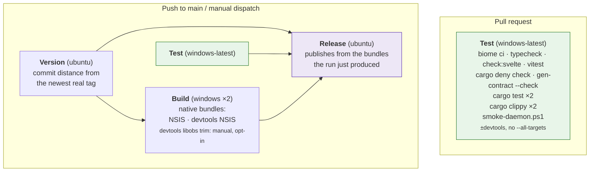
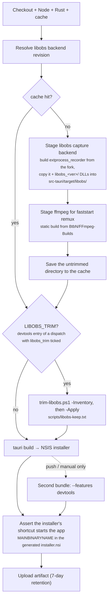
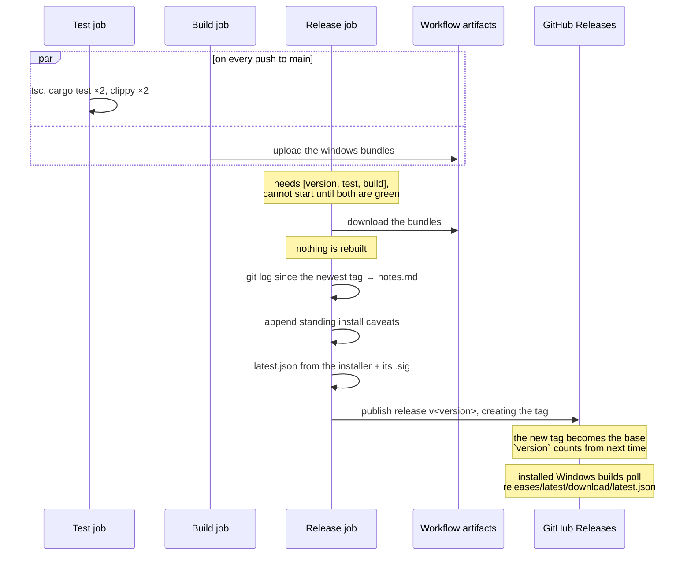

# CI and releases

One workflow, [`.github/workflows/ci.yml`](../.github/workflows/ci.yml), four
jobs. Installers are produced by CI, never built locally, and never
cross-compiled.

**Pull requests run `test` and nothing else.** Everything below the test job
is skipped until a commit reaches `main`.

---

## Job graph



### What `test` runs

Eleven steps, and the order is part of the design: the cheap gates run first, so
a formatting mistake fails in seconds rather than after a four-minute compile.
The last one is the odd one out and runs last for the same reason, from the
other end: it needs everything already compiled.

| # | Step | Gate | Added by |
|---|---|---|---|
| 1 | `npm ci` | none | v1 |
| 2 | `npx biome ci .` | lint + format, one binary | WS5.4 |
| 3 | `npm run typecheck` | TypeScript types | v1, rewired WS4.1 |
| 4 | `npm run check:svelte` | types `tsc` cannot see | WS4.1 |
| 5 | `npx vitest run` | frontend unit tests | WS5.5 |
| 6 | `cargo deny check` | licences + advisories | WS5.3 |
| 7 | `cargo run --features contract-gen --bin gen-contract -- --check` | contract drift | WS2.5 |
| 8 | `cargo test`, `cargo test --features devtools` | Rust tests, both feature sets | v1 |
| 9 | `cargo clippy -- -D warnings`, and again with `--features devtools` | Rust lints, both feature sets | v1 |
| 10 | `scripts/smoke-daemon.ps1` | the daemon actually runs | WS3.3 |
| 11 | `scripts/smoke-ui.ps1` | the UI starts and finds it | WS3.3 |

### Trimming libobs is opt-in, and only ever reaches the devtools installer

`scripts/trim-libobs.ps1` removes everything from the staged capture backend
that `scripts/libobs-keep.txt` does not keep. It is WS1.1's P0a arm (#5): the
trimmed backend is the fallback if the P0c spikes fail and a selectable second
backend for one release if they pass, and either way its size is what is being
measured.

**How to build one.** Actions → CI → Run workflow, on the branch you want, with
`libobs_trim` ticked. The run builds both entries as usual; the **devtools**
entry trims before it packages, and its artifact is named
`ninja-recorder-devtools-libobs-trim-windows-latest-<sha>` so it cannot be
mistaken for the untrimmed one. The production entry of the same run is
untouched, and so is every push to `main`: the job-level `LIBOBS_TRIM` is `1`
only when `matrix.devtools` and `inputs.libobs_trim` are both true, and
`inputs` is empty on a push. Ticking `publish_release` as well publishes the
untrimmed production bundle, because the devtools bundle is never published.
The procedure after installing is
[windows-verification.md §8](windows-verification.md#8-the-trimmed-libobs-backend-ws11-5).

It used to be switched by a repository variable, which reached both matrix
entries, so setting it would have trimmed the next release. A variable set
under that name is now ignored.

**The keep-list has three kinds of line.** A plain glob keeps, a `!` glob is an
expected removal, and a staged file that matches neither is *unrecognised*: the
script lists it and exits non-zero rather than deleting it. The fork bumping
its libobs version changes the staged directory, and a new DLL that something
imports is exactly the file a keep-list would otherwise remove silently. The
list's own header records where each entry came from.

**The cache only ever holds the untrimmed directory.** Restore and save are two
steps, and the save runs straight after staging, before the trim. So a trimmed
run cannot write a trimmed directory under the key the release builds restore
from, and a trimmed run that restores from the cache still trims the full set,
which is what makes the "before" size it prints true.

**It prints the sizes and records none.** Before, after and removed, in bytes
and rounded, and every removed file by name, in the step log. Those are the
staged directory's figures. The P0a size that counts is the installed build's,
taken with `scripts/measure.ps1` on the box, and an empty cell stays empty
until then.

A wrongly removed plugin still builds, still packages, still installs, and then
does not capture. The exit criterion is a clean plugin-load log and a recording
that plays, not a green run.

### The tree is at zero Biome warnings, and that is the point

`biome ci` fails on errors, not warnings, so a clean tree is a convention
rather than a gate. WS4.7 brought the count to zero so that the convention
means something: **any warning in a diff is one the diff introduced.**

Three suppressions carry the exceptions, each with its reason where it applies.
**None of them is in a test.**

| Where | Rule | Why |
|---|---|---|
| `**/*.svelte` | `noUnusedVariables`, `noUnusedImports` | Biome lints a component's `<script>` and does not parse its template, so a prop the markup reads looks unused. A tool limitation, not debt; `svelte-check` does see the template |
| `app.css`, `dev.css` | `noDescendingSpecificity` | a reading-order convention, not correctness: the higher-specificity selector wins whichever comes first. Five of the six in `dev.css` are false positives, matching `.kv-table th` against `table.grid th` when no element is both |
| `app.css`, `dev.css` | `noImportantStyles` | `[hidden]` is a bare attribute selector, so any class rule setting `display` beats it. Without the `!important` an error overlay sits over every video |

The override that disabled the linter outright for `index.html` and `dev.html`
is gone. It was there because the markup carried lint errors that could only be
fixed by rewriting it, which WS4 then did: both files are one `<div>` now, and
both lint clean.

**A suppression goes on the line above the thing reported, not the declaration
around it.** A `biome-ignore` above `function render(...)` does not suppress a
diagnostic inside its parameter list: Biome attributes the comment to the
function and reports the suppression itself as unused, so the file ends up with
two warnings instead of none.

Steps 3 and 4 are `npm run` scripts rather than `npx` invocations, and that is
load-bearing. Two packages in this tree ship a binary called `tsc`:
`typescript` at 6.x, which is what `svelte-check` peer-requires, and
`@typescript/native` at 7.x, the native checker, installed under an alias.
Which one `node_modules/.bin/tsc` resolves to is decided by install order, so
`npx tsc` picks a checker by accident. Each script names the one it means by
path.

Step 4 does not pass `--tsgo`. The flag saves about a second and writes a
shadow TypeScript project into `.svelte-check/`, which is not pruned when a
component is deleted, so the gate goes on failing over a file that is no
longer in the tree. A second on a run that takes minutes is not worth a gate
that can fail against a path that does not exist.

**Why each of the new ones is there.**

- **Biome** replaces nothing, because nothing existed. v1 shipped 12,797 lines
  of TypeScript with no linter and no formatter. `ci` is the non-writing mode:
  it reports what `npm run format` would change and fails instead of changing
  it.
- **`svelte-check`** is not optional once WS4 starts. `tsc` does not look
  inside `.svelte` files at all, so without it the type gate silently narrows
  to "whatever TypeScript is left" as the migration proceeds: the gate would
  appear to keep passing while covering less each week. WS4.1 landed it with
  the first `.svelte` file rather than after, which is why it is a real step
  above and no longer a commented one. It carries WS5.6.
- **Vitest** likewise: 0 tests against 447 on the Rust side is most of why the
  frontend is the half being replaced, and a strangler migration needs tests on
  the code being strangled.

  `npm run coverage` is the same suite with a v8 coverage report and an 80%
  line floor, scoped to `src/lib/`. **It is not a CI step**, deliberately: the
  gate list above is what must pass for a change to merge, and a coverage
  percentage is a property of the tree rather than of a change. The floor is
  there so that running it locally answers WS4.2's exit criterion instead of
  needing a flag remembered from an issue. Wiring it in is one block in
  `ci.yml` if that stops being the right call.
- **cargo-deny** is the instrument of the v2.1 licence exit, not hygiene. See
  [the licences and advisories gate](#licences-and-advisories) below.
- **`gen-contract --check`** re-emits `src/lib/contract/` from the Rust
  declaration and fails if it differs from what is committed, so a command or
  an event added without regenerating cannot merge. It is what
  `every_command_round_trips` in `core/dispatch.rs` and the dev portal's drift
  banner were standing in for; WS2.7 deletes both, because deleting them is
  that task's exit criterion rather than this one's.

The Rust half runs twice: with and without `--features devtools`: for both
`cargo test` and `cargo clippy -- -D warnings`. An off-by-default feature is
otherwise never compiled by CI, and a broken `#[cfg]` would stay green until
someone opened the dev portal
([DEVELOPMENT.md §9](../DEVELOPMENT.md#9-development-workflow)).

Clippy is **not** passed `--all-targets`, so the test targets are never
compiled and anything only the tests call is dead code under `-D warnings`.
A local run that adds `--all-targets` will not reproduce that failure.

**There is no `cargo fmt` step, and adding one is not a one-line change.**
`src-tauri/src` has never been run through rustfmt. It is hand-formatted, and a
tree-wide `cargo fmt` rewrites 63 of its 76 files. No rustfmt configuration is
close to what is committed: the default wants 502 hunks changed, a 100-column
`use_small_heuristics = "Max"` wants 493, and widening to 110 or 120 columns
only trades one set for another. Adopting rustfmt means a reformatting commit
of its own, listed in `.git-blame-ignore-revs` exactly as the Biome one is, and
then the gate. The Rust toolchain file still installs the component, so
`cargo fmt` on a file someone is already rewriting works; see CLAUDE.md, "The
Rust tree is not rustfmt-formatted", for why the tree-wide run is the one to
avoid.

### The compiler is pinned

`src-tauri/rust-toolchain.toml` names an exact stable version, and both
`dtolnay/rust-toolchain` steps take **no version argument** so they read it.
That missing argument is load-bearing: `@stable` would win, and the pin would
be a file in the tree that looked like it was in force and was not.

Two CI runs a week apart now use the same compiler, which is the whole point
a build that breaks on Tuesday and not on Monday has one candidate cause
instead of two. Bump it in its own PR; new lints are the expected content of
that diff.

### Licences and advisories

`cargo deny check` runs all four of cargo-deny's checks against
[`src-tauri/deny.toml`](../src-tauri/deny.toml).

The licence half is **the mechanism of the v2.1 relicence, not hygiene.** This
project is GPL-2.0 because libobs is, and only because libobs is. Every licence
not on the allow list fails, with exactly two GPL exceptions: this crate, and
the libobs fork: one dependency that resolves to five crates
(`libobs-recorder`, `intprocess-recorder`, `ipc-link`, `libobs-sys`,
`build-helper`). WS8 deletes them as a block, and that deletion is what proves
no other copyleft dependency arrived in the five months in between. **A third
exception needs a conversation, not a commit.**

The graph is pinned to `x86_64-pc-windows-msvc`, the only target that ships.
Without that pin a developer on macOS and a CI run on Windows resolve different
dependency graphs, and "cargo deny is green" would mean two different things
depending on who said it.

See [docs/provenance.md](provenance.md) for the debt the exceptions record
including that the fork is pinned to a *branch*, because it has no tags, which
is why `[bans] wildcards` is `warn` rather than `deny` until WS1.7.

### Why pull requests don't build

Three Tauri bundles (two of them Windows, each around six minutes) are the
overwhelming majority of this workflow's minute spend and its artifact
storage. Nothing consumes a PR's bundles: they are never released, and the
review that matters happens in the diff and in `test`.

A branch that genuinely needs an installer can still get the full matrix:

```bash
gh workflow run ci.yml --ref <branch>
```

### Why `build` doesn't need `test`

`build` deliberately does **not** `needs: test`. The two share no output, and
gating cost the whole test job in latency on every push to main before the
slow Windows bundle even started. Nothing unreviewed escapes, because
`release` needs both.

## Test

Windows only. The Rust half runs **twice**, once with `--features devtools`
and once without: an off-by-default feature is otherwise never compiled by CI,
and a broken `#[cfg]` would stay green until someone opened the portal. Same
for clippy, which runs with `-D warnings`.

Windows is now the only platform in the whole workflow. **Nothing in CI
compiles the non-Windows code paths any more**: `StubRecorder` and everything
behind `cfg(not(target_os = "windows"))` are what make `cargo test` work on a
dev box, and a break in them surfaces there rather than here. Accepted rather
than overlooked: the dev loop hits it within seconds of the change.

### Steps 10 and 11 start the binary, which nothing else does

Steps 1 to 9 are claims about types, units and framing. None of them runs the
app. The daemon, though, is a *process*: `main.rs`, `Paths::resolve`, the
single-instance check, the log file and the pipe's security descriptor only
exist once something is launched, and every one of those had shipped unrun.

`scripts/smoke-daemon.ps1` launches `--daemon` on the runner and asserts what
can be asserted without a person at a desktop:

- it stays running rather than exiting, and if it exits, its code and its
  stderr are printed instead of being lost
- the named pipe appears, under the name the build identity implies
- `hello` is answered, with the snapshot riding along
- a command dispatches and comes back `ok`
- the pipe's ACL grants the user who created it, and does **not** grant
  `Everyone`, `Authenticated Users` or `BUILTIN\Users`
- a second daemon exits 0 and writes nothing to the log

It exists because of a specific failure. The first report from a real Windows
box was "a console window appears and instantly closes", with no log to say why,
and narrowing it took an hour of remote PowerShell against a machine nobody
could see. A job that starts the thing answers that class of question in the
four minutes this job already spends compiling.

Step 11 asks the other half of the question. The daemon smoke asks whether the
recorder runs; `smoke-ui.ps1` asks whether the *window* process reaches its own
startup, starts a daemon when none is listening, and completes a handshake over
the pipe. `ui::link` logs the connection's health, so "daemon connection:
Connected" in the UI's log is WS3.4's whole path proving itself: window
process, spawn, pipe, hello. CI builds with `devtools`, so that file is
`ui-devtools.log`; both scripts take `-Build release` for a release binary,
which writes `ui.log` and `daemon.log` instead (#202).

It was added because of the failure it is shaped around. A UI that dies before
`log::init` leaves no log, and a windowed build throws away the stderr that
would have said why, so the only symptom in the field was a window that flashed
and closed. A redirected stderr and an exit code are precisely what a CI step
can keep and a desktop cannot.

**Neither replaces [windows-verification.md](windows-verification.md).** A
headless runner is not a desktop: nothing here asserts that anything is *drawn*.
The tray's menu, the notifications and the capture backend need a person in
front of a screen. What these cover is everything that does not.

The step runs under `powershell` rather than the default `pwsh`, because
`PipeStream.GetAccessControl` is an instance method in Windows PowerShell and
moved to a static helper in .NET Core. The script handles both; the shell that
needs no fallback is the one to use.

Windows is now the only platform in the whole workflow, which has one
consequence worth stating for the gates above: **the Windows-only Rust code is
the code CI compiles, and the Windows-only Rust code is also the only code a
Linux or macOS dev box does not.** `recorder/devices.rs`, `recorder/libobs/`
and anything else behind `cfg(target_os = "windows")` are checked here and
nowhere else. A change to them that compiles locally has been checked by
nothing.

**Node is 22**, not 20: Vitest 5 refuses to start below 22.12, and Node 20 left
maintenance in April 2026. Both jobs move together so there is one Node in this
workflow rather than two.

## Version and channels

Settled **before anything compiles**, because the version is baked into the
binary, the installer filename and the About block.

`package.json`'s version is what the project is *building toward*, and only
`npm run release -- next <x.y.z>` moves it. CI never invents one: see
[DEVELOPMENT.md §15](../DEVELOPMENT.md) for the reasoning.

| Trigger | Version | Published as |
|---|---|---|
| push to `main` | `<declared>-alpha.<commits since this version was declared>` | prerelease |
| push of a `v*` tag | the tag, cross-checked against `package.json` | stable release |
| manual dispatch | the alpha form | nothing, unless `publish_release` |

Still a pure function of the commit: the base comes from a file, the counter
from `git rev-list --count` against the commit that declared it. Simultaneous pushes cannot claim the same version
and re-running a commit updates its own release.

**Alphas are prereleases, and that is load-bearing.** GitHub excludes
prereleases from `/releases/latest/download/`, which is the stable channel's
endpoint, so stable installs ignore alphas with no filtering of our own. The
channels *cannot* be separated by version comparison, because semver says
`1.1.0-alpha.1 > 1.0.0`; they are separated by endpoint.

Both are read from `NinjaGoldfinch/ninja-recorder`: the repository this
workflow publishes to. They pointed at v1's repository until the key landed
here, which would have left every v2 install polling a manifest that never
mentions a v2 release.

| Channel | Manifest |
|---|---|
| stable | `releases/latest/download/latest.json` |
| alpha | `releases/download/alpha/alpha.json`, a permanent prerelease whose single asset is replaced each build |

### Cutting a release

```bash
npm run release -- cut              # tags the declared version; CI ships it
npm run release -- next 1.0.0       # start building toward the next one
```

The script only moves a number and pushes a tag: it never builds. Forgetting
`next` leaves `package.json` on a released version, and alphas of it sort
*below* it, so the `version` job fails rather than publishing invisible
builds.

## Build



**Why the libobs runtime is staged outside Cargo.** The upstream reference
project pulls its recorder binary in through Cargo's artifact-dependency
feature (`artifact = "bin:..."`), which needs nightly Rust and the unstable
`bindeps` flag. `-Z bindeps` syntax in `Cargo.toml` breaks manifest parsing
*for every platform*: it would force a dev box's `cargo check` onto nightly
just to support an optional Windows-only binary. So CI builds the
fork's `extprocess_recorder` as a separate, ordinary `cargo build` and copies
the result into place. No Cargo dependency-graph involvement, stable Rust
throughout.

`tauri.windows.conf.json` bundles `src-tauri/target/libobs/` as a resource;
`LibObsRecorder::new` resolves it at runtime via Tauri's path resolver.
ffmpeg is resolved with `.ok()`: optional, so a failed download degrades to
unseekable-but-playable recordings rather than a broken build.

### The installer's shortcut is checked against what was built

`tauri build` writes a generated `installer.nsi` under
`src-tauri/target/release`, and that file is where the shortcut is decided:
the template defines `MAINBINARYNAME` from the config's `mainBinaryName`, and
every `CreateShortcut` targets `$INSTDIR\${MAINBINARYNAME}.exe`. The step
after the build reads it back and fails the job if it names anything but the
app.

It is asserted here rather than as a Rust test because nothing in the Rust
gates runs late enough to see it. The binary set comes from Cargo, the choice
of main binary comes from the bundler, and both happen after `cargo test` and
`cargo clippy` have gone green. A release whose Start Menu entry launched
`gen-contract.exe` passed every other gate in this file, which is the whole
argument for the step. DEVELOPMENT.md §15 records what that cost.

The emitter is also no longer built by default, so there is nothing to choose:
`gen-contract` carries `required-features = ["contract-gen"]`, which is why
step 7 and the devtools clippy run name that feature. The two halves are
deliberate. Not building it keeps it out of the installer; naming the main
binary decides the shortcut, and would still be needed the day this package
grows a second binary that does have to ship.

> Working on the capture backend locally on the Windows box means running the
> same clone-build-copy sequence by hand before `cargo run`. It is not
> scripted for local use yet.

## Release

Runs for every commit that lands on `main`, and for a manual dispatch that
opts in via the `publish_release` input.



**It publishes rather than drafts.** The `needs: [version, test, build]` gate
already withholds this job until `tsc`, `cargo test` and `clippy` have all
gone green on that exact commit, so "published" already means "tested". A
human clicking Publish afterwards added latency, not a check.

**Release notes** come from `git log` over the range since the previous
release, not GitHub's own generator: that one lists merged PRs only, and this
repo mixes PRs with commits pushed straight to `main`, which would silently go
unlisted. Merge commits and old version-bump commits are filtered out.

Because every successful run now creates a tag, each release's notes cover
exactly one commit's worth of changes: unless a run failed before reaching
this job, in which case the next one picks up the whole range since the last
tag.

**The devtools installer is never attached** to a release. See
[dev-portal.md](dev-portal.md).

## The update manifest

Windows builds update themselves from these releases
([DEVELOPMENT.md §14](../DEVELOPMENT.md)). What makes that work is one extra
asset, `latest.json`, written by the `Build update manifest` step from the
artifacts the run just produced:

```json
{
  "version": "0.9.0",
  "notes": "<the same changelog the release carries>",
  "pub_date": "2026-09-08T01:20:53.897Z",
  "platforms": {
    "windows-x86_64": {
      "signature": "<contents of the installer's .sig>",
      "url": "https://github.com/…/releases/download/v0.9.0/…-setup.exe"
    }
  }
}
```

Three things about it are load-bearing.

**The endpoint floats; the URL inside does not.** Installed builds poll
`releases/latest/download/latest.json`, which GitHub always resolves to the
newest non-draft, non-prerelease release, so the endpoint in
`tauri.conf.json` never needs rewriting. But the `url` *inside* the manifest
is the tagged asset path. If it floated too, a download would follow the next
release and stop matching the signature sitting beside it.

**`windows-x86_64` is the only platform key**, because Windows is the only
platform that ships. A build made anywhere else finds no entry and reports
that updates are unavailable: intended behaviour, not a gap.

**The devtools bundle is excluded by config, not by omission.**
`tauri.devtools.conf.json` sets `createUpdaterArtifacts: false`, so it neither
signs nor emits a `.sig`. A dev bundle that updated itself would replace
itself with the production app: the opposite of what renaming the product was
for.

The step fails loudly if the installer or its signature is missing, rather
than publishing a release whose manifest points at nothing.

## Signing

Two different things share the word, and only one of them is configured.

**Update signing**: configured. `TAURI_SIGNING_PRIVATE_KEY` and
`TAURI_SIGNING_PRIVATE_KEY_PASSWORD` are repository secrets; the matching
public key is in `src-tauri/tauri.conf.json` under `plugins.updater.pubkey`,
and every installed build checks each download against it. **The pair is
permanent**: the public half ships inside every installer ever built, so
losing the private half strands every install in the field
([DEVELOPMENT.md §14](../DEVELOPMENT.md)). It is **the same pair v1 signs
with**, and that is why it was carried over rather than regenerated: v2 keeps
v1's `com.ninjarecorder.app` identifier and upgrades those installs in place,
so a new key would have stranded every one of them.

**Code signing**: not configured, no certificate. Windows SmartScreen warns
on first run. The standing caveat block appended to every release's notes says
so; keep it in sync with the real status. The `.sig` file attached to a
release is an update signature and does nothing about this.

## Windows is the only platform that builds

A macOS `.dmg` was produced here as a dev convenience until it was dropped. It
shipped the stub recorder and could not capture a game, so it cost a
10×-billed runner to produce an installer nobody could record with.

Real game capture is Windows-only, and that is a hard constraint rather than a
gap: see
[DEVELOPMENT.md §1.1](../DEVELOPMENT.md#11-riot-vanguard-the-constraint-that-shapes-everything).
The cross-platform code stays: it is what keeps the app developable and
testable away from the Windows box.
