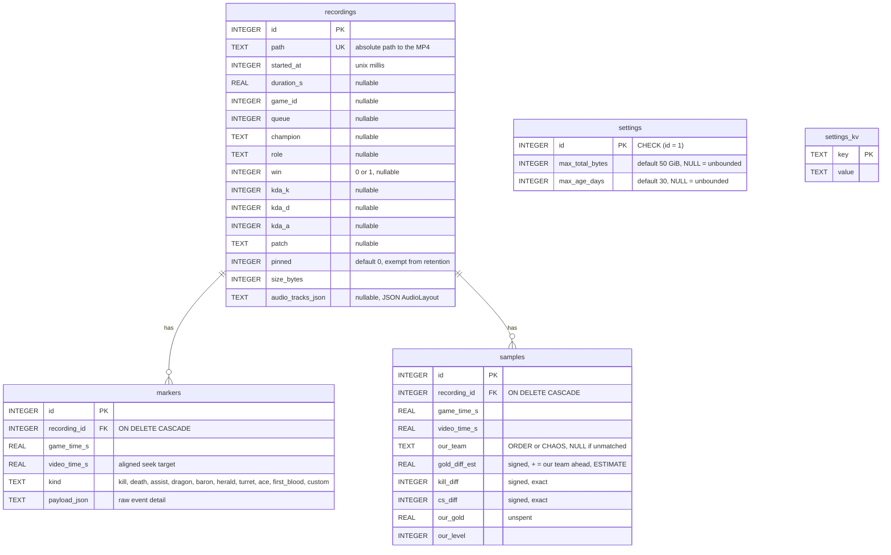
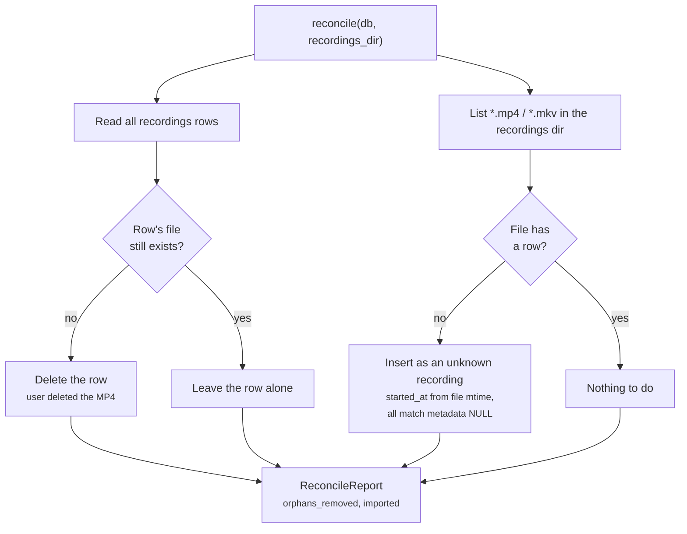
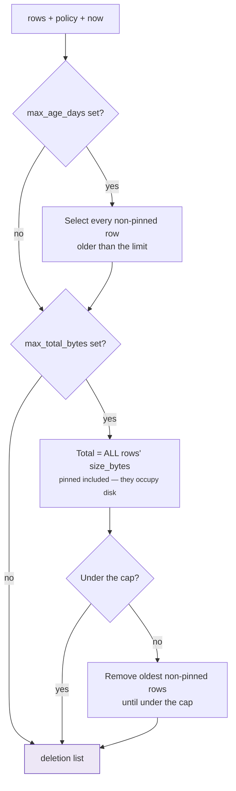

# Data model

SQLite for metadata, MP4 files on disk for video. The files are the source of
truth: a row without its file is dropped on scan, and a file without a row is
imported. The library must survive the user rearranging their own folder.

One database, in the Tauri app data directory, opened via `rusqlite` with the
`bundled` feature so no system SQLite is required. Schema changes go through
`rusqlite_migration` — **append a migration, never edit an existing one**.

---

## Schema



### Migration history

| # | Adds | Why it is shaped that way |
|---|---|---|
| 1 | `recordings`, `markers`, `idx_markers_recording_id` | The original library |
| 2 | `settings` (single row, seeded) | Retention has to protect the user out of the box, so it ships with real defaults rather than "unlimited until configured" |
| 3 | `samples`, `idx_samples_recording_id` | 1 Hz advantage series behind the review timeline. ~2100 rows for a 35-minute game; downsampling happens at render time |
| 4 | `settings_kv` (unseeded) | UI preferences. A missing key means "use the frontend default", which makes adding a preference a zero-migration change |
| 5 | `recordings.audio_tracks_json` (nullable) | Which audio source landed on which MP4 track. Nullable because NULL is the honest answer twice over: every row predating multi-track audio, and anything `reconcile` imported from a file we didn't record. The review player renders NULL as no stem picker rather than as a guess |

### The audio layout is JSON, not a child table

`recordings.audio_tracks_json` holds a serialized `AudioLayout` — the ordered
track list and the sources feeding each one ([DEVELOPMENT.md §2.5](../DEVELOPMENT.md#25-multi-track-audio)).
A `recording_audio_tracks` table would be the orthodox shape, and it would buy
nothing here: the value is written once, always read whole, never queried by
predicate, and at most six rows long.

The upsert in `insert_recording` treats it specially:

```sql
audio_tracks_json = COALESCE(excluded.audio_tracks_json, recordings.audio_tracks_json)
```

`reconcile` upserts on `path` with an all-default row. Without the `COALESCE`,
a rescan landing after a finalize would overwrite a known layout with NULL and
the VOD would silently lose its stem picker. A NULL never wins.

### Two settings tables, on purpose

`settings` is seeded and single-row because a missing retention policy would
mean *unbounded disk usage*. `settings_kv` is unseeded because a missing theme
just means "use the default". Same word, opposite failure modes.

### `gold_diff_est` is an estimate

The Live Client Data API exposes no per-player gold, so the diff is derived
from summed item prices plus unspent gold. It is stored **pre-signed from the
recording player's point of view** with `our_team` alongside, so the sign
convention is auditable in the data rather than being an unwritten frontend
assumption. `our_team` is `NULL` when the active player could not be matched
in `allPlayers`; the UI renders that as team-unknown rather than risk drawing
an inverted line.

## Reconciliation

Runs at app start and on demand via `rescan_recordings`.



Because imported files can be anything the user dropped in the folder, their
displayed names are **not** trusted markup — `src/dom.ts`'s `escapeHtml` /
`escapeAttr` exist for exactly this path.

## Retention

`retention::select_for_deletion` is pure: it takes the row set, the policy and
an injected "now", and returns what would be deleted. That is what makes both
the dry-run preview and the fabricated-clock tests possible.



Age is checked first — anything past the age limit goes regardless of how
much room there is. Pinned recordings count toward usage but are never
candidates.

**When it runs:** app start (after reconcile), after every finalize, and
immediately when the policy is changed from the settings view, so a tightened
limit does not wait for the next game.

**Preview before save:** `preview_retention_policy` runs the same pure
function against the unsaved form values, so the settings view can say what
will be deleted before anything is.

**One deliberate asymmetry.** `delete_recording` (user-initiated) and
`enforce` (automatic sweep) share `delete_recording_and_file`, but diverge on
a file that will not delete: the user-initiated path reports the failure and
leaves the row alone, while the sweep logs and drops the row anyway, so an
unattended enforcement cannot stall on one locked file.
