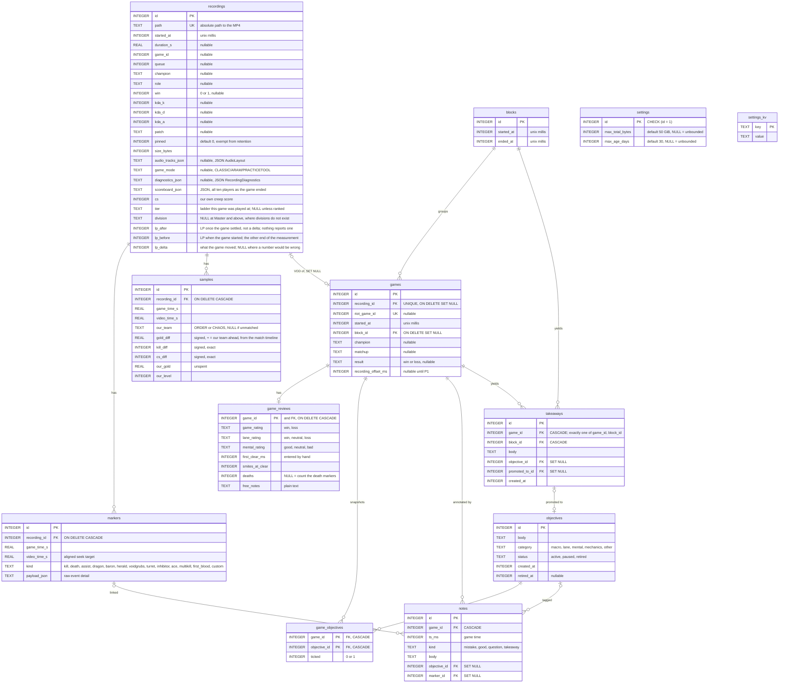
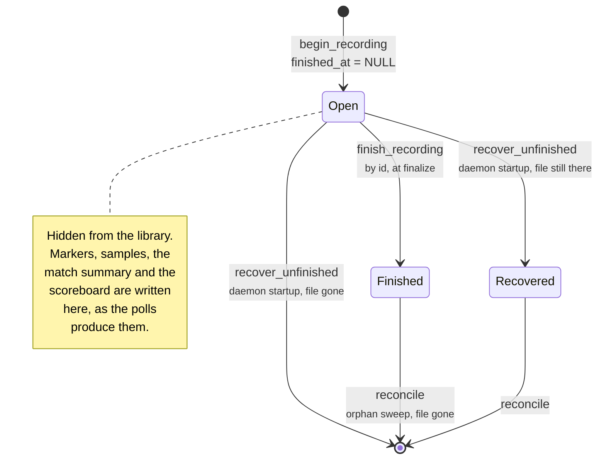
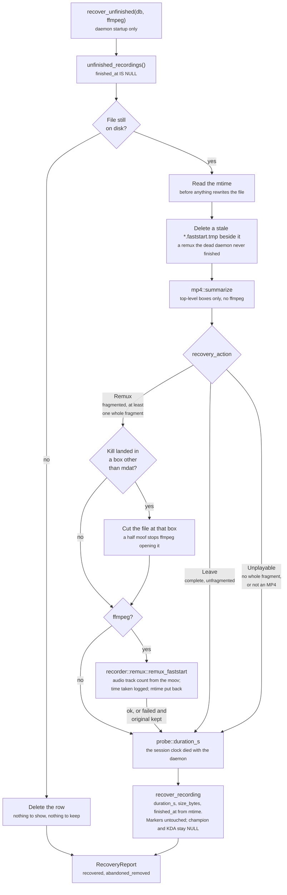
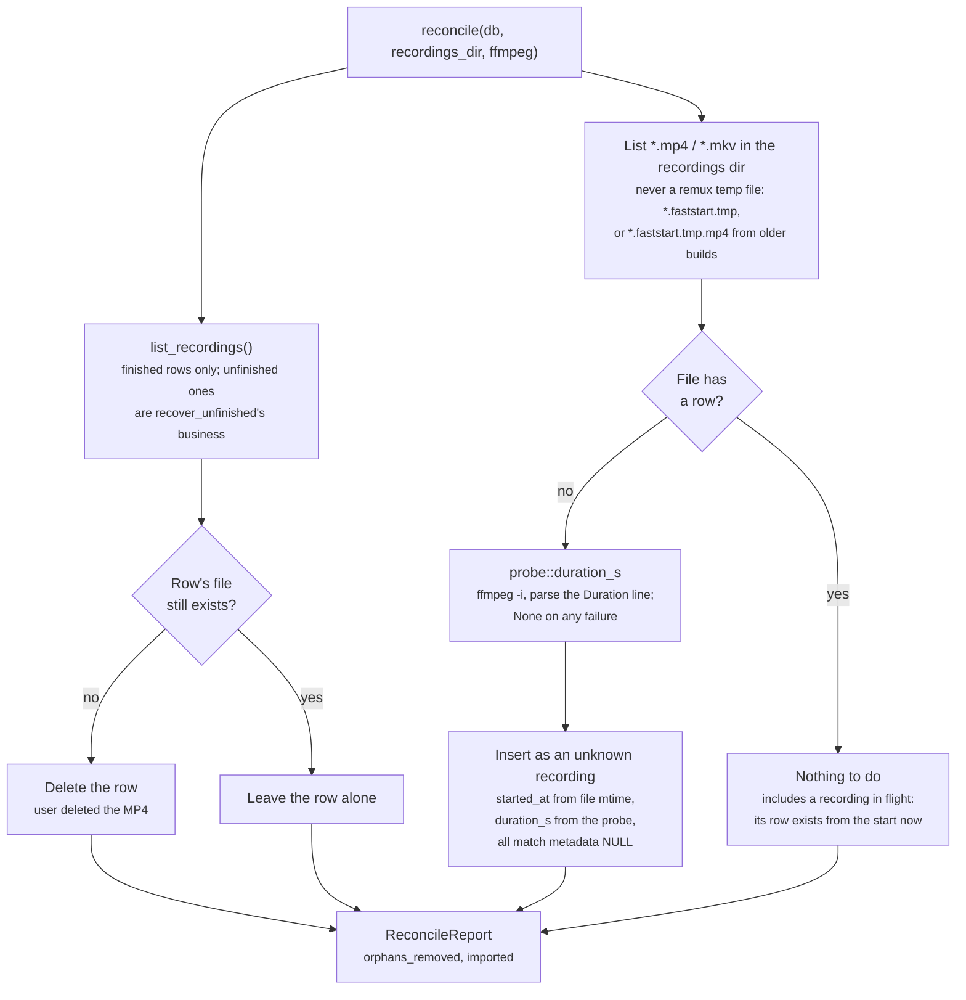
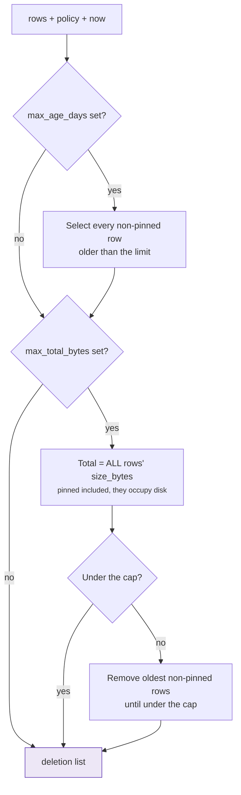

# Data model

SQLite for metadata, MP4 files on disk for video. The files are the source of
truth: a row without its file is dropped on scan, and a file without a row is
imported. The library must survive the user rearranging their own folder.

One database per build, `library.sqlite3` in the app data directory
(`%APPDATA%\com.ninjarecorder.app`, or `com.ninjarecorder.app.devtools` for a
devtools build, #222), opened via `rusqlite` with the
`bundled` feature so no system SQLite is required. The recordings folder sits
beside it, so the files-as-truth rules below apply per build: the devtools
build's reconcile never sees the release build's files, and the reverse. Schema changes go through
`rusqlite_migration`: **append a migration, never edit an existing one**.

---

## Connections

v1 held a single `Mutex<Connection>`. That is correct for one process and wrong
for two: the UI's list query would block the daemon's marker write. WS6 splits
it into `db::pool::Pool`, one writer and four readers, without touching the
schema.

| | Count | Pragmas | Who |
|---|---|---|---|
| Writer | 1 | `journal_mode=WAL`, `synchronous=NORMAL`, `busy_timeout=5s`, `foreign_keys=ON` | the daemon: every insert, update and delete |
| Readers | 4 | the same, plus `query_only=ON` | the daemon's own reads: status polls, retention preview |
| UI, all 5 | 1 + 4 | `query_only=ON` on every one | the library grid, the review timeline, the stats bar, the dev portal |

Two processes open the same file. The daemon opens a `Pool` and owns the writer;
the UI opens `Pool::open_read_only`, where even the connection `write()` hands
out is `query_only`.

**One writer, because SQLite allows exactly one.** A second write connection
would buy nothing and would turn a `Mutex` wait into an `SQLITE_BUSY` we have to
handle. Keeping the writer behind a mutex means writes queue in the process,
where waiting is free and ordered, rather than at the database, where it is an
error code.

**WAL is what makes the readers worth having.** Under the default rollback
journal a writer blocks every reader for the length of its transaction, so four
reader connections would queue exactly as one did. WAL lets reads run
concurrently with the writer and with each other, which leaves our own lock as
the only thing serialising them, and round-robin over four connections is what
turns that lock from a queue into a fast path. On disk it shows up as
`library.sqlite-wal` beside the database.

**`synchronous=NORMAL`, not `FULL`.** `FULL` fsyncs on every commit, a cost paid
at 1 Hz for the length of every game, to buy durability against power loss.
`NORMAL` is the documented pairing with WAL and loses at most the last commits
on a power cut. What it cannot lose is the *recording*: the file on disk is the
source of truth and reconciliation rebuilds a missing row from it.

**`query_only=ON` is a tripwire, not a formality.** A read path that tries to
write fails at the connection instead of quietly racing the writer, so a method
filed on the wrong side of the split is a test failure rather than a rare
interleaving nobody can reproduce.

**The UI gets it on every connection, including the writer** (WS3.4, §4.4).
Withholding the writer and panicking when something asked for it would be a
crash in a shipped window for what is a programming error, and it would fire
before SQLite ever saw the statement. A `query_only` writer refuses the
statement instead, leaving the caller an error to report. The UI also runs **no
migrations**: those are writes, the daemon owns them, and a second process
running them would be a race as well as a contradiction. A UI that opens the
library before the daemon has created it sees no tables, and SQLite hands them
to that same open connection as soon as the daemon migrates.

Seven tests hold this up, in `db/pool.rs`: the file is in WAL mode, a write on a
reader is refused, a long-held read does not block a write, a writer and three
readers hammering the database together record zero `SQLITE_BUSY`, a read-only
pool refuses a write on every connection, it still sees what the writer commits,
and one opened before the schema existed recovers when it appears.

**Tests run against a real file, not `:memory:`.** Each pool gets a throwaway
directory that it removes when it drops. An in-memory database is private to its
connection, so a pool of them would leave the readers looking at no tables at
all, and WAL is a no-op in memory, which would make the concurrency test prove
nothing. Some tests used to open `Db::open(Path::new(":memory:"))` and only
worked because there was one connection; they now use `Db::open_temporary()`.

---

## Schema



`markers.kind` is an open TEXT column with no CHECK constraint, so adding a
kind needs no migration. The list above is the authority; the inline comment
in migration 1 is a frozen snapshot of what existed when that migration was
written and is deliberately left alone (migrations are append-only, comments
included).

### The review tables outlive the recording

Everything from `games` down is WS9's VOD review, specified in the plan
repository ([docs/workstreams.md](workstreams.md)). A review hangs off
**`games`, not `recordings`**, because a `recordings` row is deleted whenever
its file goes: by `reconcile`, by retention and by the user's Delete. Deleting
a recording therefore sets `games.recording_id` to NULL and leaves the game,
its review, its takeaways and its objective snapshot in place; a note loses
its `marker_id` and keeps its text. A `games` row with no recording is also
what the spreadsheet importer creates for a game that was never recorded.

Events are not a table of their own: a note links to a `markers` row, which
already carries the raw Live Client payload and the aligned seek position.
The enums are `CHECK` constraints, and a NULL passes one, which is how a
rating is left unset. The three provisional defaults the schema carries are
recorded in [DEVELOPMENT.md §20](../DEVELOPMENT.md#20-vod-review-ws9-the-provisional-p0-defaults).

### Migration history

| # | Adds | Why it is shaped that way |
|---|---|---|
| 1 | `recordings`, `markers`, `idx_markers_recording_id` | The original library |
| 2 | `settings` (single row, seeded) | Retention has to protect the user out of the box, so it ships with real defaults rather than "unlimited until configured" |
| 3 | `samples`, `idx_samples_recording_id` | 1 Hz advantage series behind the review timeline. ~2100 rows for a 35-minute game; downsampling happens at render time |
| 4 | `settings_kv` (unseeded) | UI preferences. A missing key means "use the frontend default", which makes adding a preference a zero-migration change |
| 5 | `recordings.audio_tracks_json` (nullable) | Which audio source landed on which MP4 track. Nullable because NULL is the honest answer twice over: every row predating multi-track audio, and anything `reconcile` imported from a file we didn't record. The review player renders NULL as no stem picker rather than as a guess |
| 6 | `recordings.game_mode` (nullable) | Live Client Data's `gameData.gameMode`. Kept out of `queue`, which holds Riot's real *queue id* as an INTEGER: the live API never exposes a queue id and the LCU never exposes a mode string, so the two arrive from different sources at different times (mode during the game, queue only post-game). A row can carry either, both or neither, and the card's Queue label falls back from one to the other |
| 11 | `recordings.lp_before`, `recordings.lp_delta` (both nullable) | The other end of the measurement, and what it measured (#164). `lp_before` is read when the game **starts** (the only moment it is true) which is what makes a delta defensible: the two readings bracket one game, so the interval has no room for another game, a dodge or decay. `lp_delta` is stored rather than derived on read so the guards run once, at the moment both readings are known good, instead of being re-litigated by every reader; NULL therefore means one specific thing, that nothing could stand behind a number. It is **ours, not Riot's**: an endpoint that ever reports a change directly should win over it |
| 10 | `recordings.tier`, `recordings.division`, `recordings.lp_after` (all nullable) | What rank a game was played at (#149). Real columns on the `cs` precedent: shown on the row, and the natural thing to filter a climb by. `division` is NULL at Master and above, where divisions do not exist: a distinction, not a gap. **`lp_after`, not a delta**: no endpoint reports a change. The end-of-game block carries no LP field at all (captured from a real ranked game and checked) and both ranked endpoints answer with current state, so subtracting two readings would misattribute a dodge, a remake, decay, a promotion series or a game played on another device. A delta column can be appended the day something reports one |
| 9 | `recordings.scoreboard_json` (nullable), `recordings.cs` (nullable) | The end-of-game scoreboard: all ten champions, their KDA and CS, the items and spells they finished with, and our own rune page. JSON for the same three reasons as `audio_tracks_json` and `diagnostics_json` (always read whole, never queried by predicate, one per recording) plus a fourth: a column is disposed of with its row, so retention needs no cascade. Nothing filters or sorts on the other nine players, and the five filters the library offers are all columns that already exist. **`cs` is the exception** and gets a real column: it is shown on the row, is worth sorting by, and CS per minute wants it beside `duration_s` rather than inside a blob every query would parse |
| 8 | `samples.gold_diff_est` → `gold_diff`, existing values cleared | The column stops claiming to be an estimate because it stops being one: gold now comes from the LCU's match timeline, which is Riot's own per-participant accounting. The old values are cleared rather than carried across: every one of them is the item-price estimate, and leaving them under a column named `gold_diff` would relabel a known-wrong number as Riot's. NULL renders as "no gold data", which is true; a flat line near zero read as "you were even", which was the bug |
| 7 | `recordings.diagnostics_json` (nullable) | What the app *observed* while making the recording, as against what the recording contains: how many Live Client Data polls landed, whether we were ever found in `allPlayers`, the alignment the markers were mapped through, which capture backend was live. None of it is derivable afterwards: the live API is gone the moment the game ends. JSON rather than a child table for the same reasons as `audio_tracks_json`, plus one more: a column is disposed of with its row, so retention and `delete_recording` need no cascade to get wrong |
| 13 | `games`, `blocks`, `game_reviews`, `objectives`, `game_objectives`, `notes`, `takeaways`, and six indexes | WS9's VOD review. Hung off `games` rather than `recordings` so a review survives its VOD (see "The review tables outlive the recording" above). Reuses `markers` for events instead of adding an event table (#249). `takeaways` enforces exactly one owner with `CHECK ((game_id IS NULL) <> (block_id IS NULL))` |

### The audio layout is JSON, not a child table

`recordings.audio_tracks_json` holds a serialized `AudioLayout`: the ordered
track list and the sources feeding each one ([DEVELOPMENT.md §2.5](../DEVELOPMENT.md#25-multi-track-audio)).
A `recording_audio_tracks` table would be the orthodox shape, and it would buy
nothing here: the value is written once, always read whole, never queried by
predicate, and at most six rows long.

The upsert in `insert_recording` treats it specially:

```sql
audio_tracks_json = COALESCE(excluded.audio_tracks_json, recordings.audio_tracks_json)
game_mode         = COALESCE(excluded.game_mode,         recordings.game_mode)
```

`reconcile` upserts on `path` with an all-default row. Without the `COALESCE`,
a rescan landing after a finalize would overwrite a known layout with NULL and
the VOD would silently lose its stem picker. A NULL never wins.

`game_mode` gets the same treatment for the same reason: it is only knowable
while the game is running, so a rescan has nothing to say about it and must
not be allowed to say NULL.

### What `diagnostics_json` is for, and what it is not

The other columns describe the recording. This one describes **making** it.

A card whose champion is NULL, whose markers sit twenty seconds off, or
whose recording stopped early is a question the row cannot answer, because
everything that would answer it: the Live Client Data payloads, the poll
cadence, the alignment as it was derived: is gone the moment the game
ends. `DevSessionView` carries some of the same numbers in memory and does
not survive a restart.

So a finalize records:

| Field | Answers |
|---|---|
| `game_id`, `queue_id`, `is_custom` | Whether the client ever told us which game this was. `game_id: null` *is* the reason `queue` is NULL |
| `polls`, `first_game_time_s`, `last_game_time_s` | How much of the game the poller actually saw. Fewer `polls` than `samples` means the clock was frozen; far fewer than the duration means it was failing |
| `ever_matched` | Whether we were ever found in `allPlayers`. `false` is the entire explanation for a NULL champion, a NULL KDA and an empty advantage curve |
| `alignment_offset_s` | The offset markers were mapped through, or `null` if the clock never advanced. A marker that seeks to the wrong moment is this number being wrong |
| `backend` | Which capture backend was live: on Windows possibly `FailedRecorder` carrying its init error |
| `markers`, `samples` | What the finalize wrote. Disagreeing with the tables means an insert failed |

**Deliberately not a copy of the row.** Everything here is something the
columns cannot say. Duration, size, path and the audio layout are already
columns and are not repeated.

It is written in release builds (the failures happen there) and nothing
in the main UI reads it. The dev portal does (#72).

**Still missing:** the encoder actually selected, the negotiated resolution
and frame rate, and dropped-frame counts. Those live inside libobs, which
runs in a separate worker process (#69), so `RecordingOutput` cannot report
them yet. The LCU summary patch's outcome is also absent, because it lands
seconds to minutes *after* this record is written.

### Who writes the match-metadata columns, and when

Three sources fill them, at three different times, and no two of them can
answer for the same thing. A row can legitimately have any subset.

| Column | Source | When |
|---|---|---|
| `duration_s`, `size_bytes`, `path`, `started_at` | The recorder session | At finalize |
| `champion`, `kda_*`, `win`, `game_mode` | Live Client Data, folded in over the game | At finalize |
| `game_id`, `queue` | The gameflow session, read once at `InProgress` | At finalize |
| `role`, `patch`, and `queue`/`win`/`kda_*` confirmed | The LCU's post-game endpoints | Seconds to a minute *after* finalize |

That last row is `match_summary::patch`, and it is a plain `UPDATE`, never a
re-`insert_recording`: the upsert above takes `pinned`, `size_bytes`,
`started_at` and `duration_s` from `excluded`, so re-upserting a summary
would unpin the recording and zero its size. Every column it writes
COALESCEs so a value the LCU could not establish never erases one the live
client did.

`role` and `champion` both COALESCE the other way round: the existing value
wins:

```sql
role     = COALESCE(role, ?)
champion = COALESCE(champion, ?)
```

**`champion` has one exception, and it is not a flipped `COALESCE`.** Live
Client Data reports a possessed Viego as whoever he possessed, so a game that
ends mid-possession writes a real champion who is the wrong one, and no rename
table can catch that, because the name it wrote is a genuine champion. An id
cannot be possessed, so the deferred patch corrects the column from the id the
client answers with, through `Db::correct_champion`.

That correction runs only where the patch runs and establishes an id, which a
custom game did not reliably do (#203), so the live path no longer depends on
it: `LiveSummary::absorb` keeps a Viego a Viego however the last poll names
him ([recording-pipeline.md](recording-pipeline.md)). The correction remains
for the one case the live data cannot tell apart, a recording that saw only
the possession.

That correction is a separate method precisely so the shared patch stays
incapable of it. The backfill goes through `update_match_metadata` and matches
games *on the clock*; letting it rename a row would let a mismatched game
overwrite a champion that was already right. **The exact-id path may correct;
the heuristic path may only fill.**

`role` is the same argument in a different place: Live Client Data reports the
position the game assigned, and the LCU answers with `timeline.lane`/`role`,
which is Riot inferring it afterwards from where a player spent time. The
inference is weakest between top and jungle, so it fills a gap for a game the
poller missed and never corrects one.

`champion` is sorted on, filtered on and used as the card title, so one
champion under two spellings would split its games in two everywhere in the
UI. Two writers can reach the column: Live Client Data during the game, and
the id `lcu::champions` resolves after it, and both aim at the same display
name (`Wukong`, never the internal `MonkeyKing` alias). Filling only when the
column is NULL means they cannot disagree in it even if they ever disagree
with each other.

Zero rows changed is a no-op, not an error: retention runs during the same
finalize, and the user can delete a card at any point, so the row can
legitimately be gone by the time the patch lands.

**The rank columns have exactly one writer, and that is the point.**
`match_summary::write_ranked_standing` fills `tier`, `division` and `lp_after`
and nothing else ever does: `update_match_metadata` does not reach them, which
a test pins. The backfill in particular must not: it matches recordings to
games *on the clock* and the client only ever reports the rank held **now**, so
filling an old row would stamp this season's rank onto a game played in
another, and it would look entirely plausible. That is the failure this whole
subsystem was built to refuse.

The gate is a **freshness window**, not a rule about which code path may write.
`rank_still_describes` asks whether a reading taken now would still be about a
game that ended then; the live patch always passes it, and the resume sweep
which looks back two days, never does. Expressing it as elapsed time means a
third caller cannot get it wrong by existing. Fill-only at the database on top
of that, so the reading taken closest to the game wins over any later one.

**The backfill is the third writer of these columns**, and it goes through the
same `UPDATE` rather than a path of its own. It exists for the rows that
predate the whole pipeline, which have no `game_id` to ask about: a game id is
captured during the game, so it matches on the clock instead and refuses to
write anything when more than one game overlaps a recording. See
[DEVELOPMENT.md §4.2](../DEVELOPMENT.md) and
[recording-pipeline.md §4a](recording-pipeline.md).

**The LCU's scoreboard replaces the live one** on the two paths that know a
game id exactly: the deferred patch and the resume sweep. The live board is
the only one that exists during a game, but the LCU's is better the moment it
does: champion *ids* rather than display names, so nothing in the
`Mega Gnar` class can reach it, and settled numbers rather than the last poll
before the endpoint went away.

Two guards, and both matter more than the feature:

- **Empty participants writes nothing.** `fetch_participants` returns empty
  when it could not find us in the document, and a scoreboard that cannot say
  which half is ours renders with the teams inverted: strictly worse than the
  live one it would replace.
- **The backfill still only fills.** It matches recordings to games *on the
  clock*, so a confident-looking single match is still a heuristic. Filling a
  gap on a guess is fair; overwriting good data on one is not.
- **A recording still in flight is not a candidate.** The candidate query
  requires `finished_at IS NOT NULL`. An open row is almost empty, so it
  matches the gap test on every column, and it is the one game match history
  cannot know about, because it has not ended. Without the filter every run
  scans it and reports the game being played as unmatched.
- **A row that knows its own game is not matched on the clock at all.**
  `backfill::resolve_game` uses the `game_id` the row carries where there is
  one, and consults the clock only when there is not. That id was read from
  the gameflow session while the game was running; a clock match is an
  inference drawn afterwards from two timestamps, and letting it override the
  id would be the inference winning. Recovered recordings are what have one:
  the identity survives a killed daemon, while `role`, `patch` and `win` do
  not, so the row needs a pass and already knows what to ask about.

**It also rewrites the gold series**, which is the one thing it recovers that
is not a column on `recordings`. The curve is written by the deferred patch,
which lives only in memory on a bounded retry, so a quit, a crash or an
in-app update inside that window loses it, and nothing else on the row shows
the gap (#137). A candidate is asked for a curve only when it has a `game_id`
*and* no `gold_diff` samples: without the `game_id` test, every custom game
and practice-tool run would sit in the candidate list forever asking to be
retried for a timeline that cannot exist.

### What lives in `settings_kv`

Every key, and which side owns the default. There is no schema and no
migration (a missing key means "use the default") so the **two sides have to
agree**, because either can be the one reading a key the other never wrote.

| Key | Values | Default | Read by |
|---|---|---|---|
| `theme` | `system` / `light` / `dark` | `system` | `src/prefs.ts`, plus the pre-paint boot script |
| `defaultSort` | `newest` / `oldest` / `longest` / `champion` | `newest` | `src/prefs.ts` |
| `audio_preset` | JSON `AudioPreset` | `Game` | `db::get_audio_preset` |
| `capture_backend` | `libobs` / `own` | `libobs`, until WS1.6 flips it to `own` | `db::get_capture_backend`, once at daemon startup; written only by `set_capture_backend`, which also swaps the live backend ([DEVELOPMENT.md §16](../DEVELOPMENT.md#the-switch-and-when-it-applies)) |
| `closeAction` | `close-window` / `hide` / `quit` | `close-window` | `core::CloseAction` |
| `notifications` | `on` / `off` | `on` | `core::NotificationPrefs` |
| `notifyRecordingStarted` | `on` / `off` | `off` | `core::NotificationPrefs` |
| `notifyRecordingFinished` | `on` / `off` | `on` | `core::NotificationPrefs` |
| `notifyRecordingFailed` | `on` / `off` | `on` | `core::NotificationPrefs` |
| `notice.closeToTray.seen` | any non-empty string | empty (unseen) | `core::notice_seen` |

Two conventions worth knowing before adding one:

- **Unrecognised values fall back to the default, never error.** This table is
  shared across versions, so a downgrade will read a value a newer build wrote.
  `CloseAction::from_pref` and `NotificationPrefs::from_prefs` both do this, and
  both have a test for it.
- **An empty value means "unset".** `set_ui_pref` can only write: there is no
  delete command, so blanking a key is how "Reset one-time notices" re-arms
  `notice.closeToTray.seen`. Treating a present-but-empty key as *set* would
  make that button silently do nothing.

### Two settings tables, on purpose

`settings` is seeded and single-row because a missing retention policy would
mean *unbounded disk usage*. `settings_kv` is unseeded because a missing theme
just means "use the default". Same word, opposite failure modes.

### `samples` holds two densities, not one

Kill and CS diffs are sampled live at 1 Hz. **Gold is not a live number at
all**: it comes from the LCU's match timeline after the game, one frame a
minute, and lands as rows of its own with every other metric NULL. The
frontend builds each metric's series by dropping the rows that are NULL for
it, so the two coexist without either knowing about the other, and a game
with no timeline (a custom, a practice game) simply has no gold rows.

Writing it as rows rather than interpolating onto the 1 Hz ones keeps the
frames' own timestamps, and means a recording can carry a gold curve even
when the live poller never came up.

Every diff is stored **pre-signed from the recording player's point of
view**, with `our_team` alongside, so the sign convention is auditable in the
data rather than being an unwritten frontend assumption. `our_team` is `NULL`
when the player could not be matched; the UI renders that as team-unknown
rather than risk drawing an inverted line.

## A recording row outlives the process that opened it

A `recordings` row is written **when recording starts**, not when it finishes,
and `finished_at` is what says which of those has happened. NULL means the
recording is still running, or was interrupted and has not been recovered yet.
`list_recordings` hides those rows, so an in-progress recording is not a
library entry and neither is one a killed daemon left behind (#150).



**Why the row exists this early.** Markers used to live in the supervisor's
memory for the whole game and reach SQLite once, at finalize. A daemon killed
mid-game took every one of them with it, and the *next* recording to finish
inherited them, because the Live Client Data API serves the whole game's event
list rather than the events since the last poll. A partial MP4 is playable, and
before this its markers had no equivalent guarantee.

The advantage-curve samples were left behind by that change and fixed after it.
They were never at risk of being attributed to the wrong recording, since each
one is pushed from the poll that produced it, but they still reached SQLite
only at finalize: a recovered recording came back with its markers and a blank
graph. They are now written by the poll that produced them too.

The **match summary** was the third and the worst. Champion, KDA, game mode and
outcome are established by the polls and were held in memory until the
finalize, so a recovered recording came back as a card with no title on it. It
is now written as the polls establish it, through `update_live_summary`, which
is a plain assignment rather than a merge: this is the live client writing the
columns it owns while it still owns them, and it never hands back a field it
once knew.

The **scoreboard** was left out of that write and was the fourth (#200): a
recovered card had a champion and a score but no items, spells or runes,
because `scoreboard_json` was still written only at finalize. It now goes
through `update_live_summary` with the rest, under the same rule: the session
keeps the last poll that carried a player list, so the assignment cannot erase
one. A recovered recording's scoreboard is therefore the one standing when its
footage ends. The resume sweep's `replace_scoreboard` still supersedes it where
the LCU has a document; the backfill's `fill_scoreboard` fills only a NULL and
leaves it alone.

**Five writers, each with its own rule about `finished_at`.** The heading used to say three, and the table has had more than that since `recover_unfinished` landed.

| Writer | Method | `finished_at` |
|---|---|---|
| Supervisor, at start | `begin_recording` | NULL, and upserts on `path` so a leftover row is reclaimed |
| Supervisor, per poll | `update_live_summary` | untouched: the row stays hidden while it fills in, summary columns, scoreboard and game identity alike |
| Supervisor, at finalize | `finish_recording` | set, and matched **by id** |
| `reconcile`, importing | `insert_recording` | set from the file's mtime |
| `recover_unfinished` | `recover_recording` | set from the file's mtime |

The finalize matches by id rather than upserting on `path` because the path a
recording starts with is a prediction (`RecordConfig::expected_output_path`)
and the path it ends with is a fact (`Recorder::stop`). Where the two differ,
an upsert would finish a different row and strand the game's markers on an
unfinished one that nothing ever shows.

The finalize also **deletes and re-inserts** the markers and the samples rather
than appending. Both were resolved during the game against whatever alignment
was known at the time; the ones from before game time first advanced used a 1:1
fallback, and the finalize is where they get the alignment the whole game
proved. See [recording-pipeline.md](recording-pipeline.md), "Timestamp
alignment".

## Reconciliation

Runs at app start and on demand via `rescan_recordings`.

`recover_unfinished` is the other half, and runs at **daemon startup only**.
The two passes cannot be merged: from the database an in-progress recording and
an abandoned one are the same thing, a row with no `finished_at` and a file on
disk, so a pass that finished them on demand would finish the recording the
supervisor was still writing. Startup is the moment when nothing is recording,
which is what makes the question safe to not ask.

Recovery is not optional alongside the start-insert. An abandoned row is hidden
from `list_recordings`, so reconcile's orphan sweep cannot see it, and its file
is skipped by the import pass because `find_by_path` finds the row. Without
recovery an interrupted recording would be **invisible**, which is worse than
the bug that motivated all of this.

Recovery also repairs the file (#233). A killed recording is a fragmented MP4
that never reached the faststart remux a clean stop runs, so it came back
playable but with no scrub bar. `recovery_action` decides from the file's own
boxes, because an unfinished row's `audio_tracks_json` is still NULL, and the
remux runs before the duration probe so the probe reads the file the library
will play. A failed remux leaves the file as it was, and no failure along
the way stops the row being finished. The one change made without ffmpeg is
cutting off a half-written box that is not an `mdat`: a half `moof` stops
ffmpeg, and a player, opening the file at all, and it carries no media. The
remux is inline at startup, a copy of the whole file, so `daemon.log` records
how long it took.





The duration probe runs **only on the import branch**, so a rescan of a folder
whose files all have rows spawns nothing. A first run against a large existing
folder is the case that costs: one ffmpeg per file, and startup reconcile is
inline in `lib.rs`'s `setup`. Every failure (no ffmpeg bundled, an unreadable
file, a file still being written, wording the parser doesn't recognize) leaves
`duration_s` NULL rather than failing the import; see
[DEVELOPMENT.md §4.1](../DEVELOPMENT.md).

Because imported files can be anything the user dropped in the folder, their
displayed names are **not** trusted markup: `src/dom.ts`'s `escapeHtml` /
`escapeAttr` exist for exactly this path.

## Retention

`retention::select_for_deletion` is pure: it takes the row set, the policy and
an injected "now", and returns what would be deleted. That is what makes both
the dry-run preview and the fabricated-clock tests possible.



Age is checked first: anything past the age limit goes regardless of how
much room there is. Pinned recordings count toward usage but are never
candidates.

**When it runs:** app start (after reconcile), after every finalize, and
immediately when the policy is changed from the settings view, so a tightened
limit does not wait for the next game.

**Preview before save:** `preview_retention_policy` runs the same pure
function against the unsaved form values, so the settings view can say what
will be deleted before anything is.

**One deliberate asymmetry.** `delete_recording` (user-initiated) and
`enforce` (automatic sweep) share `delete_recording_and_file`, but diverge on
a file that will not delete: the user-initiated path reports the failure and
leaves the row alone, while the sweep logs and drops the row anyway, so an
unattended enforcement cannot stall on one locked file.
