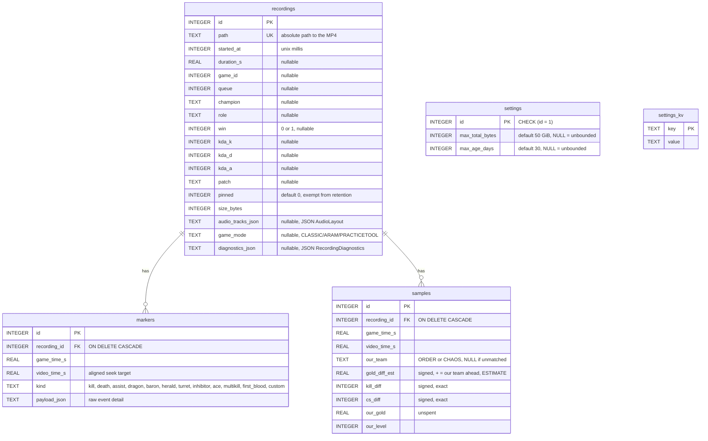
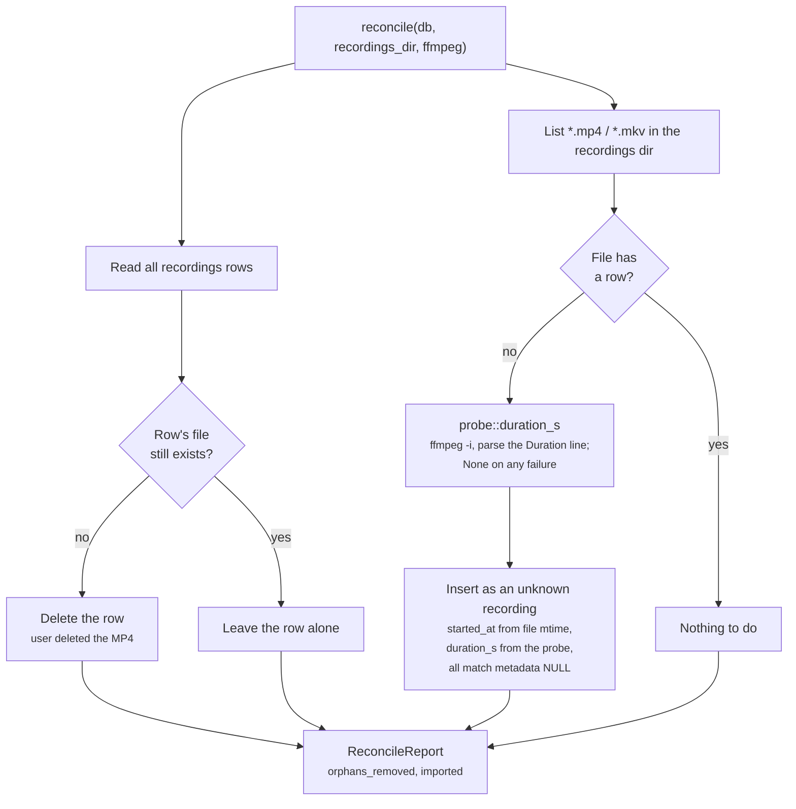
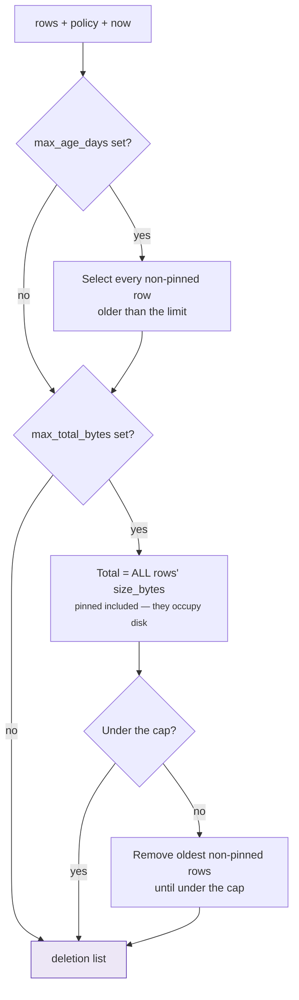

# Data model

SQLite for metadata, MP4 files on disk for video. The files are the source of
truth: a row without its file is dropped on scan, and a file without a row is
imported. The library must survive the user rearranging their own folder.

One database, in the Tauri app data directory, opened via `rusqlite` with the
`bundled` feature so no system SQLite is required. Schema changes go through
`rusqlite_migration` — **append a migration, never edit an existing one**.

---

## Schema



`markers.kind` is an open TEXT column with no CHECK constraint, so adding a
kind needs no migration. The list above is the authority; the inline comment
in migration 1 is a frozen snapshot of what existed when that migration was
written and is deliberately left alone (migrations are append-only, comments
included).

### Migration history

| # | Adds | Why it is shaped that way |
|---|---|---|
| 1 | `recordings`, `markers`, `idx_markers_recording_id` | The original library |
| 2 | `settings` (single row, seeded) | Retention has to protect the user out of the box, so it ships with real defaults rather than "unlimited until configured" |
| 3 | `samples`, `idx_samples_recording_id` | 1 Hz advantage series behind the review timeline. ~2100 rows for a 35-minute game; downsampling happens at render time |
| 4 | `settings_kv` (unseeded) | UI preferences. A missing key means "use the frontend default", which makes adding a preference a zero-migration change |
| 5 | `recordings.audio_tracks_json` (nullable) | Which audio source landed on which MP4 track. Nullable because NULL is the honest answer twice over: every row predating multi-track audio, and anything `reconcile` imported from a file we didn't record. The review player renders NULL as no stem picker rather than as a guess |
| 6 | `recordings.game_mode` (nullable) | Live Client Data's `gameData.gameMode`. Kept out of `queue`, which holds Riot's real *queue id* as an INTEGER: the live API never exposes a queue id and the LCU never exposes a mode string, so the two arrive from different sources at different times (mode during the game, queue only post-game). A row can carry either, both or neither, and the card's Queue label falls back from one to the other |
| 7 | `recordings.diagnostics_json` (nullable) | What the app *observed* while making the recording, as against what the recording contains: how many Live Client Data polls landed, whether we were ever found in `allPlayers`, the alignment the markers were mapped through, which capture backend was live. None of it is derivable afterwards — the live API is gone the moment the game ends. JSON rather than a child table for the same reasons as `audio_tracks_json`, plus one more: a column is disposed of with its row, so retention and `delete_recording` need no cascade to get wrong |

### The audio layout is JSON, not a child table

`recordings.audio_tracks_json` holds a serialized `AudioLayout` — the ordered
track list and the sources feeding each one ([DEVELOPMENT.md §2.5](../DEVELOPMENT.md#25-multi-track-audio)).
A `recording_audio_tracks` table would be the orthodox shape, and it would buy
nothing here: the value is written once, always read whole, never queried by
predicate, and at most six rows long.

The upsert in `insert_recording` treats it specially:

```sql
audio_tracks_json = COALESCE(excluded.audio_tracks_json, recordings.audio_tracks_json)
game_mode         = COALESCE(excluded.game_mode,         recordings.game_mode)
```

`reconcile` upserts on `path` with an all-default row. Without the `COALESCE`,
a rescan landing after a finalize would overwrite a known layout with NULL and
the VOD would silently lose its stem picker. A NULL never wins.

`game_mode` gets the same treatment for the same reason: it is only knowable
while the game is running, so a rescan has nothing to say about it and must
not be allowed to say NULL.

### What `diagnostics_json` is for, and what it is not

The other columns describe the recording. This one describes **making** it.

A card whose champion is NULL, whose markers sit twenty seconds off, or
whose recording stopped early is a question the row cannot answer, because
everything that would answer it — the Live Client Data payloads, the poll
cadence, the alignment as it was derived — is gone the moment the game
ends. `DevSessionView` carries some of the same numbers in memory and does
not survive a restart.

So a finalize records:

| Field | Answers |
|---|---|
| `game_id`, `queue_id`, `is_custom` | Whether the client ever told us which game this was. `game_id: null` *is* the reason `queue` is NULL |
| `polls`, `first_game_time_s`, `last_game_time_s` | How much of the game the poller actually saw. Fewer `polls` than `samples` means the clock was frozen; far fewer than the duration means it was failing |
| `ever_matched` | Whether we were ever found in `allPlayers`. `false` is the entire explanation for a NULL champion, a NULL KDA and an empty advantage curve |
| `alignment_offset_s` | The offset markers were mapped through, or `null` if the clock never advanced. A marker that seeks to the wrong moment is this number being wrong |
| `backend` | Which capture backend was live — on Windows possibly `FailedRecorder` carrying its init error |
| `markers`, `samples` | What the finalize wrote. Disagreeing with the tables means an insert failed |

**Deliberately not a copy of the row.** Everything here is something the
columns cannot say. Duration, size, path and the audio layout are already
columns and are not repeated.

It is written in release builds — the failures happen there — and nothing
in the main UI reads it. The dev portal does (#72).

**Still missing:** the encoder actually selected, the negotiated resolution
and frame rate, and dropped-frame counts. Those live inside libobs, which
runs in a separate worker process (#69), so `RecordingOutput` cannot report
them yet. The LCU summary patch's outcome is also absent, because it lands
seconds to minutes *after* this record is written.

### Who writes the match-metadata columns, and when

Three sources fill them, at three different times, and no two of them can
answer for the same thing. A row can legitimately have any subset.

| Column | Source | When |
|---|---|---|
| `duration_s`, `size_bytes`, `path`, `started_at` | The recorder session | At finalize |
| `champion`, `kda_*`, `win`, `game_mode` | Live Client Data, folded in over the game | At finalize |
| `game_id`, `queue` | The gameflow session, read once at `InProgress` | At finalize |
| `role`, `patch` — and `queue`/`win`/`kda_*` confirmed | The LCU's post-game endpoints | Seconds to a minute *after* finalize |

That last row is `match_summary::patch`, and it is a plain `UPDATE`, never a
re-`insert_recording`: the upsert above takes `pinned`, `size_bytes`,
`started_at` and `duration_s` from `excluded`, so re-upserting a summary
would unpin the recording and zero its size. Every column it writes
COALESCEs so a value the LCU could not establish never erases one the live
client did.

`champion` COALESCEs the other way round — the existing value wins:

```sql
champion = COALESCE(champion, ?)
```

`champion` is sorted on, filtered on and used as the card title, so one
champion under two spellings would split its games in two everywhere in the
UI. Two writers can reach the column — Live Client Data during the game, and
the id `lcu::champions` resolves after it — and both aim at the same display
name (`Wukong`, never the internal `MonkeyKing` alias). Filling only when the
column is NULL means they cannot disagree in it even if they ever disagree
with each other.

Zero rows changed is a no-op, not an error: retention runs during the same
finalize, and the user can delete a card at any point, so the row can
legitimately be gone by the time the patch lands.

**The backfill is the third writer of these columns**, and it goes through the
same `UPDATE` rather than a path of its own. It exists for the rows that
predate the whole pipeline, which have no `game_id` to ask about — a game id is
captured during the game — so it matches on the clock instead and refuses to
write anything when more than one game overlaps a recording. See
[DEVELOPMENT.md §4.2](../DEVELOPMENT.md) and
[recording-pipeline.md §4a](recording-pipeline.md).

### What lives in `settings_kv`

Every key, and which side owns the default. There is no schema and no
migration — a missing key means "use the default" — so the **two sides have to
agree**, because either can be the one reading a key the other never wrote.

| Key | Values | Default | Read by |
|---|---|---|---|
| `theme` | `system` / `light` / `dark` | `system` | `src/prefs.ts`, plus the pre-paint boot script |
| `defaultSort` | `newest` / `oldest` / `longest` / `champion` | `newest` | `src/prefs.ts` |
| `audio_preset` | JSON `AudioPreset` | `Game` | `db::get_audio_preset` |
| `closeAction` | `close-window` / `hide` / `quit` | `close-window` | `core::CloseAction` |
| `notifications` | `on` / `off` | `on` | `core::NotificationPrefs` |
| `notifyRecordingStarted` | `on` / `off` | `off` | `core::NotificationPrefs` |
| `notifyRecordingFinished` | `on` / `off` | `on` | `core::NotificationPrefs` |
| `notifyRecordingFailed` | `on` / `off` | `on` | `core::NotificationPrefs` |
| `notice.closeToTray.seen` | any non-empty string | empty (unseen) | `core::notice_seen` |

Two conventions worth knowing before adding one:

- **Unrecognised values fall back to the default, never error.** This table is
  shared across versions, so a downgrade will read a value a newer build wrote.
  `CloseAction::from_pref` and `NotificationPrefs::from_prefs` both do this, and
  both have a test for it.
- **An empty value means "unset".** `set_ui_pref` can only write — there is no
  delete command — so blanking a key is how "Reset one-time notices" re-arms
  `notice.closeToTray.seen`. Treating a present-but-empty key as *set* would
  make that button silently do nothing.

### Two settings tables, on purpose

`settings` is seeded and single-row because a missing retention policy would
mean *unbounded disk usage*. `settings_kv` is unseeded because a missing theme
just means "use the default". Same word, opposite failure modes.

### `gold_diff_est` is an estimate

The Live Client Data API exposes no per-player gold, so the diff is derived
from summed item prices plus unspent gold. It is stored **pre-signed from the
recording player's point of view** with `our_team` alongside, so the sign
convention is auditable in the data rather than being an unwritten frontend
assumption. `our_team` is `NULL` when the active player could not be matched
in `allPlayers`; the UI renders that as team-unknown rather than risk drawing
an inverted line.

## Reconciliation

Runs at app start and on demand via `rescan_recordings`.



The duration probe runs **only on the import branch**, so a rescan of a folder
whose files all have rows spawns nothing. A first run against a large existing
folder is the case that costs — one ffmpeg per file, and startup reconcile is
inline in `lib.rs`'s `setup`. Every failure (no ffmpeg bundled, an unreadable
file, a file still being written, wording the parser doesn't recognize) leaves
`duration_s` NULL rather than failing the import; see
[DEVELOPMENT.md §4.1](../DEVELOPMENT.md).

Because imported files can be anything the user dropped in the folder, their
displayed names are **not** trusted markup — `src/dom.ts`'s `escapeHtml` /
`escapeAttr` exist for exactly this path.

## Retention

`retention::select_for_deletion` is pure: it takes the row set, the policy and
an injected "now", and returns what would be deleted. That is what makes both
the dry-run preview and the fabricated-clock tests possible.



Age is checked first — anything past the age limit goes regardless of how
much room there is. Pinned recordings count toward usage but are never
candidates.

**When it runs:** app start (after reconcile), after every finalize, and
immediately when the policy is changed from the settings view, so a tightened
limit does not wait for the next game.

**Preview before save:** `preview_retention_policy` runs the same pure
function against the unsaved form values, so the settings view can say what
will be deleted before anything is.

**One deliberate asymmetry.** `delete_recording` (user-initiated) and
`enforce` (automatic sweep) share `delete_recording_and_file`, but diverge on
a file that will not delete: the user-initiated path reports the failure and
leaves the row alone, while the sweep logs and drops the row anyway, so an
unattended enforcement cannot stall on one locked file.
