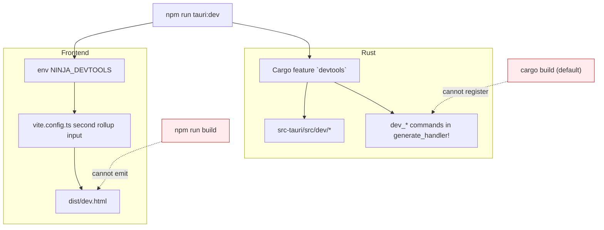

# Dev portal

A second window (`dev.html`) that exercises the whole backend: every command,
every table, the retention decision, and the state machine — none of which the
app's own UI can reach.

Most of the backend can only be driven through it. If you are working on the
supervisor, the DB, retention or the review player, this is your loop.

```bash
npm run tauri:dev   # note the colon — plain `tauri dev` omits the feature
```

`tauri:dev` passes `--features devtools`. Without it the portal's window and
every `dev_*` command are absent, and the main window hides its own "Dev
portal" button accordingly.

---

## It is compiled out of shipped builds

Two independent gates, both off by default:



**Availability is detected, not configured.** The main window calls
`dev_open_portal` and hides its button when the command isn't registered, so
there is no second frontend flag that could drift from the Rust side.

**It is never attached to a release.** It carries raw SQL execution, arbitrary
row writes, a database wipe and state-machine injection — none of which has
any business in a public download. It was once attached to the release with a
note reminding whoever published it to delete the asset first; a reminder is
one forgotten click from shipping all of that, so the asset is now simply
never there. CI uploads it as a workflow artifact instead, which
expires on its own and cannot be published by accident.

## Panels and what each one exists to solve

| Panel | Exists because |
|---|---|
| **Overview** | The state machine diagram with the live state lit, plus `dev_session_snapshot` — markers and samples accumulating *during* a recording were previously invisible, since `game_state_status` only carries the last finalized one |
| **Seed** | There was no seed script anywhere, so the library, its filters and sort, retention and the entire review player could only be exercised by finishing a real game on Windows. Writes real files, rows, markers with the payload shapes `classify_event` produces, and a 1 Hz advantage curve |
| **Simulate** | The supervisor's async glue was only drivable by real League polling. Dispatches `StateEvent`s into the live supervisor (really starting and stopping the recorder), injects Live Client Data payloads through the real `MarkerTracker`, and replays a scripted game at a speed multiplier until it finalizes into a real row |
| **Retention** | `set_retention_policy` saves *and* enforces, with no preview. `select_for_deletion` is pure and takes an injected clock, so this panel dry-runs it — including at a fabricated "now", to test an age rule without waiting days |
| **Database** | Schema browse, paged table reads, row insert/update/delete, raw SQL, full reset |
| **Commands** | Every registered command, invocable by hand, with a drift banner (below) |
| **Recorder** | `start_recording` / `stop_recording` / `is_recording` directly, without a game |
| **Fixtures** | Read/write `fixtures/`, toggle live capture at runtime — the replay mode the fixture strategy always called for |
| **Log** | Portal-side action log |

## What the portal drove back into the app

Two changes leaked usefully out of it:

- **`library-changed`.** The supervisor now emits it after a finalize (and
  `set_retention_policy` after a deletion), and `src/main.ts` listens. This
  was the first backend→frontend push in the codebase, and it fixed the
  standing bug where a recording that just finished stayed invisible until the
  user pressed Refresh.
- **Runtime fixture toggling.** `fixtures::enabled()` is now an `AtomicBool`
  seeded from `NINJA_RECORDER_RECORD_FIXTURES` rather than a per-call env
  read, so capture can be flipped without relaunching.

## Getting a build with it, without building from source

CI bundles a second Windows installer with `--features devtools`, uploaded as
the workflow artifact `ninja-recorder-devtools-windows-latest-<sha>`. A push to
`main` produces one, and so does a manual dispatch on any branch:

```bash
gh workflow run ci.yml --ref <branch>
```

Pull requests skip it — it is a second full Windows bundle and dispatching a
run is cheap.

`tauri.devtools.conf.json` renames the product and binary to
`ninja-recorder-dev` so Windows treats it as a separate application. NSIS keys
the uninstall entry, default install directory and shortcut off `productName`,
so while the two shared one, this installer treated the real install as an
older version of *itself* and tried to uninstall it first — a step that aborts
the whole install with "Unable to uninstall!" if the old uninstaller returns
non-zero or leaves the binary behind (a still-running app is enough).
`mainBinaryName` splits the process name too, so neither build's "close the
running app" check reaches across at the other. The `identifier` is
deliberately *not* overridden, so the portal still opens the library the real
app writes to.

## Known limits

- **The TS command registry is hand-maintained.** Tauri has no runtime
  reflection over `generate_handler!` and this project has no type codegen, so
  `src/dev/registry.ts` is a manual list. `dev_registered_commands` returns the
  Rust side's own list and the Commands panel shows a banner when the two
  disagree — that catches drift without preventing it.
- **`generate_handler!` cannot host a `#[cfg]`**, so `lib.rs` spells out the
  production command list twice. That duplication is exactly what the drift
  banner watches.
- **Seeded placeholder files are sparse and will not decode.** The
  Review-ready preset copies `fixtures/sample.mp4` instead — a synthetic
  6-second clip checked in for this purpose (see `fixtures/README.md`). It has
  no audio track, so the player's mute and volume controls still cannot be
  exercised against it — and neither can stem playback. The Seed panel does
  write varied `audio_tracks_json` layouts across the seeded rows, so the stem
  *picker* renders (including the single-track case, where it must not appear
  at all); selecting a stem then fails at extraction, since there is no audio
  to extract.
- **Retention fixtures use sparse files**, so a 3 GiB recording costs a few
  hundred bytes of real disk.
