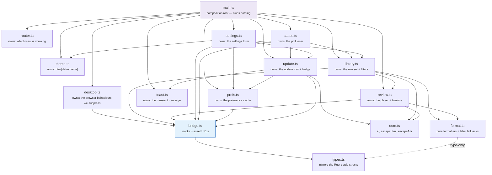
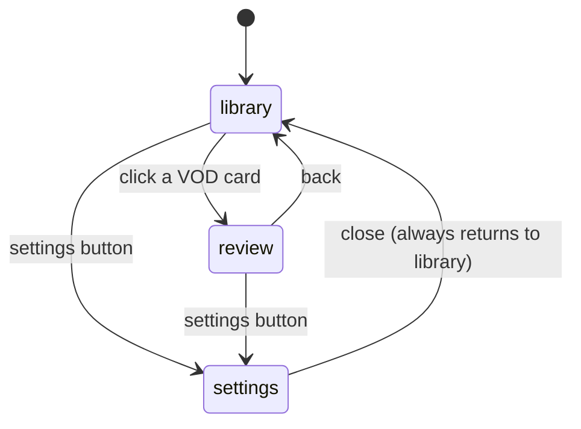
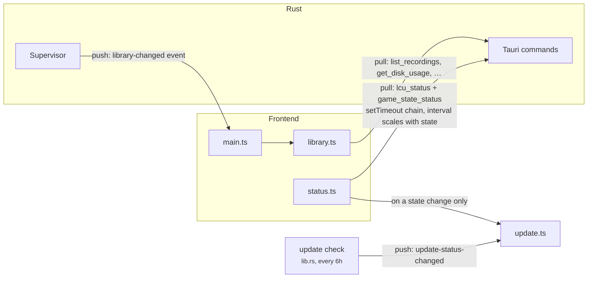
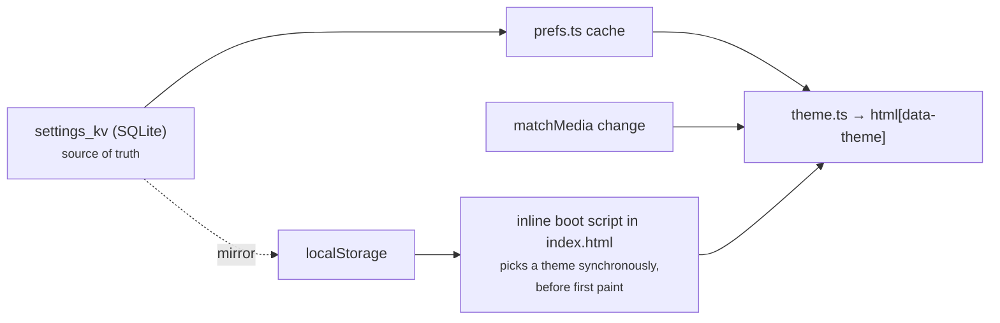

# Frontend

Vanilla TypeScript, no framework, no build-time templating beyond Vite. The
markup lives in `index.html`; the modules under `src/` wire behaviour onto it.

The organising principle is **state ownership, not widgets**. Each module owns
exactly one piece of mutable state and is the only place that writes it.

---

## Module graph

`types.ts` sits apart deliberately: putting each shape beside its first
consumer would make `bridge` → `review` → `bridge` a cycle.

`devportal.ts` is left off the graph: it is one button and a probe, and it is
compiled out of what it talks to. Its edge to `bridge.ts` is the same
`hasDevCommands` one `desktop.ts` draws.

### Suppressed browser behaviour

`desktop.ts` is the only module that exists to make things *not* happen. A
webview arrives as a page — selectable text, a browser context menu, drag
images, F5 — and a window wants none of it. What each half handles:

| Behaviour | Where | Exemption |
|---|---|---|
| Text selection | `styles.css`, `user-select` | Form fields, `code`, `.mono`, `.about-list dd`, and anything marked `.selectable` |
| Context menu | `contextmenu` | Text fields (it is the Cut/Copy/Paste menu there); every build that can inspect |
| Drag images | `dragstart` | Text fields |
| Middle-click autoscroll | `mousedown`, button 1 | — |
| Reload (F5, Ctrl+R) | `keydown` | Every build that can inspect |
| Print (Ctrl+P) | `keydown` | — |

"Every build that can inspect" means the vite dev server (`import.meta.env.DEV`)
or a `devtools` build, detected through `bridge.ts`'s `hasDevCommands` probe.
The flag is read when the event fires, not captured at init, so the few
milliseconds before that probe resolves simply behave like a shipped build.

The dev portal (`dev.html`, `src/dev/`) does none of this. It is a debugging
surface: log output and query results are there to be selected and copied, and
"Inspect element" is a feature of the window.

The reasoning behind all of it is in
[DEVELOPMENT.md §5.1](../DEVELOPMENT.md).

### The library is a list, not a grid

One row per game. A library is scanned rather than browsed — the question is
almost always "which game was that", answered by champion, result and roughly
when — and a card grid answers that in two dimensions when one would do. Rows
also left somewhere for the scoreboard, items and team compositions to go
without a second redesign (#85), which is where all three now are.

**A stacked block on the left sets the row's height**: what the game was, when
it was, which patch, how long it ran, and how it went. Four short lines rather
than four columns, because none of them is a number worth comparing down the
list — together they answer "is this the game I mean", which is read once per
row and then never again.

What *is* worth comparing gets a column: the champion, and the KDA. Deaths are
coloured and the slashes are not, so the eye lands on the middle number without
having to read the other two.

Every column is *capped*, so values line up down the list and a column can be
read vertically without the eye re-finding it on each row. Cells ellipsize
rather than widening the row.

**The leftover width collects in one place, before the actions.** A single
column at `1fr` stretched the champion cell across half the window and threw
everything else at the right edge, so the row read as two unrelated clusters
with a hole between them. With every data column capped they stay one group at
the left, the actions stay pinned right, and the slack sits between them.

The team compositions were once earmarked for that slack and took a column of
their own instead. A fixed grid of squares dropped into a `1fr` track leaves
the leftover width *inside* a data column, where it is invisible to read but
real to every column added after it; slack that stays slack keeps the rule
above true rather than nearly true.

**The ten champions, five to a line, ours on top.** They are the fastest way
to recognise a game the champion column cannot identify on its own — "the one
against the Yasuo" is how people actually remember a match — and they come
free: `scoreboard_json` has held all ten since the end-of-game scoreboard was
persisted, so the block costs no column in the schema and no query.

Which line is *ours* is a claim, and it is only made when the capture can back
it. `our_team` is absent whenever the live poller never matched us in
`allPlayers`; the halves still draw, grouped and in the order the game listed
them, but neither is labelled, because a top line silently meaning "yours"
would be a guess in a slot read as fact. The squares are smaller than the item
strip on purpose — this is a block to scan, and ten boxes at item size
out-weigh the champion, the KDA and the result the row is actually about.

It is also the one block that *hides*, and only ever on window width: below
about 1100px the row's other ten columns already need every pixel there is.
It is the right one to drop, because every other block answers something about
the row's own player — who they were, how they did, what they built — and this
one is context around that, so losing it costs recognition rather than the
ability to tell one row from another. Every row loses it at the same moment, so
the list stays one shape, which is the entire reason a missing *value* renders
as `—` instead of vanishing. That rule is about data, not window width.

**The outcome is carried twice, in one place each.** The leading edge is the
colour, with a wash of it fading out across the first few centimetres so the
edge reads as the row's state rather than as decoration beside it. The word
sits on the last line of the left block — `31m 42s · Win` — where it costs no
column, and is tinted to match, so colour and text each carry it once.

Both channels matter. A badge in its own column repeated the edge and was
dropped; the word was not, because green and red are exactly the pair a
red-green deficiency cannot separate, and an accent alone would leave those
users with no result at all. On an undecided row the word is simply absent,
which is unambiguous rather than a gap: every decided row has one.

**A row never hides an empty slot.** A missing value renders as `—` in the
place it would have occupied, because a row that collapses its gaps is a
different shape per recording, which is precisely what stops a list being
scannable. That matters more now than it did with cards, and more again until
#56's backfill has been run against an old library.

### What a row says when the data is missing

Match metadata arrives from two independent sources — Live Client Data
during the game, the LCU after it (see
[recording-pipeline.md](recording-pipeline.md) §4) — so a row can carry
either, both or neither. `format.ts` owns the fallback chains rather than
scattering `??` through the row template:

| Slot | Chain | Why it stops there |
|---|---|---|
| Title (`vodTitle`) | `champion` → game mode → filename | Never empty. The filename is untrusted input, so the caller still escapes it |
| Queue (`queueOrModeLabel`) | `queue` id → `game_mode` | `CLASSIC` renders as "Summoner's Rift", the *map*: the mode string cannot tell blind from draft from ranked, and naming one would be a guess in a slot read as fact |
| KDA (`formatKda`) | all three or nothing | A partial KDA reads as a real one. The ratio (`kdaRatio`) is a hover hint, not a fourth number in a column three numbers wide |
| Role | Live Client Data's position → the LCU's inference → `Unknown` | The live value is what the game assigned; the LCU's `timeline.lane`/`role` is Riot working it out afterwards and confuses top with jungle, so it fills a gap rather than correcting one. `Unknown` is written out rather than left blank — a row that hides an empty slot is a different shape per recording |
| Outcome | the leading accent, plus the word on the left block's last line | Undecided rows are excluded from the win-rate tile too, so an unknown never reads as a loss — it gets the neutral edge, no wash and no word. A Win/Loss badge used to sit in its own column and was dropped as redundant with the edge; the word moved into the sub-line rather than being dropped with it, because the accent alone is colour only |
| When (`formatRelative`) | relative inside a week → absolute date | "6 weeks ago" is worse than a date at that distance: nobody counts weeks, and the date is what a person searches their memory by. The absolute form is on the `title` either way |

An unrecognised queue id shows as `Queue 1234` and an unrecognised mode
shows as itself. Both are honest; neither invents a name.

### Which blanks the backfill can fill, and which are blank forever

A row made before the metadata pipeline shipped — or imported by `reconcile`
from a folder the user pointed at — starts almost entirely `—`. The backfill
(Settings → "Fill in missing match data"; mechanics in
[data-model.md](data-model.md)) fills some of that from the client's match
history. **It cannot fill all of it, and the difference is not arbitrary:** it
is exactly the line between what the game *reported afterwards* and what only
something watching *during* the game could have seen.

| Blank on the row | The backfill | Why |
|---|---|---|
| Champion, result, KDA | fills | Straight off the match-history document |
| Queue, role, patch | fills | Same document. `role` is Riot's own `lane`/`role` inference, not the live position — see the table above |
| CS | fills, with the scoreboard | Written only when there was no scoreboard at all |
| Items, spells, runes, the ten champions | fills | The scoreboard is rebuilt from the same document, so it arrives as champion *ids* rather than display names |
| The gold curve | fills **only if the recording already has samples** | The curve has to be placed in the video, and the offset for that is read off an existing sample (`sample_alignment_offset`). A recording that never had a live poller has no offset, and a guessed one would draw the right curve at the wrong times |
| Kill diff, CS diff curves | **never** | The advantage curve's other two metrics are the live poller's own arithmetic. Match history has no per-second series but gold |
| The marker timeline | **never** | Live Client Data is gone the moment the game ends, and it was the only thing that saw the events. See [DEVELOPMENT.md §3.2](../DEVELOPMENT.md) |

The last two are the ones worth knowing before running it. A backfilled
recording gets a row that reads completely and a review view that is still
half empty — the gold curve draws, the other two metrics say they have no
data, and the timeline carries no glyphs at all. That is not a bug in the
backfill; those recordings never held the events, and nothing can put them
back.

Two properties inherited from the mechanism, because they show up as
surprises otherwise. **It only ever fills**, so a value already on the row
survives a run — it matches recordings to games on the clock, and filling a
gap on a heuristic is fair where overwriting good data on one is not. And it
**refuses outright when more than one game overlaps** a recording, so a row in
a back-to-back session can come back still blank; that is the refusal working,
not a miss.

### The filter bar

Five filters and a sort, all — with the stats bar above them — operating
client-side over the already-fetched row set. That is fine at solo-user
library sizes and would need real pagination if that stops being true.
Champion (a search box), result and pinned-only were there first; queue, role
and patch complete the set #85 called for, and every one of them reads a
column that already exists.

| Filter | Reads | Built from |
|---|---|---|
| Champion | `vodTitle(row)` | free text |
| Queue | `queueOrModeLabel(row)` | the rows in the library |
| Role | `role` | the rows in the library |
| Result | `win` | fixed: all / wins / losses |
| Patch | `patchLabel(row.patch)` | the rows in the library |
| Pinned only | `pinned` | a checkbox |

**The three derived lists come from the data, not from a vocabulary.** Patch
is open-ended and could not be enumerated ahead of time at all. Queue ids are
a table `format.ts` only partly names — `Queue 1234` is a real label a
hard-coded list would have no entry for. And a fixed list offers "Ranked Flex"
to somebody who has never queued it, which is a control that can only ever
empty the list. A facet with fewer than two things to choose between is
`disabled` rather than hidden, so the bar keeps one shape as a library grows
— unless it is the facet currently filtering, which is never disabled:
retention or a delete can take the library down to the one value already
selected, and greying the control there strands a selection with no way to
undo it.

They are derived from the **whole** library, not from what the other filters
leave. Facets that narrow as you use their neighbours are how a person ends up
holding a selection they can no longer see the way out of.

**Queue filters on the label, not the id**, because the label is what the row
shows — and it is the merged `queue`-then-`game_mode` chain, so a row with no
queue id still files under what it says. Two ids that print the same name
(1700 and 1710 are both "Arena") group together, which is the intent.

**"Unknown" is a value you can filter *to*,** offered only when something is
actually missing it. "Which of my games never got a role" is the question the
`Unknown` on the row itself prompts, and the backfill leaves plenty of them —
see [data-model.md](data-model.md) for what it can and cannot fill.

**An empty result says which kind of empty it is.** "Nothing recorded yet" and
"everything is filtered out" are different problems with different next steps,
and the first message used to be the only one there was — which read as data
loss the moment a filter matched nothing. The filtered case names the total it
is hiding and carries the Clear filters button, which resets the five filters
and deliberately leaves the sort alone: sort hides nothing, and resetting it
would throw away an order the user chose.

## Views

Three top-level sections in one document, toggled by `router.ts`. Before it
existed, each view flipped its own and its sibling's `hidden` attribute from
two files that knew nothing about each other.

### The player clips both ends

A recording brackets the game: it starts on the loading screen — twenty
seconds of a static splash — and it keeps rolling after the game window is
gone, which under WGC captures as *black*, not as a frozen last frame. Opening
a VOD used to land on the first, and playing one to the end used to land on
the second.

The review view treats the recording as a window instead,
`[game start − 1s, game end + 2s]`. Playback opens at its start, stops at its
end, the scrubber spans it, the ruler reads 0:00 at its start, and every seek
is clamped into it by a single `seekTo`.

**The file is untouched.** Both numbers come from the samples the timeline
already fetches: each carries a game clock and a video clock, so the offset
between them is the loading screen, and the last sample is the last thing the
game reported. No column, no migration, and it works on recordings made long
before this existed.

**Three ways it declines to clip the tail**, each falling back to the end of
the file rather than to a guess:

| Condition | Why |
|---|---|
| No samples | A rescan import, or a game whose poller never came up. Nothing knows where its game ended |
| Tail shorter than the margin | There is nothing to remove |
| Gap wider than `MAX_TAIL_CLIP_S` (60 s) | Not a post-game tail. A stretch of unreadable Live Client Data responses keeps recording and produces *no samples*, so real gameplay would sit after the last one — cutting there would hide the game |

Playback is stopped at the window end from both the rAF loop and
`timeupdate`: the loop is smooth but only runs while frames are produced,
`timeupdate` fires at ~4 Hz regardless. Whichever arrives first wins.

See [DEVELOPMENT.md §5.4](../DEVELOPMENT.md) for why the file is not cut, and
[#120](../../issues/120) for cutting the tail out of it.

### Where each kind of art comes from

| Kind | Source | Keyed by |
|---|---|---|
| Champion | Data Dragon | display name → key (`Wukong` → `MonkeyKing`) |
| Item | Data Dragon | the numeric id the game reports |
| Rune | Data Dragon | rune or tree id → an icon *path*, from an unversioned part of the CDN |
| Summoner spell | Data Dragon | display name *and* numeric id → art key (`Flash`, `4`, `74`, `2202` → `SummonerFlash`) |

Spells are the odd one out because `summoner.json` lists one entry per
game-mode *variant* rather than one per spell: `Flash` is `SummonerFlash`,
`SummonerFlash_Jade` and `SummonerCherryFlash`. `spell_art_map` collapses each
name onto the standard version, and maps every variant's id onto it as well, so
a live-captured scoreboard and one rebuilt from match history draw the same
picture from one cache file. Smite is folded the same way — the jungle item
renames it `Primal Smite` mid-game and Data Dragon has no such entry. See
[DEVELOPMENT.md §5.3](../DEVELOPMENT.md).

### Art is asked for once per page, not once per icon

A row carries a champion portrait, two summoner spells, two rune icons, seven
item slots and ten more champion squares for the two team compositions. Forty
rows is therefore several hundred icons, and one IPC call each — every one a
CDN round trip the first time — would be a library that renders over several
seconds.

The team squares are the one set bounded by the *game* rather than by the
library: there are about 170 champions, a square is around 7 KB, and a library
of any size converges on the ones its owner actually meets. Ten times the names
asked for is not ten times the disk.

So `icons.ts` collects what the visible rows want, asks once (`resolve_icons`),
and caches the answer for the session. Misses are cached too: a champion Data
Dragon has never heard of must not be asked about again on every render.

`fillInArt` walks the rows eight at a time and paints each chunk as it lands,
so the top of the list fills in while the bottom is still resolving. The
backend fans out within a chunk as well, six icons at a time — see
[DEVELOPMENT.md §5.3](../DEVELOPMENT.md).

**The row is correct before any of it arrives.** Slots render empty and are
filled in afterwards, which is also exactly what an offline session gets
forever — the row still says the champion, the KDA, the CS and the result in
words. Nothing about the layout depends on a picture turning up.

Empty slots hold their place rather than collapsing. A build with four items is
a different thing from a game with no scoreboard, and a strip that shrank to fit
would say neither.

The spell-and-rune block fills **down each column** rather than across each row:
spells on the left, runes on the right, which is how every scoreboard in the
game arranges them. The markup order is therefore load-bearing — spell 1, spell
2, keystone, secondary tree.

The team block fills the other way, across each row, for the same reason: a
team is a line of five, so the line has to be what the eye picks up. Filling by
column there would interleave the two sides.

### What a marker says

Two shapes, and the split is about who the marker is *about*.

**Kills name people**: `Killed Nautilus`, `Killed by Akali`, `Blitzcrank killed
Jarvan IV`. The name is the whole content — it is never yours, and it is what
you would scrub for.

**Objectives name nobody**: `Dragon`, `Baron`, `Herald`, `Turret`,
`Inhibitor`, `Ace`, `First Blood`. `classify_event` only writes one of these
when you took part — every objective branch is gated on `took_part()`, and
`Ace` and `FirstBlood` on it being *you* — so the killer was always you or an
ally you assisted. Printing it told you your own champion's name, which is the
one thing you already know.

The elemental dragon type went the same way. It says which drake, not which
moment; `Fire Dragon — Shyvana` was four words to say `Dragon`. **Elder is the
exception** and stays `Elder Dragon`: it is a different objective rather than a
flavour of the same one, and it is a thing you would go looking for by name.

`(stolen)` survives on the three it can apply to, because a stolen Baron is the
moment, not a detail.

## Backend communication

Two directions, deliberately asymmetric.

**Pull for live state.** The header's summoner/phase/recording readout comes
from a `setTimeout` chain, not `setInterval` — `lcu_status` reads a lockfile
and makes two HTTPS round trips, and a slow tick under `setInterval` would
stack calls on top of each other. The interval scales with game state, and
stretches to 10 s while the window is hidden.

Because that delay is only chosen when the *next* timer is armed, a
`visibilitychange` listener re-polls immediately when the window comes back —
otherwise the header could show up to 10 s of stale state while the in-flight
timer ran out. The 60 s safety refresh is skipped entirely while hidden: it
rebuilds the whole grid with `innerHTML`, and `library-changed` already covers
real changes. Skipping it leaves its timestamp stale on purpose, so the first
poll after the window returns catches up at once.

**Push for the library.** `library-changed` is one of two backend→frontend
events: the supervisor emits it after a finalize, and `set_retention_policy`
after a deletion. Polling `list_recordings` instead would rebuild the grid
every few seconds and fight scroll and focus.

**Push for updates.** `update-status-changed` is the other. The background
check runs every six hours ([DEVELOPMENT.md §14](../DEVELOPMENT.md)), which is
far too slow to poll for — but *whether the offered update can be installed*
depends on game state, which changes constantly. So `status.ts` also nudges
`update.ts` on a state **edge** and not every tick: without it the Install
button would sit enabled through a whole game and only refuse at the click.

### Command surface

The names and arguments below are the IPC contract and have not changed, but
how they reach Rust has. `bridge.ts` sends all but three of them through a
single `rpc` command — `invoke("rpc", { command, args })` — which `core`'s
dispatch table routes by name
([DEVELOPMENT.md §12](../DEVELOPMENT.md#12-process-model-a-recorder-daemon-and-a-ui-that-can-leave)).
Callers are unaffected: `call()` takes the same name and the same args object,
and forwards the args untouched.

The exceptions are in `DIRECT_COMMANDS` in `bridge.ts`:
`open_recordings_folder` and `dev_open_portal` drive the desktop shell, so they
stay in the UI process; `dev_registered_commands` must stay direct because
`devportal.ts` detects the portal's existence by watching that call *reject* in
a shipped build.

| Command | Returns | Used by |
|---|---|---|
| `list_recordings` | `Vec<RecordingRow>` | library grid |
| `rescan_recordings` | `ReconcileReport` | library toolbar → rescan |
| `backfill_match_metadata` | `BackfillReport` | settings → storage → fill in |
| `resolve_icons` | `IconSet` | library row art, after the list paints |
| `get_recording_markers` | `Vec<MarkerRow>` | review timeline |
| `get_recording_samples` | `Vec<SampleRow>` | advantage curve |
| `get_disk_usage` | `DiskUsage` | library stats bar |
| `get_retention_policy` / `set_retention_policy` | policy / `EnforcementReport` | settings → storage |
| `preview_retention_policy` | dry-run deletion list | settings, while editing |
| `set_pinned` | — | library 📌 |
| `delete_recording` | — | library card |
| `get_recordings_dir` / `open_recordings_folder` | path / — | settings |
| `get_ui_prefs` / `set_ui_pref` | `HashMap<String,String>` / — | `prefs.ts` |
| `get_autostart` / `set_autostart` | `AutostartStatus` | settings → background & tray |
| `get_audio_preset` / `set_audio_preset` | `AudioPreset` / — | settings → audio |
| `list_audio_inputs` | `Vec<AudioInputDevice>` | settings → microphone picker |
| `extract_audio_track` | path to a cached sidecar | review player, stem selection |
| `lcu_status` | `LcuStatus` | header strip |
| `game_state_status` | `SupervisorStatus` | header strip, About block |
| `dev_open_portal` | — | the header's dev button, and the 🔎 on each library row (which passes a `recordingId` so the portal opens on it) |
| `get_update_status` | `UpdateStatus` | settings → About (version + changelog), and the badge on the gear |
| — | the `updateChannel` pref | the channel dropdown rides `get_ui_prefs`/`set_ui_pref`, so it needs no command of its own |
| `check_for_update` | — | settings → About → "Check now" |
| `install_update` | — | settings → About → "Install and restart"; ends the process |
| `start_recording` / `stop_recording` / `is_recording` | — | registered but unreferenced by the main UI; the dev portal's Recorder panel drives them |

**Start on login is the one setting that is not a pref.** It lives in the
platform's own store — `HKCU\…\Run` on Windows — which the user can also edit
from Task Manager, so `settings.ts` reads it from `get_autostart` when the view
loads instead of from the `prefs.ts` cache, and applies whatever
`set_autostart` reports *back* rather than the value it just sent
([DEVELOPMENT.md §12](../DEVELOPMENT.md#12-process-model-a-recorder-daemon-and-a-ui-that-can-leave)).
It is the only row in the settings form that can come back disabled, when the
build has no autostart control or the read failed.

## Routing and the tray

`router.ts` owns which view is showing. `initRouting` adds two entry points the
tray needs: a `#settings` URL fragment read once at startup, for a window the
tray has just created, and a `navigate` event for a window that already exists.
A `#review` fragment is ignored — the review view with no recording loaded is
not a state worth restoring into.

## Theming

`data-theme` on `<html>` is written by JS and only ever holds `"light"` or
`"dark"` — there is no `prefers-color-scheme` query in the stylesheet.
Resolving the OS preference once, in one place, keeps a single dark block
instead of two and makes an explicit "Light" on a dark OS win by construction
rather than by CSS specificity.

The cost: "System" no longer follows the OS for free. `theme.ts` listens on
the matchMedia `change` event to put that back — **removing that listener is a
silent regression with no test to catch it.**

`localStorage` exists for exactly one reason: the boot script has to choose a
theme before first paint and IPC resolves too late. SQLite stays the source of
truth and wins any disagreement.

## Review player

- A plain `<video>` element. H.264/AAC MP4 decodes natively in the webview, so
  seeking and playback rate come for free.
- Video loads through Tauri's asset protocol (`convertFileSrc`), scoped in
  `tauri.conf.json` to `$APPDATA/recordings/*` and
  `$APPDATA/recordings/audio-tracks/*` — this needs the `protocol-asset` Cargo
  feature, not just the config entry. The second entry is not redundant:
  Tauri's scope matcher won't let `*` cross a `/`.
- **The controls live inside `.player-wrap`**, over a scrim at the bottom of
  the video, not in a bar beneath it. That is not cosmetic:
  `requestFullscreen` is called on `.player-wrap`, and anything outside the
  fullscreened subtree is not rendered at all — controls beside the video
  simply vanished when you pressed `f`. The `:fullscreen` rules in
  `styles.css` are load-bearing for the same feature: without them
  `#review-video` keeps its `max-height: 60vh` and renders as a small
  rectangle in the middle of a black screen.
- **Two seek surfaces, one implementation.** The plain progress bar inside the
  player and the rich `#vod-timeline` below it both go through
  `bindScrubbing` + `seekFromPointer`, which take the element to measure
  against. The in-player bar carries no marker ticks; the timeline keeps the
  metric graph, marker glyphs and ruler. The timeline is *outside*
  `.player-wrap`, so it is unavailable in fullscreen — there, marker
  navigation is the `[` / `]` / `d` / `D` hotkeys, which are bound at the
  document level and keep working.
- **Speed and audio-track pickers sit behind the gear button**, in a popover
  that closes on outside pointerdown, on Escape, on `fullscreenchange` and in
  `closeReview`. Escape is guarded on the menu actually being open, so it
  never shadows the user agent's own Escape-exits-fullscreen. Volume is an
  icon that expands into a slider on hover or focus, with an `.open` class
  held for the duration of a drag so it cannot collapse mid-drag.
- The fullscreen button's state is synced from a `fullscreenchange` listener
  rather than from the click handler, since Escape and the OS can both leave
  fullscreen without going through the app.
- Markers closer together than the timeline can resolve (common around a
  teamfight) collapse into one cluster glyph; `MARKER_PRIORITY` decides which
  icon the cluster shows.
- **Audio stems.** Track 0 is the combined mix and plays from the `<video>`
  itself, so most recordings need nothing here and the picker stays hidden
  (fewer than two tracks, or an unknown layout). Selecting any other track
  calls `extract_audio_track`, then plays the returned sidecar through a
  hidden `<audio>` synced against the muted video — WebView2 offers no way to
  switch tracks within one element
  ([DEVELOPMENT.md §2.5](../DEVELOPMENT.md#25-multi-track-audio)).
- Because of that, **volume and mute are held as state, not read off the video
  element** (`userVolume` / `userMuted` → `applyAudioOutput`). The video is
  muted whenever a stem is playing, and controls that read `video.muted` would
  render a muted player over audible sound. The `volumechange` listener was
  removed for the same reason — it would re-enter on the programmatic mute.

- **Playback stops while the window is hidden.** An open VOD otherwise keeps
  decoding video and playing its stem `<audio>` behind a minimised window,
  which is the largest thing the app can burn while it is out of the way.
  A `visibilitychange` listener pauses it and resumes only what it paused
  (`pausedByHide`), so a video the user had already paused stays paused.
  Pausing cascades through the existing `play`/`pause` handlers, so the rAF
  playhead loop stops with it — and `resumeStem` hard-resyncs the stem on the
  way back, so it cannot return drifted.

## Escaping

`reconcile` imports any video file the user drops into the recordings folder,
so a displayed recording name is **not necessarily ours**. `escapeHtml` is for
text nodes and does not handle quotes; `escapeAttr` is the one for attribute
values. Using the wrong one is an injection bug with a plausible trigger.
