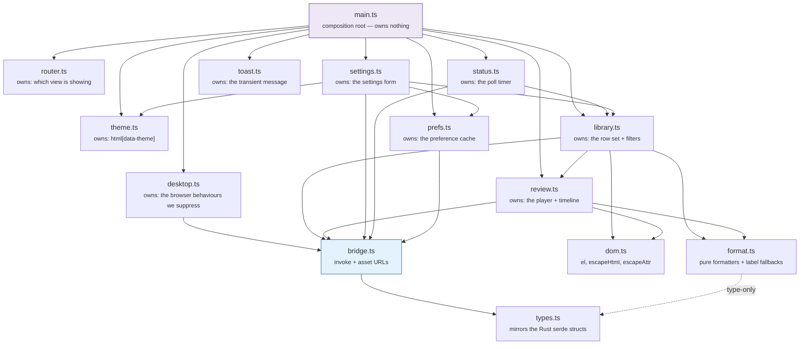
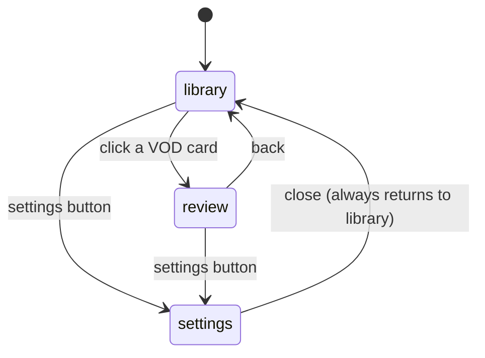
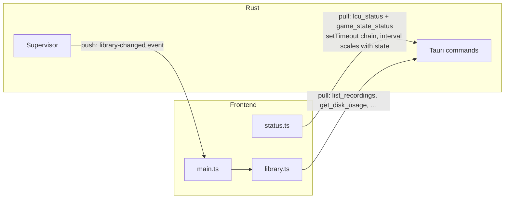
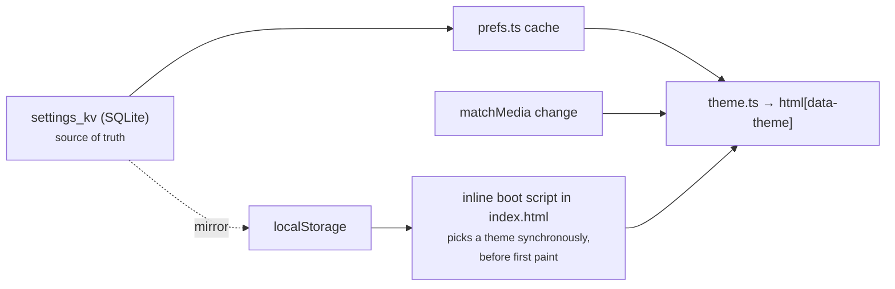

# Frontend

Vanilla TypeScript, no framework, no build-time templating beyond Vite. The
markup lives in `index.html`; the modules under `src/` wire behaviour onto it.

The organising principle is **state ownership, not widgets**. Each module owns
exactly one piece of mutable state and is the only place that writes it.

---

## Module graph

`types.ts` sits apart deliberately: putting each shape beside its first
consumer would make `bridge` → `review` → `bridge` a cycle.

`devportal.ts` is left off the graph: it is one button and a probe, and it is
compiled out of what it talks to. Its edge to `bridge.ts` is the same
`hasDevCommands` one `desktop.ts` draws.

### Suppressed browser behaviour

`desktop.ts` is the only module that exists to make things *not* happen. A
webview arrives as a page — selectable text, a browser context menu, drag
images, F5 — and a window wants none of it. What each half handles:

| Behaviour | Where | Exemption |
|---|---|---|
| Text selection | `styles.css`, `user-select` | Form fields, `code`, `.mono`, `.about-list dd`, and anything marked `.selectable` |
| Context menu | `contextmenu` | Text fields (it is the Cut/Copy/Paste menu there); every build that can inspect |
| Drag images | `dragstart` | Text fields |
| Middle-click autoscroll | `mousedown`, button 1 | — |
| Reload (F5, Ctrl+R) | `keydown` | Every build that can inspect |
| Print (Ctrl+P) | `keydown` | — |

"Every build that can inspect" means the vite dev server (`import.meta.env.DEV`)
or a `devtools` build, detected through `bridge.ts`'s `hasDevCommands` probe.
The flag is read when the event fires, not captured at init, so the few
milliseconds before that probe resolves simply behave like a shipped build.

The dev portal (`dev.html`, `src/dev/`) does none of this. It is a debugging
surface: log output and query results are there to be selected and copied, and
"Inspect element" is a feature of the window.

The reasoning behind all of it is in
[DEVELOPMENT.md §5.1](../DEVELOPMENT.md).

### The library is a list, not a grid

One row per game. A library is scanned rather than browsed — the question is
almost always "which game was that", answered by champion, result and roughly
when — and a card grid answers that in two dimensions when one would do. Rows
also leave somewhere for the scoreboard, items and team compositions to go
without a second redesign (#85).

Every column is *capped*, so values line up down the list and a column can be
read vertically without the eye re-finding it on each row. Cells ellipsize
rather than widening the row.

**The leftover width collects in one place, before the actions.** A single
column at `1fr` stretched the champion cell across half the window and threw
everything else at the right edge, so the row read as two unrelated clusters
with a hole between them. With every data column capped they stay one group at
the left, the actions stay pinned right, and the slack between them is where
the scoreboard, items and team compositions land next — the row is already the
shape it is growing into.

**The outcome is carried twice, in one place each.** The leading edge is the
colour, with a wash of it fading out across the first few centimetres so the
edge reads as the row's state rather than as decoration beside it. The word
sits in the queue sub-line — `Ranked Solo · Jungle · Win` — where it costs no
column, and is tinted to match, so colour and text each carry it once.

Both channels matter. A badge in its own column repeated the edge and was
dropped; the word was not, because green and red are exactly the pair a
red-green deficiency cannot separate, and an accent alone would leave those
users with no result at all. On an undecided row the word is simply absent,
which is unambiguous rather than a gap: every decided row has one.

**A row never hides an empty slot.** A missing value renders as `—` in the
place it would have occupied, because a row that collapses its gaps is a
different shape per recording, which is precisely what stops a list being
scannable. That matters more now than it did with cards, and more again until
#56's backfill has been run against an old library.

### What a row says when the data is missing

Match metadata arrives from two independent sources — Live Client Data
during the game, the LCU after it (see
[recording-pipeline.md](recording-pipeline.md) §4) — so a row can carry
either, both or neither. `format.ts` owns the fallback chains rather than
scattering `??` through the row template:

| Slot | Chain | Why it stops there |
|---|---|---|
| Title (`vodTitle`) | `champion` → game mode → filename | Never empty. The filename is untrusted input, so the caller still escapes it |
| Queue (`queueOrModeLabel`) | `queue` id → `game_mode` | `CLASSIC` renders as "Summoner's Rift", the *map*: the mode string cannot tell blind from draft from ranked, and naming one would be a guess in a slot read as fact |
| KDA (`formatKda`) | all three or nothing | A partial KDA reads as a real one. The ratio (`kdaRatio`) is a hover hint, not a fourth number in a column three numbers wide |
| Outcome | the leading accent, plus the word in the queue sub-line | Undecided rows are excluded from the win-rate tile too, so an unknown never reads as a loss — it gets the neutral edge, no wash and no word. A Win/Loss badge used to sit in its own column and was dropped as redundant with the edge; the word moved into the sub-line rather than being dropped with it, because the accent alone is colour only |
| When (`formatRelative`) | relative inside a week → absolute date | "6 weeks ago" is worse than a date at that distance: nobody counts weeks, and the date is what a person searches their memory by. The absolute form is on the `title` either way |

An unrecognised queue id shows as `Queue 1234` and an unrecognised mode
shows as itself. Both are honest; neither invents a name.

## Views

Three top-level sections in one document, toggled by `router.ts`. Before it
existed, each view flipped its own and its sibling's `hidden` attribute from
two files that knew nothing about each other.

## Backend communication

Two directions, deliberately asymmetric.

**Pull for live state.** The header's summoner/phase/recording readout comes
from a `setTimeout` chain, not `setInterval` — `lcu_status` reads a lockfile
and makes two HTTPS round trips, and a slow tick under `setInterval` would
stack calls on top of each other. The interval scales with game state, and
stretches to 10 s while the window is hidden.

Because that delay is only chosen when the *next* timer is armed, a
`visibilitychange` listener re-polls immediately when the window comes back —
otherwise the header could show up to 10 s of stale state while the in-flight
timer ran out. The 60 s safety refresh is skipped entirely while hidden: it
rebuilds the whole grid with `innerHTML`, and `library-changed` already covers
real changes. Skipping it leaves its timestamp stale on purpose, so the first
poll after the window returns catches up at once.

**Push for the library.** `library-changed` is the one backend→frontend event:
the supervisor emits it after a finalize, and `set_retention_policy` after a
deletion. Polling `list_recordings` instead would rebuild the grid every few
seconds and fight scroll and focus.

### Command surface

The names and arguments below are the IPC contract and have not changed, but
how they reach Rust has. `bridge.ts` sends all but three of them through a
single `rpc` command — `invoke("rpc", { command, args })` — which `core`'s
dispatch table routes by name
([DEVELOPMENT.md §12](../DEVELOPMENT.md#12-process-model-a-recorder-daemon-and-a-ui-that-can-leave)).
Callers are unaffected: `call()` takes the same name and the same args object,
and forwards the args untouched.

The exceptions are in `DIRECT_COMMANDS` in `bridge.ts`:
`open_recordings_folder` and `dev_open_portal` drive the desktop shell, so they
stay in the UI process; `dev_registered_commands` must stay direct because
`devportal.ts` detects the portal's existence by watching that call *reject* in
a shipped build.

| Command | Returns | Used by |
|---|---|---|
| `list_recordings` | `Vec<RecordingRow>` | library grid |
| `rescan_recordings` | `ReconcileReport` | library toolbar → rescan |
| `backfill_match_metadata` | `BackfillReport` | settings → storage → fill in |
| `champion_icon` | `string \| null` | library card portraits, after the grid paints |
| `get_recording_markers` | `Vec<MarkerRow>` | review timeline |
| `get_recording_samples` | `Vec<SampleRow>` | advantage curve |
| `get_disk_usage` | `DiskUsage` | library stats bar |
| `get_retention_policy` / `set_retention_policy` | policy / `EnforcementReport` | settings → storage |
| `preview_retention_policy` | dry-run deletion list | settings, while editing |
| `set_pinned` | — | library 📌 |
| `delete_recording` | — | library card |
| `get_recordings_dir` / `open_recordings_folder` | path / — | settings |
| `get_ui_prefs` / `set_ui_pref` | `HashMap<String,String>` / — | `prefs.ts` |
| `get_autostart` / `set_autostart` | `AutostartStatus` | settings → background & tray |
| `get_audio_preset` / `set_audio_preset` | `AudioPreset` / — | settings → audio |
| `list_audio_inputs` | `Vec<AudioInputDevice>` | settings → microphone picker |
| `extract_audio_track` | path to a cached sidecar | review player, stem selection |
| `lcu_status` | `LcuStatus` | header strip |
| `game_state_status` | `SupervisorStatus` | header strip, About block |
| `start_recording` / `stop_recording` / `is_recording` | — | registered but unreferenced by the main UI; the dev portal's Recorder panel drives them |

**Start on login is the one setting that is not a pref.** It lives in the
platform's own store — `HKCU\…\Run` on Windows — which the user can also edit
from Task Manager, so `settings.ts` reads it from `get_autostart` when the view
loads instead of from the `prefs.ts` cache, and applies whatever
`set_autostart` reports *back* rather than the value it just sent
([DEVELOPMENT.md §12](../DEVELOPMENT.md#12-process-model-a-recorder-daemon-and-a-ui-that-can-leave)).
It is the only row in the settings form that can come back disabled, when the
build has no autostart control or the read failed.

## Routing and the tray

`router.ts` owns which view is showing. `initRouting` adds two entry points the
tray needs: a `#settings` URL fragment read once at startup, for a window the
tray has just created, and a `navigate` event for a window that already exists.
A `#review` fragment is ignored — the review view with no recording loaded is
not a state worth restoring into.

## Theming

`data-theme` on `<html>` is written by JS and only ever holds `"light"` or
`"dark"` — there is no `prefers-color-scheme` query in the stylesheet.
Resolving the OS preference once, in one place, keeps a single dark block
instead of two and makes an explicit "Light" on a dark OS win by construction
rather than by CSS specificity.

The cost: "System" no longer follows the OS for free. `theme.ts` listens on
the matchMedia `change` event to put that back — **removing that listener is a
silent regression with no test to catch it.**

`localStorage` exists for exactly one reason: the boot script has to choose a
theme before first paint and IPC resolves too late. SQLite stays the source of
truth and wins any disagreement.

## Review player

- A plain `<video>` element. H.264/AAC MP4 decodes natively in the webview, so
  seeking and playback rate come for free.
- Video loads through Tauri's asset protocol (`convertFileSrc`), scoped in
  `tauri.conf.json` to `$APPDATA/recordings/*` and
  `$APPDATA/recordings/audio-tracks/*` — this needs the `protocol-asset` Cargo
  feature, not just the config entry. The second entry is not redundant:
  Tauri's scope matcher won't let `*` cross a `/`.
- **The controls live inside `.player-wrap`**, over a scrim at the bottom of
  the video, not in a bar beneath it. That is not cosmetic:
  `requestFullscreen` is called on `.player-wrap`, and anything outside the
  fullscreened subtree is not rendered at all — controls beside the video
  simply vanished when you pressed `f`. The `:fullscreen` rules in
  `styles.css` are load-bearing for the same feature: without them
  `#review-video` keeps its `max-height: 60vh` and renders as a small
  rectangle in the middle of a black screen.
- **Two seek surfaces, one implementation.** The plain progress bar inside the
  player and the rich `#vod-timeline` below it both go through
  `bindScrubbing` + `seekFromPointer`, which take the element to measure
  against. The in-player bar carries no marker ticks; the timeline keeps the
  metric graph, marker glyphs and ruler. The timeline is *outside*
  `.player-wrap`, so it is unavailable in fullscreen — there, marker
  navigation is the `[` / `]` / `d` / `D` hotkeys, which are bound at the
  document level and keep working.
- **Speed and audio-track pickers sit behind the gear button**, in a popover
  that closes on outside pointerdown, on Escape, on `fullscreenchange` and in
  `closeReview`. Escape is guarded on the menu actually being open, so it
  never shadows the user agent's own Escape-exits-fullscreen. Volume is an
  icon that expands into a slider on hover or focus, with an `.open` class
  held for the duration of a drag so it cannot collapse mid-drag.
- The fullscreen button's state is synced from a `fullscreenchange` listener
  rather than from the click handler, since Escape and the OS can both leave
  fullscreen without going through the app.
- Markers closer together than the timeline can resolve (common around a
  teamfight) collapse into one cluster glyph; `MARKER_PRIORITY` decides which
  icon the cluster shows.
- **Audio stems.** Track 0 is the combined mix and plays from the `<video>`
  itself, so most recordings need nothing here and the picker stays hidden
  (fewer than two tracks, or an unknown layout). Selecting any other track
  calls `extract_audio_track`, then plays the returned sidecar through a
  hidden `<audio>` synced against the muted video — WebView2 offers no way to
  switch tracks within one element
  ([DEVELOPMENT.md §2.5](../DEVELOPMENT.md#25-multi-track-audio)).
- Because of that, **volume and mute are held as state, not read off the video
  element** (`userVolume` / `userMuted` → `applyAudioOutput`). The video is
  muted whenever a stem is playing, and controls that read `video.muted` would
  render a muted player over audible sound. The `volumechange` listener was
  removed for the same reason — it would re-enter on the programmatic mute.

- **Playback stops while the window is hidden.** An open VOD otherwise keeps
  decoding video and playing its stem `<audio>` behind a minimised window,
  which is the largest thing the app can burn while it is out of the way.
  A `visibilitychange` listener pauses it and resumes only what it paused
  (`pausedByHide`), so a video the user had already paused stays paused.
  Pausing cascades through the existing `play`/`pause` handlers, so the rAF
  playhead loop stops with it — and `resumeStem` hard-resyncs the stem on the
  way back, so it cannot return drifted.

The library grid's filters, sort and stats bar all operate client-side over
the already-fetched row set. That is fine at solo-user library sizes and would
need real pagination if that stops being true.

## Escaping

`reconcile` imports any video file the user drops into the recordings folder,
so a displayed recording name is **not necessarily ours**. `escapeHtml` is for
text nodes and does not handle quotes; `escapeAttr` is the one for attribute
values. Using the wrong one is an injection bug with a plausible trigger.
