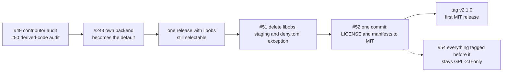

# Licensing

What WS8 ([#85](https://github.com/NinjaGoldfinch/ninja-recorder/issues/85))
has to know before the licence changes: who holds copyright in the tree, which
code came from the libobs fork or from anything else under a copyleft licence,
which copyleft component survives, and what happens to the releases already out.
The *why* (MIT, the order, and where "written from the docs" ends) is
[DEVELOPMENT.md §18](../DEVELOPMENT.md#18-the-licensing-exit).
[provenance.md](provenance.md) records what was copied from v1 and the debt that
came with it. This file is the audit, done against that record.

**Today the repository is GPL-2.0-only**, and nothing here changes that. The
decision is made, **MIT at v2.1**
([#66](https://github.com/NinjaGoldfinch/ninja-recorder/issues/66)), and it
lands in the order below. Every date and count on this page is as of the audit
on **2026-09-26**, against `origin/main` at `08051d0`.

This page records facts and cites the files behind them. **It is not legal
advice**, and where a question is a legal one rather than a factual one it says
so and leaves it to the owner.



---

## 1. Contributor audit (#49)

Relicensing needs the agreement of everyone whose copyright is in the tree.

### How to run it

```bash
git fetch --tags origin
git shortlog -sne --all
```

**The `--all` counts depend on the clone, and the authors do not.** `--all`
counts every ref: unmerged branches in whichever clone runs it, and the tags
`v2.0.0-alpha.11` to `v2.0.0-alpha.70`, which point into an earlier copy of this
history. Each of the 69 commits reachable only from those tags has a
counterpart on `main` with the same author and subject. Both inflate the counts
without adding an author, so `--all` is still the right command: it is the one
that cannot miss one. `git shortlog -sne origin/main` gives the counts for what
is actually in the tree.

### Result, 2026-09-26

| Author | `--all` | `origin/main` | Who |
|---|---:|---:|---|
| Samuel Goldfinch `<ninja@ninjagoldfinch.nz>` | 231 | 115 | the maintainer |
| ninja `<ninja@ninjagoldfinch.nz>` | 16 | 15 | **the maintainer**: the same email, committing under a short name |
| dependabot[bot] `<49699333+dependabot[bot]@users.noreply.github.com>` | 8 | 4 | GitHub's dependency bot; see below |

`Co-authored-by` trailers add one name, dependabot's, on its own commits and on
the maintainer's #93. No commit has a human co-author.

GitHub's own attribution agrees:
`gh api 'repos/NinjaGoldfinch/ninja-recorder/contributors?anon=1'` lists
`NinjaGoldfinch` (130) and `dependabot[bot]` (4, type `Bot`), and no anonymous
contributors.

### Dependabot's commits need no agreement

All four of dependabot's commits on `main` are version bumps in manifests and
lock files, and none of them adds any code. The other four under `--all` are
their copies in the earlier history described above.

| PR | Commit | Files | What changed |
|---|---|---|---|
| #86 | `168d037` | `package.json`, `package-lock.json` | `typescript` `~5.6.2` → `~7.0.2`, `vite` `^6.0.3` → `^8.3.0`, and the lock file regenerated |
| #87 | `b311b48` | `.github/workflows/{ci,advisories,project}.yml` | `uses:` lines only: eight actions moved to newer major versions |
| #88 | `53e8a1e` | `src-tauri/Cargo.toml`, `Cargo.lock` | `base64 = "0.22"` → `"0.23"` |
| #89 | `0db1b5e` | `src-tauri/Cargo.toml`, `Cargo.lock` | `reqwest` 0.12.28 → 0.13.4 |

`09a7350` (#93) carries a `Co-authored-by: dependabot[bot]` trailer because it
took over Dependabot's #90 (`tokio-tungstenite` 0.24 → 0.30). Dependabot's share
of that commit is the `Cargo.toml` line and the lock file. The code in it, the
`.into()` at two send sites in `lcu/gameflow.rs` and `dev/events.rs`, is the
maintainer's.

A version number and a machine-generated lock file are not creative
expression, and a bot is not a copyright holder. **Finding: nothing in the
tree needs anyone's agreement except the maintainer's.**

### Code copied from v1

This repository began as v1 at `32dcd41`
([provenance.md](provenance.md#source)), so v1's authors are this tree's
authors too. The import commit (`ffce649`) is authored by the maintainer, so the
check has to run against v1's own history:

```bash
git clone --bare https://github.com/NinjaGoldfinch/ninja-recorder-deprecated.git
git -C ninja-recorder-deprecated.git shortlog -sne 32dcd41
```

| Author identity at `32dcd41` | Commits |
|---|---:|
| a container-default author name, with the email `ninja@ninjagoldfinch.nz` | 129 |
| Samuel Goldfinch `<s@g.org.nz>` | 115 |
| NinjaGoldfinch `<s@g.org.nz>` | 80 |
| NinjaGoldfinch `<ninja@ninjagoldfinch.nz>` | 1 |

All four are the maintainer: two email addresses and three names. The container
name is what the maintainer's development container used before its identity
was set, and it carries the maintainer's email. v1 has no `Co-authored-by`
trailers and no dependabot commits. GitHub agrees:
`gh api 'repos/NinjaGoldfinch/ninja-recorder-deprecated/contributors?anon=1'`
returns a single contributor, `NinjaGoldfinch`, with 327 commits (v1's `main`
runs two commits past `32dcd41`), and no anonymous ones.

**Finding: v1 had no other contributors, so the copied code carries no one
else's authorship.** Authorship is not the only way someone else's copyright
can get into a tree, though. v1 also consulted third-party code, and
[section 2](#2-derived-code-audit-50) covers that.

### Before tagging v2.1.0

- [ ] Re-run `git shortlog -sne --all` on the commit #52 tags, and update the
      table above. A new author means a written agreement or a rewrite of
      their hunks before the tag, not after.
- [ ] Check any new dependabot commits in the same way: files touched, and
      version strings only.

---

## 2. Derived-code audit (#50)

The rule, and the reason for it, is in
[DEVELOPMENT.md §18](../DEVELOPMENT.md#18-the-licensing-exit): code that
survives v2.1 must be written from the public Windows API documentation and
never from the fork. The checklist below is what #51 executes.

### Sources that are GPL

| Source | Licence | How it reached this tree |
|---|---|---|
| [`NinjaGoldfinch/libobs-recorder`](https://github.com/NinjaGoldfinch/libobs-recorder), pinned at tag `v2.0.0` (`7c65164`) | GPL-2.0 (a fork of `FFFFFFFXXXXXXX/libobs-recorder`) | a Cargo dependency, five crates; `recorder/libobs/` drives its API |
| libobs ([obs-studio](https://github.com/obsproject/obs-studio)) | GPL-2.0-or-later | the DLLs CI stages; C sources cited as behavioural references |
| [`FFFFFFFXXXXXXX/league_record`](https://github.com/FFFFFFFXXXXXXX/league_record) | **GPL-3.0** (its `LICENSE.txt`) | DEVELOPMENT.md §2.1 names it as v1's reference implementation, and §2.2 says v1's capture glue was "cross-checked against league_record's real, working source" |

league_record is not a dependency and is not in `deny.toml`. It is in this
table because v1 read it while writing capture code, and one function survives
from that (the `recorder/window.rs` item below).

### Method

1. The identifier grep below, over everything that builds or ships.
2. A line-by-line comparison of every `.rs`, `.ts`, `.svelte` and `.css` file
   in `src-tauri/src/`, `src/` and `spikes/` against the fork at `v2.0.0` and
   against league_record's `master` (`df3acfa`). Lines are compared after
   whitespace is normalised, and only lines of 25 characters or more count. It
   catches copying and misses paraphrase, which is why step 3 exists.
3. Reading every comment that names libobs, OBS or the fork in
   `recorder/own/`, `mp4/` and `spikes/`.

**Step 2 found one derivation**, `recorder/window.rs`. Everything else it
matched was an identifier that belongs to Riot's API (`gameData`,
`participantIdentities`, the `CheckedIntoTournament` gameflow phase) or Rust
boilerplate (`fn fmt(&self, f: &mut std::fmt::Formatter<'_>)`), which is shared
by any two programs doing the same job and not copied expression. Nothing in
`recorder/own/`, `mp4/` or `spikes/` matched either source.

### The exit grep

#50's exit criterion is that a grep for fork identifiers returns nothing.
This is that grep, run from the repository root:

```bash
git grep -n -I -E 'libobs[_-](recorder|sys)|(int|ext)process[_-]recorder|ipc[_-]link|IpcLink|build[_-]helper|InpRecorder|LibObs|\bObs[A-Z]|RecorderSettings|drain_logs|\[rec\]:|\bobs_[a-z]|OBS_(X264|QSV)|JIM_NVENC|FFMPEG_NVENC|AMD_AMF|wasapi_(process_output|input|output)_capture|MAX_AUDIO_MIXES|winrt-capture|win-wasapi|plugin-main\.cpp|def_log_handler|base_set_log_handler' \
  -- src-tauri src scripts .github spikes ':!*Cargo.lock'
```

It covers the fork's crate and type names, libobs's C symbols, and the libobs
source files cited as references. It leaves out `docs/`, `DEVELOPMENT.md` and
`README.md`, because a history of why libobs was used and then removed is
allowed to name it, and it leaves out `Cargo.lock`, which regenerates.

**Today it returns 134 lines in 20 files.** The audit counted 133 in 22;
#277 then added `about.toml`'s notice entries for the fork's crates and
`scripts/notices.mjs`'s note about the libobs runtime (six lines),
#269 added `own/worker/serve.rs`'s mention of a libobs-recorder PR (one), and
PR-CITATIONS re-cited the own backend's four comments that leaned on libobs or
OBS (six lines, five files: 140 before it, 134 after):

| Lines | File |
|---:|---|
| 39 | `src-tauri/src/recorder/libobs/mod.rs` |
| 20 | `src-tauri/src/daemon/log_bridge.rs` |
| 14 | `.github/workflows/ci.yml` |
| 13 | `src-tauri/deny.toml` |
| 11 | `scripts/libobs-keep.txt` |
| 9 | `src-tauri/src/recorder/libobs/worker_log.rs` |
| 5 | `src-tauri/about.toml` |
| 4 | `src-tauri/nsis/installer-hooks.nsh` |
| 3 | `src-tauri/src/daemon/mod.rs` |
| 3 | `src-tauri/Cargo.toml` |
| 2 | `src-tauri/src/lib.rs` |
| 2 | `src-tauri/build.rs` |
| 2 | `scripts/trim-libobs.ps1` |
| 1 each | `recorder/own/win/mod.rs`, `recorder/own/worker/serve.rs`, `recorder/mod.rs`, `recorder/libobs/window.rs`, `spikes/p0c-audio/src/main.rs`, `scripts/notices.mjs`, `.github/dependabot.yml` |

Every line left is either the libobs backend itself, its staging and
notices, or a sentence about the fork in a file #51 already rewrites, so
all of it goes with #51.

After #51 it must return nothing.

**The grep does not catch `recorder/window.rs`**, which is derived from
league_record rather than from the fork and uses none of the fork's names. It
is its own checklist item below.

**The word `libobs` itself will survive in code, on purpose.** #51 requires a
stored `capture_backend = libobs` row to read back as `own`, so the setting's
parser keeps that one string. `git grep -n -i libobs -- src-tauri/src src`
should, after #51, find only that parser and its test.

### Checklist for #51

Each item is classified one of three ways. **Delete** means #51 removes it and
nothing replaces it. **Rewrite from Microsoft's docs** means the own backend
still needs what it does, so it is rewritten from Microsoft Learn, not from the
fork, league_record or libobs. **Not derived** means the reason is given and
only the reference goes.

#### The libobs backend itself

- [ ] **Delete** `src-tauri/src/recorder/libobs/mod.rs`. It is written against
      the fork's API throughout (`libobs_recorder::Recorder`,
      `RecorderSettings`, `Window`, `Encoder::JIM_NVENC` and the rest), and its
      header says it was "written and reviewed against the reference
      implementation's actual working code".
- [ ] **Delete** `recorder/libobs/window.rs`, the adapter to the fork's
      `Resolution`.
- [ ] **Delete** `recorder/libobs/worker_log.rs`. It exists to capture the
      fork's worker output, and it cites libobs's `def_log_handler` and
      `base_set_log_handler`.
- [ ] **Delete** `pub mod libobs;` in `recorder/mod.rs`, and the doc comments in
      `recorder/mod.rs` and `recorder/own/win/mod.rs` that name
      `LibObsRecorder`.
- [ ] **Delete** the `libobs-recorder` dependency and its comment in
      `src-tauri/Cargo.toml`. The pin is `v2.0.0` today, with a `v2.0.1` bump
      pending for libobs-recorder#1.
- [ ] **Delete** the fork's block in `src-tauri/deny.toml`: the five
      `[[licenses.exceptions]]` entries and the `[sources] allow-git` URL. Then
      `cargo deny check` has to stay green, which is #51's exit criterion.
- [ ] **Delete** `.github/dependabot.yml`'s `ignore` entry for
      `libobs-recorder`.

#### Logging

- [ ] **Delete** `daemon/log_bridge.rs`'s capture routing:
      `CAPTURE_CRATES` (`ipc_link`, `libobs_recorder`, `intprocess_recorder`),
      `WORKER_LINE_PREFIX` (`"[rec]: "`, which is `ipc-link`'s wire format) and
      the `libobs` tag. If nothing else logs through the `log` facade, the
      bridge and `Cargo.toml`'s `log` dependency go with them. That dependency's
      comment says it is there for the capture crates.
- [ ] **Delete** `log.rs`'s `libobs_file_names`, the `libobs.log` and
      `libobs-devtools.log` files, and their rotation, as well as the Log panel's
      and the diagnostics tests' references to them.

#### Staging, bundling and install

- [ ] **Move ffmpeg out of `libobs\` first**, before anything else in this
      group. See [section 3](#moving-it-out-of-libobs-before-51). Otherwise the
      faststart remux and startup recovery stop silently.
- [ ] **Delete** `ci.yml`'s "Resolve libobs backend revision" and "Stage libobs
      capture backend" steps, the libobs part of the cache key, the
      `libobs_trim` dispatch input, the `LIBOBS_TRIM` env and the two trim
      steps, and the `-libobs-trim` artifact suffix.
- [ ] **Delete** `scripts/libobs-keep.txt` and `scripts/trim-libobs.ps1`. The
      keep-list names files in libobs's distribution and cites
      `intprocess-recorder`'s `GRAPHICS_MODULE`. Both are facts about the fork,
      and neither is needed once there is nothing to trim.
- [ ] **Delete** `tauri.windows.conf.json`'s `target/libobs` resource, and
      `build.rs`'s `target/libobs` placeholder directory.
- [ ] `src-tauri/nsis/installer-hooks.nsh`: **delete** `NR_WORKER`
      (`libobs\extprocess_recorder.exe`), the fork's binary, and the comments
      that name it, along with `daemon/mod.rs`'s test that pins it. The Restart
      Manager machinery (`RmStartSession`, `RmRegisterResources`, `RmGetList`)
      is **not derived**: the fork has no installer, and the calls are
      Microsoft's documented API. Keep it if #241's capture worker needs to be
      stopped the same way.
- [ ] **Delete** `daemon/mod.rs`'s `libobs_worker()` and the
      `CaptureBackend::Libobs` arms, and `lib.rs`'s comment about the
      out-of-process `extprocess_recorder.exe`.

#### The `capture_backend` switch (not derived, deleted with the backend)

- [ ] `recorder/backend.rs`, `set_capture_backend`/`get_capture_backend` in
      `core/dispatch.rs`, the Settings row (`Advanced.svelte`,
      `settings/capture.ts`, the store and their tests), the mock transport,
      and a regenerated contract. A stored `libobs` value must still read
      cleanly as `own`. This is our own code. It goes because what it switches
      between goes.

#### Code the own backend keeps

- [x] **Rewrite from Microsoft's docs: `recorder/window.rs`'s `client_size`,
      and `find_window` if anything still calls it.** The evidence: #247
      extracted this file from `recorder/libobs/window.rs`, which v1 wrote in
      `6570b2f` (2026-09-01). That file matches league_record's
      [`src-tauri/src/recorder/window.rs`](https://github.com/FFFFFFFXXXXXXX/league_record/blob/master/src-tauri/src/recorder/window.rs)
      in structure and detail. Both declare the same three constants in the
      same order, build `FindWindowA` arguments by pushing `'\0'` onto owned
      `String`s and wrapping them in `PCSTR`, and treat a `GetClientRect` of
      `right > 1 && bottom > 1` as ready. Both also give the same explanation for
      that check: the (1, 1) rectangle Windows reports briefly under per-monitor
      DPI awareness. Our file's own header says "These identifiers ... are the
      same ones the reference implementation uses". league_record is GPL-3.0.

      What is and is not affected:
      - `client_size` is **used by the own backend** (`own/win/session.rs`) and
        is the part to rewrite. Take the behaviour, polling until the client
        rectangle is meaningful, from Microsoft Learn's `GetClientRect` and DPI
        awareness pages, and write it fresh.
      - `find_window` and `WINDOW_TITLE`/`WINDOW_PROCESS` are used only by the
        libobs backend, so #51 deletes them.
      - `find_by_class` (`FindWindowW` on the class alone) is **not derived**.
        league_record has no class-only lookup, and it was written for the own
        backend.
      - The string values `"RiotWindowClass"`, `"League of Legends (TM)
        Client"` and `"League of Legends.exe"` are **not derived**. They are
        names Riot's game gives its window and process, facts that anyone can
        read with Spy++ or Task Manager, and they are not anyone's expression.

      **`client_size`: done in #275.** It was deleted by line range without
      its body or doc comment being read, and written again from Microsoft
      Learn's `GetClientRect`, `IsIconic`, `IsWindow` and high-DPI pages,
      which its doc comment cites. It now checks `IsIconic` first, returns
      `None` for a failed call or a side under two pixels, and does its
      rectangle arithmetic in a pure, unit-tested `usable_size`. The doc
      comment also records a finding: the executable declares no DPI
      awareness and the daemon never sets one, so the daemon reads the game's
      size in unaware coordinates. `find_window` stays for #51 to delete.
- [x] **Not derived, re-cite: `own/win/capture.rs::hide_border`** (and its spike
      original, `spikes/p0c-video/src/win/mod.rs`). Its comment says it follows
      "the same three steps as libobs's `winrt-capture.cpp`". The steps are
      Microsoft's: the
      [`IsBorderRequired`](https://learn.microsoft.com/en-us/uwp/api/windows.graphics.capture.graphicscapturesession.isborderrequired)
      page gives build 20348 as the minimum and says the app "must get consent
      from the user by calling `GraphicsCaptureAccess.RequestAccessAsync`,
      passing in the value `GraphicsCaptureAccessKind.Borderless`".
      `ApiInformation.IsPropertyPresent` is the documented way to ask whether
      the property exists. The Rust is our own and matches nothing in libobs,
      which is C++. **Replace the libobs citation with that page.** Keeping
      the border off because libobs did is a behavioural parity goal, and it
      can stay in the comment as the reason.

      **Done in PR-CITATIONS.** Both copies now cite the `IsBorderRequired`,
      [`RequestAccessAsync`](https://learn.microsoft.com/en-us/uwp/api/windows.graphics.capture.graphicscaptureaccess.requestaccessasync)
      and [`IsPropertyPresent`](https://learn.microsoft.com/en-us/uwp/api/windows.foundation.metadata.apiinformation.ispropertypresent)
      pages, step by step. The `IsBorderRequired` page is also where the
      decision not to act on the access status comes from: it says that
      without consent the setter still succeeds and is ignored, which is why
      the flag is read back. libobs survives in the comment only as the
      reason (the libobs backend shows no border).
- [x] **Not derived, re-cite: `own/select.rs`'s `MIN_BUILD` comment.** It quotes
      one sentence from OBS's `win-wasapi/plugin-main.cpp` ("MS says 20348, but
      process filtering seems to work earlier"), to explain why the floor is
      *not* 19041. The constant itself, 20348, comes from Microsoft Learn's
      `AUDIOCLIENT_ACTIVATION_TYPE` page, which the same comment cites. Quoting a
      sentence to disagree with it is not porting code, but after #51 the
      comment is better off saying "some capture software enables it from
      19041" without the file name. The test's `(19_041, false)` row stays.

      **Done in PR-CITATIONS.** The comment now says, without quoting, that
      OBS enables its process audio capture from build 19041, earlier than
      Microsoft documents. It cites
      [#237's decision](https://github.com/NinjaGoldfinch/ninja-recorder/issues/237#issuecomment-5822380979)
      and gives the
      [`AUDIOCLIENT_ACTIVATION_TYPE`](https://learn.microsoft.com/en-us/windows/win32/api/audioclientactivationparams/ne-audioclientactivationparams-audioclient_activation_type)
      page's URL.
- [x] **Not derived, re-cite: `own/win/audio/loopback.rs`**, ported from
      `spikes/p0c-audio`. It says process loopback is "the same API the libobs
      fork's process-output source calls". That sentence is about the fork, not
      taken from it. The API use follows Microsoft's `ActivateAudioInterfaceAsync`
      and `AUDIOCLIENT_PROCESS_LOOPBACK_PARAMS` pages and the ApplicationLoopback
      sample, and the `ManuallyDrop` around the `PROPVARIANT` came from a crash
      the spike hit (DEVELOPMENT.md §16), not from the fork. Once the fork is
      gone, drop the comparison.

      **Done in PR-CITATIONS.** The comparison is gone. The header now
      describes the activation sequence against
      [`ActivateAudioInterfaceAsync`](https://learn.microsoft.com/en-us/windows/win32/api/mmdeviceapi/nf-mmdeviceapi-activateaudiointerfaceasync),
      [`AUDIOCLIENT_ACTIVATION_PARAMS`](https://learn.microsoft.com/en-us/windows/win32/api/audioclientactivationparams/ns-audioclientactivationparams-audioclient_activation_params),
      `AUDIOCLIENT_ACTIVATION_TYPE`,
      [`AUDIOCLIENT_PROCESS_LOOPBACK_PARAMS`](https://learn.microsoft.com/en-us/windows/win32/api/audioclientactivationparams/ns-audioclientactivationparams-audioclient_process_loopback_params)
      and the
      [Application Loopback sample](https://learn.microsoft.com/en-us/samples/microsoft/windows-classic-samples/applicationloopbackaudio-sample/),
      and says where the `ManuallyDrop` came from.
- [x] **Not derived, re-justify: `recorder/audio.rs`'s `MAX_TRACKS`**, which is
      documented as "libobs' `MAX_AUDIO_MIXES`". After #51 the limit belongs to
      the own backend's muxer (`mp4/write.rs`), which can say what it actually
      supports. The same file's comments describing how "the backend hands every
      source to libobs" go with it.

      **The constant: done in PR-CITATIONS.** Its doc comment now justifies
      six in this project's terms. The format has no such limit (a 32-bit
      `track_ID`, and 255 in `mp4/write.rs` because of `tfra`'s one-byte
      traf number), so the limit is a product choice about how many stems a
      preset offers, and it bounds what a hand-edited `Custom` row can ask
      for. The value is unchanged. `AudioLayout::validate`'s message is
      #243's to reword. The two comments that describe the libobs backend
      (`AudioSourceKind`'s header and `is_microphone`) are still true while
      it ships, so they stay for #51.
- [x] **Not derived, reword: `recorder/devices.rs`**, which enumerates devices
      through `IMMDeviceEnumerator` (Microsoft's API) and explains the string it
      returns in terms of what OBS's `wasapi_input_capture` expects. After #51
      the consumer is the own backend, so explain it in those terms.

      **Done in PR-CITATIONS.** The id is now explained as Microsoft
      documents it:
      [`IMMDevice::GetId`](https://learn.microsoft.com/en-us/windows/win32/api/mmdeviceapi/nf-mmdeviceapi-immdevice-getid)'s
      opaque endpoint ID string, reopened in another process through
      [`IMMDeviceEnumerator::GetDevice`](https://learn.microsoft.com/en-us/windows/win32/api/mmdeviceapi/nf-mmdeviceapi-immdeviceenumerator-getdevice),
      which is what the own backend's capture worker does with it. "Windows
      default" is explained through
      [`GetDefaultAudioEndpoint(eCapture, eCommunications)`](https://learn.microsoft.com/en-us/windows/win32/api/mmdeviceapi/nf-mmdeviceapi-immdeviceenumerator-getdefaultaudioendpoint)
      and [device roles](https://learn.microsoft.com/en-us/windows/win32/coreaudio/device-roles),
      and by the fact that `own/win/audio/endpoint.rs` resolves it the same
      way.
- [ ] **Not derived: the spikes' comments** (`spikes/p0c-audio/src/main.rs`
      line 6, and the five places in `spikes/p0c-audio/src/main.rs`,
      `spikes/p0c-video/src/main.rs` and `spikes/p0c-video/src/win/video.rs` that
      name `recorder/libobs/window.rs`). They describe the fork. They were not
      taken from it, and after #51 they point at a deleted file. Reword them to
      name `recorder/window.rs`.
- [ ] **Not derived: `own/win/encode.rs`'s bitrates** (8 Mbps video, 160 kbps
      AAC). Both are DEVELOPMENT.md §2.4's figures, chosen by this project. The
      comments that say "the libobs backend's `RateControl::CBR(8000)`, for
      parity" should cite §2.4 alone.
- [ ] **Not derived: `mp4/`.** The fragmented-MP4 writer and reader are written
      against ISO/IEC 14496-1, -3, -12 and -15, which they cite section by
      section. Its one libobs mention (`write.rs`) describes what the faststart
      remux sets on track 0.

#### Documentation (after #51, not blocking the grep)

- [ ] `docs/windows-verification.md` §8 (the trimmed libobs backend) and its
      libobs rows: mark them historical rather than deleting them.
- [ ] `DEVELOPMENT.md` §2.1, §2.3, §16: the decision history stays. Add a line
      where it helps saying the backend was removed in v2.1.
- [ ] `docs/architecture.md`, `docs/ci-and-releases.md` and `README.md`: the
      module map, job graph and the licence section.

### Where the line is

**A behavioural reference is allowed, and copying is not.** Reading libobs or
the fork to learn *that* something is needed, such as that the WGC border can
be turned off, or that process loopback is how OBS isolates a game, is fine.
The implementation then has to come from Microsoft's documentation and be
written fresh, and the comment has to cite Microsoft rather than the file that
prompted it. The own backend was written that way (DEVELOPMENT.md §16, and the
spikes' READMEs). Every item above that compares the own backend to libobs is
of the first kind. `recorder/window.rs` is the one place where code came from
a GPL source.

---

## 3. ffmpeg: the one copyleft component that stays (#53)

### What is bundled

| | |
|---|---|
| Build | [BtbN/FFmpeg-Builds](https://github.com/BtbN/FFmpeg-Builds) release [`autobuild-2026-08-31-13-27`](https://github.com/BtbN/FFmpeg-Builds/releases/tag/autobuild-2026-08-31-13-27), asset `ffmpeg-n9.0.1-11-ge47273f4d9-win64-lgpl-9.0.zip`, staged by [`scripts/stage-ffmpeg.ps1`](../scripts/stage-ffmpeg.ps1) from `ci.yml`'s step "Stage ffmpeg (pinned) and its licence texts" |
| Pin | [`scripts/ffmpeg-pin.json`](../scripts/ffmpeg-pin.json): the release tag, the asset, its SHA-256 (`2484854ad6988d34560f4e6ea7a6ecb9dde0af7c229d2591815d056b04ec4f56`, from BtbN's `checksums.sha256` for that release, and the same digest GitHub's API reports for the asset), the FFmpeg commit and the BtbN commit. A mismatch fails the build |
| Variant | `lgpl`: "lacking libraries that are GPL-only. Most prominently libx264 and libx265" (BtbN's README) |
| Linking | static: the non-`shared` variants are "pure static executables", and CI copies `ffmpeg.exe` alone |
| Licence | **LGPL-3.0-or-later**, not 2.1. BtbN's `variants/defaults-lgpl.sh` configures `--enable-version3` and names `COPYING.LGPLv3` as the licence file. CI checks both: the zip's `LICENSE.txt` must be byte-identical to FFmpeg's `COPYING.LGPLv3` at the pinned commit, and `ffmpeg -version` must show `--enable-version3` and neither `--enable-gpl` nor `--enable-nonfree` |
| Version | **FFmpeg `n9.0.1-11-ge47273f4d9`**: the `release/9.0` branch, 11 commits past the `n9.0.1` tag, at commit [`e47273f4d9227152dcbf543cebaf9e2430ddbcc4`](https://github.com/FFmpeg/FFmpeg/commit/e47273f4d9227152dcbf543cebaf9e2430ddbcc4). Built by BtbN's scripts at [`8267213e26c1031621e6e1210fe3aa4867214f6a`](https://github.com/BtbN/FFmpeg-Builds/tree/8267213e26c1031621e6e1210fe3aa4867214f6a). A month-end release, which BtbN keeps for two years; the dailies go after 14 days |
| Where it lands | `src-tauri/target/libobs/ffmpeg.exe`, bundled to `$INSTDIR\libobs\ffmpeg.exe` |
| What ships beside it | `FFMPEG-LICENSE.txt` (the zip's `LICENSE.txt`: the LGPLv3), `FFMPEG-COPYING.GPLv3.txt` (the GPLv3 the LGPLv3 incorporates, from FFmpeg's source at the pinned commit, since the zip does not carry it), `FFMPEG-LICENSE.md` (FFmpeg's own licensing statement, same commit) and `FFMPEG-SOURCE.txt` (the version, both commits, the release, both checksums and where the corresponding source is). The build job asserts the generated `installer.nsi` installs all five |

### How it is run

**One spawn point.** `lib.rs::ffmpeg_command` is the only `Command::new` on the
bundled binary; every production caller goes through it:

| Caller | What it asks ffmpeg to do |
|---|---|
| `recorder/remux.rs` | faststart remux: `-map 0:v? -map 0:a? -c copy -movflags +faststart`. Called by both backends' `stop` and by `db::reconcile::recover_unfinished` |
| `trim.rs` | cut dead ends: `-ss`/`-t` with `-c copy` |
| `audio_tracks.rs` | extract one stem: `-map 0:a:N -c copy` |
| `probe.rs` | `-hide_banner -i <file>` with no output: reads the header for a duration, and writes nothing |

The one rule to hold: **ffmpeg only ever copies streams or reads headers, and
never encodes.** The remux module's own test asserts that no `-c:v`/`-c:a`
appears in its arguments. The `libx264` in `recorder/remux.rs`'s test helper
builds fixtures with a developer's system ffmpeg, in `#[cfg(test)]` code, and
never runs against the bundled one. `mp4/write.rs`'s `Command::new(ffmpeg)`
calls are in its `#[cfg(test)]` module for the same reason.

### Why that is compatible with an MIT app

- **A separate process, not a link.** ninja-recorder does not link any ffmpeg
  library. It runs an unmodified executable and exchanges files and exit codes
  with it. The (L)GPL's conditions on a "work based on" or a "Combined Work"
  concern linking, so they do not reach a program that only runs another
  program. The app is free to be MIT or proprietary.
- **The `lgpl` variant is enough because of `-c copy`.** A stream copy needs no
  encoder, so none of the GPL-only libraries the variant leaves out (x264,
  x265) is missing anything the app uses. If a future feature needed ffmpeg to
  *encode*, the choice of build would have to be made again. That is why the
  single spawn point and the copy-only rule are worth defending.
- **It is optional at runtime.** `daemon::ffmpeg()` and `lib.rs::ffmpeg_path`
  both return `None` when it is missing. Without it recordings are playable and cannot be
  scrubbed until remuxed, so nothing depends on ffmpeg to function, which
  also keeps it a replaceable utility rather than part of the program.

### What is still owed while it ships

Distributing an LGPL-3.0 executable, even unmodified, still has conditions
attached:

- [x] **The licence text beside the binary.** `FFMPEG-LICENSE.txt` (the
      zip's `LICENSE.txt`, which is `COPYING.LGPLv3`) and
      `FFMPEG-COPYING.GPLv3.txt` ship next to `ffmpeg.exe`. The zip carries only
      the first, so the GPLv3 comes from FFmpeg's source at the pinned commit
      and is checked against a fixed SHA-256.
- [x] **The source, for the exact build shipped.** Pinned to a dated
      `autobuild-*` release and a release-branch asset, with its checksum, in
      `scripts/ffmpeg-pin.json`. `FFMPEG-SOURCE.txt`, installed beside the
      binary, records the FFmpeg commit and the BtbN commit that built it and
      links both: FFmpeg's git (`git.ffmpeg.org` and the GitHub mirror) at the
      commit, and BtbN's scripts at theirs, which pin every library linked into
      the static build. Those are git commits, so they outlive BtbN's two-year
      retention of the release asset.
- [ ] **A copy of the source we hold ourselves.** Linking upstream's git is
      how most redistributors meet the obligation, but it relies on two third
      parties keeping those commits reachable. Attaching a source archive (the
      FFmpeg tree at the commit, and BtbN's tree at theirs) to each GitHub
      release would remove that dependency. It is an owner decision, and it
      makes every release larger by the size of those two archives.
- [ ] **The libraries inside the static build.** `ffmpeg -version`'s
      configuration line enables third-party libraries (libxml2, freetype,
      harfbuzz, fribidi, libvorbis and others), linked statically into
      `ffmpeg.exe`, each under its own licence. BtbN's zip carries only
      FFmpeg's `LICENSE.txt`. Their notices belong in the same place as the
      Rust and npm ones (#85); which libraries a pin includes is in BtbN's
      scripts at the pinned commit.
- [ ] **Say it in the app or the release notes.** One line: the bundled ffmpeg
      is LGPL-3.0-or-later, with the source link above.
- [ ] **Do not modify it**, and do not link to it. Both would change the
      analysis above.

These are owed today, under GPL-2.0 as well, because they concern the ffmpeg
binary, not the app's own licence. They are listed here because #52 is when
the release notes and the About panel are edited anyway.

### Moving it out of `libobs\` before #51

`ffmpeg.exe` is staged into the same folder as the libobs DLLs and resolved at
`libobs/ffmpeg.exe` in **three** places:

- [ ] `daemon/mod.rs::ffmpeg()` (the daemon: remux, recovery, trim, stems)
- [ ] `lib.rs::ffmpeg_path` (the UI side's copy)
- [ ] `ci.yml`'s "Stage ffmpeg (pinned) and its licence texts" step, and the libobs cache
      it shares

Give it its own resource path, update all three together, and only then
delete `libobs\`. ffmpeg being optional is what makes a miss silent. `spikes/
p0c-video/src/probe.rs` also looks for the installed copy at
`ninja-recorder\libobs\ffmpeg.exe`, and should follow.

### Other things that ship

| Component | Licence | Needs |
|---|---|---|
| Rust crates in the binary | allow list in `deny.toml` (MIT, Apache-2.0, BSD, ISC, Zlib, Unicode-3.0, MPL-2.0 and public-domain equivalents) | `deny.toml` covers *which* licences are allowed; `THIRD_PARTY_NOTICES.txt` carries the **notices** MIT, BSD and Apache-2.0 ask a binary distribution to carry, generated by `cargo about` and checked in CI. See [section 5](#5-third-party-notices-85) |
| JavaScript in the bundle | `svelte` (MIT), `@tauri-apps/api` (Apache-2.0 OR MIT), from `package-lock.json` | in the same `THIRD_PARTY_NOTICES.txt`, read from the production bundle, and the same CI check fails on a licence `deny.toml` does not allow. See [section 5](#5-third-party-notices-85) |
| libobs DLLs and `extprocess_recorder.exe` | GPL-2.0 | nothing after #51, which deletes them |
| `src-tauri/icons/` | copied from v1's first commit (`aab1ef6`) | it is the Tauri logo, Tauri's default scaffold icon (not byte-identical to the current templates). A licence question is unlikely, but the Tauri name and logo are a trademark question. Replace it before any distribution that is not open source |
| WebView2 | Microsoft's, installed by the NSIS bootstrapper, not bundled | nothing from this repository |
| `fixtures/` | captured LCU and Live Client Data responses, and a generated `sample.mp4` | not shipped: they are test inputs only |

---

## 4. Historical releases stay GPL-2.0-only (#54)

A licence change is not retroactive. **Every release tagged before the commit
that #52 tags as `v2.1.0` is GPL-2.0-only and stays so**, and stays available
on GitHub Releases. `v2.1.0` is the first MIT release.

As of this audit that is:

- this repository's 102 `v2.0.0-alpha.*` prereleases (from `v2.0.0-alpha.11`,
  2026-09-14, to `v2.0.0-alpha.119`), plus the floating `alpha` prerelease
  that carries the alpha channel's manifest;
- v1's 36 releases in
  [`ninja-recorder-deprecated`](https://github.com/NinjaGoldfinch/ninja-recorder-deprecated/releases):
  `v1.0.0`, its one stable release, and prereleases up to
  `v1.1.0-alpha.67`.

**`v2.0.0` is not tagged yet.** The plan calls it "the last GPL release", and
that holds only if nothing is tagged between it and `v2.1.0`. The versioning
([ci-and-releases.md](ci-and-releases.md#version-and-channels)) publishes an
alpha on every push to `main`, so there will be alphas after `v2.0.0` and
before #52, including builds made after #51 has deleted libobs. They are
GPL-2.0-only too: until #52, `LICENSE` and both manifests say so. The statement
that stays true is **"every release before `v2.1.0`"**, and that is how the
README puts it.

The `alpha` prerelease is the one release that is not a version. Its asset is
replaced on every build, so it describes whatever the latest alpha is. It turns
MIT at the first alpha built after #52, with no action needed.

- [ ] At #52: the About panel and the release-notes caveat block say MIT, and
      the README's licence section says which releases are GPL.
- [ ] Leave every earlier tag and release in place. Deleting them would not
      relicense them and would break installs that update from them.

---

## 5. Third-party notices (#85)

MIT, BSD and Apache-2.0 allow redistribution on one condition that is easy to
miss in a binary: the copyright notice and the licence text travel with the
copy. `deny.toml` decides which licences may be linked. It does not carry
anyone's notice. [`THIRD_PARTY_NOTICES.txt`](../THIRD_PARTY_NOTICES.txt) does,
and the installer puts it beside `ninja-recorder.exe`. The About panel in
Settings names it. This is owed under GPL-2.0 as much as under MIT.

### What generates it

[`scripts/notices.mjs`](../scripts/notices.mjs) writes the whole file from two
sources:

| Half | Tool | What it covers |
|---|---|---|
| Rust | [`cargo-about`](https://github.com/EmbarkStudios/cargo-about) 0.9.2, with [`src-tauri/about.toml`](../src-tauri/about.toml) and the plain-text template [`about.hbs`](../src-tauri/about.hbs) | the crates linked into the shipped binary: `x86_64-pc-windows-msvc`, default features, with build and dev dependencies ignored. Grouped by licence text, each text printed once |
| JavaScript | Vite's own module graph: the script builds the production bundle in memory and maps every module that rendered any code back to its package | each package's declared licence and every `LICENSE*`, `COPYING*` and `NOTICE*` file it publishes. Today that is `@tauri-apps/api` and `svelte` |

**Why the bundle and not `package.json`.** Tools that read the manifest list
`dependencies` and leave out `devDependencies`. Here that is wrong both ways.
Svelte's runtime is compiled into the bundle, and Svelte is a devDependency, so
it would be left out. A production dependency tree-shaken to nothing would be
listed. The bundle is what ships, so the script reads the bundle.

**Rust runs offline.** The script runs `cargo fetch --locked` and then
`cargo about generate --locked --offline --fail`, so the output depends on
`Cargo.lock` and the published packages and on nothing a network service could
change between runs. `--fail` stops on a crate whose licence cannot be read.

### What it checks

- **`about.toml`'s `accepted` is the same set as `deny.toml`'s `allow`.** The
  script compares them and stops if they differ, so the two lists cannot drift.
  The GPL exceptions are mirrored as per-crate tables, for this crate and four
  of the fork's five crates. `build-helper` is only a build dependency, so it
  is not in the graph. Deleting those tables goes with #51 deleting
  `deny.toml`'s exceptions.
- **npm licences against the same list.** Each bundled package's SPDX
  expression has to be satisfied by `deny.toml`'s allow list: every term of an
  `AND`, or one side of an `OR`. Before this, nothing checked npm licences at
  all. A package with no licence file also fails.
- **The committed file is current.** `node scripts/notices.mjs --check`
  regenerates it and fails on any difference, in the same way
  `gen-contract --check` works for the contract. Adding, removing or bumping a
  dependency without regenerating fails CI.

### The gate

The `notices` job in `ci.yml` runs on `ubuntu-latest`, on every pull request
and push. Nothing in it needs Windows, because cargo-about reads
`cargo metadata` filtered to the Windows target and compiles nothing. It
installs cargo-about at a pinned version, since a new version that words a
licence differently would otherwise fail the check on a commit that changed
nothing. `release` needs it, alongside `test` and `build`.
[ci-and-releases.md](ci-and-releases.md#third-party-notices) has its place in
the job graph.

To regenerate by hand:

```bash
cargo install --locked cargo-about@0.9.2   # once
node scripts/notices.mjs                   # then commit THIRD_PARTY_NOTICES.txt
```

### What it does not cover

- **`ffmpeg.exe`** and the libraries statically linked into it. It is a
  separate program with its own licence texts ([section 3](#3-ffmpeg-the-one-copyleft-component-that-stays-53)).
- **The libobs runtime** (the DLLs, plugins and `extprocess_recorder.exe` in
  `libobs\`), GPL-2.0, which #51 deletes. The fork's Rust crates *are* listed,
  because they are linked into the binary.
- **WebView2**, which Microsoft's bootstrapper installs and this installer does
  not carry.
