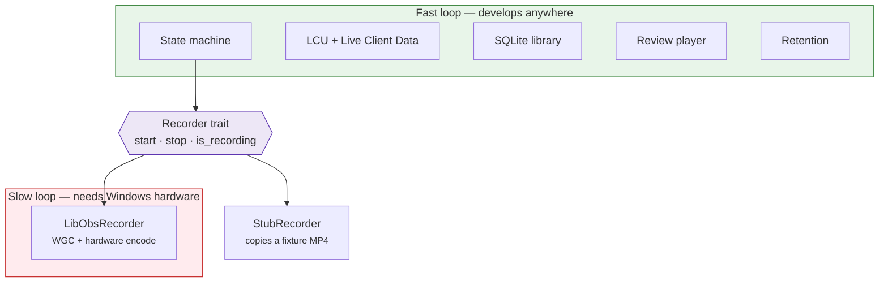
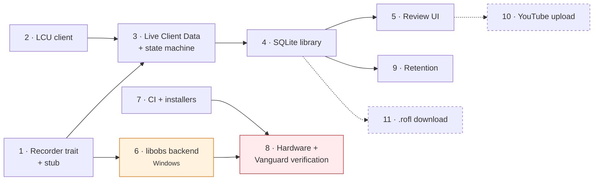
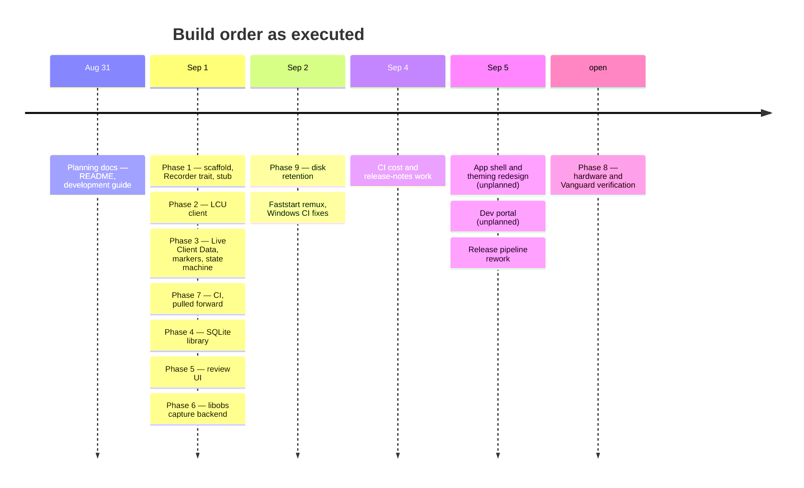

# Product design and implementation history

What this product is, the decisions that shaped it, and how it was actually
built — in what order, and why that order.

This document is also where the project's **phase vocabulary** lives. The
build was planned and executed as eleven numbered phases, and for a while
those numbers were scattered through source comments (`Phase 6`, `pending
Phase 8`). That was useful while the plan was the main artifact and confusing
once the code was. The numbers are collected here instead; the code now
describes what it does, not which phase produced it.

- The *why* behind individual technical decisions: [DEVELOPMENT.md](../DEVELOPMENT.md)
- The *what and how* of the code as it stands today: [docs/](README.md)

---

## 1. The product

### The problem

Improving at League means reviewing your own games, and the tools for that are
all bad in the same way: they make you do work before you get any value.

- **OBS** records anything, which means configuring scenes, sources, hotkeys
  and output settings — then remembering to press record. Miss the start of
  the game and the VOD is worthless.
- **Riot's own replays** (`.rofl`) give full camera control but only play on
  the exact patch they were recorded on, and require launching the game
  client to watch anything.
- **Third-party recorders** that solve the automation problem tend to be
  Electron apps that cost 400 MB of disk and 300 MB of RAM to sit idle, or
  they capture via injection — which is not survivable under a kernel
  anti-cheat.

And every recorder shares one problem: a 35-minute VOD is an undifferentiated
block. Finding the fight you died in means scrubbing.

### The product

A recorder that you install, and then never interact with until you want to
review something.

1. **It knows when you are playing.** The League Client exposes a local API
   with the current gameflow phase. That is the entire trigger — no button, no
   hotkey, no scene.
2. **It knows what happened.** The Live Client Data API reports kills, deaths,
   objectives and per-player state once a second while a game runs. Those
   become markers on the VOD timeline, so "show me my deaths" is a click, not
   a scrub.
3. **It stays out of the way.** Small install, near-zero idle cost, and a
   retention policy that ships on, so a week of ranked doesn't quietly consume
   the disk.

### What it must never do

These are constraints, not preferences. Anything violating them is out of
scope rather than a trade-off to weigh — the reasoning is in
[DEVELOPMENT.md §1](../DEVELOPMENT.md#1-hard-constraints).

- **Never inject into the game process.** League runs under Riot Vanguard, a
  kernel anti-cheat. OBS-style "Game Capture" hooking is exactly the behaviour
  it exists to detect. Capture is Windows Graphics Capture only.
- **Never read memory or inspect packets.** Two official local HTTP APIs
  provide everything needed.
- **Never treat "lightweight" as a vibe.** Install size and idle RAM are
  numbers with targets.

## 2. The five product decisions that shaped the build

| Decision | Consequence for the implementation |
|---|---|
| **Zero-config recording** | The trigger has to come from the client, so LCU integration is core infrastructure, not an integration nicety. It also means the state machine must handle every way a game can end badly — crashes, dodges, reconnects — because there is no user to press stop. |
| **Event-tagged timeline** | A second data source (Live Client Data) polled during play, its own time base, and an alignment problem: recording starts on the loading screen, before game time zero. |
| **Retention is a launch feature** | 1080p60 at 8 Mbps is ~3.5 GB/hour. Shipping without retention means uninstalls in week two, so the policy ships **on** (50 GiB / 30 days) rather than waiting for the user to find a settings screen. |
| **Lightweight** | Tauri over Electron: an OS webview and a ~10 MB shell instead of a bundled Chromium. It also rules out the most proven architecture in this space (Electron + obs-studio-node) on footprint alone. |
| **No injection, ever** | Rules out the best-supported capture path, forces a patched fork of the libobs binding crate, and makes real-hardware Vanguard verification a gate on calling the project done. |

## 3. How it was built

### The strategy: one risky piece, isolated behind a trait

The project has exactly one part that is genuinely hard to develop: the
capture backend. It is Windows-only, it links a large C library, it cannot be
tested in a VM (Vanguard refuses hypervisors), and it needs a real GPU.

Everything else — client integration, the state machine, the library, the
review player, retention — is ordinary application code that happens to sit on
top of it.

So the very first thing built was the boundary between them:

The stub is not a mock. It takes real time, writes a real playable file into
the real recordings directory, and returns a real path. That is what let every
phase after the first develop on macOS in seconds-long loops, with the
Windows-only work deferred until it was the only thing left.

The same idea shows up again inside the app, in a pattern that repeats three
times: **a pure decision function plus a thin I/O wrapper.**
`StateMachine::handle`, `retention::select_for_deletion` and `db::reconcile`
are all pure, directly unit-tested, and wrapped by glue kept deliberately too
small to hide a bug. It is the trait boundary trick applied at function scale.

### The phases

| # | What it delivered | Where it lives now | Status |
|---|---|---|---|
| 1 | Tauri v2 scaffold, the `Recorder` trait, the stub backend | `recorder/` | done |
| 2 | LCU client: lockfile discovery, gameflow watching, match metadata | `lcu/` | done |
| 3 | Live Client Data poller, event → marker pipeline, the game state machine | `live_client/`, `state_machine/` | done |
| 4 | SQLite VOD library, the data model, folder reconciliation | `db/` | done |
| 5 | Review UI: player, marker timeline, VOD browser | `src/review.ts`, `src/library.ts` | done |
| 6 | libobs capture backend — WGC window capture + hardware encode | `recorder/libobs/` | built, **unverified on real hardware** |
| 7 | CI: tests on every push and PR, installers and a published release per commit on `main` | `.github/workflows/ci.yml` | done |
| 8 | Integration test on real hardware, Vanguard verification | [windows-verification.md](windows-verification.md) | **open** |
| 9 | Disk retention: max size, max age, pinning, free-space preflight | `retention.rs` | done |
| 10 | YouTube upload (OAuth desktop flow, resumable upload) | [DEVELOPMENT.md §7](../DEVELOPMENT.md#7-youtube-upload-designed-not-built) | not started |
| 11 | `.rofl` replay download alongside video | [DEVELOPMENT.md §8](../DEVELOPMENT.md#8-rofl-replays-designed-not-built) | not started |

### Why that dependency order

Two things in that graph are worth defending:

**Phase 6 is late on purpose.** It is the highest-risk work, and conventional
advice says to attack risk first. That advice assumes the risk is *design*
risk — "will this approach work at all?" Here it wasn't: the approach was
already proven by an existing open-source project, so the risk was
*environmental* (Windows box, real GPU, real anti-cheat). Building it first
would have meant doing every subsequent phase on the slow loop for no
information gained. The trait let the risk be scheduled instead of avoided.

**Phase 7 is out of order, deliberately.** CI landed after phase 3, before the
library and review UI existed. The reason is phase 6: the *only* way to test
the capture backend on the Windows box is to install a CI-built installer, and
never cross-compile from macOS. Building that pipeline is entirely independent
of app features, so doing it while the app was still small meant phase 6 began
with a working delivery path instead of two unknowns at once.

### What actually happened

The real order, from the commit history:

Phases 1 through 7 landed in a single day, which is what the stub-plus-fixtures
strategy bought. The two largest pieces of work after that were **not in the
plan at all**.

## 4. What the plan got wrong

Worth recording, because these are the parts that cost the most time.

### The dev portal was missing from the plan

The plan assumed fixtures plus unit tests would keep the backend developable.
They did — for the *pure* parts. What it missed is that the async half had no
way to be driven at all:

- There was no seed script anywhere, so the library, its filters, retention
  and the entire review player could only be exercised by finishing a real
  game on Windows.
- The supervisor's async glue was only drivable by real League polling.
- `set_retention_policy` saved *and* enforced, with no preview — testing an
  age rule meant waiting days.
- Markers accumulating *during* a recording were invisible; only the last
  finalized recording was exposed.

The fix was a whole second window ([dev-portal.md](dev-portal.md)), compiled
out of shipped builds behind a Cargo feature. In hindsight this was implied by
the phase 3 fixture design — "the poller and state machine must be runnable in
replay mode against fixtures" was in the design doc from the start, and the
replay mode simply never got built until it became blocking.

**Lesson:** a testing strategy that only covers the pure parts of a codebase
is a partial strategy, and the gap shows up as "this phase is done" claims
that nobody can actually demonstrate.

### The UI was planned as one phase and took two passes

Phase 5 delivered a working review player and VOD browser. It took a second,
unplanned pass — a design-token system, a real app shell with a status strip,
VOD cards, a stats bar and a settings view — before it was something worth
shipping. The frontend was also restructured during that pass from
widget-shaped files into state-ownership-shaped ones
([frontend.md](frontend.md)).

### Three design details flipped under contact

| Planned | Shipped | Why |
|---|---|---|
| Record MKV, remux to MP4 on stop | Fragmented MP4, then a faststart remux on clean stop | Fragmented MP4 survives a crash with no finalization step — but no player can seek it, including the review player itself, so a lossless stream-copy remux was added on top |
| Pull-only; no backend→frontend events | One event, `library-changed` | Polling `list_recordings` to notice a finished game rebuilt the grid every few seconds and fought scroll and focus |
| Match metadata written at finalize | Metadata columns stay `NULL` | `fetch_match_summary` is implemented and unit-tested but still unwired: resolving *which* `gameId` just ended needs LCU behaviour that no one has been able to check against a live client |

### Audio was treated as a backend default, and it is a product decision

The eleven phases never mention audio. It appears once in the capture phase as
a single line — `AudioSource::SYSTEM`, desktop loopback — filed under encoding
defaults alongside bitrate and resolution, on the assumption that the user has
no more opinion about it than they do about CBR.

That was wrong in a way the plan couldn't see from the outside. Whether your
own voice is in the VOD, whether your Discord call is, and whether you can
remove either one later are all things people care about — and the last of
them is a *recording-time* decision, because an audio track that wasn't
captured can't be recovered afterwards. A default that silently mixes
everything into one stream forecloses it permanently for every game already
recorded.

The fix (track 0 the combined mix, isolated stems after it —
[DEVELOPMENT.md §2.5](../DEVELOPMENT.md#25-multi-track-audio)) is the same
shape as the retention decision in §2: pick the option that keeps the user's
future choices open, and pay a little for it now. It also needed a second
patch to the capture fork, which is the concrete cost of having treated the
question as settled.

### One phase is still open, and it is the honest gate

Phase 8 — real hardware, real Vanguard — has not run. The capture backend
compiles, bundles and records, and it was written against a working reference
implementation rather than guessed, but "compiles and was carefully derived"
is not "verified". Until that checklist is filled in, the specific unknowns
are enumerated in [windows-verification.md](windows-verification.md), not
papered over.

## 5. Where the numbers went

Every "Phase N" reference that used to sit in a source comment has been
rewritten to say what it means. The mapping, if you are reading old commits or
issues:

| Old comment said | Now reads as |
|---|---|
| Phase 1 | the `Recorder` trait / the stub backend |
| Phase 2 | the LCU client |
| Phase 3 | the state machine / the marker pipeline |
| Phase 4 | the VOD library / the DB |
| Phase 5 | the review UI / the review timeline |
| Phase 6 | the libobs capture backend |
| Phase 7 | CI |
| Phase 8 | hardware verification — [windows-verification.md](windows-verification.md) |
| Phase 9 | retention |
| Phase 10 / 11 | not built — [DEVELOPMENT.md §7](../DEVELOPMENT.md#7-youtube-upload-designed-not-built) / [§8](../DEVELOPMENT.md#8-rofl-replays-designed-not-built) |

New code should not reintroduce phase numbers. Describe the behaviour, and
link to the document that explains it.
