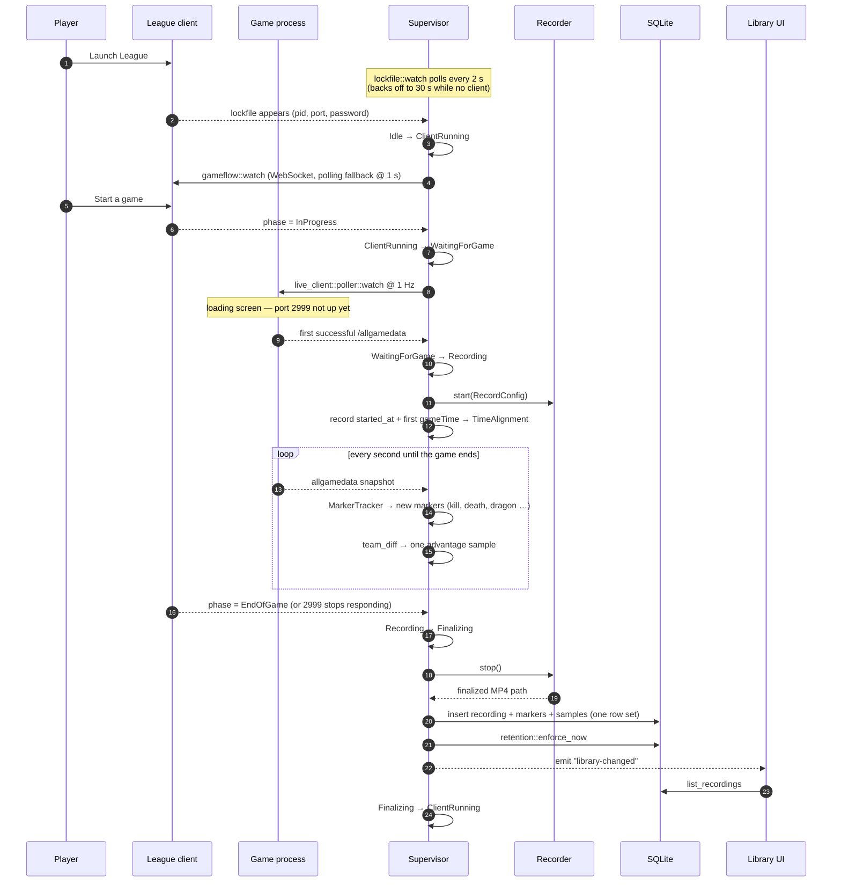
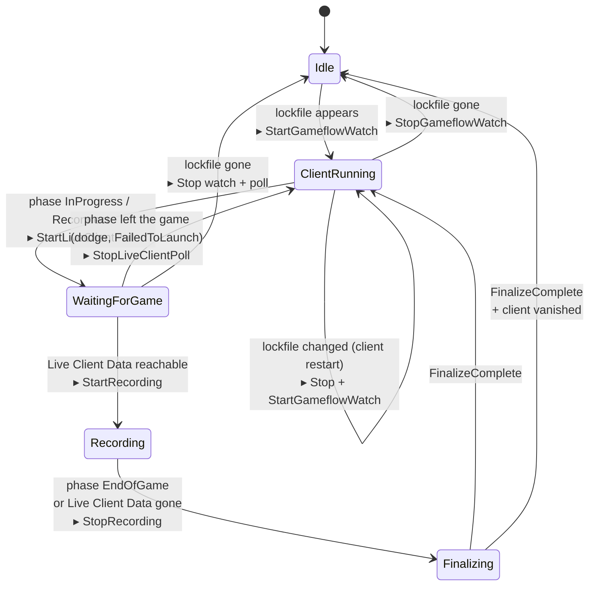
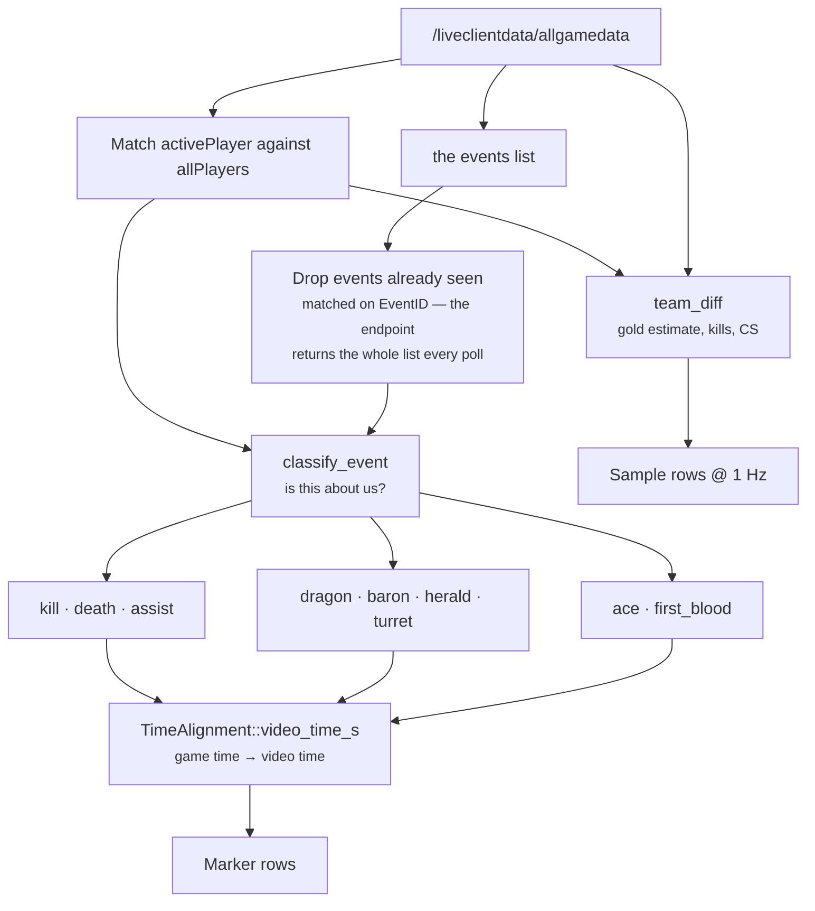
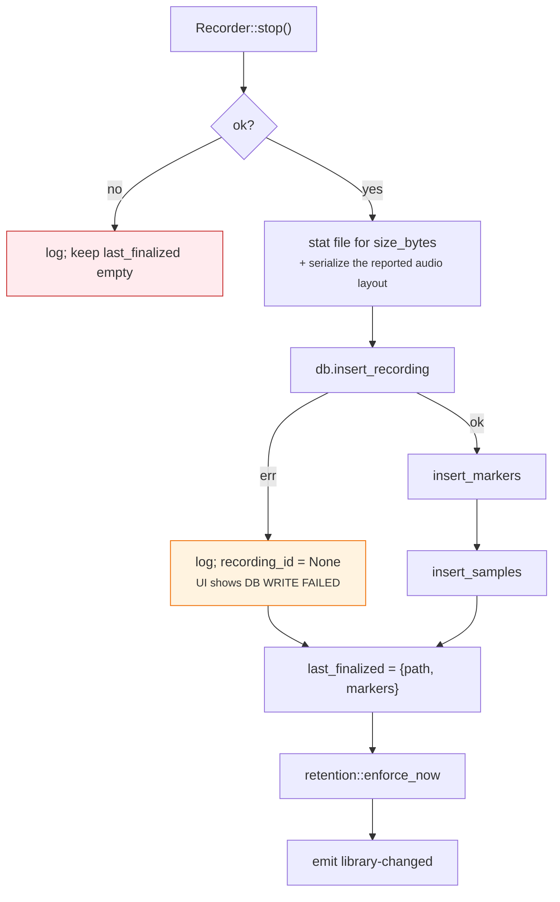

# The recording pipeline

The core workflow: from "League isn't running" to "a tagged VOD is in the
library." This is the document to read before touching `state_machine/`,
`lcu/` or `live_client/`.

---

## 1. The happy path, end to end



## 2. The state machine

`state_machine::machine::StateMachine::handle` is a pure function — no I/O, no
clock, no async — which is why the whole edge-case matrix below is covered by
unit tests that need neither League nor Windows.



**Actions, not side effects.** `handle` returns a `Vec<Action>`
(`StartGameflowWatch`, `StopLiveClientPoll`, `StartRecording`, …). The
supervisor is the only thing that executes them, so "what should happen" and
"how it happens" are testable apart from each other.

### Which signal drives which transition

| Signal | Source | Cadence |
|---|---|---|
| `LockfileChanged` | `lcu::lockfile::watch` | poll every 2 s, backing off to 30 s while absent |
| `GameflowPhase` | `lcu::gameflow::watch` | LCU WebSocket, falling back to 1 s polling |
| `LiveClientUp` / `LiveClientDown` | `live_client::poller::watch` | 1 Hz, exponential backoff to 10 s while down |
| `FinalizeComplete` | the supervisor itself, after `stop()` and teardown | once per game |

### The capture backend's warm window

Orthogonal to the transitions above, and driven off the resulting state rather
than off any `Action`: the supervisor calls `Recorder::prepare` on every state
except `Idle`, and `Recorder::release` on `Idle`. In practice that means the
Windows backend is warm for exactly as long as the League client is running,
because holding it from launch to exit is the largest single item on the
idle-RAM budget ([DEVELOPMENT.md §2.2](../DEVELOPMENT.md#22-the-recorder-trait)).

`prepare` is only a pre-warm — `start` brings the backend up itself if it has to
— so a client that goes straight into a game is safe, and `release` is a no-op
while a recording is in flight.

### Edge cases the pure tests cover

| Case | Behaviour |
|---|---|
| Game crashes mid-match | Live Client Data stops responding → `LiveClientDown` → finalize normally; footage up to the crash is kept |
| Client crashes mid-match | lockfile disappears → finalize, then `Idle` |
| Client crashes before the game loads | `WaitingForGame` → `Idle`, nothing recorded, nothing to finalize |
| Reconnect to a game in progress | Identical to a fresh start — the machine has no memory of *how* it reached `WaitingForGame`, so recording begins when 2999 answers (later than a from-the-start recording) |
| Practice Tool | Reports the same `InProgress`/`Reconnect` phases, so it is not special-cased |
| Dodge / cancelled champ select | `WaitingForGame` bounces back to `ClientRunning` without ever recording |
| Client restart during finalize | Handled regardless of ordering against `FinalizeComplete` |

Two cases are **not** verified, both because they need a live client on real
hardware: **spectator mode** (no phase beyond `InProgress`/`Reconnect` is
special-cased, so if spectating also reports `InProgress` it would be
recorded) and **machine sleep** (backoff and the lockfile watch should
recover after wake, untested). See
[windows-verification.md](windows-verification.md).

## 3. Events → markers

Each 1 Hz snapshot goes through `live_client::events`, which owns both halves
of the transform: discrete events become markers, and the same snapshot also
yields one row of the advantage time series.



**Marker kinds** (`MarkerKind::as_str`, matching `markers.kind` in SQLite):
`kill`, `death`, `assist`, `dragon`, `baron`, `herald`, `turret`, `ace`,
`first_blood`. `custom` exists in the schema for hand-added markers.

### Timestamp alignment

Recording starts on the loading screen — before game time 0 — so event times
and video times do not share an origin.

```
offset     = elapsed_since_record_start − gameTime   (sampled at one poll)
video_time = max(0, game_time + offset)
```

A positive offset is the normal loading-screen case (recording ran for a few
seconds before the clock started). A negative offset means recording started
*after* game time 0 — a reconnect. The clamp to 0 keeps a backdated event at
game start from producing a negative seek target.

```
video time  0s        8s                              40s
            ├─────────┼───────────────────────────────┤
            │ loading │ game in progress              │
recording   ▓▓▓▓▓▓▓▓▓▓▓▓▓▓▓▓▓▓▓▓▓▓▓▓▓▓▓▓▓▓▓▓▓▓▓▓▓▓▓▓▓▓
            ▲         ▲                    ▲
   Recorder::start    gameTime 0           kill at gameTime 12
                      (offset = +8s)       → video time 20s
```

#### Which poll the offset is measured at

The offset above is only correct if `elapsed` and `gameTime` are sampled at
the same instant *and* `gameTime` is really a clock. Neither holds on the
first poll:

- Recording starts **on** the first successful poll (`WaitingForGame +
  LiveClientUp -> StartRecording`, dispatched synchronously), so `elapsed` at
  that poll is ~0.
- That poll lands on the loading screen, where `gameTime` is a frozen `0`
  rather than a running clock.

`0 − 0 = 0` claims the video and the game start together, which puts every
marker one whole loading screen early. So `AlignmentTracker` waits for
`gameTime` to **advance** — proving it is a clock and not the frozen 0 —
before measuring anything, and then re-measures on **every** advancing poll.
Re-measuring also absorbs drift a single offset cannot: a game pause freezes
the clock while the video keeps rolling, and dropped encoder frames skew a
fixed offset over a long game.


**Markers are stored with `game_time_s` and mapped at finalize**, not at
ingest. A marker seen before the clock ever moved has no alignment yet; it is
still collected (and still fed to `MarkerTracker`, so its event ID is deduped)
and resolved at finalize against the first alignment the recording ever
proved. If the clock never moved at all — the game ended during loading —
the fallback is a 1:1 mapping. Nothing is dropped.

A reconnect's first poll reports a clock already at, say, 600, which is
indistinguishable from a frozen one until it ticks. That costs one poll of
accuracy (sub-second) instead of the minutes a wrong offset would cost.

## 4. Finalize

`Supervisor::stop_recording` is the one place a recording becomes a library
entry. It is deliberately fail-soft: every step that can fail logs and
continues, because losing the footage is worse than losing its metadata.



**Known gap:** `lcu::fetch_match_summary` is implemented and unit-tested but
is not called from finalize, so `champion`, `queue`, `win`, `kda_*`, `patch`
and `game_id` are `NULL` on rows written by a real game. Resolving *which*
`gameId` just ended needs LCU behaviour that has not been checked against a
live client. The dev portal can invoke the fetch by hand
(`dev_fetch_match_summary`).

## 5. Where recording can refuse to start

`retention::has_room_to_record` runs as a preflight from both
`Supervisor::start_recording` and the manual `start_recording` command, and
refuses below **1 GiB free** on the recordings volume. It fails *open* on a
stat error — a check that could not run is not a reason to lose a game.
