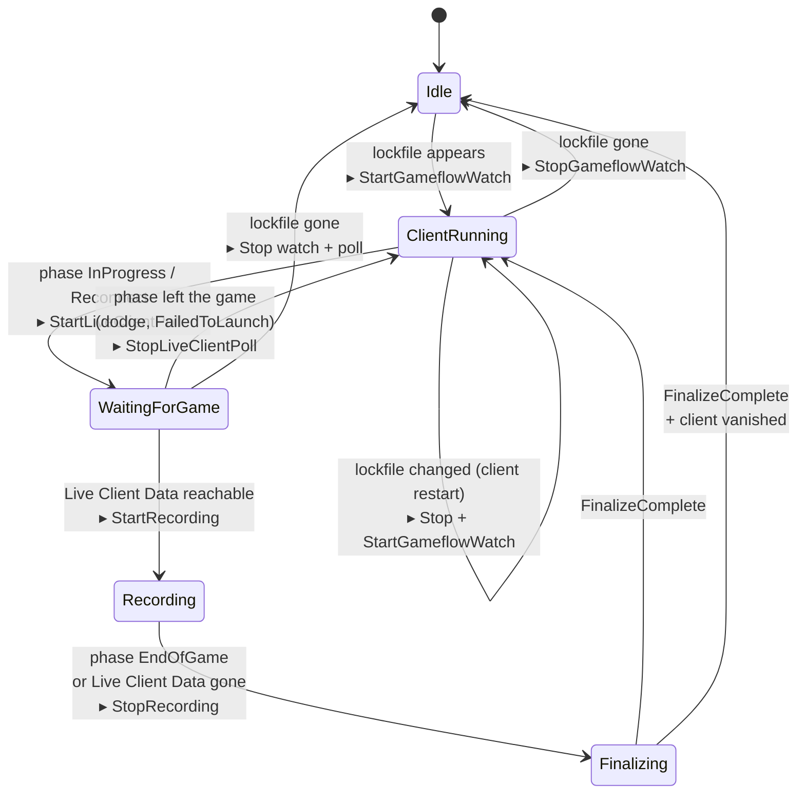
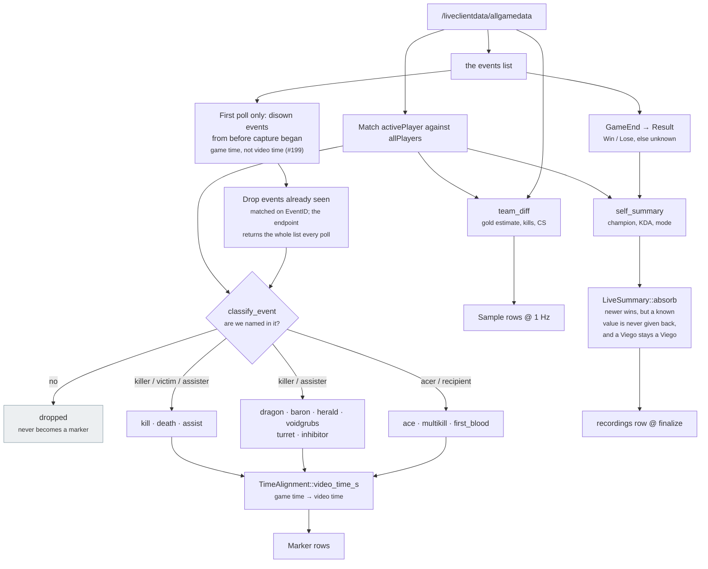
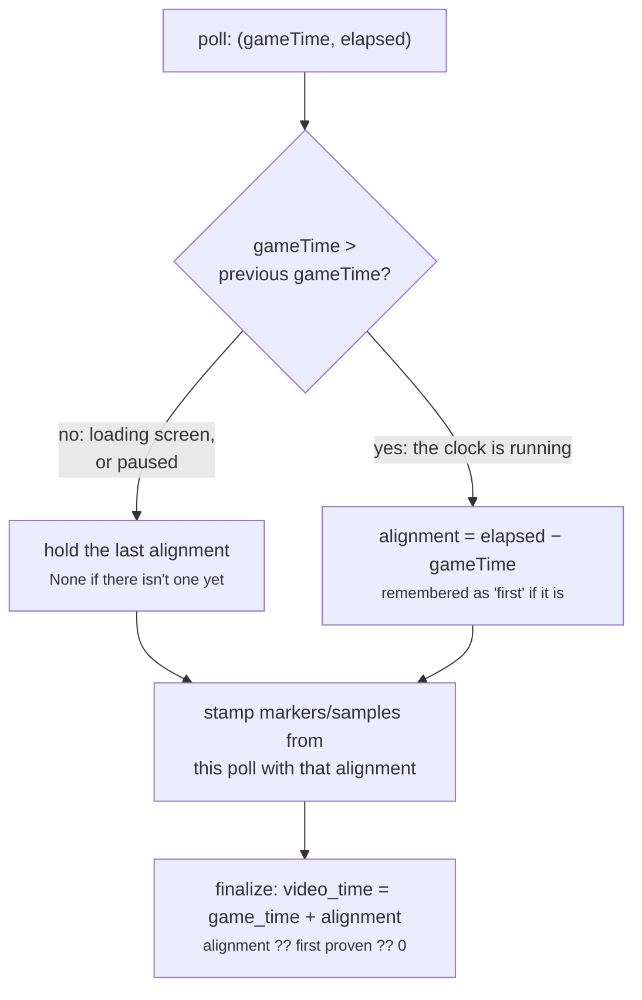
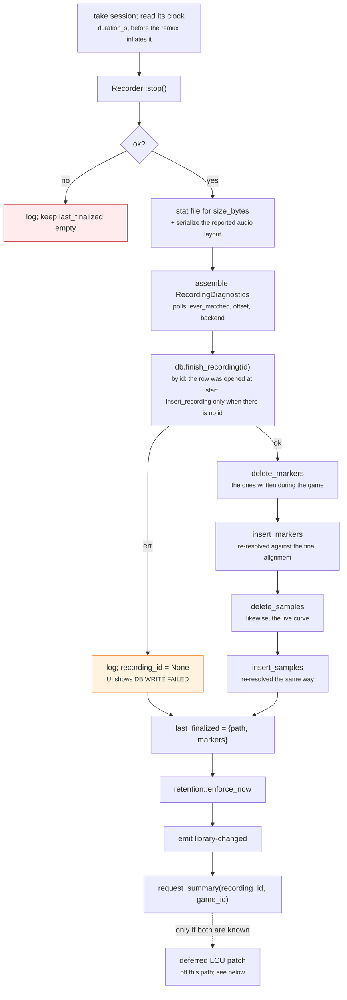
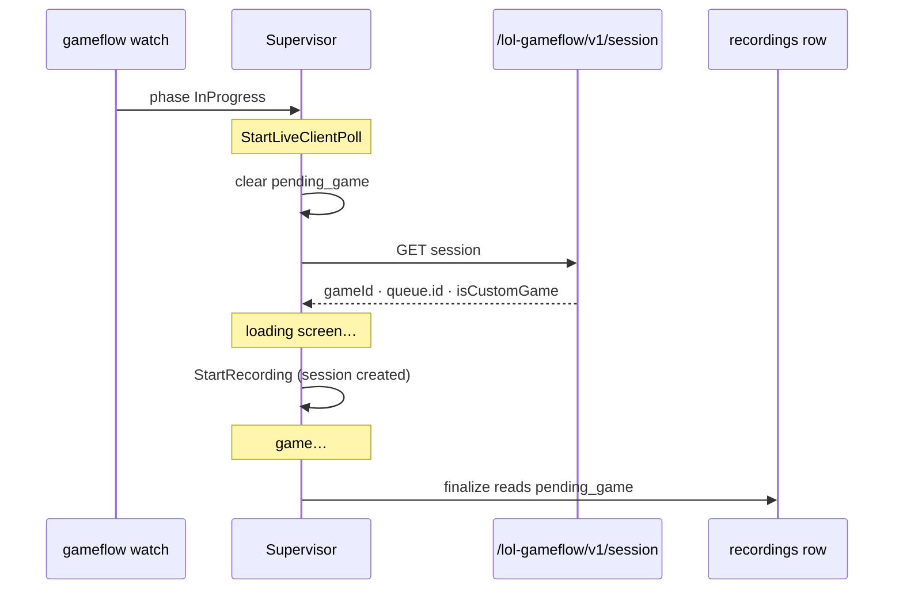
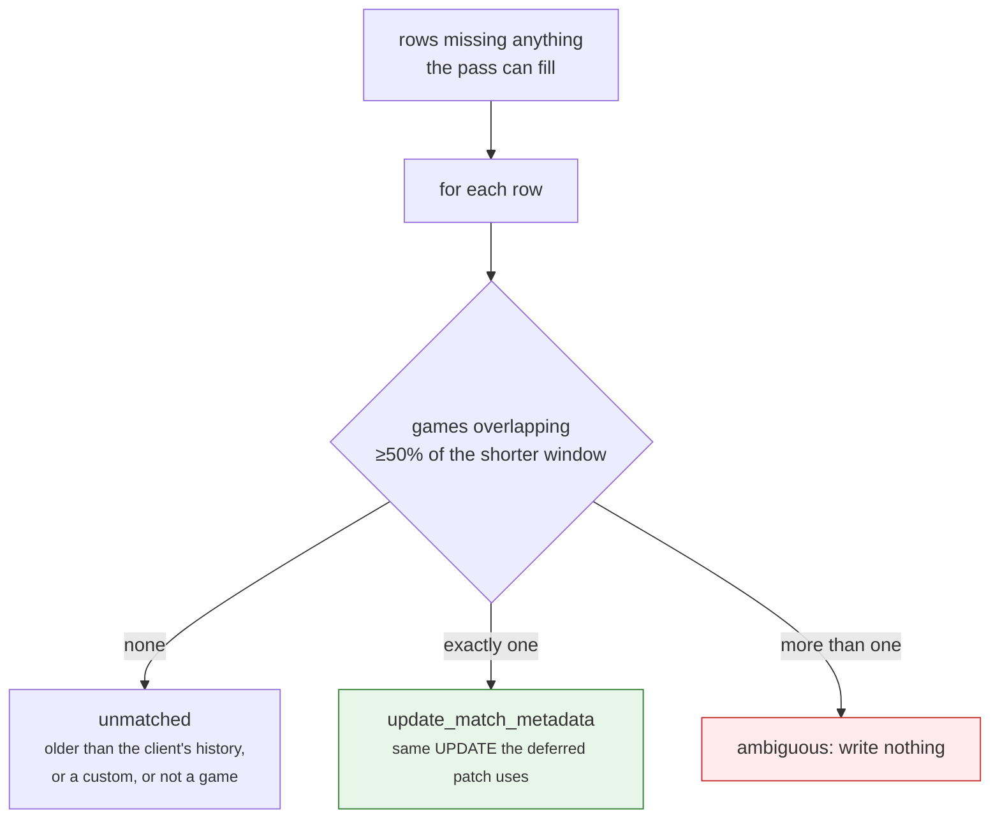

# The recording pipeline

The core workflow: from "League isn't running" to "a tagged VOD is in the
library." This is the document to read before touching `state_machine/`,
`lcu/` or `live_client/`.

---

## 1. The happy path, end to end

```mermaid
sequenceDiagram
    autonumber
    participant U as Player
    participant C as League client
    participant G as Game process
    participant S as Supervisor
    participant R as Recorder
    participant D as SQLite
    participant UI as Library UI

    U->>C: Launch League
    Note over S: lockfile::watch polls every 2 s<br/>(backs off to 30 s while no client)
    C-->>S: lockfile appears (pid, port, password)
    S->>S: Idle → ClientRunning
    S->>C: gameflow::watch (WebSocket, polling fallback @ 1 s)

    U->>C: Start a game
    C-->>S: phase = InProgress
    S->>S: ClientRunning → WaitingForGame
    S->>G: live_client::poller::watch @ 1 Hz

    Note over G: loading screen, port 2999 not up yet
    G-->>S: first successful /allgamedata
    S->>S: WaitingForGame → Recording
    S->>R: start(RecordConfig)
    S->>D: begin_recording (row opened, finished_at NULL)
    S->>S: record started_at + first gameTime → TimeAlignment

    loop every second until the game ends
        G-->>S: allgamedata snapshot
        S->>S: MarkerTracker → new markers (kill, death, dragon …)
        S->>S: team_diff → one advantage sample
        S->>S: LiveSummary::absorb → champion, KDA, mode, outcome
        S->>S: GameIdentity::absorb → game id, queue
        S->>D: write them as they arrive (so a crash keeps them)
    end

    C-->>S: phase = EndOfGame (or 2999 stops responding)
    S->>S: Recording → Finalizing
    S->>R: stop()
    R-->>S: finalized MP4 path
    S->>D: finish_recording; rewrite markers + samples<br/>against the final alignment
    S->>D: retention::enforce_now
    S-->>UI: emit "library-changed"
    UI->>D: list_recordings
    S->>S: Finalizing → ClientRunning
```

## 2. The state machine

`state_machine::machine::StateMachine::handle` is a pure function with no I/O,
no clock and no async, which is why the whole edge-case matrix below is covered
by unit tests that need neither League nor Windows.



**Actions, not side effects.** `handle` returns a `Vec<Action>`
(`StartGameflowWatch`, `StopLiveClientPoll`, `StartRecording`, …). The
supervisor is the only thing that executes them, so "what should happen" and
"how it happens" are testable apart from each other.

### Which signal drives which transition

| Signal | Source | Cadence |
|---|---|---|
| `LockfileChanged` | `lcu::lockfile::watch` | poll every 2 s, backing off to 30 s while absent |
| `GameflowPhase` | `lcu::gameflow::watch` | LCU WebSocket, falling back to 1 s polling. Both read the *current* phase on connect, not just changes to it. The socket lasts two to three minutes and is re-established; see below |
| `LiveClientUp` / `LiveClientDown` | `live_client::poller::watch` | 1 Hz. `Down` needs 5 consecutive *transport* failures, ~5 s; backoff to 10 s only once down |
| `FinalizeComplete` | the supervisor itself, after `stop()` and teardown | once per game |

Alongside those, one request that drives no transition: entering
`WaitingForGame` also fires a single `GET /lol-gameflow/v1/session` to learn
*which* game is starting: `gameId`, the real `queueId`, and whether it is a
custom. See "Identifying the game" below.

#### The gameflow socket is short-lived, and that is absorbed by design

An alpha.49 log showed the LCU event socket living two to three minutes and
then being re-established, repeatedly (#146). Nothing breaks, because the
reconnect reads the current phase over HTTP immediately after subscribing and
`last` de-duplicates, so a change landing in the two-second gap is picked up by
that read rather than lost. That ordering is the one "Subscribes to phase-change
events, **and reads the phase we are already in**" already argues for.

It was invisible for a different reason: a stream that simply ends falls out of
the read loop and returns `Ok(())`, which the caller treats as nothing worth
mentioning. Two of the three closes in that log produced no line at all, and the
only reason anyone noticed was that #142 had made the *reconnect* announce
itself. Each connection now logs one line when it ends, carrying how long it
lived, how many frames of each kind it saw, and the close code and reason if the
peer sent one. The read loop used to discard `Message::Close` along with
everything that was not text, which is exactly the frame that answers why.

**Pongs are not ours to send.** A plausible reading of the code is that nothing
writes after the initial subscribe, so an LCU ping would go unanswered and the
server would drop us on a timer. That is not what happens: tungstenite queues a
pong for every ping and flushes it from inside `read`, which is what
`ws.next()` drives, so replying manually is wrong rather than missing. The ping
and pong counts are in the close line so a real session can show whether the
client pings at all.

### The capture backend's warm window

Orthogonal to the transitions above, and driven off the resulting state rather
than off any `Action`: the supervisor calls `Recorder::prepare` on every state
except `Idle`, and `Recorder::release` on `Idle`. In practice that means the
Windows backend is warm for exactly as long as the League client is running,
because holding it from launch to exit is the largest single item on the
idle-RAM budget ([DEVELOPMENT.md §2.2](../DEVELOPMENT.md#22-the-recorder-trait)).

`prepare` is only a pre-warm, and `start` brings the backend up itself if it has
to, so a client that goes straight into a game is safe, and `release` is a no-op
while a recording is in flight.

### Edge cases the pure tests cover

| Case | Behaviour |
|---|---|
| Game crashes mid-match | Live Client Data stops responding → `LiveClientDown` → finalize normally; footage up to the crash is kept |
| Client crashes mid-match | lockfile disappears → finalize, then `Idle` |
| Client crashes before the game loads | `WaitingForGame` → `Idle`, nothing recorded, nothing to finalize |
| Reconnect to a game in progress | Identical to a fresh start; the machine has no memory of *how* it reached `WaitingForGame`, so recording begins when 2999 answers (later than a from-the-start recording), and carries only the events after that (see "A recording started mid-game") |
| Practice Tool | Reports the same `InProgress`/`Reconnect` phases, so it is not special-cased |
| Dodge / cancelled champ select | `WaitingForGame` bounces back to `ClientRunning` without ever recording |
| Client restart during finalize | Handled regardless of ordering against `FinalizeComplete` |

Two cases are **not** verified, both because they need a live client on real
hardware, and neither comes up in ordinary play: **spectator mode** (no phase
beyond `InProgress`/`Reconnect` is special-cased, so if spectating also
reports `InProgress` it would be recorded) and **machine sleep** (backoff and
the lockfile watch should recover after wake). See
[windows-verification.md](windows-verification.md).

## 3. Events → markers

Each 1 Hz snapshot goes through `live_client::events`, which owns all three
halves of the transform: discrete events become markers, the same snapshot
yields one row of the advantage time series, and it also updates the
match summary the finalize writes onto the `recordings` row.



`find_us`, the `Match activePlayer against allPlayers` step above, is
shared by `team_diff` and `self_summary`, so there is one answer in the
module to "which of these ten players are we" and one place to fix it.

**Why `absorb` and not just the last snapshot.** `GameEnd` appears in the
event list on one poll and the game process routinely exits before the next
one lands, so the poll that carries the outcome is often the last that ever
succeeds. Reading metadata off the final snapshot alone would lose the
result of most games. A value once known is therefore never overwritten
with `None`.

**`champion` has one more exception: a Viego stays a Viego** (#203). Viego's
passive takes over a champion he helped kill, and while it lasts Live Client
Data reports him under that champion's name, so a game that ended
mid-possession used to land the possessed champion on the row. No other
champion changes mid-game, so `settle_champion` believes any poll that says
Viego and, once one has, ignores every other name. Viego is recognised by
`rawChampionName` (`game_character_displayname_Viego`, independent of the
client's language) or by name, and stored as `Viego`. A recording that starts
mid-possession, as one does after a daemon restart, is corrected when the
possession ends; one that sees only the possession cannot be, and relies on the
deferred patch's `correct_champion` (see [data-model.md](data-model.md)).

**Marker kinds** (`MarkerKind::as_str`, matching `markers.kind` in SQLite):
`kill`, `death`, `assist`, `dragon`, `baron`, `herald`, `voidgrubs`,
`turret`, `inhibitor`, `ace`, `multikill`, `first_blood`. `custom` exists
in the schema for hand-added markers.

### What ends a recording, and what must not

`LiveClientDown` transitions `Recording → Finalizing`, so whatever decides
to fire it decides when a VOD stops. It used to fire on the **first** failed
poll, which cost a real game half an hour of footage after 543 consecutive
successful polls ([#74](https://github.com/NinjaGoldfinch/ninja-recorder/issues/74)).

Two rules now stand between a failed request and a finalize.

**A response we could not read never ends a recording.** It is proof of the
opposite: something answered, so the game is running. It is also the one
failure guaranteed to repeat, since a payload the parser cannot read will not
start parsing next second, so treating it as "game over" turns a cosmetic
problem into a lost game. `LiveClientError::means_endpoint_gone` draws the
line: only a request that got **no response at all** (connection refused, or
the 3-second timeout) counts. An HTTP error status came from a live server
and does not.

**Five consecutive transport failures, not one.** The trade is asymmetric:
being too tolerant costs a few seconds of post-game screen on the end of a
VOD, being too strict costs the VOD. While still hoping, the poller stays at
its normal 1 Hz rather than backing off. The exponential backoff exists for
the long stretch between games, and applying it here would stretch five
failures across fifteen seconds instead of five.

The dev portal can also record that socket's whole output to disk without filtering (`dev::events`, [dev-portal.md](dev-portal.md)). It is a second connection rather than a tap on this one, because this watch's lifetime belongs to the state machine and a debug tool has no business in the path that decides when recordings start.

Underneath both, the event list is parsed **entry by entry**: an event whose
shape we cannot read is dropped and the rest of the snapshot survives. The
events array is the only part of `AllGameData` that both grows during a game
and can fail to deserialize (everything in `allPlayers` is defaulted) so it
is the one place a shape nobody here has seen can arrive mid-game and take
the payload with it. `Stolen` and `KillStreak` additionally accept whichever
spelling the client uses, since Riot has historically sent booleans in this
API as the strings `"True"`/`"False"`.

**That leniency is load-bearing right now, not defensive.** It was written
from documentation, and the captured game confirms it: `Stolen` arrives as the
string `"False"` six times in
`fixtures/live-client/captured-allgamedata.json`. `flexible_bool` absorbs it,
nothing fails, and nothing said so until `shapes::mistyped_fields` existed,
which is the exact silent loss #113 was about. A field Riot spells that way
*without* a lenient reader waiting costs the whole event instead.

**What it drops is recoverable afterwards, and that is deliberate.** Dropping
the entry is right while a game is running, and #74 is what happens when one bad
event takes the whole payload with it, but it used to leave nothing behind
except a `debug!` line in a log nobody kept, so the shape that caused it was
gone with the game. Fixture capture writes the raw payload
([DEVELOPMENT.md §3.3](../DEVELOPMENT.md)), so re-parsing it reproduces the
same failure exactly: `shapes::unreadable_events` re-runs the parse over every
captured payload and reports each shape it could not read, with the JSON that
broke it. See [dev-portal.md](dev-portal.md) for where that surfaces.

That pairs with `shapes::unmodelled_events`, and the pair is the whole
diagnosis: one lists events that parsed perfectly well and then classified to
nothing, the other lists events that never parsed at all. The two failures look
identical from the outside, in that neither produces a marker, and have
completely different fixes.

Two more sit alongside them. `shapes::mistyped_fields` reports a modelled field
whose JSON type is not the one modelled, and marks whether a lenient reader
absorbed it. A *tolerated* mismatch is a value silently lost rather than an
event dropped, and it is invisible everywhere else. `shapes::unread_event_keys`
reports keys on events that nothing reads, which is what a new field from Riot
looks like. Both are scoped to the events array rather than the whole payload:
the capture carries 171 distinct key paths and almost all of them are
unmodelled on purpose, so the same check over `activePlayer` and `allPlayers`
would be hundreds of lines nobody reads. Over events it reports nothing on the
real capture, which is what makes a line worth acting on.

**The ladder is read when the game starts, not only when it ends.** The
gameflow session resolved at `InProgress` is where `game_id` and `queue` come
from, and when the queue has a ladder the standing at that moment is read
alongside them and held for the finalize. That reading is the *before* half of
#164's LP measurement, and game start is the only moment it is true: by the
time the game ends the number has already moved. It is best effort and comes
after the identity is stored, because a standing that cannot be read costs a
delta while the identity it is keyed by is what the whole row depends on.

**Riot's `lane`/`role` pair is an inference, and it is measurably unreliable.**
A captured ranked game put a jungler with Smite and 154 camps at
`BOTTOM`/`SUPPORT` and a bot-lane Ashe at `JUNGLE`, leaving one side holding two
supports and the other two junglers. The `timeline` block it comes from arrives
with every per-minute delta map empty, which is what a field the API has stopped
maintaining looks like.

Two things follow. `position` accepts the client's current spelling as well as
the old one. It sends `SUPPORT` where this was written for `DUO_SUPPORT`, so
every support was falling through and being labelled `Bottom`, in the `role`
column as well as in the matchup. And `discard_implausible_positions` drops a
side's positions wholesale when two players share one: five players share five
positions, so a duplicate is proof the inference is wrong rather than a close
call. A missing position empties the matchup, which announces itself; a wrong
one shows a plausible opponent who is not the one you played.

### What each poll leaves behind

Markers and samples are the *product* of a poll. They are not a record of
what the poll **showed**, and the difference matters: a game where the
champion came out NULL, or the markers landed twenty seconds out, or the
recording stopped early leaves nothing behind that says why.

So every poll also writes one distilled line to the log
([DEVELOPMENT.md §13](../DEVELOPMENT.md)), tagged `live-poll`:

```
game=1512.3 cap=1530.0 off=17.70 matched=yes champ=Ahri kda=3/1/2 gold=450 lvl=11 events=12 new=2
```

- `game` / `cap`: the game clock the poll reported, and how long capture
  had been running when it landed. The pair is what the offset is derived
  from
- `off`: the alignment in force, or `-` while the clock has not been seen
  to advance. `-` is not `0.00`: "not yet known" and "aligned" are
  different states and reading one as the other is how a marker ends up in
  the wrong place
- `matched`: whether we could be found in `allPlayers`. `no` silently
  empties champion, KDA and the advantage curve, and the Practice Tool
  ambiguity means it is a real recurring state, not a corner case
- `events` / `new`: how many events the payload carried, and how many the
  `MarkerTracker` had not already seen

The key set and order are fixed even when a value is unknown, so the
stream is greppable and parseable; unknown reads as `-`.

**Distilled rather than raw, deliberately.** A real `allgamedata` response
is tens of kilobytes and arrives at 1 Hz, so keeping every payload would
cost hundreds of megabytes per game. A trace line is about 120 bytes, roughly
200 KB across a game. When the raw stream is genuinely wanted,
that is what fixture capture is for
([DEVELOPMENT.md §3.3](../DEVELOPMENT.md)), and it is on by default until
v1.0.

It is written at `debug`, which is **off** unless
`NINJA_RECORDER_LOG_LEVEL=debug` asks for it: at 1 Hz it would otherwise
rotate a session's real errors out of the file within a single game.

A poll that **fails** is logged too, and that one is not at `debug`. The
first failure after a healthy run is what ends a recording
([#74](https://github.com/NinjaGoldfinch/ninja-recorder/issues/74)), so it
is a `warn` carrying the error, which is what separates "the endpoint went
away" from "the payload would not parse", a distinction that cost a real
game before the error was being recorded at all. Failures *before* the
endpoint has ever answered stay at `debug`: the poller starts when gameflow
says `InProgress`, which is before the game has finished loading, so those
are expected.

### A marker is a seek target, so it has to be about the player

Every kind above is gated on the recording player appearing in the event, as
killer, victim, assister, acer or recipient. An event nobody asked us
about is dropped at classification and never reaches the database.

This is not a size optimisation. Markers drive the review timeline and the
`[`/`]` navigation, so an objective taken while the player was on the other
side of the map is a stop that shows them something they had no part in.
Being on the team that took it is not taking part in it: the filter reads
the event's own name fields, not team membership.

The cost is that it is **irreversible per recording**. Live Client Data is
gone once the game ends, so a marker not captured cannot be recovered for
that VOD. An enemy Baron taken in our absence is dropped along with our
own team's uncontested turrets, and "why did we lose that Baron" is not a
question this VOD can answer afterwards. That trade was made deliberately;
[DEVELOPMENT.md §3.2](../DEVELOPMENT.md#32-live-client-data-api-in-game)
records why.

`Stolen` rides in the payload of the neutral objectives rather than
becoming a kind of its own: a stolen Baron is still a Baron, and the
review list renders the flag as a suffix.

### Timestamp alignment

Recording starts on the loading screen, before game time 0, so event times
and video times do not share an origin.

```
offset     = elapsed_since_record_start − gameTime   (sampled at one poll)
video_time = max(0, game_time + offset)
```

A positive offset is the normal loading-screen case (recording ran for a few
seconds before the clock started). A negative offset means recording started
*after* game time 0, which is a reconnect. The clamp to 0 keeps a backdated
event at game start from producing a negative seek target.

```
video time  0s        8s                              40s
            ├─────────┼───────────────────────────────┤
            │ loading │ game in progress              │
recording   ▓▓▓▓▓▓▓▓▓▓▓▓▓▓▓▓▓▓▓▓▓▓▓▓▓▓▓▓▓▓▓▓▓▓▓▓▓▓▓▓▓▓
            ▲         ▲                    ▲
   Recorder::start    gameTime 0           kill at gameTime 12
                      (offset = +8s)       → video time 20s
```

#### Which poll the offset is measured at

The offset above is only correct if `elapsed` and `gameTime` are sampled at
the same instant *and* `gameTime` is really a clock. Neither holds on the
first poll:

- Recording starts **on** the first successful poll (`WaitingForGame +
  LiveClientUp -> StartRecording`, dispatched synchronously), so `elapsed` at
  that poll is ~0.
- That poll lands on the loading screen, where `gameTime` is a frozen `0`
  rather than a running clock.

`0 − 0 = 0` claims the video and the game start together, which puts every
marker one whole loading screen early. So `AlignmentTracker` waits for
`gameTime` to **advance**, proving it is a clock and not the frozen 0,
before measuring anything, and then re-measures on **every** advancing poll.
Re-measuring also absorbs drift a single offset cannot: a game pause freezes
the clock while the video keeps rolling, and dropped encoder frames skew a
fixed offset over a long game.



The **match summary** rides the same path for the same reason, and needs no
mapping: champion, KDA, game mode and outcome are written to the open row as
the polls establish them, and only when a poll establishes something new. See
[data-model.md](data-model.md) for why that write is an assignment rather than
a merge. The **game identity** rides with it, absorbed from the
gameflow session rather than from the poll, which is why a killed daemon
leaves a row that knows which game it was.

**Markers and samples are stored with `game_time_s` and mapped twice.** Each
is written once as its poll produces it, against the alignment known then, and
once at finalize against the one the whole game proved. A marker seen
before the clock ever moved has no alignment yet; it is still collected (and
still fed to `MarkerTracker`, so its event ID is deduped) and resolved against
the first alignment the recording ever proved. If the clock never moved at all,
meaning the game ended during loading, the fallback is a 1:1 mapping. Nothing
is dropped.

Twice, because a marker is written to the database as soon as the poll that
found it returns, against whatever alignment is known then, and rewritten at
finalize against the alignment the whole game proved (#150). The first write
is what survives a killed daemon; the second is what makes the position right.

The rewrite is cheap because of what `fallback()` returns. It is the **first**
alignment the recording proved, not a running average, so once the clock has
been seen to advance every subsequent marker resolves to the same value at
both writes. Only the ones captured during the loading screen actually move,
which is why the finalize deletes and re-inserts rather than trying to work
out which rows changed.

A reconnect's first poll reports a clock already at, say, 600, which is
indistinguishable from a frozen one until it ticks. That costs one poll of
accuracy (sub-second) instead of the minutes a wrong offset would cost.

#### A recording started mid-game

A reconnect, or a daemon killed mid-game and replaced by one that identifies
the same game, starts a recording whose first poll carries **the whole game's
event list**. `MarkerTracker` dedupes on `EventID` against its own memory, and
a new recording's tracker has none, so every earlier event used to become one
of its markers, and each one clamped to 0:00 at finalize (#199). The recording
that was running when they happened already has them.

So on the recording's first poll, and only that one,
`MarkerTracker::disown_earlier_events` marks as seen every event from before
capture began: earlier than `gameTime − elapsed` at that poll, less a 2 s
tolerance. The comparison is between two readings of the game clock and never
involves the alignment, for two reasons:

- On that first poll no alignment is proven yet, so the live write resolves
  1:1 and an inherited event does not *look* early. A filter on a negative
  video time would only have caught it at finalize.
- When the alignment is wrong, as it may be in a Practice Tool whose clock
  pauses or skips (#198), a video-time filter would drop the recording's own
  events too.

Only the first poll's list is disowned from, because the list is cumulative:
everything a recording could have inherited is already on it, and an event
that first appears later happened while it was recording, whatever its
timestamp says. A Live Client outage inside one recording keeps its session
and tracker, so the polls after it change nothing. A recording that starts on
the loading screen sees a frozen `gameTime` of 0 with capture already running,
which puts the estimate below 0 and disowns nothing. Every error in the
estimate (a pause, a slow first poll) makes it earlier than the truth, which
keeps more rather than less.

Samples need no equivalent. The endpoint has no history for the curve, so a
sample is only ever the state at the poll that took it.

## 4. Finalize

`Supervisor::stop_recording` is the one place a recording becomes a library
entry. It is deliberately fail-soft: every step that can fail logs and
continues, because losing the footage is worse than losing its metadata.

It is no longer the place the **row** is created. Since #150 the row exists
from the moment capture starts, hidden from the library by a NULL
`finished_at`, so that markers have somewhere to go as they arrive. What
happens here is that the row is completed: see
[data-model.md](data-model.md), "A recording row outlives the process that
opened it", for the three writers and why this one matches by id.



### Identifying the game

Working out which `gameId` just ended is what kept `lcu::match_data` unwired
for months. The client will simply tell you while the game is still running,
so the answer is read once per game rather than deduced afterwards.



`pending_game` lives on the supervisor, not on `RecordingSession`. The read
happens when gameflow reaches `InProgress`, and recording does not begin
until Live Client Data answers a loading screen later, so there is no
session to put it in yet. Reading it back at finalize also removes the race:
by then the request has resolved either way.

It is **best-effort**. A game that cannot be identified still records, it
just lands without a `game_id` or `queue`. Losing footage over a missing
queue label would be an absurd trade.

`queue` id `0` is kept, because it is the real id for a custom game and the
library labels it "Custom"; only negatives mean "no queue". A `gameId` of
`0` is discarded, because the session exists in the lobby too and zero
means "no game" rather than game number zero.

**Where the row's metadata comes from.** `champion`, `kda_*`, `win` and
`game_mode` are captured *during* the game from Live Client Data, folded
into the session on every poll by `events::self_summary` and written at
finalize. Nothing about that path needs the LCU, so it works in Practice
Tool and customs too.

`game_id` and `queue` come from the gameflow session read above. They are
written twice: the finalize writes them, and the patch below confirms them.

### The deferred LCU patch

`role` and `patch` have no Live Client Data equivalent, and only the LCU can
answer for them. But at the instant `Recording → Finalizing` fires the
client is still in `WaitingForStats`: match history 404s, and the same
transition emits `StopGameflowWatch`, tearing down the task that owned the
LCU connection. Fetching inline would block the finalize behind a request
that is *expected* to fail.

So the row is written from the live values exactly as before, and
`match_summary::patch` fills the rest in afterwards.

```mermaid
sequenceDiagram
    participant SUP as Supervisor
    participant MS as match_summary::patch
    participant EOG as /lol-end-of-game/v1/eog-stats-block
    participant MH as /lol-match-history/v1/games/{id}
    participant DB as recordings row
    participant UI as frontend

    SUP->>MS: SummaryRequest {recording_id, game_id, is_custom, live}
    Note over SUP: finalize returns; nothing waits
    loop 2s · 4s · 8s · 15s · 15s · 15s, then give up
        MS->>EOG: GET (our own block, no participant join)
        EOG-->>MS: win · championId · KDA
        MS->>MH: GET (skipped for a custom game)
        MH-->>MS: queueId · role · gameVersion
    end
    MS->>DB: update_match_metadata
    MS->>UI: library-changed
```

**The eog block is tried first, not second.** It is *our own* stats block,
so `teams[].isPlayerTeam` + `isWinningTeam` gives the outcome with no
participant matching at all, which removes the most fragile step in the
whole path (see #59, where a join key that did not exist made every fetch
fail). It is also populated during `EndOfGame`, so it usually answers on the
first attempt. Match history is authoritative but arrives late, and is the
only source for `role` and `patch`; it fills the gaps the block left.

Where both answer, the block wins, because it cannot have matched the wrong
player. Where they *disagree*, that is logged loudly, because the two are
views of one game, so a contradiction almost certainly means the wrong `gameId`
was matched, and that is worth knowing before it mislabels a library.

The retry schedule is a pure function (`match_summary::next_delay`) with a
roughly 60-second ceiling. Past it, the patch gives up **silently**: the row
already carries champion, KDA and outcome from the live path, and a missing
queue id is not worth interrupting the next game over. A 404 or a 5xx is
"not ready yet" and is waited out; an auth failure or no response at all is
"will never work" and stops immediately.

Two skips, both normal and neither logged: no `recording_id` (the row write
itself failed) and no `game_id` (the gameflow read lost its race, or there
was no client, which is simply what Practice Tool looks like).

### What happens when the app does not survive that minute

The schedule runs **in memory**, so a quit, a crash or an in-app update
inside it takes the unfinished patch with it. That mattered more than it
sounds: the gold curve is written by this path and by nothing else, and the
row shows no sign of the gap, because champion, KDA and outcome all come from
the live path at finalize. The failure therefore looks arbitrary, when what it
turns on is "did the app stay open for a minute after the game ended" (#137).

So the state is **derived rather than stored**: a recording with a `game_id`
that is missing `role`, `patch`, `queue`, `win` or a gold curve *is* an
unfinished patch. No column, no migration, nothing to keep in sync with
reality, because the row already says everything needed.

`match_summary::resume_pending` runs that query when a client becomes
reachable, which is `start_gameflow_watch` rather than startup: the app can
start long before League does, and a sweep at boot would find nothing and
never run again.

Two bounds keep it from becoming a permanent tail of doomed work:

- **48 hours.** The LCU forgets old games, so a recording it can never
  complete has to drop out rather than be retried at every client start.
  Settings → Storage → *fill in* stays the unbounded, deliberate version.
- **Single-shot, not the retry schedule.** `patch` retries because it runs
  seconds after a game ends, while the client is still assembling the result.
  By the time this runs the game is minutes or hours old: the LCU either has
  it or never will, and waiting sixty seconds per recording to re-learn that
  would make a client restart cost minutes of pointless requests.

**What the patch will not touch.** It is a plain `UPDATE` of the post-game
columns, never a re-`insert_recording`. That method's `ON CONFLICT(path)`
takes `pinned`, `size_bytes`, `started_at` and `duration_s` from `excluded`,
so re-upserting a summary would unpin the recording and zero its size. Zero
rows changed is a no-op, not an error: retention runs during the same
finalize, and the user can delete a card at any time.

`champion` is the one column the patch leaves alone when it is already set.
The LCU answers with a champion *id*, which `lcu::champions` turns into a
name by asking the client's own asset store
(`/lol-game-data/assets/v1/champion-summary.json`, fetched once per client
session and cached against its lockfile). It reads that entry's `name`, never
its `alias`, because `alias` is where the legacy internal spellings live
(`MonkeyKing` beside `Wukong`) and one champion under two spellings would
split its games in two everywhere the library sorts and filters. The store
also repeats display names across ids (a `Jade_*` block in the 60000s), which
id → name does not mind and a name → id map could not survive. Filling only
when the column is NULL is the second half of the same guarantee: the two
writers can disagree without the column ever holding both.

An id the store has never heard of, a client that went away, a shape that
would not parse: each of those resolves to no name rather than a wrong one,
and none of them stops the rest of the patch. The outcome and the queue id
are worth more than the name.

**The gold curve rides along with the patch.** Kill and CS diffs are sampled
live at 1 Hz and are exact; gold is not a live number at all. The Live Client
Data API exposes no per-player gold, so it used to be estimated from summed
item prices, an estimate whose error was unbounded, signed in our favour and
time-varying (DEVELOPMENT.md §5.2). It now comes from
`/lol-match-history/v1/game-timelines/{gameId}`, which carries Riot's own
per-participant `totalGold` per frame, and lands as its own sparser rows in
`samples`, one a minute against one a second, with every other metric NULL.

The frames carry a game clock, so they go through the same game-time →
video-time alignment the 1 Hz samples did, recovered from an existing sample
row. A recording with no samples gets no gold: there is no alignment to place
frames through. A custom or practice game gets none either, since it never
reaches match history, and that renders as "no gold data for this recording",
never as a flat zero line, because a zero line reads as "you were even".

**Known gap:** neither endpoint's shape has been seen off a real client.
Both are modelled from the LCU's own OpenAPI spec, so every field is
optional and an unrecognised response degrades to "this source knew less"
rather than failing. `dev_patch_match_summary` drives the whole path against
a live client without playing a game.

### The scoreboard is captured, not fetched

All ten champions, their KDA and CS, the items and spells they finished with,
and our own rune page come from the Live Client Data poll, the same 1 Hz
stream the markers and the advantage curve already ride. Nothing extra is
requested, and the LCU is not involved: it is written at finalize from what
the game itself was saying while it was running.

**Last good, not last.** The poll carrying `GameEnd` is often the last one that
succeeds; the ones after it, during the end-of-game screen or as the process
exits, come back with no `allPlayers` at all. So a snapshot with no players
yields no scoreboard and the session keeps whatever it captured before;
overwriting would trade a real scoreboard for the absence of one. Same
asymmetry, and the same reason, as `LiveSummary::absorb`.

**Which of the ten is us is decided in Rust**, by the same `find_us` the
advantage curve uses, and stored as a flag on the player. That question already
had exactly one answer and must not grow a second one in the frontend out of
champion names.

## 4a. Labelling what predates all of this

Everything above only labels recordings made *after* it shipped. Older rows,
and anything `reconcile` imported from a folder the user pointed at, have no
`game_id`, because a finalize captures one *during* the game and these rows
never had one.

`backfill::run` is the manual pass that fixes them, triggered from settings and
never on startup: it is a bulk read against the user's client and the moment to
do that is theirs. One request for the match history and one for the summoner
cover the whole run, because the list response carries entire game documents:
forty unlabelled recordings cost two requests, not forty-two.

The only handle left is the clock, so `match_recording` compares windows: the
recording ran from some instant for some length, and so did a game. A game
counts when it overlaps by at least half of the shorter of the two windows,
which is loose enough for a recording that brackets the loading screen and
tight enough that consecutive games in one session do not brush each other.



**It also rebuilds the scoreboard.** A recording made before the live capture
existed has no `scoreboard_json`, and the match-history document carries enough
to reconstruct one: every participant's champion id, items, spell ids, perks,
level and minion counts. That fills a gap and never corrects one, because
`fill_scoreboard` writes only where the column is NULL, because a scoreboard
captured live came from the game itself while a rebuilt one is Riot's account
of it afterwards, and the live one has things the rebuild does not.

The two differ in one visible way: match history reports spell **ids** where
the live client reports **names**. Both are stored as they arrive rather than
one being converted into the other, since converting would need Data Dragon in
a path that otherwise only talks to the League client.

**More than one match is refused, not resolved.** A card labelled with the
wrong game is worse than one left unlabelled: the value of this library is that
what it says about a VOD is true, and a wrong label is invisible, because
nobody re-checks a row that already looks plausible.

The report counts every outcome rather than only the successes. "Nothing to
fill in" and "nothing could be matched" look identical otherwise, and they mean
opposite things. The second says the recordings are older than the client's
own history, and re-running will never help.

## 5. Where recording can refuse to start

`retention::has_room_to_record` runs as a preflight from both
`Supervisor::start_recording` and the manual `start_recording` command, and
refuses below **1 GiB free** on the recordings volume. It fails *open* on a
stat error, because a check that could not run is not a reason to lose a game.
