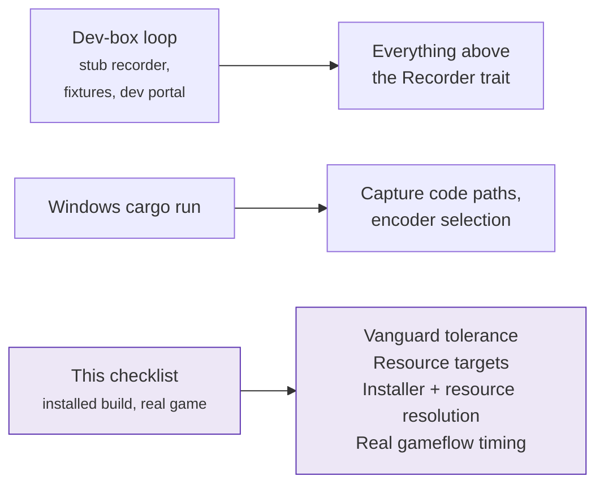

# Windows verification checklist

Capture has now run across many live Vanguard-protected games, so the gap this
checklist existed to close is **closed**. Capture, markers, multi-track audio,
the tray and the notifications all hold up on real hardware.

It stands as the record of what was checked, and as the procedure for
re-checking after a change to the capture backend. None of it is executable
from the dev box: it needs real Windows hardware, a real League client and
Vanguard active
([DEVELOPMENT.md §1.1, §9](../DEVELOPMENT.md#11-riot-vanguard-the-constraint-that-shapes-everything)).

**Still open:** the *install* half of the updater (§5.0.4) and the install-size
budget (§5), which is missed rather than met. Fill in results inline as each
remaining step is done.

**2026-09-18: the install half ran twice.** The first attempt, from alpha.45,
reported "The update is not a readable archive: invalid Zip archive: Could not
find EOCD". The daemon was unzipping an artifact that is not an archive: since
Tauri v2 the updater artifact is the signed installer itself. Fixed in #141,
and DEVELOPMENT.md §14 records why nothing caught it.

The second attempt, alpha.48 to alpha.49 on a build carrying that fix,
**installed correctly**. The offer appeared, the download verified, the
installer ran and the new version was in place.

Also confirmed in the same pass: **the install is refused while a game is being
recorded**, which is `core::install_update`'s gate working on hardware rather
than in a unit test, and Settings shows the new version afterwards.

**It does not restart afterwards** (#145). The machine is left with no daemon
and no window and the app has to be started by hand, so the step stays open.
`launch_installer` passes `/S /UPDATE` and the generated NSIS script also
parses `/R` and `/ARGS`, which is where a relaunch would come from; what should
come back, a window or a `--daemon`, is the decision that issue carries.

One more thing to re-test there rather than assume: a window left open during
an install would, before #148, have respawned a daemon out of the binary being
replaced. Whether that contributed is unknown and worth knowing before treating
the missing `/R` as the whole story.

---

## What this catches that the dev loop can't



## 0. Prerequisites

- [x] Latest `main` has a green CI run on `windows-latest`
- [x] League of Legends installed and up to date on the Windows box
- [x] **No dev toolchain involved in the app under test.** No `cargo run`, no
      `npm run tauri dev` for this pass. The dev loop already covers
      everything short of a real installer and real Vanguard; this pass exists
      specifically to catch what that loop cannot.

## 1. Install from a CI artifact

- [x] Download `ninja-recorder-windows-latest-<sha>` from the latest `main` CI
      run, or take the installer off that run's Release instead, if
      this pass is also meant to validate what a release actually ships
- [x] Run the NSIS installer on a clean-ish user account (not the profile used
      for `cargo run` testing, if avoidable; the goal is to catch anything
      leftover dev state hides)
- [x] Launch the installed app from the Start Menu / desktop shortcut, not
      from a terminal

Record: installer filename, version, SmartScreen prompt behaviour (expected on
an unsigned build).

## 2. Full loop: client detected → recording → markers → VOD in library

Use Practice Tool first: 30-second launch, on-demand kills and objectives.
Never iterate against real queued games.

- [x] League client launch is detected (lockfile discovery)
- [x] Gameflow phase transitions drive the state machine into `Recording` when
      a Practice Tool game starts
- [x] Recording file appears and grows during the game
- [x] Markers are captured (kills, objectives) and time-aligned
- [x] On game end the VOD and its markers land in the library: SQLite row,
      visible in the review UI
- [x] Playback works in the review UI and markers seek correctly

Record: nothing failed, fired late, or fired wrong.

**2026-09-17, v2.0.0-alpha.40, on a live Ranked Solo game rather than Practice
Tool.** Patch 16.18, Viego jungle, 25:46, a loss. The loop ran unattended from
end to end: the client was found, the state machine reached `Recording` without
being asked, the VOD and its markers landed in the library with the match
summary filled in (KDA, CS, rank and patch all present on the row), and the
review player plays it back with the kill markers on the gold-diff track
seeking where they are clicked.

Two things this run does not say, recorded so they are not read into it. The
first two rows were observed only by their effect: a recording that started on
its own proves the lockfile was found and the gameflow drove the machine, but
neither was watched happening. And marker *alignment* rests on the review
player looking right rather than on a frame comparison against the game, so
what is confirmed is that markers are captured and that seeking to one works.

## 3. Vanguard-protected game

- [x] The Practice Tool run above completed with Vanguard active and no flags
      or warnings from Vanguard or Riot
- [x] Repeat the full loop once during a **live queued game**, not just
      Practice Tool. This confirms behaviour under real matchmaking timing
      (champ select, dodges) per the documented state machine edge cases in
      [recording-pipeline.md](recording-pipeline.md#2-the-state-machine)

Record: Ranked Solo, and a Practice Tool run since. Vanguard was active for
both, since League does not start without it, and no flag, warning or client
complaint followed either.

**What differed between the two is not recorded here**, because nobody has
written it down. The queued game came first and was the stronger case; the
Practice Tool row was checked off afterwards. If anything behaved differently
between them it belongs in this paragraph, and an empty statement is better
than an assumed one.

## 4. Capture resilience

For each, confirm the recording continues or recovers cleanly and the final
VOD is playable:

- [ ] Alt-tab out of League and back mid-game
- [ ] In-game resolution change mid-recording
- [ ] Mid-game reconnect: disconnect the client (brief network drop or manual
      client kill), then reconnect; exercises the `Reconnect` path
- [ ] Unplug the microphone mid-game on a mic preset. The recording should
      survive with its remaining tracks rather than failing

Record: pass/fail per case, and what the output VOD looked like for any
failure (gap, corruption, truncation).

### 4.1 The daemon dying under the UI (WS3.8)

The recorder is a separate process since WS3.2, so it can go away on its own:
the updater replaces it, someone quits it from the tray, it crashes. The UI is
disposable and the recording is not, which makes this the case worth being
deliberate about.

CI covers the part that needs no game. `scripts/smoke-ui.ps1` kills the daemon
out from under a connected UI on every push and asserts that the window notices,
starts another, and reconnects, without dying itself. Killed rather than asked
to stop, because a clean shutdown says goodbye on the wire and a crash says
nothing at all.

What needs a game, and a person:

**2026-09-17: the ordinary half holds, the violent half is untested.** On the
alpha.40 ranked run the window was closed normally mid-game and the recording
carried on to a complete, playable VOD with its markers, which is the claim the
whole split exists to make. Nothing was killed from Task Manager, so every row
below is still open, and so is the harder question they ask: a clean close is
the case the code is most likely to survive.

**One known defect applies to these rows before they are attempted.** When the
daemon comes back, the strip clears itself and nothing re-reads the library, so
the window will show whatever it held when the connection died. That is fixed
in #135; on a build without it, a stale grid after a reconnect is expected
rather than a new finding.

**2026-09-18, alpha.49: the recording survives and the markers do not.** The
strip appeared and stayed, the window started another daemon and cleared it by
itself, and the partial file is playable. The rows about the row and its markers
fail, for the reason #150 sets out: markers are only written at finalize, so
killing the daemon loses every one.

**#150 has since landed and these rows are open again, not passed.** A row is
now written when recording starts, and markers, advantage-curve samples, the
match summary and the game identity are each written as the polls produce them,
so a killed daemon leaves all of it behind; daemon startup finishes the
abandoned row from the file.

Three of those four were not part of #150 and were fixed after it, for the same
reason in each case. The samples were never attributed to the wrong recording,
but they reached the database only at finalize, so a recovered recording used
to come back with its markers and a blank graph. The summary was worse: the
polls establish champion, KDA and game mode from the first one that matches
us, and all of it was thrown away, so the card came back with no title. The
game identity went the same way, which cost a recovered recording the exact
patch path and left it matchable only on the clock. That is covered by unit tests, including one that
kills a recording by simply never finalizing it, but **no part of it has been
run on hardware**. The four rows below about the library, the row and its
markers are the observable form of the fix, and are what the next session
should test. The second recording in particular
matters: the inherited-markers half of the bug only shows on the recording
*after* the one that was killed.

- [x] Start a recording. Kill **the daemon** from Task Manager mid-game.
- [x] The window says the recorder is not running, in a strip under the app bar
      that stays until it is no longer true. It must not be a toast that
      vanishes while the problem persists.
- [x] The UI starts another daemon and the strip clears by itself.
- [x] The **recording file is playable**. A fragmented MP4 is valid up to the
      point it was cut off, which is the guarantee that survives a crash.

**2026-09-21, WS3 session: 18 of 28 rows on the #130 sheet pass.** The tray is
fully exercised and the daemon's headless half holds: a game recorded with no
UI process, "Recording saved" arrived with the window closed, and the row was
in the library at the next launch. The dev portal drove the daemon over the
pipe, and a second Windows account was refused at the ACL. The update ran end
to end apart from the relaunch. Ticks below are from that session unless an
earlier dated note claims them.

**What that session did not reach, and why each one matters:**

| Open | Section | Why it is not a formality |
|---|---|---|
| `daemon.log` holds the finalize, with no `WARN [notify]` | 5.0.5 | The notification was *seen*, so the absence of a warning is the only evidence the daemon took the path it was supposed to rather than a fallback |
| The UI killed mid-game, all three rows | 5.0.6 | **WS3.4's exit criterion.** The other direction from the daemon kill, and the only untested one of the two |
| The row, its markers, its curve, its card and its game id survive a killed daemon | 4.1 | #150 landed specifically to make this true and has never been run |
| Start on login, all four rows | 5.0.2 | The argument list is an on-disk contract written once and replayed for years |
| The app comes back on the new version | 5.0.4 | The install was handed over; nothing confirmed what came back |
- [ ] The recording does **not** appear in the library while the daemon is
      down. Its row exists but is unfinished, and an unfinished row is not a
      library entry.
- [ ] The row appears on the next daemon start, with a duration read back from
      the file, and **the card is filled in**: champion, KDA, queue and game
      mode as they stood at the last poll before the kill. The outcome is
      blank unless the game had actually ended, which is the one honest answer
      to a game that was still running. `role` and `patch` are blank too:
      those come from the LCU after a finalize that never happened.
- [ ] **Run the backfill afterwards and the row completes.** It carries the
      game id the client gave it during the game, so the pass asks the LCU
      about that game directly rather than working out which one it was from
      the clock. `role`, `patch` and the outcome fill in.
- [ ] **Markers up to the kill are in the row.** This is the row that failed on
      alpha.49 and the reason #150 exists. Open the recording and check the
      timeline has marker glyphs on it, at positions that match what happened
      before the kill.
- [ ] **The advantage graph is drawn, up to the kill.** Samples are written by
      the poll that produced them for the same reason the markers are. A
      recovered recording whose timeline has glyphs on it but whose graph is
      blank is the shape of this half being broken.
- [ ] **Record a second game to completion afterwards. Its markers are its
      own.** This is the half that looked right while being wrong: the Live
      Client Data API serves the whole game's event list rather than the events
      since the last poll, so a session starting mid-game used to ingest
      everything that had already happened and attribute it to the file it was
      writing. A second recording carrying markers from the killed one, at
      offsets that belong to neither, is a regression.

And the version-skew case, which is the one that does **not** recover:

- [ ] Run a UI from one build against a daemon from another whose `PROTOCOL`
      differs. The strip says a restart is required and offers nothing else. It
      must **not** ask the daemon to quit, because the daemon may be recording.

## 5. Resource measurements

First real measurement against the targets in
[DEVELOPMENT.md §1.2](../DEVELOPMENT.md#12-lightweight-is-a-tracked-requirement).

| Metric | Target | Measured | How |
|---|---|---|---|
| Installed size | ≤ 200 MB | **248 MB**, over | `Get-ChildItem -Recurse \| Measure-Object -Property Length -Sum` on the install folder |
| Installer | none | 64 MB | the NSIS `.exe` on the release page, LZMA-compressed, roughly a quarter of what it unpacks to |
| Idle RAM | ≤ 100 MB | **9 MB**, well under | Task Manager / `Get-Process` working set, app idle, no League running |
| Recording overhead | Hardware encoder only, no x264 | | Confirm encoder choice in app logs during §2/§3 |
| Idle CPU | ~0% | | Task Manager, app idle with the client closed |

**The size target is missed, and that is recorded rather than rounded.** 248 MB
against a 200 MB budget ([DEVELOPMENT.md §1.2](../DEVELOPMENT.md)); the binary
is 64 MB of it and the rest is bundled libobs plus ffmpeg. Whether the budget
was wrong or the bundle is, it is not a pass. Idle RAM went the other way, at
9 MB against 100 MB, which is what staying out of Electron bought.

**Measure idle RAM with the client closed *and* open.** The capture backend is
now warm only while the League client is running
([DEVELOPMENT.md §2.2](../DEVELOPMENT.md#22-the-recorder-trait)), so those are
two different numbers and only the first is the §1.2 target. Confirm from Task
Manager that **no `extprocess_recorder.exe` exists at all** before the client
starts, that one appears within a few seconds of it starting, and that it goes
away again when the client closes.

**The 9 MB above is a Working Set reading taken once, with the window closed.**
That is one of six numbers it could have been, and not the one v2 is measured
against. [§5.2](#52-memory-by-the-v2-method) below is the method that replaces
it; this table and its figures are left exactly as they were recorded.

### 5.0 Launch modes

The main window is created in Rust now rather than by `tauri.conf.json`, and
argv selects the mode. Verified off Windows; the Windows behaviour of a windowless
process is what needs confirming.

- [ ] A normal start still opens the window at 1160x800 with an 880x600
      minimum, titled `ninja-recorder`.
- [ ] `ninja-recorder.exe --hidden` opens a window like any other start.
      **The flag was removed at 2.0.0** (#71), so it is an unknown argument
      now and unknown arguments are ignored. This row inverted: it used to
      assert no window, and the passing result it had is kept below as a
      record of the behaviour that was replaced.
- [ ] `ninja-recorder.exe --daemon` starts headless and stays running, with no
      window and no taskbar button. It used to print a refusal and exit 2;
      since WS3.2 it is the daemon, and §5.0.5 is where it is checked.
- [ ] Unknown arguments (a shell verb, a file path from "Open with") do not
      prevent startup.

### 5.0.1 Tray and the close button

**The tray moved to the daemon in WS3.3.** Everything below is now a property of
`ninja-recorder.exe --daemon`, not of the window, and the rows about the close
button remain the UI's. Start a daemon before working through these; the icon
belongs to that process and disappears when it quits.

- [x] The icon appears when the daemon starts and disappears when it quits. If
      `daemon.log` says "no icon could be loaded", the tray is there but
      invisible: report that line, because the icon is loaded from three
      different places in order and which one worked is the useful fact.
- [x] Right-click shows exactly three items: Open ninja-recorder, Settings,
      Quit, with separators around Settings.
- [x] Left-click opens the window; left-click does **not** show the menu.
      **Failed on alpha.49, fixed in #147, re-checked on alpha.51.**
      `tray-icon` defaults `menu_on_left_click` to true and it was never turned
      off, so the menu appeared for both buttons while the click handler fired
      underneath it.
- [x] With no UI running, Open starts one and the window appears.
- [x] With a UI already running, Open focuses the existing window rather than
      starting a second process. Confirm in Task Manager that there is still
      one non-daemon `ninja-recorder.exe`.
- [x] With the window open but minimised, Open restores it.
- [x] With the window closed to the tray (`CloseAction::CloseWindow`), Open
      creates it again.
- [x] Settings does the same and lands on the Settings view, in all three of
      those states.
- [x] **Quit while idle** exits without asking, the icon disappears, and both
      processes are gone from Task Manager.
      **Failed on alpha.49, fixed in #148, re-checked on alpha.51.** The daemon
      stopped, the window noticed the pipe die, and `connect_or_start` started
      a fresh one seconds later, so the app could not be quit from its own
      tray. The daemon had always published `DaemonShuttingDown` with a reason
      saying it left on purpose; nothing read it.
- [x] **Quit mid-recording asks first.** A modal appears naming the recording;
      "No" cancels and the recording continues, and the daemon keeps running.
      "Yes" finalizes before exiting: the VOD is playable and the row is in the
      library when the app is next opened. This is 3.3's exit criterion.
- [x] The tray stays responsive during a recording. Right-click it repeatedly
      while a game is being captured; the menu must open immediately every time.
      A slow menu means something is blocking the pump's thread, which is the
      failure this design exists to avoid.

**2026-09-18: the whole row holds, including the half that had never run.**
Tray Quit during a live recording asked first. No left everything running. Yes
finalized the recording before exiting, and the resulting VOD is fully viewable
with its row in the library.

That is WS3.3's exit criterion, and until #140 it could not have passed:
`pump::stop` posted `WM_QUIT` to the calling thread rather than the one running
the message loop, so answering Yes did nothing whatsoever. The 2026-09-17 pass
reached the modal and answered No, which is the half that worked, and that is
why the failure survived a manual pass.

The tray also stayed responsive throughout a capture, with repeated right-clicks
opening the menu immediately every time.

#### The close button's own three options

This section was named for the close button and never had rows for it. WS3
changed what two of those options mean and #140 changed the third outright, so
here they are, all verified 2026-09-18 on alpha.49.

- [x] The three options in Settings say what they actually do. "Close the
      window" and "Hide the window" both keep recording; "Quit ninja-recorder"
      stops it, and says so.
- [x] **Close the window** destroys the webview and the process survives, which
      is what keeps a recording running after the window is gone. Confirmed in
      §2's run, where Task Manager showed the non-daemon process still there
      after the window closed.
- [x] **Hide the window** shows it again without rebuilding it. Distinguishable
      from the row above by the window reappearing instantly rather than being
      recreated.
- [x] **Quit while idle** closes without a dialog and both processes are gone.
- [x] **Quit mid-recording** shows a dialog **inside the window**, styled like
      the app. Not a Windows system box, and not behind the window it came
      from. That was the reason #136 chose a `<dialog>` over reusing the
      daemon's `MessageBoxW`, which has no owner window.
- [x] **Escape** and **Keep recording** both mean no: the daemon survives and
      the recording continues.
- [x] **Quit anyway** finalizes, both processes go, and the VOD is playable
      with its row in the library.

Worth noting against §5.0.1's failing rows above: **the window's Quit works and
the tray's does not**, and they are different code paths. The window calls
`quit_recorder` and then `exit_ui`, ending both processes explicitly. The tray
only ever stopped the daemon, and the window restarted it (#148).


Verified off Windows only as far as a script can go: the tray builds without
error, a default start creates a webview and a start with no window creates
none (0 WebKit handles vs 4). That measurement was taken against `--hidden`,
which no longer exists (#71); `--daemon` is the mode that builds no window
now, and it builds no `tauri::App` either, so it is a stronger version of the
same claim rather than the same one. **Everything below needs a real click and none of it is covered
by a test.**

- [ ] The tray icon appears, with a tooltip, and its menu has exactly three
      items: Open ninja-recorder / Settings / Quit.
- [ ] Left-click opens the window; right-click opens the menu.
- [ ] "Settings" opens the window **on the settings view**, both when a window
      already exists (a `navigate` event) and when one does not (the
      `index.html#settings` fragment). These are different code paths.
- [ ] With Close = "Close the window" (the default), the X destroys the window
      and the process keeps running in the tray. Reopening from the tray works,
      and does so repeatedly.
- [ ] With Close = "Hide the window", the X hides it and reopening is instant.
- [ ] With Close = "Quit", the X quits.
- [ ] **Quit mid-recording finalizes rather than dropping the game**: start a
      recording, Quit from the tray, relaunch, and confirm the VOD is in the
      library with its markers, not adopted as an untracked file by
      `reconcile`.
- [ ] The tray icon survives an `explorer.exe` restart (kill it from Task
      Manager and confirm the icon comes back).
- [ ] Measure idle RAM with the window closed vs hidden. The whole premise of
      "close-window" as the default is that hiding reclaims nothing.

### 5.0.2 Start on login

The one setting that writes outside the app's own data, and the one whose
source of truth is not ours: `HKCU\Software\Microsoft\Windows\CurrentVersion\Run`.
Nothing in `cargo test` can reach it (`Ctx::new` leaves the control unset), and
the dev loop exercises a LaunchAgent or a `.desktop` entry, not this, so every
row below is Windows-only.

**Check the registry directly, not just the checkbox**, since the checkbox is
supposed to be a report of that key and the whole failure mode is the two
disagreeing:

```powershell
Get-ItemProperty 'HKCU:\Software\Microsoft\Windows\CurrentVersion\Run' |
  Select-Object -ExpandProperty 'ninja-recorder'
```

**2026-09-22: `l1` and `l2` pass, with Defender live.** After a real logon:
one `ninja-recorder.exe`, its command line carrying `--daemon`, no second
process without it, and no WebView2 process parented to ours. The Run value is
the installed exe path followed by `--daemon`, written by the app rather than
by hand.

Taken with the Defender exclusion **off**, which is what makes any of it worth
anything: see #181. Nothing fired from the logon, from the Run key starting the
daemon, from relaunching the binary, or from the app writing and removing the
key through Settings. Unticking removes the value entirely and ticking writes
it back with `--daemon`.

**The Defender quarantine that started that investigation was caused by the
test method, not by the app.** Writing the Run key from PowerShell and then
spawning the target through `Win32_Process::Create` is two malware techniques
in sequence; the app doing the same write itself is not. Two entries in the
same registry key make the point better than any argument: `Discord` and
`Spotify` both run from AppData, from HKCU Run, with arguments, and neither is
flagged. What they have that this build does not is a signature.

- [ ] A fresh install registers **nothing**: the key is absent and the
      Settings checkbox is off before it is ever touched.
- [x] Ticking it creates the value, and it holds the installed exe's full path
      **followed by `--daemon`** (WS3.5). A path with no flag means a login
      start that opens a window, and so, since 2.0.0, does one ending in
      `--hidden`: that flag was removed (#71) and is ignored.
- [x] Unticking it removes the value entirely.
- [ ] The setting survives a restart of the app: reopen Settings and confirm
      the checkbox still reflects the key.
- [x] **Sign out and back in.** Task Manager shows **one**
      `ninja-recorder.exe` and it is the daemon: no window and no taskbar
      button. The tray icon is there, and the recorder is live. Start a game
      without opening the window and confirm it records. This is WS3.5's exit
      criterion: login starts a daemon only.

      **Do not check this by looking for `msedgewebview2.exe`.** WebView2 is
      shared infrastructure: Widgets, Outlook, Teams and plenty else host it,
      and a normal desktop runs a dozen of them at rest. Their presence says
      nothing about this app. The claim is that *our* process did not start a
      window, so ask about our process:

      ```powershell
      $proc = @(Get-CimInstance Win32_Process -Filter "Name='ninja-recorder.exe'")
      @($proc | Where-Object { $_.CommandLine -notmatch '--daemon' }).Count   # must be 0
      ```

      Or, if the webview itself is what you want to see, filter to the ones
      whose parent is ours rather than counting them all.
- [x] Open the app from that tray icon. Now there are two processes and still
      **one** tray icon, because the UI no longer builds its own (WS3.5).
- [ ] **An entry written by an older build (`--hidden`) heals itself.** Set
      the value by hand to the exe's path plus `--hidden`, sign out and back
      in. Expect a window to open, because the flag no longer means anything
      (#71). Then check the `Run` value again **without touching Settings**:
      it must now end in `--daemon`, because the window started a daemon and
      `RegistryAutostart::refresh_if_enabled` rewrote it. Sign out and back in
      once more and confirm a daemon start with no window.

      The window appearing once is the cost of the removal and is expected.
      The row is about it happening exactly once.

      > **Superseded, and kept as the record.** This row previously passed
      > asserting the opposite: that `--hidden` still worked and started a UI
      > with no window, so Task Manager showed two processes rather than one.
      > It was checked on 2026-09-18 by launching the exe with the flag
      > directly, and it confirmed that `--hidden` built no window at all
      > rather than a hidden one, with no WebView2 process parented to ours.
      > That was true of the behaviour it tested. #71 removed the flag rather
      > than choosing between its two possible meanings.
- [ ] Delete the entry from **Task Manager → Startup** with the app running,
      then reopen Settings: the checkbox must now read *off*. This is the case
      the "no `settings_kv` mirror" decision exists for
      ([DEVELOPMENT.md §12](../DEVELOPMENT.md#12-process-model-a-recorder-daemon-and-a-ui-that-can-leave)).
- [ ] Disabling the entry in Task Manager (rather than deleting it): note what
      the checkbox says. Windows records that state outside the `Run` key, so
      the app is expected to still report "on"; confirm it, and that toggling
      off then on clears it.
- [ ] Uninstall with autostart enabled, then check the key: NSIS does not know
      about it, so a stale entry pointing at a removed exe is the expected and
      harmless outcome. Confirm it does not produce an error dialog on
      the next login.
- [ ] Reinstall over an existing install with autostart on: the path must still
      resolve, or the entry silently stops working.
- [ ] Both product names side by side (`ninja-recorder` and
      `ninja-recorder-dev`) get **separate** `Run` values; confirm enabling one
      does not show as enabled in the other.

### 5.0.3 Notifications

**None of this can be checked before installing.** The
`System.AppUserModel.ID` is only set for a non-`target/debug|release` exe, and
Windows resolves it through the Start-menu shortcut NSIS creates, so a dev run
shows nothing and that is expected. The decision logic (which kinds are enabled,
the one-time notice) is unit tested; presentation is not testable anywhere but
here.

**Three of the four now come from the daemon** (WS3.3), because a notification
is for the moment nobody is looking at a window. So the rows below about
recordings must hold **with no UI process running at all**: close the window
first, and check them against a daemon on its own. The "still running in the
tray" notice is the exception and stays in the UI, because it is about the
window.

They were missing for two commits, between WS3.4 moving the supervisor out of
the UI and WS3.3 rebuilding the notifier on `notify-rust`. If a build predates
that, this section is expected to fail entirely.

**2026-09-18: with no UI process in existence, not merely no window.** The
non-daemon `ninja-recorder.exe` was ended from Task Manager before the game, so
one process remained and its command line was `--daemon`. Both "Recording
started" and "Recording saved" arrived, the second carrying the file name and
marker count. `daemon.log` holds no `WARN [notify]` lines.

The distinction matters and the 2026-09-17 pass could not make it: closing the
window destroys the webview and leaves the process alive, because
`RunEvent::ExitRequested { code: None }` is vetoed. "Window closed" had never
meant "no UI process", and this is the first run where it did.

Note that **"Recording started" is off by default** (`NotificationPrefs`), so
its absence on a fresh profile is a setting rather than a fault.

- [ ] Closing the window the first time shows the "still running in the tray"
      notice, and closing it again does **not**.
- [ ] Settings → Notifications → Reset makes that notice appear once more.
- [x] Finishing a game shows "Recording saved" with the file name and marker
      count, **with the window closed**. This is the one that says the split
      worked: the process that noticed the game ended is the one that told you.
- [ ] Starting a game shows "Recording started" when that kind is enabled, again
      with no window open.
- [ ] Turning the master switch off silences everything, including the
      one-time notice, and greys out the other three checkboxes.
- [ ] A recording that fails to start (try filling the disk below 1 GiB) shows
      the problem notification.
- [ ] Toasts are **display-only**; clicking one is expected to do nothing.
      Confirm it at least does not crash or mis-focus.
- [ ] Both product names get their own Start-menu shortcut and therefore their
      own AUMID; confirm `ninja-recorder` and `ninja-recorder-dev` do not
      collide.
- [ ] A notification that cannot be shown must not touch the recording. There
      is no easy way to break the toast subsystem on purpose, so this one is
      checked by reading `daemon.log`: any `WARN [notify]` line should sit
      beside a recording that continued regardless.

### 5.0.4 In-app updates

**Nothing about this is testable off Windows, and none of it without two
builds on the same channel.** The gate, whether an offered update may be
installed, is pure and unit-tested (`update::decide`); everything below it
is not ([DEVELOPMENT.md §14](../DEVELOPMENT.md#14-updates)).

**Use the alpha channel.** Every commit on `main` publishes one, so getting a
newer build is one merge rather than a deliberate release: set Settings →
About → Update channel to Alpha, install an alpha, land any commit, and the
next check offers its successor. On stable the same exercise costs two
deliberate cuts ([DEVELOPMENT.md §15](../DEVELOPMENT.md)).

Whichever channel, the versions must move **forwards**. An alpha is below the
stable release it precedes, so an alpha install offered a stable build is
being offered an upgrade, and a stable install will never be offered an alpha
at all. That is the design, not a fault.

- [ ] Both manifests resolve and name the build they should:
      `curl -L .../releases/latest/download/latest.json` (stable) and
      `curl -L .../releases/download/alpha/alpha.json` (alpha). Each `url`
      must point at that release's **tagged** asset, not `/latest/`.
- [ ] Switching the channel re-checks immediately, and the row changes to
      describe the channel just selected rather than the one left behind.
- [ ] A **stable** install is never offered an alpha, even with alphas newer
      in time. This is the one that a comparison-based implementation would
      get wrong, since semver says `1.1.0-alpha.1 > 1.0.0`.
- [ ] About 30 s after launch, a dot appears on the settings button and
      Settings → About names the newer version. **Nothing else happens**: no
      toast, no Windows notification, no dialog. That is the design, not a
      missing piece.
- [ ] "Check now" produces the same answer without waiting.
- [x] **The gate.** Start a game. While the header reads Recording, the Install
      button is disabled and the row says why. Confirm the same during
      `Game starting…` and `Saving…`. All three refuse.
- [x] The button re-enables on its own once the game ends, **without**
      reopening Settings or restarting the app. This is the `status.ts` edge
      refresh; if it needs a reload, that hook is broken.
- [x] Install. The app exits, the NSIS installer runs *passively* (a progress
      bar, no wizard to click through), and the app comes back. Settings →
      About now shows the new version and offers nothing.
- [ ] The install did **not** create a second entry in Apps & Features, a
      second Start-menu shortcut, or a second install directory.
- [x] Start-on-login, the close-button setting, the audio preset and the
      retention policy all survive the update; they live in `settings_kv` and
      the `Run` key, neither of which the installer touches.
- [x] The VOD library survives it: recordings are still listed, and their files
      still play.
- [ ] **Install the devtools bundle and confirm it offers nothing at all.**
      Settings → About must read "not available in this build". A dev bundle
      that updated itself would replace itself with the production app, which
      is exactly what renaming the product was meant to prevent.
- [ ] Pull the network cable and press "Check now": the row reports the failure
      in words and the app carries on recording normally.
- [x] Tamper check, which needs a scratch release: replace the installer
      attached to a release without updating `latest.json`, and confirm the
      download is **rejected** rather than run. This is the only test that
      exercises the signature at all.

### 5.0.5 The daemon process

`--daemon` runs the recorder with no Tauri, no window and no WebView2
(WS3.2). All of it has been exercised on a Linux dev box over a Unix socket,
which is the same code path with a different address: the daemon started,
opened the library, served a client, recorded through the stub backend,
reported a second launch as already running, and shut down cleanly on Ctrl-C.
None of that has been run on Windows, where the address is a named pipe and the
backend is libobs, and this section is what stands in for that.

- [x] `ninja-recorder.exe --daemon` starts and keeps running, with no window
      and no second `ninja-recorder.exe`. (This row originally said "no
      `msedgewebview2.exe`", which is not a sound test: see §5.0.2. It passed
      on a machine where nothing else happened to be hosting WebView2.)
- [x] `app_data_dir()/logs/daemon.log` is created and names the pipe it bound.
      The UI's own log is `ui.log` beside it, and neither rotates the other.
- [x] The pipe exists while the daemon runs. From PowerShell:
      `[System.IO.Directory]::GetFiles("\\.\pipe\") -match "ninja-recorder"`
      should list `ninja-recorder.com.ninjarecorder.app.release`, or
      `...devtools` for a devtools build.
- [x] **The pipe's ACL grants this user and nobody else.** The daemon will
      start and delete recordings for anyone who can open it, so this is the
      one row here that is a security property rather than a behaviour.

      ```powershell
      $p = [System.IO.Pipes.NamedPipeClientStream]::new('.', 'ninja-recorder.com.ninjarecorder.app.release')
      $p.Connect(2000)
      $p.GetAccessControl().Access | Format-Table IdentityReference, FileSystemRights, AccessControlType
      ```

      Expect three allow entries: this account, `NT AUTHORITY\SYSTEM` and
      `BUILTIN\Administrators`. **No `Everyone`, and no `NT AUTHORITY\Authenticated
      Users`.** **2026-09-18, alpha.49:** exactly three, and the right three.
      `daemon.log` carries neither `using the default pipe ACL` nor
      `using the default`, so the descriptor was built and applied rather than
      fallen back to, which is the one way this row can look right while
      proving nothing. (`FileSystemRights` renders blank for a pipe handle in
      PowerShell; the identities and the `Allow` types are the readable part.)
      If `daemon.log` carries a line about using the default pipe ACL,
      the descriptor could not be built and the pipe fell back to the process
      default, which is the thing this replaced: report that line's reason
      rather than the ACL.
- [x] A second Windows account signed in at the same time cannot drive this
      user's daemon. With fast user switching, sign in as another account and
      run the same connect: it must fail with access denied rather than
      connecting.
- [ ] A devtools build and a release build can run at the same time without
      either taking the other's clients. Their pipe names differ by that last
      segment; the database and the recordings folder are still shared.
- [ ] A second `ninja-recorder.exe --daemon` exits **0** immediately and
      silently, leaving the first running. Confirm the exit code and confirm
      the first daemon's log has nothing new in it.
- [ ] Kill the daemon with Task Manager, then start it again. It binds the pipe
      on the first try: a killed daemon must not leave the name unusable.
- [x] With the daemon running and a game in progress, the recording continues
      with no UI process at all. This is the whole point of the split, and it
      is also §3.2's exit criterion.
- [x] Stop the daemon while it is recording. The recording is finalized before
      the process exits, and the row is in the library when it comes back.

**Not in the daemon yet**, so do not look for them: the tray icon (3.3), the
updater (3.6) and desktop notifications. The dev portal's `dev_*` commands do
run there since WS3.7 and can be invoked over the pipe, but the portal window
itself still talks to the UI process until WS3.4's proxy lands. Running the UI and the daemon together means two supervisors watching for
the same game, which is expected rather than a defect to report.

**The Run key still pointed at `--hidden`** at the time of this note, so
§5.0.2 was unchanged and a login start was still the UI. That is deliberate rather than pending: the two
prerequisites are in
[DEVELOPMENT.md §12](../DEVELOPMENT.md#12-process-model-a-recorder-daemon-and-a-ui-that-can-leave).
When it does move, §5.0.2's "sign out and back in" row is the one that changes,
and the row to add beside it is that an entry written by an older build still
says `--hidden`. That row was written before #71 removed the flag; what
replaced it is the self-healing row in §5.0.2.

### 5.0.6 The UI as a client of the daemon
**2026-09-22: WS3 is 26 of 28.** The sheet on #130 is the row-level record.
Everything passes except the two below, and one of them is what #150 landed
for.

| Open | Why it is still worth doing |
|---|---|
| `daemon.log` holds the finalize, with no `WARN [notify]` | The notification was seen, so the absence of a warning is the only evidence the daemon took the path it was meant to rather than a fallback |
| The row and its markers survive a killed daemon (§4.1) | #150 landed to make this true and it has never been run. It is also the state PR #180 fixes the review player for |

**WS3.4's exit criterion passes**: the UI killed mid-game, relaunched, showing
the recording still in flight with the elapsed time continuing, and a complete
VOD afterwards. That is also WS1.2's (#6) exit criterion, which needs no
separate run.


Since WS3.4 the window runs no recorder of its own: every command it issues is
forwarded to the daemon over the pipe, and the daemon pushes a snapshot and a
stream of events back. None of this can be checked off Windows, because it
needs a window.

- [ ] With no daemon running, launch the UI. It starts one (`daemon::spawn`),
      connects, and the library and settings render normally. Task Manager
      shows two `ninja-recorder.exe` processes.
- [ ] `app_data_dir()/logs/` now holds both `ui.log` and `daemon.log`, and
      neither rotates the other.
- [x] **The exit criterion for 3.4.** Start a game and let recording begin.
      Kill the UI process from Task Manager, then launch it again. Within one
      reconnect it shows the recording still in flight, with the elapsed time
      continuing rather than restarting. The VOD is complete and playable
      afterwards.
- [ ] Quit the daemon while the UI is open. The UI reports a lost connection
      rather than hanging, and reconnects when a daemon is started again.
- [x] Start a recording, then close the UI window entirely. The recording
      continues and the row appears in the library when the UI is reopened.
- [x] **The exit criterion for 3.7.** With a devtools build, open the dev
      portal and work through every panel. Each one drives the *daemon's*
      database, supervisor and recorder: Overview's counts, Database's tables,
      Simulate's state injection and Log's files should all describe the daemon
      process, and the Log panel's active file should be `daemon.log`.
- [ ] Version skew: run the UI from one build against a daemon from another
      whose `PROTOCOL` differs. The UI must say a restart is required and must
      **not** ask the daemon to quit, because it might be recording.

**Not verifiable here, and expected to be missing:** desktop notifications for
recording started, finished and failed. They belong to the daemon, which cannot
raise them until WS3.3. Do not file these as bugs against this build.

### 5.1 Capture-backend lifecycle

New with `prepare`/`release`; none of it can be exercised off Windows.

- [x] `extprocess_recorder.exe` is absent at app start, appears with the League
      client, and disappears when the client closes.
      **2026-09-18:** observed present alongside a running client and gone from
      Task Manager once the client was closed, which is `prepare`/`release`
      doing what §2.2 designed them for.
- [ ] The app log's `[recorder] backend:` line reads `libobs (idle)` at startup,
      not `libobs (ready)`.
- [ ] **A game recorded minutes after the client opened still works.** The
      backend is now brought up well before `start`, so this checks it is still
      healthy after sitting warm through champ select.
- [ ] **Several games in one session.** Bring-up/tear-down now repeats across a
      session (client restart, or closing and reopening the client). Watch for
      a leak, a stale GPU device, or a second worker process.
- [ ] Closing the client *mid-recording* does not tear the backend down under a
      live encoder; the recording should finalize normally.
- [ ] A machine where libobs fails to initialize surfaces
      `libobs (unavailable: …)` in the dev portal's health panel rather than
      failing at startup.

### 5.2 Memory, by the v2 method

Added by WS0 task 0.1. Nothing above is renumbered or rewritten; §5's original
table stays as the record of what was measured in v1 and how.

What it does not do is say which of several different numbers "9 MB" was.
[docs/measurement.md](measurement.md) defines the one this project uses from
here: **Private Bytes** as the headline, because it excludes shared pages and
is the honest cost to the machine; **Working Set** recorded alongside it,
because that is the column Task Manager shows a user; both **sampled at 1 Hz
for 60 seconds** and reported as median with the range, because a single
reading catches whatever the allocator was doing at the time.

Fill the rows in with [`scripts/measure.ps1`](../scripts/measure.ps1), which
emits the row itself so the transcription cannot introduce a typo:

```powershell
.\scripts\measure.ps1 -Label 'v1 0.8.0 - window closed' `
    -InstallPath "$env:LOCALAPPDATA\ninja-recorder"
```

**Do not estimate a cell.** An empty row is a true statement about what has
been measured; a plausible number in it is not. WS0.2 fills these three in on
the Windows box.

| State | Process | Private Bytes (median) | Private (min-max) | Working Set (median) | WS (min-max) | Install | Samples |
|---|---|---|---|---|---|---|---|
| v1 0.8.0 - window closed | ninja-recorder | | | | | | |
| v1 0.8.0 - window open | ninja-recorder | | | | | | |
| v1 0.8.0 - League client open | ninja-recorder | | | | | | |

**Window closed is the row the [§1.2](../DEVELOPMENT.md) ceiling is about.** The
other two are recorded so that the cost of the webview and the cost of a warm
capture backend are each visible, rather than folded into one figure that
describes neither.

WS7.1 appends the v2.0.0 rows beneath these, in the four states the process
split creates: daemon only, daemon + UI, daemon + League client, all three.
**Daemon only is the one gated against C3**: it is what runs at login and what
runs for the twenty-three hours a day nobody has the window open. The
two-process total is recorded and not gated.

## 6. Open questions specific to the capture backend

These are the things nobody has been able to answer by reading the code:

- [ ] Does `window_capture` forced to WGC (`method=2`) actually produce frames
      for League's borderless and windowed modes?
- [ ] Does the faststart remux on stop actually run against a real capture?
- [ ] **Does the duration probe work off the bundled `ffmpeg.exe`?** Drop a
      handful of video files the app did not record into the recordings
      folder, press Rescan, and confirm each card shows a real LENGTH rather
      than the empty-value placeholder. This is the only place `ffmpeg -i`
      output is parsed
      ([DEVELOPMENT.md §4.1](../DEVELOPMENT.md)), and the wording it parses
      has only ever been checked against a hand-written sample.
- [ ] **Time a first startup against a large existing folder** (a few hundred
      files, none of them in the DB). The probe spawns one ffmpeg per file on
      the import branch and startup reconcile is inline, so this is the cost
      §4.1 says to watch. A settled folder should spawn nothing on the next
      launch; confirm the second start is fast.
- [ ] Does the bundled resource path (`target/libobs` → next to the installed
      `.exe`) resolve correctly in an installed build, and does dev mode need
      the staging step to also copy into `target/debug/libobs`?
- [ ] Are encoder priority and the window-size retry timing sensible against
      real hardware? They are first-cut defaults, not tuned.

### Multi-track audio ([DEVELOPMENT.md §2.5](../DEVELOPMENT.md#25-multi-track-audio))

Nothing below can be checked off Windows. Use `ffprobe`, because the failure
modes here are silent, and the app's own UI will not show you most of them.

- [ ] **Does `wasapi_process_output_capture` produce non-silent samples for a
      Vanguard-protected `League of Legends.exe`?** This is the big one: every
      preset naming "game audio" depends on it and there is no automatic
      fallback. If it fails, Desktop is the documented workaround.

      **This row also answers WS1's P0c stage 1 (#7), on the shipping build.**
      The libobs fork and `spikes/p0c-audio` call the same Windows API, so a
      Game-preset recording with real samples in it says process loopback works
      against League on this machine, and a silent one says it does not. Either
      way the spike is then confirming a known answer rather than discovering
      one, which is the cheaper order to do them in. See #67.
- [ ] Record with each preset. Confirm the track *count* and order match the
      table in §2.5, and that a Game-only recording contains no microphone
      audio.
- [ ] Confirm track 0 is the combined mix and tracks 1+ are genuinely
      isolated, **not four copies of the same mix**, which is what a missing
      `obs_source_set_audio_mixers` call produces and what the app cannot
      detect on its own.
- [ ] Confirm the faststart remux preserved every track. `-c copy` without
      `-map` silently keeps one audio stream, and the remux renames over the
      original, so this is unrecoverable if it regresses.
- [ ] `ffprobe` shows `DISPOSITION:default=1` on `a:0` and `0` on the rest.
- [ ] Discord audio lands on its own track and is absent from the game stem.
      With Discord *not* running, the track should be silent rather than the
      recording failing.
- [ ] On a non-English client, game audio is still captured. This is what the
      `priority = 2` (match-by-executable) fix in the fork is for.
- [ ] The microphone picker lists real devices, and "Windows default" records
      from the device the user expects. libobs resolves an input `device_id`
      of `"default"` as the default *communications* device, which commonly
      differs from the default device when a headset is plugged in.
- [ ] In the review player: switching stems plays the right audio, stays in
      sync across seeks, speed changes and pauses, and mute/volume behave.
      Confirm the sidecar cache lands in `recordings/audio-tracks/` and that
      deleting the VOD removes it.
- [ ] **The two post-game LCU shapes, which no one here has seen.** Both
      `/lol-end-of-game/v1/eog-stats-block` and
      `/lol-match-history/v1/games/{gameId}` are modelled from the LCU's own
      OpenAPI spec, not from a captured response. Run `dev_lcu_get` on each
      after a real game, commit the trimmed responses under `fixtures/lcu/`,
      and correct the parsers if they differ. Specifically: does the eog block
      carry `teams[].isPlayerTeam`/`isWinningTeam`, and are its scoreboard keys
      really `CHAMPIONS_KILLED`/`NUM_DEATHS`/`ASSISTS`?
- [ ] **The deferred patch end to end.** Play a game, then watch the card fill
      in `role` and a queue label on its own within a minute of the finalize,
      with no manual refresh. `dev_patch_match_summary` drives the same path against
      an existing row without playing another game. Check the log for a
      disagreement warning: the LCU and Live Client Data must never report a
      different winner, and if they do, the wrong game was matched.
- [ ] **Start the app during a game.** It should begin recording rather than
      waiting for the next one; the gameflow watch now reads the current
      phase on connect instead of only reacting to changes (#75). The same
      path is what lets a recording resume after anything interrupts it
      mid-game.
- [ ] **A recording survives a brief Live Client Data outage.** #74 tolerates
      five consecutive transport failures; confirm a momentary blip no longer
      finalizes the VOD, and that a genuinely ended game still finalizes
      within a few seconds.
- [ ] **`logs/libobs.log` exists and has content after a capture.** The
      worker's stderr is redirected into it before the process spawns
      (#69); confirm libobs's own startup lines, the encoder it chose and
      the adapter it picked are all in there, and that the dev portal's Log
      panel can select and read the file.
- [ ] Does gameflow report a distinct phase while spectating? If it reports
      `InProgress`, spectated games are currently recorded, which the design
      says they should not be.
- [ ] Does the app recover state after machine sleep/wake mid-session?

## 7. The frontend, after the Svelte migration (#167)

WS4 replaced every view in the window, one workstream at a time. **All of it
has now been run on Windows and all of it passes**; what follows is the
checklist that was used and the record of what it found. The order is still
the order to repeat it in: each step leaves the machine in a useful state for
the next, and it leads with the two failures that would make everything after
them meaningless.

**Nothing below is covered by CI, and that is structural rather than an
oversight.** The test suite runs in jsdom, which lays nothing out: every
element is zero pixels wide. Marker clustering is measured in pixels and
correctly returns nothing there; tooltip placement, the graph's geometry, and
every CSS rule in both stylesheets are unexercised by construction.

Read §2's ticks with care. They were recorded on alpha.40, before WS4.3, so
"visible in the review UI" and "playback works in the review UI" were observed
against `library.ts` and `review.ts`, both since deleted. They still stand as
claims about the backend underneath; they say nothing about the current views.

**2026-09-21: all 45 rows pass.** WS4 is verified. The row-level record is the
sheet on #167; this section is its durable copy, and the two disagree only in
grain: the sheet splits tooltip placement and the reset dialog into rows of
their own, so it counts 45 where this counts 45 after the two additions below.

**The first pass found two defects, and the list had a row for neither.**

| Found | Was | Fixed |
|---|---|---|
| The player rendered enormous and cropped | `app.css` sizes the video through `#review-video`, and WS4.5 rebuilt the element with a `bind:this` reference, which needs no id. The rule stopped matching and the `<video>` fell back to its intrinsic 1920-wide box inside a wrapper with `overflow: hidden` | #169 |
| Clicking the video did nothing | `review.ts` bound a click handler; the rebuilt element carried seven handlers and no `click` | #169 |

Both are worth more than their own fixes. The sizing bug **survived a look at
the feature most likely to break**, because fullscreen was checked first and
fullscreen looks right either way: there the wrapper fills the screen whatever
the video does. And neither was on the list, which means the list is a floor
rather than a ceiling, and a session that only ticks rows finds less than one
that also looks.

`src/style-hooks.test.ts` now asserts that every id a stylesheet selects exists
in the markup, which is the structural half of the first one. It is the most a
test can say here: nothing in this repo renders a pixel, so a stylesheet
detaching from its markup is invisible until someone opens the window.

### 7.1 It boots, and it is dressed

- [x] The window opens and shows the library. A blank window means the root
      threw on the way up: open DevTools and read the console first, because
      everything below will fail in a way that hides it
- [x] **No flash of the wrong theme on launch.** The inline boot script in
      `index.html` runs before first paint and `app.css` imports `tokens.css`
      on its first line; either coming late is visible exactly once per start,
      so watch the first frame rather than the settled window
- [x] The app bar, the library grid and the rows are **styled**. `app.css` was
      moved from `src/styles.css` in #164 and not rewritten, so the failure
      to look for is wholesale unstyled markup rather than a wrong margin
- [x] Switch to Settings and back. One view at a time, never two at once
- [x] Open the app at `#settings` directly (edit the URL in a dev build, or
      relaunch after leaving it there). **The settings view alone** should
      show: a view that trusted its own default would render two at once

### 7.2 The library (WS4.3)

- [x] Rows show champion art, the matchup, KDA, CS and the result
- [x] Champion search narrows the list as it is typed
- [x] Each of the three facet filters (queue, role, patch) narrows it, and the
      options offered are the values actually present
- [x] Delete a recording that a facet filter is selecting on. The filter
      should fall back to "All", not hide everything with no way back
- [x] Every sort order reorders the grid, and survives switching views
- [x] "Clear filters" clears the filters and **leaves the sort where it was**
- [x] The empty state appears with a way out when filters match nothing, and
      without one when the library is genuinely empty
- [x] Pin a row, delete a row: both report, and the grid and the disk figure
      both update

### 7.3 The review player (WS4.5)

Needs one real recording. §2 produces one.

- [x] It plays, and the timeline draws the advantage curve
- [x] Markers appear as glyphs on the track. **Markers close together cluster
      into one glyph with a count**, which no test can check: clustering is
      measured in pixels and jsdom has none
- [x] Hovering a cluster shows its tooltip, and a tooltip near either end
      stays inside the timeline rather than hanging off it
- [x] A tooltip with more markers than fit scrolls, and survives the pointer
      moving into it
- [x] Clicking a glyph seeks to that marker; the marker list seeks too
- [x] Dragging the in-player bar scrubs, and keeps scrubbing when the pointer
      leaves the bar
- [x] **The player is the size of its wrapper**, not its intrinsic size, and
      stays right when the window is resized. Neither this nor the row below
      was on this list when the first session ran; both were found anyway, and
      both were real (#169). The list is the poorer of the two records, so they
      are here now.
- [x] Clicking the video toggles play and pause, and a click that only
      dismissed the settings menu does not also toggle it.
- [x] **Playback stops at the end of the viewing window rather than running
      into the black tail** (#119), and the clock does not read past the end
- [x] The hotkeys work, **including in fullscreen**, which is the only marker
      navigation available there: the rich timeline is outside `.player-wrap`
- [x] For a multi-track recording, switching audio tracks extracts a stem and
      the video mutes. Switch twice quickly: the second choice must win
- [x] Switch to a track whose extraction fails. It should fall back to the mix
      and say so, not go silent with the picker claiming otherwise

### 7.4 Settings and the updater (WS4.4)

- [x] Every control reflects what is actually set, and a restart shows the
      same values
- [x] Theme: Light, Dark and System each apply, and System follows the OS
      when it is changed underneath the app
- [x] Start on login ticks and unticks, and the checkbox shows what the
      registry ended up saying rather than what was asked for
- [x] Audio preset changes, and a failed change rolls the control back
- [x] Retention: the preview says what saving would delete **before** saving,
      and saving deletes exactly that
- [x] "Fill in match data" reports, and the library reflects what it filled
- [x] The update panel shows a real status, and the release notes render as
      text (`latest.json` is not covered by the update signature)

### 7.5 The shell (WS4.6)

- [x] Toasts appear, stack, and go away on their own
- [x] Kill the daemon: the strip appears and **stays** until the connection is
      back, then clears itself
- [x] Close the window while recording: the quit dialog appears, and
      **"Quit anyway" quits** (see DEVELOPMENT.md §4.9, where answering the
      wrong way was a real bug)
- [x] "Cancel" on that dialog cancels
- [x] Escape dismisses it, and dismissing is not a yes

### 7.6 The dev portal (#72)

Needs a devtools build (`npm run tauri:dev`, or the CI artifact).

- [x] The portal opens, the header pills poll, and the Live toggle stops them
- [x] **Every one of the eleven panels renders**, which is the whole of what
      the rewrite risks. Walk the sidebar top to bottom
- [x] The portal is **styled**: `dev.css` moved in #72 the same way `app.css`
      did, so the failure to look for is an unstyled page rather than a
      misplaced rule
- [x] `r` refreshes the current panel, and does nothing while typing in a field
- [x] A confirm dialog appears for a destructive action, Cancel cancels, and
      the Reset database dialog stays disabled until `reset` is typed
- [x] Fixtures → "Send to the snapshot injector" lands the payload in
      Simulate. It is 99 KB and does not travel in the URL
- [x] The 🔎 on a library row opens the portal **on that recording**
      (`#/library/<id>`)
- [x] Seed a library, then confirm the main window updates without a manual
      refresh (`library-changed`)

### 7.7 What to record

For each failure: the panel or view, what was on screen, and whether the
console said anything. A component that throws takes its subtree with it and
leaves a gap rather than an error, so **an empty area is a finding**, not a
layout preference.

## Outcome

- [ ] All boxes above checked
- [ ] Any failures filed as follow-up issues, linked here
- [ ] "Not verified" notes in DEVELOPMENT.md §2.2 / §3.4 and the README status
      paragraph updated to reflect what is now actually verified
