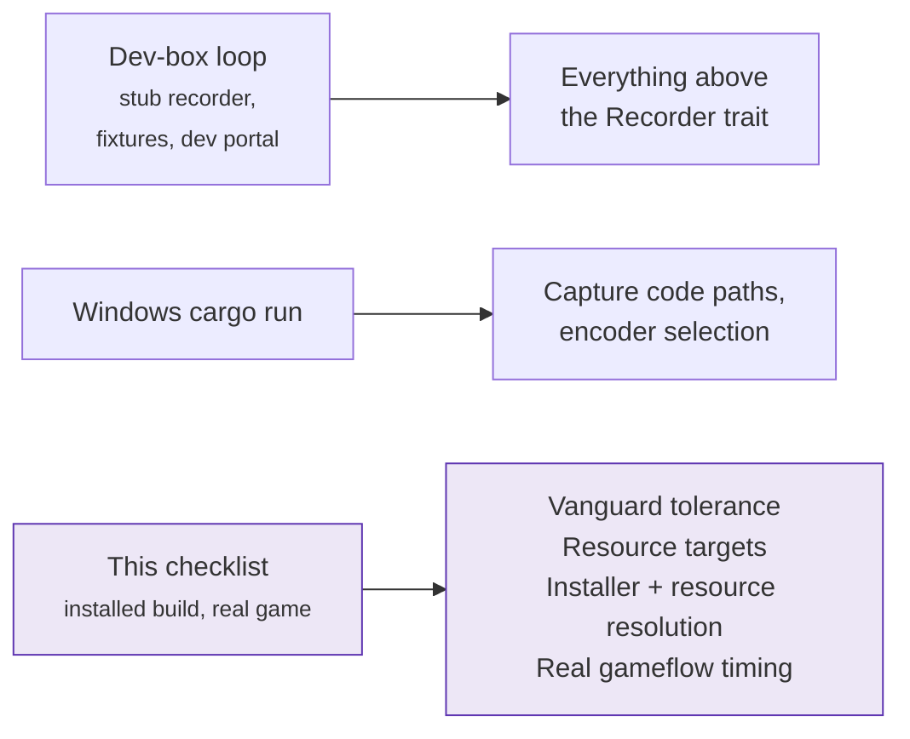

# Windows verification checklist

Capture has now run across many live Vanguard-protected games, so the gap this
checklist existed to close is **closed**. Capture, markers, multi-track audio,
the tray and the notifications all hold up on real hardware.

It stands as the record of what was checked, and as the procedure for
re-checking after a change to the capture backend. None of it is executable
from the dev box: it needs real Windows hardware, a real League client and
Vanguard active
([DEVELOPMENT.md §1.1, §9](../DEVELOPMENT.md#11-riot-vanguard-the-constraint-that-shapes-everything)).

**Still open:** the install-size budget (§5), which is missed rather than met
by the untrimmed bundle, and the rows listed under 2026-10-03 below. Fill in
results inline as each remaining step is done.

**2026-10-03: the WS1 box runs are copied in, and #199 passes.** Between
2026-09-24 and 2026-09-26 the own backend was built and checked in lettered
blocks (A to N), each posted to its issue as a "Box run" comment rather than
ticked here. This update copies those results into §4, §6, §7.8, §8, §9, §10
and §11, each with the build it ran on and the issue holding the detail. #199's
row in §4.1 passes on alpha.103 (#200's comment). Nothing in this update is a
new measurement; every result here was already posted on its issue.

Five fixes for what the blocks found landed afterwards, and none has run on
hardware: #293, #295, #296, #297/#313 and #298 (PRs #317, #316, #331, #319,
#318). Where a row was rewritten for one of them, the block passed against the
old wording, so the row says so and stays open; the other fixes are named in
the notes beside the row that found them. They, with the rows no block
reached, are what WS7.2's pass (#47) has to cover. The rest of what remains
open needs hardware this box does not have: a Windows 10 machine, a build below
19041, and a non-NVIDIA GPU (#224).

**2026-09-23, alpha.87 → alpha.89: the whole #130 sheet has a result, and one
row fails.** The in-app update came back on its own for the first time, which
closes the install half of §5.0.4. The daemon killed mid-game now leaves a
complete, recovered row behind. The one failure is the recording the
replacement daemon starts afterwards, which inherits the killed one's markers
(#199). Ticks below from this pass are claimed by the dated notes beside them.

**2026-09-18: the install half ran twice.** The first attempt, from alpha.45,
reported "The update is not a readable archive: invalid Zip archive: Could not
find EOCD". The daemon was unzipping an artifact that is not an archive: since
Tauri v2 the updater artifact is the signed installer itself. Fixed in #141,
and DEVELOPMENT.md §14 records why nothing caught it.

The second attempt, alpha.48 to alpha.49 on a build carrying that fix,
**installed correctly**. The offer appeared, the download verified, the
installer ran and the new version was in place.

Also confirmed in the same pass: **the install is refused while a game is being
recorded**, which is `core::install_update`'s gate working on hardware rather
than in a unit test, and Settings shows the new version afterwards.

**It does not restart afterwards** (#145). The machine is left with no daemon
and no window and the app has to be started by hand, so the step stays open.
`launch_installer` passes `/S /UPDATE` and the generated NSIS script also
parses `/R` and `/ARGS`, which is where a relaunch would come from; what should
come back, a window or a `--daemon`, is the decision that issue carries.

One more thing to re-test there rather than assume: a window left open during
an install would, before #148, have respawned a daemon out of the binary being
replaced. Whether that contributed is unknown and worth knowing before treating
the missing `/R` as the whole story.

---

## What this catches that the dev loop can't


```mermaid
flowchart LR
    A["Dev-box loop<br/><small>stub recorder,<br/>fixtures, dev portal</small>"] --> B["Everything above<br/>the Recorder trait"]
    C["Windows cargo run"] --> D["Capture code paths,<br/>encoder selection"]
    E["This checklist<br/><small>installed build, real game</small>"] --> F["Vanguard tolerance<br/>Resource targets<br/>Installer + resource resolution<br/>Real gameflow timing"]
    style E fill:#ede7f6,stroke:#5e35b1
    style F fill:#ede7f6,stroke:#5e35b1
```

## 0. Prerequisites

- [x] Latest `main` has a green CI run on `windows-latest`
- [x] League of Legends installed and up to date on the Windows box
- [x] **No dev toolchain involved in the app under test.** No `cargo run`, no
      `npm run tauri dev` for this pass. The dev loop already covers
      everything short of a real installer and real Vanguard; this pass exists
      specifically to catch what that loop cannot.

## 1. Install from a CI artifact

- [x] Download `ninja-recorder-windows-latest-<sha>` from the latest `main` CI
      run, or take the installer off that run's Release instead, if
      this pass is also meant to validate what a release actually ships
- [x] Run the NSIS installer on a clean-ish user account (not the profile used
      for `cargo run` testing, if avoidable; the goal is to catch anything
      leftover dev state hides)
- [x] Launch the installed app from the Start Menu / desktop shortcut, not
      from a terminal

Record: installer filename, version, SmartScreen prompt behaviour (expected on
an unsigned build).

## 2. Full loop: client detected → recording → markers → VOD in library

Use Practice Tool first: 30-second launch, on-demand kills and objectives.
Never iterate against real queued games.

- [x] League client launch is detected (lockfile discovery)
- [x] Gameflow phase transitions drive the state machine into `Recording` when
      a Practice Tool game starts
- [x] Recording file appears and grows during the game
- [x] Markers are captured (kills, objectives) and time-aligned
- [x] On game end the VOD and its markers land in the library: SQLite row,
      visible in the review UI
- [x] Playback works in the review UI and markers seek correctly

Record: nothing failed, fired late, or fired wrong.

**2026-09-17, v2.0.0-alpha.40, on a live Ranked Solo game rather than Practice
Tool.** Patch 16.18, Viego jungle, 25:46, a loss. The loop ran unattended from
end to end: the client was found, the state machine reached `Recording` without
being asked, the VOD and its markers landed in the library with the match
summary filled in (KDA, CS, rank and patch all present on the row), and the
review player plays it back with the kill markers on the gold-diff track
seeking where they are clicked.

Two things this run does not say, recorded so they are not read into it. The
first two rows were observed only by their effect: a recording that started on
its own proves the lockfile was found and the gameflow drove the machine, but
neither was watched happening. And marker *alignment* rests on the review
player looking right rather than on a frame comparison against the game, so
what is confirmed is that markers are captured and that seeking to one works.

## 3. Vanguard-protected game

- [x] The Practice Tool run above completed with Vanguard active and no flags
      or warnings from Vanguard or Riot
- [x] Repeat the full loop once during a **live queued game**, not just
      Practice Tool. This confirms behaviour under real matchmaking timing
      (champ select, dodges) per the documented state machine edge cases in
      [recording-pipeline.md](recording-pipeline.md#2-the-state-machine)

Record: Ranked Solo, and a Practice Tool run since. Vanguard was active for
both, since League does not start without it, and no flag, warning or client
complaint followed either.

**What differed between the two is not recorded here**, because nobody has
written it down. The queued game came first and was the stronger case; the
Practice Tool row was checked off afterwards. If anything behaved differently
between them it belongs in this paragraph, and an empty statement is better
than an assumed one.

## 4. Capture resilience

For each, confirm the recording continues or recovers cleanly and the final
VOD is playable:

- [x] Alt-tab out of League and back mid-game
- [x] In-game resolution change mid-recording
- [x] Mid-game reconnect: disconnect the client (brief network drop or manual
      client kill), then reconnect; exercises the `Reconnect` path
- [x] Unplug the microphone mid-game on a mic preset. The recording should
      survive with its remaining tracks rather than failing

Record: pass/fail per case, and what the output VOD looked like for any
failure (gap, corruption, truncation).

**2026-09-26, on the own backend (§11.8, block N8; `40cd157`, release
installer).** All four pass, and each recording plays. Alt-tab leaves no gap; a
resolution change to another aspect is pillarboxed in black; killing
`League of Legends.exe` and pressing Reconnect reattached within 4 s into the
same file (#304); unplugging the headset stopped its sources part-way and the
recording carried on with its other tracks. These rows were never run on
libobs, which is now the fallback. The reconnect left the restarted game
audio pulled into line by slips (#313); #319 re-anchors it instead, and has not
run on hardware.

### 4.1 The daemon dying under the UI (WS3.8)

The recorder is a separate process since WS3.2, so it can go away on its own:
the updater replaces it, someone quits it from the tray, it crashes. The UI is
disposable and the recording is not, which makes this the case worth being
deliberate about.

CI covers the part that needs no game. `scripts/smoke-ui.ps1` kills the daemon
out from under a connected UI on every push and asserts that the window notices,
starts another, and reconnects, without dying itself. Killed rather than asked
to stop, because a clean shutdown says goodbye on the wire and a crash says
nothing at all.

What needs a game, and a person:

**2026-09-17: the ordinary half holds, the violent half is untested.** On the
alpha.40 ranked run the window was closed normally mid-game and the recording
carried on to a complete, playable VOD with its markers, which is the claim the
whole split exists to make. Nothing was killed from Task Manager, so every row
below is still open, and so is the harder question they ask: a clean close is
the case the code is most likely to survive.

**One known defect applies to these rows before they are attempted.** When the
daemon comes back, the strip clears itself and nothing re-reads the library, so
the window will show whatever it held when the connection died. That is fixed
in #135; on a build without it, a stale grid after a reconnect is expected
rather than a new finding.

**2026-09-18, alpha.49: the recording survives and the markers do not.** The
strip appeared and stayed, the window started another daemon and cleared it by
itself, and the partial file is playable. The rows about the row and its markers
fail, for the reason #150 sets out: markers are only written at finalize, so
killing the daemon loses every one.

**#150 has since landed and these rows are open again, not passed.** A row is
now written when recording starts, and markers, advantage-curve samples, the
match summary and the game identity are each written as the polls produce them,
so a killed daemon leaves all of it behind; daemon startup finishes the
abandoned row from the file.

Three of those four were not part of #150 and were fixed after it, for the same
reason in each case. The samples were never attributed to the wrong recording,
but they reached the database only at finalize, so a recovered recording used
to come back with its markers and a blank graph. The summary was worse: the
polls establish champion, KDA and game mode from the first one that matches
us, and all of it was thrown away, so the card came back with no title. The
game identity went the same way, which cost a recovered recording the exact
patch path and left it matchable only on the clock. That is covered by unit tests, including one that
kills a recording by simply never finalizing it, but **no part of it has been
run on hardware**. The four rows below about the library, the row and its
markers are the observable form of the fix, and are what the next session
should test. The second recording in particular
matters: the inherited-markers half of the bug only shows on the recording
*after* the one that was killed.

- [x] Start a recording. Kill **the daemon** from Task Manager mid-game.
- [x] The window says the recorder is not running, in a strip under the app bar
      that stays until it is no longer true. It must not be a toast that
      vanishes while the problem persists.
- [x] The UI starts another daemon and the strip clears by itself.
- [x] The **recording file is playable**. A fragmented MP4 is valid up to the
      point it was cut off, which is the guarantee that survives a crash.
- [x] After the restart, the recovered recording **scrubs** in the review
      player: drag the playhead to the middle and to near the end. Startup
      recovery remuxes it since #233, and `daemon.log` should hold a
      `remuxed recovered ... in N ms` line for it, with no `WARN [db]`.
      **2026-09-26:** passes on both backends. Own (block J8 and N7):
      `remuxed recovered … 4 audio track(s) in 475 ms`, and the recording
      plays and scrubs. libobs (#309, `40cd157`): `repaired recovered …`, then
      `remuxed recovered … in 132 ms`, no `WARN [db]`, no `.faststart.tmp`
      left behind, and both the recovered card and the resumed recording
      play and scrub.

**2026-09-21, WS3 session: 18 of 28 rows on the #130 sheet pass.** The tray is
fully exercised and the daemon's headless half holds: a game recorded with no
UI process, "Recording saved" arrived with the window closed, and the row was
in the library at the next launch. The dev portal drove the daemon over the
pipe, and a second Windows account was refused at the ACL. The update ran end
to end apart from the relaunch. Ticks below are from that session unless an
earlier dated note claims them.

**What that session did not reach, and why each one matters:**

| Open | Section | Why it is not a formality |
|---|---|---|
| `daemon.log` holds the finalize, with no `WARN [notify]` | 5.0.5 | The notification was *seen*, so the absence of a warning is the only evidence the daemon took the path it was supposed to rather than a fallback |
| The UI killed mid-game, all three rows | 5.0.6 | **WS3.4's exit criterion.** The other direction from the daemon kill, and the only untested one of the two |
| The row, its markers, its curve, its card and its game id survive a killed daemon | 4.1 | #150 landed specifically to make this true and has never been run |
| Start on login, all four rows | 5.0.2 | The argument list is an on-disk contract written once and replayed for years |
| The app comes back on the new version | 5.0.4 | The install was handed over; nothing confirmed what came back |

**2026-09-23, alpha.87: #150 holds on hardware, and the recording after it does
not.** Run twice with the daemon killed from Task Manager mid-game: once in
Practice Tool and once in a custom game, so that a match record existed for the
backfill. The replacement daemon logged `startup recovery: finished 1
interrupted recording(s)` within a second of starting. The recovered card came
back with champion, KDA, CS and queue, with no outcome, and with its markers and
CS-diff curve up to the cut. Fill in completed role, patch, outcome and the
scoreboard. Items and spells are missing from the recovered card until then,
and for good on Practice Tool, which has no match record (#200).

**The last row fails.** The replacement daemon identifies the game still in
progress and starts a second recording, and that recording carries every event
of the game, the pre-kill ones included, at video time 0:00 (#199). In
Practice Tool, even its own post-restart markers were stored at 0:00 (#198);
that did not reproduce in the custom game.

- [x] The recording does **not** appear in the library while the daemon is
      down. Its row exists but is unfinished, and an unfinished row is not a
      library entry.
- [x] The row appears on the next daemon start, with a duration read back from
      the file, and **the card is filled in**: champion, KDA, queue and game
      mode as they stood at the last poll before the kill. The outcome is
      blank unless the game had actually ended, which is the one honest answer
      to a game that was still running. `role` and `patch` are blank too:
      those come from the LCU after a finalize that never happened.
- [x] **Run the backfill afterwards and the row completes.** It carries the
      game id the client gave it during the game, so the pass asks the LCU
      about that game directly rather than working out which one it was from
      the clock. `role`, `patch` and the outcome fill in.
- [x] **Markers up to the kill are in the row.** This is the row that failed on
      alpha.49 and the reason #150 exists. Open the recording and check the
      timeline has marker glyphs on it, at positions that match what happened
      before the kill.
- [x] **The advantage graph is drawn, up to the kill.** Samples are written by
      the poll that produced them for the same reason the markers are. A
      recovered recording whose timeline has glyphs on it but whose graph is
      blank is the shape of this half being broken.
- [x] **Record a second game to completion afterwards. Its markers are its
      own.** This is the half that looked right while being wrong: the Live
      Client Data API serves the whole game's event list rather than the events
      since the last poll, so a session starting mid-game used to ingest
      everything that had already happened and attribute it to the file it was
      writing. A second recording carrying markers from the killed one, at
      offsets that belong to neither, is a regression.
      **Fails on 2026-09-23 (#199):** exactly that regression, in both runs.
      **Passes on 2026-09-24, alpha.103** (#205's fix; #200's comment): only
      post-restart events, none inherited, and at the right video times rather
      than 0:00 (#198). The same run's recovered card kept its items, spells
      and runes (#200).

And the version-skew case, which is the one that does **not** recover:

- [ ] Run a UI from one build against a daemon from another whose `PROTOCOL`
      differs. **Not runnable on 2026-09-23:** every published build has
      `PROTOCOL = 1`, so no pair disagrees. The strip says a restart is required and offers nothing else. It
      must **not** ask the daemon to quit, because the daemon may be recording.

## 5. Resource measurements

First real measurement against the targets in
[DEVELOPMENT.md §1.2](../DEVELOPMENT.md#12-lightweight-is-a-tracked-requirement).

| Metric | Target | Measured | How |
|---|---|---|---|
| Installed size | ≤ 200 MB | **248 MB**, over | `Get-ChildItem -Recurse \| Measure-Object -Property Length -Sum` on the install folder |
| Installer | none | 64 MB | the NSIS `.exe` on the release page, LZMA-compressed, roughly a quarter of what it unpacks to |
| Idle RAM | ≤ 100 MB | **9 MB**, well under | Task Manager / `Get-Process` working set, app idle, no League running |
| Recording overhead | Hardware encoder only, no x264 | | Confirm encoder choice in app logs during §2/§3 |
| Idle CPU | ~0% | | Task Manager, app idle with the client closed |

**The size target is missed, and that is recorded rather than rounded.** 248 MB
against a 200 MB budget ([DEVELOPMENT.md §1.2](../DEVELOPMENT.md)); the binary
is 64 MB of it and the rest is bundled libobs plus ffmpeg. Whether the budget
was wrong or the bundle is, it is not a pass. Idle RAM went the other way, at
9 MB against 100 MB, which is what staying out of Electron bought.

**Measure idle RAM with the client closed *and* open.** The capture backend is
now warm only while the League client is running
([DEVELOPMENT.md §2.2](../DEVELOPMENT.md#22-the-recorder-trait)), so those are
two different numbers and only the first is the §1.2 target. Confirm from Task
Manager that **no `extprocess_recorder.exe` exists at all** before the client
starts, that one appears within a few seconds of it starting, and that it goes
away again when the client closes.

**The 9 MB above is a Working Set reading taken once, with the window closed.**
That is one of six numbers it could have been, and not the one v2 is measured
against. [§5.2](#52-memory-by-the-v2-method) below is the method that replaces
it; this table and its figures are left exactly as they were recorded.

### 5.0 Launch modes

The main window is created in Rust now rather than by `tauri.conf.json`, and
argv selects the mode. Verified off Windows; the Windows behaviour of a windowless
process is what needs confirming.

- [ ] A normal start still opens the window at 1340x850 with a 960x640
      minimum, titled `ninja-recorder`.
- [x] `ninja-recorder.exe --hidden` opens a window like any other start.
      **The flag was removed at 2.0.0** (#71), so it is an unknown argument
      now and unknown arguments are ignored. This row inverted: it used to
      assert no window, and the passing result it had is kept below as a
      record of the behaviour that was replaced.
- [x] `ninja-recorder.exe --daemon` starts headless and stays running, with no
      window and no taskbar button. It used to print a refusal and exit 2;
      since WS3.2 it is the daemon, and §5.0.5 is where it is checked.
- [ ] Unknown arguments (a shell verb, a file path from "Open with") do not
      prevent startup.

### 5.0.1 Tray and the close button

**The tray moved to the daemon in WS3.3.** Everything below is now a property of
`ninja-recorder.exe --daemon`, not of the window, and the rows about the close
button remain the UI's. Start a daemon before working through these; the icon
belongs to that process and disappears when it quits.

- [x] The icon appears when the daemon starts and disappears when it quits. If
      `daemon.log` says "no icon could be loaded", the tray is there but
      invisible: report that line, because the icon is loaded from three
      different places in order and which one worked is the useful fact.
- [x] Right-click shows exactly three items: Open ninja-recorder, Settings,
      Quit, with separators around Settings.
- [x] Left-click opens the window; left-click does **not** show the menu.
      **Failed on alpha.49, fixed in #147, re-checked on alpha.51.**
      `tray-icon` defaults `menu_on_left_click` to true and it was never turned
      off, so the menu appeared for both buttons while the click handler fired
      underneath it.
- [x] With no UI running, Open starts one and the window appears.
- [x] With a UI already running, Open focuses the existing window rather than
      starting a second process. Confirm in Task Manager that there is still
      one non-daemon `ninja-recorder.exe`.
- [x] With the window open but minimised, Open restores it.
- [x] With the window closed to the tray (`CloseAction::CloseWindow`), Open
      creates it again.
- [x] Settings does the same and lands on the Settings view, in all three of
      those states.
- [x] **Quit while idle** exits without asking, the icon disappears, and both
      processes are gone from Task Manager.
      **Failed on alpha.49, fixed in #148, re-checked on alpha.51.** The daemon
      stopped, the window noticed the pipe die, and `connect_or_start` started
      a fresh one seconds later, so the app could not be quit from its own
      tray. The daemon had always published `DaemonShuttingDown` with a reason
      saying it left on purpose; nothing read it.
- [x] **Quit mid-recording asks first.** A modal appears naming the recording;
      "No" cancels and the recording continues, and the daemon keeps running.
      "Yes" finalizes before exiting: the VOD is playable and the row is in the
      library when the app is next opened. This is 3.3's exit criterion.
- [x] The tray stays responsive during a recording. Right-click it repeatedly
      while a game is being captured; the menu must open immediately every time.
      A slow menu means something is blocking the pump's thread, which is the
      failure this design exists to avoid.

**2026-09-18: the whole row holds, including the half that had never run.**
Tray Quit during a live recording asked first. No left everything running. Yes
finalized the recording before exiting, and the resulting VOD is fully viewable
with its row in the library.

That is WS3.3's exit criterion, and until #140 it could not have passed:
`pump::stop` posted `WM_QUIT` to the calling thread rather than the one running
the message loop, so answering Yes did nothing whatsoever. The 2026-09-17 pass
reached the modal and answered No, which is the half that worked, and that is
why the failure survived a manual pass.

The tray also stayed responsive throughout a capture, with repeated right-clicks
opening the menu immediately every time.

#### The close button's own three options

This section was named for the close button and never had rows for it. WS3
changed what two of those options mean and #140 changed the third outright, so
here they are, all verified 2026-09-18 on alpha.49.

- [x] The three options in Settings say what they actually do. "Close the
      window" and "Hide the window" both keep recording; "Quit ninja-recorder"
      stops it, and says so.
- [x] **Close the window** destroys the webview and the process survives, which
      is what keeps a recording running after the window is gone. Confirmed in
      §2's run, where Task Manager showed the non-daemon process still there
      after the window closed.
- [x] **Hide the window** shows it again without rebuilding it. Distinguishable
      from the row above by the window reappearing instantly rather than being
      recreated.
- [x] **Quit while idle** closes without a dialog and both processes are gone.
- [x] **Quit mid-recording** shows a dialog **inside the window**, styled like
      the app. Not a Windows system box, and not behind the window it came
      from. That was the reason #136 chose a `<dialog>` over reusing the
      daemon's `MessageBoxW`, which has no owner window.
- [x] **Escape** and **Keep recording** both mean no: the daemon survives and
      the recording continues.
- [x] **Quit anyway** finalizes, both processes go, and the VOD is playable
      with its row in the library.

Worth noting against §5.0.1's failing rows above: **the window's Quit works and
the tray's does not**, and they are different code paths. The window calls
`quit_recorder` and then `exit_ui`, ending both processes explicitly. The tray
only ever stopped the daemon, and the window restarted it (#148).


Verified off Windows only as far as a script can go: the tray builds without
error, a default start creates a webview and a start with no window creates
none (0 WebKit handles vs 4). That measurement was taken against `--hidden`,
which no longer exists (#71); `--daemon` is the mode that builds no window
now, and it builds no `tauri::App` either, so it is a stronger version of the
same claim rather than the same one. **Everything below needs a real click and none of it is covered
by a test.**

- [ ] The tray icon appears, with a tooltip, and its menu has exactly three
      items: Open ninja-recorder / Settings / Quit.
- [ ] Left-click opens the window; right-click opens the menu.
- [ ] "Settings" opens the window **on the settings view**, both when a window
      already exists (a `navigate` event) and when one does not (the
      `index.html#settings` fragment). These are different code paths.
- [ ] With Close = "Close the window" (the default), the X destroys the window
      and the process keeps running in the tray. Reopening from the tray works,
      and does so repeatedly.
- [ ] With Close = "Hide the window", the X hides it and reopening is instant.
- [ ] With Close = "Quit", the X quits.
- [ ] **Quit mid-recording finalizes rather than dropping the game**: start a
      recording, Quit from the tray, relaunch, and confirm the VOD is in the
      library with its markers, not adopted as an untracked file by
      `reconcile`.
- [ ] The tray icon survives an `explorer.exe` restart (kill it from Task
      Manager and confirm the icon comes back).
- [ ] Measure idle RAM with the window closed vs hidden. The whole premise of
      "close-window" as the default is that hiding reclaims nothing.

### 5.0.2 Start on login

The one setting that writes outside the app's own data, and the one whose
source of truth is not ours: `HKCU\Software\Microsoft\Windows\CurrentVersion\Run`.
Nothing in `cargo test` can reach it (`Ctx::new` leaves the control unset), and
the dev loop exercises a LaunchAgent or a `.desktop` entry, not this, so every
row below is Windows-only.

**Check the registry directly, not just the checkbox**, since the checkbox is
supposed to be a report of that key and the whole failure mode is the two
disagreeing:

```powershell
Get-ItemProperty 'HKCU:\Software\Microsoft\Windows\CurrentVersion\Run' |
  Select-Object -ExpandProperty 'ninja-recorder'
```

**2026-09-22: `l1` and `l2` pass, with Defender live.** After a real logon:
one `ninja-recorder.exe`, its command line carrying `--daemon`, no second
process without it, and no WebView2 process parented to ours. The Run value is
the installed exe path followed by `--daemon`, written by the app rather than
by hand.

Taken with the Defender exclusion **off**, which is what makes any of it worth
anything: see #181. Nothing fired from the logon, from the Run key starting the
daemon, from relaunching the binary, or from the app writing and removing the
key through Settings. Unticking removes the value entirely and ticking writes
it back with `--daemon`.

**The Defender quarantine that started that investigation was caused by the
test method, not by the app.** Writing the Run key from PowerShell and then
spawning the target through `Win32_Process::Create` is two malware techniques
in sequence; the app doing the same write itself is not. Two entries in the
same registry key make the point better than any argument: `Discord` and
`Spotify` both run from AppData, from HKCU Run, with arguments, and neither is
flagged. What they have that this build does not is a signature.

**2026-09-23, alpha.87: every row but the uninstall one passes.** A fresh
install left the key absent. The `--hidden` entry opened a window at the first
login, was rewritten to `--daemon` on the same login (`[autostart] login entry
rewritten with the current arguments`), and the next login was a daemon start.
The disabled-entry row came out the other way round from what it predicted,
and better; see the row.

- [x] A fresh install registers **nothing**: the key is absent and the
      Settings checkbox is off before it is ever touched.
- [x] Ticking it creates the value, and it holds the installed exe's full path
      **followed by `--daemon`** (WS3.5). A path with no flag means a login
      start that opens a window, and so, since 2.0.0, does one ending in
      `--hidden`: that flag was removed (#71) and is ignored.
- [x] Unticking it removes the value entirely.
- [x] The setting survives a restart of the app: reopen Settings and confirm
      the checkbox still reflects the key.
- [x] **Sign out and back in.** Task Manager shows **one**
      `ninja-recorder.exe` and it is the daemon: no window and no taskbar
      button. The tray icon is there, and the recorder is live. Start a game
      without opening the window and confirm it records. This is WS3.5's exit
      criterion: login starts a daemon only.

      **Do not check this by looking for `msedgewebview2.exe`.** WebView2 is
      shared infrastructure: Widgets, Outlook, Teams and plenty else host it,
      and a normal desktop runs a dozen of them at rest. Their presence says
      nothing about this app. The claim is that *our* process did not start a
      window, so ask about our process:

      ```powershell
      $proc = @(Get-CimInstance Win32_Process -Filter "Name='ninja-recorder.exe'")
      @($proc | Where-Object { $_.CommandLine -notmatch '--daemon' }).Count   # must be 0
      ```

      Or, if the webview itself is what you want to see, filter to the ones
      whose parent is ours rather than counting them all.
- [x] Open the app from that tray icon. Now there are two processes and still
      **one** tray icon, because the UI no longer builds its own (WS3.5).
- [x] **An entry written by an older build (`--hidden`) heals itself.** Set
      the value by hand to the exe's path plus `--hidden`, sign out and back
      in. Expect a window to open, because the flag no longer means anything
      (#71). Then check the `Run` value again **without touching Settings**:
      it must now end in `--daemon`, because the window started a daemon and
      `RegistryAutostart::refresh_if_enabled` rewrote it. Sign out and back in
      once more and confirm a daemon start with no window.

      The window appearing once is the cost of the removal and is expected.
      The row is about it happening exactly once.

      > **Superseded, and kept as the record.** This row previously passed
      > asserting the opposite: that `--hidden` still worked and started a UI
      > with no window, so Task Manager showed two processes rather than one.
      > It was checked on 2026-09-18 by launching the exe with the flag
      > directly, and it confirmed that `--hidden` built no window at all
      > rather than a hidden one, with no WebView2 process parented to ours.
      > That was true of the behaviour it tested. #71 removed the flag rather
      > than choosing between its two possible meanings.
- [x] Delete the entry from **Task Manager → Startup** with the app running,
      then reopen Settings: the checkbox must now read *off*. This is the case
      the "no `settings_kv` mirror" decision exists for
      ([DEVELOPMENT.md §12](../DEVELOPMENT.md#12-process-model-a-recorder-daemon-and-a-ui-that-can-leave)).
- [x] Disabling the entry in Task Manager (rather than deleting it): note what
      the checkbox says. **It reads "off", not "on" as this row used to
      predict.** Windows records the state outside the `Run` key, under
      `Explorer\StartupApproved\Run`, and `auto-launch` 0.5 reads it:
      `is_enabled` is true only when the `Run` value exists *and* that entry
      does not mark it disabled. Ticking the box in the app writes the value and
      resets that entry to enabled, so Windows showed it On again. The app and
      Windows agree in both directions.
- [ ] Uninstall with autostart enabled, then check the key: NSIS does not know
      about it, so a stale entry pointing at a removed exe is the expected and
      harmless outcome. Confirm it does not produce an error dialog on
      the next login.
- [x] Reinstall over an existing install with autostart on: the path must still
      resolve, or the entry silently stops working.
- [x] Both product names side by side (`ninja-recorder` and
      `ninja-recorder-dev`) get **separate** `Run` values; confirm enabling one
      does not show as enabled in the other.

### 5.0.3 Notifications

**None of this can be checked before installing.** The
`System.AppUserModel.ID` is only set for a non-`target/debug|release` exe, and
Windows resolves it through the Start-menu shortcut NSIS creates, so a dev run
shows nothing and that is expected. The decision logic (which kinds are enabled,
the one-time notice) is unit tested; presentation is not testable anywhere but
here.

**Three of the four now come from the daemon** (WS3.3), because a notification
is for the moment nobody is looking at a window. So the rows below about
recordings must hold **with no UI process running at all**: close the window
first, and check them against a daemon on its own. The "still running in the
tray" notice is the exception and stays in the UI, because it is about the
window.

They were missing for two commits, between WS3.4 moving the supervisor out of
the UI and WS3.3 rebuilding the notifier on `notify-rust`. If a build predates
that, this section is expected to fail entirely.

**2026-09-18: with no UI process in existence, not merely no window.** The
non-daemon `ninja-recorder.exe` was ended from Task Manager before the game, so
one process remained and its command line was `--daemon`. Both "Recording
started" and "Recording saved" arrived, the second carrying the file name and
marker count. `daemon.log` holds no `WARN [notify]` lines.

The distinction matters and the 2026-09-17 pass could not make it: closing the
window destroys the webview and leaves the process alive, because
`RunEvent::ExitRequested { code: None }` is vetoed. "Window closed" had never
meant "no UI process", and this is the first run where it did.

Note that **"Recording started" is off by default** (`NotificationPrefs`), so
its absence on a fresh profile is a setting rather than a fault.

- [ ] Closing the window the first time shows the "still running in the tray"
      notice, and closing it again does **not**.
- [ ] Settings → Notifications → Reset makes that notice appear once more.
- [x] Finishing a game shows "Recording saved" with the file name and marker
      count, **with the window closed**. This is the one that says the split
      worked: the process that noticed the game ended is the one that told you.
- [ ] Starting a game shows "Recording started" when that kind is enabled, again
      with no window open.
- [ ] Turning the master switch off silences everything, including the
      one-time notice, and greys out the other three checkboxes.
- [ ] A recording that fails to start (try filling the disk below 1 GiB) shows
      the problem notification.
- [ ] Toasts are **display-only**; clicking one is expected to do nothing.
      Confirm it at least does not crash or mis-focus.
- [ ] Both product names get their own Start-menu shortcut and therefore their
      own AUMID; confirm `ninja-recorder` and `ninja-recorder-dev` do not
      collide.
- [ ] A notification that cannot be shown must not touch the recording. There
      is no easy way to break the toast subsystem on purpose, so this one is
      checked by reading `daemon.log`: any `WARN [notify]` line should sit
      beside a recording that continued regardless.

### 5.0.4 In-app updates

**Nothing about this is testable off Windows, and none of it without two
builds on the same channel.** The gate, whether an offered update may be
installed, is pure and unit-tested (`update::decide`); everything below it
is not ([DEVELOPMENT.md §14](../DEVELOPMENT.md#14-updates)).

**Use the alpha channel.** Every commit on `main` publishes one, so getting a
newer build is one merge rather than a deliberate release: set Settings →
About → Update channel to Alpha, install an alpha, land any commit, and the
next check offers its successor. On stable the same exercise costs two
deliberate cuts ([DEVELOPMENT.md §15](../DEVELOPMENT.md)).

Whichever channel, the versions must move **forwards**. An alpha is below the
stable release it precedes, so an alpha install offered a stable build is
being offered an upgrade, and a stable install will never be offered an alpha
at all. That is the design, not a fault.

**2026-09-23: the install comes back.** alpha.87 to alpha.89 through the
Install button: the installer ran, a window came back by itself, and Settings →
About read the new version and offered nothing. It is the first run with #153's
`/R`, and the first where nothing had to be started by hand. alpha.87 still
polls the pre-rename `ninja-recorder-v2` URL, so the same run also shows
GitHub's redirect carrying an old install to the new manifest.

- [ ] Both manifests resolve and name the build they should:
      `curl -L .../releases/latest/download/latest.json` (stable) and
      `curl -L .../releases/download/alpha/alpha.json` (alpha). Each `url`
      must point at that release's **tagged** asset, not `/latest/`.
      On 2026-09-23 the alpha manifest named a tagged asset. The stable one
      answers 404 because no stable v2 release exists yet, which is expected
      until v2.0.0 is cut.
- [ ] Switching the channel re-checks immediately, and the row changes to
      describe the channel just selected rather than the one left behind.
- [ ] A **stable** install is never offered an alpha, even with alphas newer
      in time. This is the one that a comparison-based implementation would
      get wrong, since semver says `1.1.0-alpha.1 > 1.0.0`.
- [ ] About 30 s after launch, a dot appears on the settings button and
      Settings → About names the newer version. **Nothing else happens**: no
      toast, no Windows notification, no dialog. That is the design, not a
      missing piece.
- [ ] "Check now" produces the same answer without waiting.
- [x] **The gate.** Start a game. While the header reads Recording, the Install
      button is disabled and the row says why. Confirm the same during
      `Game starting…` and `Saving…`. All three refuse.
- [x] The button re-enables on its own once the game ends, **without**
      reopening Settings or restarting the app. This is the `status.ts` edge
      refresh; if it needs a reload, that hook is broken.
- [x] Install. The app exits, the NSIS installer runs *passively* (a progress
      bar, no wizard to click through), and the app comes back. Settings →
      About now shows the new version and offers nothing.
- [x] The install did **not** create a second entry in Apps & Features, a
      second Start-menu shortcut, or a second install directory.
- [x] Start-on-login, the close-button setting, the audio preset and the
      retention policy all survive the update; they live in `settings_kv` and
      the `Run` key, neither of which the installer touches.
- [x] The VOD library survives it: recordings are still listed, and their files
      still play.
- [x] **Install the devtools bundle and confirm it offers nothing at all.**
      Settings → About must read "not available in this build". A dev bundle
      that updated itself would replace itself with the production app, which
      is exactly what renaming the product was meant to prevent.
- [x] Pull the network cable and press "Check now": the row reports the failure
      in words and the app carries on recording normally. It read "Could not
      check for updates: error sending request for url (…alpha.json)".
- [x] Tamper check, which needs a scratch release: replace the installer
      attached to a release without updating `latest.json`, and confirm the
      download is **rejected** rather than run. This is the only test that
      exercises the signature at all.

### 5.0.5 The daemon process

`--daemon` runs the recorder with no Tauri, no window and no WebView2
(WS3.2). All of it has been exercised on a Linux dev box over a Unix socket,
which is the same code path with a different address: the daemon started,
opened the library, served a client, recorded through the stub backend,
reported a second launch as already running, and shut down cleanly on Ctrl-C.
None of that has been run on Windows, where the address is a named pipe and the
backend is libobs, and this section is what stands in for that.

- [x] `ninja-recorder.exe --daemon` starts and keeps running, with no window
      and no second `ninja-recorder.exe`. (This row originally said "no
      `msedgewebview2.exe`", which is not a sound test: see §5.0.2. It passed
      on a machine where nothing else happened to be hosting WebView2.)
- [x] `app_data_dir()/logs/daemon.log` is created and names the pipe it bound.
      The UI's own log is `ui.log` beside it, and neither rotates the other.
      (A devtools build writes `daemon-devtools.log` and `ui-devtools.log`
      since #202; this row was checked before that split.)
- [x] The pipe exists while the daemon runs. From PowerShell:
      `[System.IO.Directory]::GetFiles("\\.\pipe\") -match "ninja-recorder"`
      should list `ninja-recorder.com.ninjarecorder.app.release`, or
      `...devtools` for a devtools build.
- [x] **The pipe's ACL grants this user and nobody else.** The daemon will
      start and delete recordings for anyone who can open it, so this is the
      one row here that is a security property rather than a behaviour.

      ```powershell
      $p = [System.IO.Pipes.NamedPipeClientStream]::new('.', 'ninja-recorder.com.ninjarecorder.app.release')
      $p.Connect(2000)
      $p.GetAccessControl().Access | Format-Table IdentityReference, FileSystemRights, AccessControlType
      ```

      Expect three allow entries: this account, `NT AUTHORITY\SYSTEM` and
      `BUILTIN\Administrators`. **No `Everyone`, and no `NT AUTHORITY\Authenticated
      Users`.** **2026-09-18, alpha.49:** exactly three, and the right three.
      `daemon.log` carries neither `using the default pipe ACL` nor
      `using the default`, so the descriptor was built and applied rather than
      fallen back to, which is the one way this row can look right while
      proving nothing. (`FileSystemRights` renders blank for a pipe handle in
      PowerShell; the identities and the `Allow` types are the readable part.)
      If `daemon.log` carries a line about using the default pipe ACL,
      the descriptor could not be built and the pipe fell back to the process
      default, which is the thing this replaced: report that line's reason
      rather than the ACL.
- [x] A second Windows account signed in at the same time cannot drive this
      user's daemon. With fast user switching, sign in as another account and
      run the same connect: it must fail with access denied rather than
      connecting.
- [x] A devtools build and a release build can run at the same time without
      either taking the other's clients. Their pipe names differ by that last
      segment; the database and the recordings folder are still shared.
      So is `daemon.log`, with nothing on a line saying which build wrote it
      (#202).
- [ ] A second `ninja-recorder.exe --daemon` exits **0** immediately and
      silently, leaving the first running. Confirm the exit code and confirm
      the first daemon's log has nothing new in it.
- [x] Kill the daemon with Task Manager, then start it again. It binds the pipe
      on the first try: a killed daemon must not leave the name unusable.
- [x] With the daemon running and a game in progress, the recording continues
      with no UI process at all. This is the whole point of the split, and it
      is also §3.2's exit criterion.
- [x] Stop the daemon while it is recording. The recording is finalized before
      the process exits, and the row is in the library when it comes back.

**Not in the daemon yet**, so do not look for them: the tray icon (3.3), the
updater (3.6) and desktop notifications. The dev portal's `dev_*` commands do
run there since WS3.7 and can be invoked over the pipe, but the portal window
itself still talks to the UI process until WS3.4's proxy lands. Running the UI and the daemon together means two supervisors watching for
the same game, which is expected rather than a defect to report.

**The Run key still pointed at `--hidden`** at the time of this note, so
§5.0.2 was unchanged and a login start was still the UI. That is deliberate rather than pending: the two
prerequisites are in
[DEVELOPMENT.md §12](../DEVELOPMENT.md#12-process-model-a-recorder-daemon-and-a-ui-that-can-leave).
When it does move, §5.0.2's "sign out and back in" row is the one that changes,
and the row to add beside it is that an entry written by an older build still
says `--hidden`. That row was written before #71 removed the flag; what
replaced it is the self-healing row in §5.0.2.

### 5.0.6 The UI as a client of the daemon
**2026-09-22: WS3 is 26 of 28.** The sheet on #130 is the row-level record.
Everything passes except the two below, and one of them is what #150 landed
for.

| Open | Why it is still worth doing |
|---|---|
| `daemon.log` holds the finalize, with no `WARN [notify]` | The notification was seen, so the absence of a warning is the only evidence the daemon took the path it was meant to rather than a fallback |
| The row and its markers survive a killed daemon (§4.1) | #150 landed to make this true and it has never been run. It is also the state PR #180 fixes the review player for |

**2026-09-23: both ran.** The finalize is in `daemon.log` with no `WARN [notify]`
line, so that one passes. The killed daemon's row survives, and so do its
markers; the recording started after it is the one that fails (#199, §4.1).

**WS3.4's exit criterion passes**: the UI killed mid-game, relaunched, showing
the recording still in flight with the elapsed time continuing, and a complete
VOD afterwards. That is also WS1.2's (#6) exit criterion, which needs no
separate run.


Since WS3.4 the window runs no recorder of its own: every command it issues is
forwarded to the daemon over the pipe, and the daemon pushes a snapshot and a
stream of events back. None of this can be checked off Windows, because it
needs a window.

- [x] With no daemon running, launch the UI. It starts one (`daemon::spawn`),
      connects, and the library and settings render normally. Task Manager
      shows two `ninja-recorder.exe` processes.
- [x] `app_data_dir()/logs/` now holds both `ui.log` and `daemon.log`, and
      neither rotates the other.
- [x] **#202.** With the release and devtools builds both installed and both
      running, the release build's `logs/` holds `daemon.log` and `ui.log`, the
      devtools build's holds `daemon-devtools.log` and `ui-devtools.log`, and no
      line from one build appears in the other's file. Since #222 those are two
      folders, `%APPDATA%\com.ninjarecorder.app\logs` and
      `%APPDATA%\com.ninjarecorder.app.devtools\logs`; recording with both
      running is §7.8. Start capture in both: `libobs.log` and
      `libobs-devtools.log` both have content, and starting the second
      worker leaves the first build's file where it was rather than moving
      it to `.1.log`. Each daemon session's first lines name its version,
      build and pid: `ninja-recorder <version> (release build), pid <n>`.
      **2026-09-24, alpha.103 beside a devtools build:** each build wrote only
      its own `daemon*`, `ui*` and `libobs*` logs, neither rotated the
      other's libobs log, and the build lines read `2.0.0-alpha.103 (release
      build), pid 30576` and `0.8.0 (devtools build), pid 15148` (#202's
      comment). That was before #222 split the folders; the recordings half
      failed then and passes in §7.8.
- [x] **The exit criterion for 3.4.** Start a game and let recording begin.
      Kill the UI process from Task Manager, then launch it again. Within one
      reconnect it shows the recording still in flight, with the elapsed time
      continuing rather than restarting. The VOD is complete and playable
      afterwards.
- [ ] Quit the daemon while the UI is open. The UI reports a lost connection
      rather than hanging, and reconnects when a daemon is started again.
- [x] Start a recording, then close the UI window entirely. The recording
      continues and the row appears in the library when the UI is reopened.
- [x] **The exit criterion for 3.7.** With a devtools build, open the dev
      portal and work through every panel. Each one drives the *daemon's*
      database, supervisor and recorder: Overview's counts, Database's tables,
      Simulate's state injection and Log's files should all describe the daemon
      process, and the Log panel's active file should be `daemon.log`.
      Since #202 that file is `daemon-devtools.log`, because the portal only
      exists in a devtools build; this row was checked before the split.
- [ ] Version skew: run the UI from one build against a daemon from another
      whose `PROTOCOL` differs. The UI must say a restart is required and must
      **not** ask the daemon to quit, because it might be recording.

**Not verifiable here, and expected to be missing:** desktop notifications for
recording started, finished and failed. They belong to the daemon, which cannot
raise them until WS3.3. Do not file these as bugs against this build.

### 5.1 Capture-backend lifecycle

New with `prepare`/`release`; none of it can be exercised off Windows.

- [x] `extprocess_recorder.exe` is absent at app start, appears with the League
      client, and disappears when the client closes.
      **2026-09-18:** observed present alongside a running client and gone from
      Task Manager once the client was closed, which is `prepare`/`release`
      doing what §2.2 designed them for.
- [ ] The app log's `[recorder] backend:` line reads `libobs (idle)` at startup,
      not `libobs (ready)`.
- [ ] **A game recorded minutes after the client opened still works.** The
      backend is now brought up well before `start`, so this checks it is still
      healthy after sitting warm through champ select.
- [ ] **Several games in one session.** Bring-up/tear-down now repeats across a
      session (client restart, or closing and reopening the client). Watch for
      a leak, a stale GPU device, or a second worker process.
- [ ] Closing the client *mid-recording* does not tear the backend down under a
      live encoder; the recording should finalize normally.
- [ ] A machine where libobs fails to initialize surfaces
      `libobs (unavailable: …)` in the dev portal's health panel rather than
      failing at startup.

### 5.2 Memory, by the v2 method

Added by WS0 task 0.1. Nothing above is renumbered or rewritten; §5's original
table stays as the record of what was measured in v1 and how.

What it does not do is say which of several different numbers "9 MB" was.
[docs/measurement.md](measurement.md) defines the one this project uses from
here: **Private Bytes** as the headline, because it excludes shared pages and
is the honest cost to the machine; **Working Set** recorded alongside it,
because that is the column Task Manager shows a user; both **sampled at 1 Hz
for 60 seconds** and reported as median with the range, because a single
reading catches whatever the allocator was doing at the time.

Fill the rows in with [`scripts/measure.ps1`](../scripts/measure.ps1), which
emits the row itself so the transcription cannot introduce a typo:

```powershell
.\scripts\measure.ps1 -Label 'v1 0.8.0 - window closed' `
    -InstallPath "$env:LOCALAPPDATA\ninja-recorder"
```

**Do not estimate a cell.** An empty row is a true statement about what has
been measured; a plausible number in it is not. WS0.2 fills these three in on
the Windows box.

| State | Process | Private Bytes (median) | Private (min-max) | Working Set (median) | WS (min-max) | Install | Samples |
|---|---|---|---|---|---|---|---|
| v1 0.8.0 - window closed | ninja-recorder | | | | | | |
| v1 0.8.0 - window open | ninja-recorder | | | | | | |
| v1 0.8.0 - League client open | ninja-recorder | | | | | | |

**Window closed is the row the [§1.2](../DEVELOPMENT.md) ceiling is about.** The
other two are recorded so that the cost of the webview and the cost of a warm
capture backend are each visible, rather than folded into one figure that
describes neither.

WS7.1 appends the v2.0.0 rows beneath these, in the four states the process
split creates: daemon only, daemon + UI, daemon + League client, all three.
**Daemon only is the one gated against C3**: it is what runs at login and what
runs for the twenty-three hours a day nobody has the window open. The
two-process total is recorded and not gated.

## 6. Open questions specific to the capture backend

These are the things nobody has been able to answer by reading the code:

- [ ] Does `window_capture` forced to WGC (`method=2`) actually produce frames
      for League's borderless and windowed modes?
- [x] Does the faststart remux on stop actually run against a real capture?
      **Yes, on both backends.** Own: `own: remux …: ok in 256–841 ms` on
      every block F recording (#236). libobs: block A's recordings play and
      seek after it (#236, `cdf45fe`).
- [ ] **Does the duration probe work off the bundled `ffmpeg.exe`?** Drop a
      handful of video files the app did not record into the recordings
      folder, press Rescan, and confirm each card shows a real LENGTH rather
      than the empty-value placeholder. This is the only place `ffmpeg -i`
      output is parsed
      ([DEVELOPMENT.md §4.1](../DEVELOPMENT.md)), and the wording it parses
      has only ever been checked against a hand-written sample.
- [ ] **Time a first startup against a large existing folder** (a few hundred
      files, none of them in the DB). The probe spawns one ffmpeg per file on
      the import branch and startup reconcile is inline, so this is the cost
      §4.1 says to watch. A settled folder should spawn nothing on the next
      launch; confirm the second start is fast.
- [ ] Does the bundled resource path (`target/libobs` → next to the installed
      `.exe`) resolve correctly in an installed build, and does dev mode need
      the staging step to also copy into `target/debug/libobs`?
- [ ] Are encoder priority and the window-size retry timing sensible against
      real hardware? They are first-cut defaults, not tuned.

### Multi-track audio ([DEVELOPMENT.md §2.5](../DEVELOPMENT.md#25-multi-track-audio))

Nothing below can be checked off Windows. Use `ffprobe`, because the failure
modes here are silent, and the app's own UI will not show you most of them.

**2026-10-03: these rows were written for libobs and are still open there.** The
own backend's answers to the same questions (track count and order, isolated
stems, `a:0` the only default, Discord on its own track, every track kept
through the remux) are in §11.7 and §11.8, and they pass. On libobs, block A
found four AAC tracks that decode cleanly, and #5 found track switching works.
Nobody has checked the libobs rows one by one.

- [x] **Does `wasapi_process_output_capture` produce non-silent samples for a
      Vanguard-protected `League of Legends.exe`?** This is the big one: every
      preset naming "game audio" depends on it and there is no automatic
      fallback. If it fails, Desktop is the documented workaround.

      **This row also answers WS1's P0c stage 1 (#7), on the shipping build.**
      The libobs fork and `spikes/p0c-audio` call the same Windows API, so a
      Game-preset recording with real samples in it says process loopback works
      against League on this machine, and a silent one says it does not. Either
      way the spike is then confirming a known answer rather than discovering
      one, which is the cheaper order to do them in. See #67.
      **Yes.** The spike ran first in the end (below), and then the own
      backend's block G recorded the game alone on the Game preset, with the
      game audible and Discord absent by ear (#237). On libobs, #5's full game
      and block A's recordings carried their game tracks.
- [x] **Run `spikes/p0c-audio` for #7**, following
      [its README](../spikes/p0c-audio/README.md): the process-tree report,
      then an include and an exclude capture with League in game and Discord
      audible. Paste the output into #7; the results go in
      [DEVELOPMENT.md §16](../DEVELOPMENT.md#16-the-capture-gate-and-what-it-is-allowed-to-decide)'s
      P0c-1 rows, not here.
      **2026-09-24, build 26200, unelevated:** include held the game only,
      exclude held Discord and Spotify with no game, and the root was
      `League of Legends.exe`, the game window's owner. #7 holds the reports;
      it is WS1.3's gate result.
- [x] **Run `spikes/p0c-video` for #8**, following
      [its README](../spikes/p0c-video/README.md): `--list`, a clean
      ten-minute run, a `--kill-after 300` run and a two-minute
      `--encoder software` run, with ninja-recorder quit and League in a
      Practice Tool game in borderless or windowed mode. Each run checks its
      own file with the bundled `ffmpeg.exe`. Paste the output into #8; the
      results go in
      [DEVELOPMENT.md §16](../DEVELOPMENT.md#16-the-capture-gate-and-what-it-is-allowed-to-decide)'s
      P0c-2 rows, not here.
      **2026-09-24, build 26200, RTX 4080: every row passes on NVIDIA.** Ten
      minutes at 0.016 frames of drift, a file killed at 300 s that plays with
      0.32 s lost, and a software run. A second GPU vendor is still unchecked
      (#224). #8 holds the reports.
- [ ] Record with each preset. Confirm the track *count* and order match the
      table in §2.5, and that a Game-only recording contains no microphone
      audio.
- [ ] Confirm track 0 is the combined mix and tracks 1+ are genuinely
      isolated, **not four copies of the same mix**, which is what a missing
      `obs_source_set_audio_mixers` call produces and what the app cannot
      detect on its own.
- [ ] Confirm the faststart remux preserved every track. `-c copy` without
      `-map` silently keeps one audio stream, and the remux renames over the
      original, so this is unrecoverable if it regresses.
- [ ] `ffprobe` shows `DISPOSITION:default=1` on `a:0` and `0` on the rest.
- [ ] Discord audio lands on its own track and is absent from the game stem.
      With Discord *not* running, the track should be silent rather than the
      recording failing.
- [ ] On a non-English client, game audio is still captured. This is what the
      `priority = 2` (match-by-executable) fix in the fork is for.
- [ ] The microphone picker lists real devices, and "Windows default" records
      from the device the user expects. libobs resolves an input `device_id`
      of `"default"` as the default *communications* device, which commonly
      differs from the default device when a headset is plugged in.
- [ ] In the review player: switching stems plays the right audio, stays in
      sync across seeks, speed changes and pauses, and mute/volume behave.
      Confirm the sidecar cache lands in `recordings/audio-tracks/` and that
      deleting the VOD removes it.
- [ ] **The end-of-game block, which no one here has seen.**
      `/lol-end-of-game/v1/eog-stats-block` is modelled from the LCU's own
      OpenAPI spec, not from a captured response. Run `dev_lcu_get` on it
      after a real game, commit the trimmed response under `fixtures/lcu/`,
      and correct the parser if it differs. Specifically: does it carry
      `teams[].isPlayerTeam`/`isWinningTeam`, and are its scoreboard keys
      really `CHAMPIONS_KILLED`/`NUM_DEATHS`/`ASSISTS`?
      `/lol-match-history/v1/games/{gameId}` was on this line too and is done:
      it is captured in `fixtures/lcu/match-history-game.json` (16.17) and
      `match-history-paired.json` (16.19, with its live twin; #346).
- [ ] **The deferred patch end to end.** Play a game, then watch the card fill
      in `role` and a queue label on its own within a minute of the finalize,
      with no manual refresh. `dev_patch_match_summary` drives the same path against
      an existing row without playing another game. Check the log for a
      disagreement warning: the LCU and Live Client Data must never report a
      different winner, and if they do, the wrong game was matched.
- [x] **Start the app during a game.** It should begin recording rather than
      waiting for the next one; the gameflow watch now reads the current
      phase on connect instead of only reacting to changes (#75). The same
      path is what lets a recording resume after anything interrupts it
      mid-game.
      **2026-09-23 to 2026-09-26: it does, every time it was tried.** Reopening
      the app mid-game on alpha.87 started a second recording of the same
      game, and so did every daemon restart after a kill (§4.1; block J8,
      "resumed the same game into a second recording within about a second").
      One game then gives two rows, which is expected after an interruption.
- [ ] **A recording survives a brief Live Client Data outage.** #74 tolerates
      five consecutive transport failures; confirm a momentary blip no longer
      finalizes the VOD, and that a genuinely ended game still finalizes
      within a few seconds.
- [ ] **`logs/libobs.log` exists and has content after a capture.** The
      worker's stderr is redirected into it before the process spawns
      (#69), and its stdout lines are added by the daemon's `log` bridge
      (#221): libobs writes errors to stderr but info and warnings to
      stdout. Confirm libobs's own startup lines (`info: ...`), the encoder
      it chose and the adapter it picked are all in there, as well as the
      `error: ...` lines, and that the dev portal's Log panel can select and
      read the file. Before #221 only errors and ffmpeg output reached it.
      (A devtools build's worker writes `libobs-devtools.log` instead; see
      the #202 row.)
      **2026-09-26, everything but the portal half** (block B, devtools
      `3a9f092`, #221): 228 lines after one game, 0 of them `error:`; the
      daemon's `[recorder] encoder: JIM_NVENC (available: [JIM_NVENC,
      FFMPEG_NVENC, OBS_X264])` line; no failed module load. Whether the Log
      panel reads the file was not recorded.
- [x] **Worker lines keep arriving mid-game** (#221). During a long
      recording, `libobs.log` should grow every few seconds when libobs has
      something to say (unplugging the microphone is a reliable way to make
      it), rather than all at once when the game ends. `daemon.log` should
      have no `could not reach the capture worker` or `says it is not
      recording` warning for a recording that played back fine.
      **2026-09-26 (block B5):** five minutes into a game, unplugging the
      headset took the file from 351 to 362 to 367 lines, with the mic's
      `Device … invalidated. Retrying` lines arriving live. Three
      `error: UI task could not be queued, there's no UI task handler!` lines
      followed; whether libobs's microphone comes back after a replug was not
      checked, and libobs is due to go in WS8.
- [ ] Does gameflow report a distinct phase while spectating? If it reports
      `InProgress`, spectated games are currently recorded, which the design
      says they should not be.
- [ ] Does the app recover state after machine sleep/wake mid-session?

## 7. The frontend, after the Svelte migration (#167)

WS4 replaced every view in the window, one workstream at a time. **All of it
has now been run on Windows and all of it passes**; what follows is the
checklist that was used and the record of what it found. The order is still
the order to repeat it in: each step leaves the machine in a useful state for
the next, and it leads with the two failures that would make everything after
them meaningless.

**Nothing below is covered by CI, and that is structural rather than an
oversight.** The test suite runs in jsdom, which lays nothing out: every
element is zero pixels wide. Marker clustering is measured in pixels and
correctly returns nothing there; tooltip placement, the graph's geometry, and
every CSS rule in both stylesheets are unexercised by construction.

Read §2's ticks with care. They were recorded on alpha.40, before WS4.3, so
"visible in the review UI" and "playback works in the review UI" were observed
against `library.ts` and `review.ts`, both since deleted. They still stand as
claims about the backend underneath; they say nothing about the current views.

**2026-09-21: all 45 rows pass.** WS4 is verified. The row-level record is the
sheet on #167; this section is its durable copy, and the two disagree only in
grain: the sheet splits tooltip placement and the reset dialog into rows of
their own, so it counts 45 where this counts 45 after the two additions below.

**The first pass found two defects, and the list had a row for neither.**

| Found | Was | Fixed |
|---|---|---|
| The player rendered enormous and cropped | `app.css` sizes the video through `#review-video`, and WS4.5 rebuilt the element with a `bind:this` reference, which needs no id. The rule stopped matching and the `<video>` fell back to its intrinsic 1920-wide box inside a wrapper with `overflow: hidden` | #169 |
| Clicking the video did nothing | `review.ts` bound a click handler; the rebuilt element carried seven handlers and no `click` | #169 |

Both are worth more than their own fixes. The sizing bug **survived a look at
the feature most likely to break**, because fullscreen was checked first and
fullscreen looks right either way: there the wrapper fills the screen whatever
the video does. And neither was on the list, which means the list is a floor
rather than a ceiling, and a session that only ticks rows finds less than one
that also looks.

`src/style-hooks.test.ts` now asserts that every id a stylesheet selects exists
in the markup, which is the structural half of the first one. It is the most a
test can say here: nothing in this repo renders a pixel, so a stylesheet
detaching from its markup is invisible until someone opens the window.

### 7.1 It boots, and it is dressed

- [x] The window opens and shows the library. A blank window means the root
      threw on the way up: open DevTools and read the console first, because
      everything below will fail in a way that hides it
- [x] **No flash of the wrong theme on launch.** The inline boot script in
      `index.html` runs before first paint and `app.css` imports `tokens.css`
      on its first line; either coming late is visible exactly once per start,
      so watch the first frame rather than the settled window
- [x] The app bar, the library grid and the rows are **styled**. `app.css` was
      moved from `src/styles.css` in #164 and not rewritten, so the failure
      to look for is wholesale unstyled markup rather than a wrong margin
- [x] Switch to Settings and back. One view at a time, never two at once
- [x] Open the app at `#settings` directly (edit the URL in a dev build, or
      relaunch after leaving it there). **The settings view alone** should
      show: a view that trusted its own default would render two at once

### 7.2 The library (WS4.3)

- [x] Rows show champion art, the matchup, KDA, CS and the result
- [x] Champion search narrows the list as it is typed
- [x] Each of the three facet filters (queue, role, patch) narrows it, and the
      options offered are the values actually present
- [x] Delete a recording that a facet filter is selecting on. The filter
      should fall back to "All", not hide everything with no way back
- [x] Every sort order reorders the grid, and survives switching views
- [x] "Clear filters" clears the filters and **leaves the sort where it was**
- [x] The empty state appears with a way out when filters match nothing, and
      without one when the library is genuinely empty
- [x] Pin a row, delete a row: both report, and the grid and the disk figure
      both update

### 7.3 The review player (WS4.5)

Needs one real recording. §2 produces one.

- [x] It plays, and the timeline draws the advantage curve
- [x] Markers appear as glyphs on the track. **Markers close together cluster
      into one glyph with a count**, which no test can check: clustering is
      measured in pixels and jsdom has none
- [x] Hovering a cluster shows its tooltip, and a tooltip near either end
      stays inside the timeline rather than hanging off it
- [x] A tooltip with more markers than fit scrolls, and survives the pointer
      moving into it
- [x] Clicking a glyph seeks to that marker; the marker list seeks too
- [x] Dragging the in-player bar scrubs, and keeps scrubbing when the pointer
      leaves the bar
- [x] **The player is the size of its wrapper**, not its intrinsic size, and
      stays right when the window is resized. Neither this nor the row below
      was on this list when the first session ran; both were found anyway, and
      both were real (#169). The list is the poorer of the two records, so they
      are here now.
- [x] Clicking the video toggles play and pause, and a click that only
      dismissed the settings menu does not also toggle it.
- [x] **Playback stops at the end of the viewing window rather than running
      into the black tail** (#119), and the clock does not read past the end
- [x] The hotkeys work, **including in fullscreen**, which is the only marker
      navigation available there: the rich timeline is outside `.player-wrap`
- [x] For a multi-track recording, switching audio tracks extracts a stem and
      the video mutes. Switch twice quickly: the second choice must win
- [x] Switch to a track whose extraction fails. It should fall back to the mix
      and say so, not go silent with the picker claiming otherwise

### 7.4 Settings and the updater (WS4.4)

- [x] Every control reflects what is actually set, and a restart shows the
      same values
- [x] Theme: Light, Dark and System each apply, and System follows the OS
      when it is changed underneath the app
- [x] Start on login ticks and unticks, and the checkbox shows what the
      registry ended up saying rather than what was asked for
- [x] Audio preset changes, and a failed change rolls the control back
- [x] Retention: the preview says what saving would delete **before** saving,
      and saving deletes exactly that
- [x] "Fill in match data" reports, and the library reflects what it filled
- [x] The update panel shows a real status, and the release notes render as
      text (`latest.json` is not covered by the update signature)

### 7.5 The shell (WS4.6)

- [x] Toasts appear, stack, and go away on their own
- [x] Kill the daemon: the strip appears and **stays** until the connection is
      back, then clears itself
- [x] Close the window while recording: the quit dialog appears, and
      **"Quit anyway" quits** (see DEVELOPMENT.md §4.9, where answering the
      wrong way was a real bug)
- [x] "Cancel" on that dialog cancels
- [x] Escape dismisses it, and dismissing is not a yes

### 7.6 The dev portal (#72)

Needs a devtools build (`npm run tauri:dev`, or the CI artifact).

- [x] The portal opens, the header pills poll, and the Live toggle stops them
- [x] **Every one of the eleven panels renders**, which is the whole of what
      the rewrite risks. Walk the sidebar top to bottom
- [x] The portal is **styled**: `dev.css` moved in #72 the same way `app.css`
      did, so the failure to look for is an unstyled page rather than a
      misplaced rule
- [x] `r` refreshes the current panel, and does nothing while typing in a field
- [x] A confirm dialog appears for a destructive action, Cancel cancels, and
      the Reset database dialog stays disabled until `reset` is typed
- [x] Fixtures → "Send to the snapshot injector" lands the payload in
      Simulate. It is 99 KB and does not travel in the URL
- [x] The 🔎 on a library row opens the portal **on that recording**
      (`#/library/<id>`)
- [x] Seed a library, then confirm the main window updates without a manual
      refresh (`library-changed`)

### 7.7 What to record

For each failure: the panel or view, what was on screen, and whether the
console said anything. A component that throws takes its subtree with it and
leaves a gap rather than an error, so **an empty area is a finding**, not a
layout preference.

### 7.8 Release and devtools side by side (#222)

Each build has its own data folder since #222: `%APPDATA%\com.ninjarecorder.app`
for release, `%APPDATA%\com.ninjarecorder.app.devtools` for devtools. Before it,
both daemons recorded every game into **one file** in a shared folder and
corrupted it, so this section asks for two recordings of one game, one in each
build's library, and both clean. A devtools install that upgraded from a build
before #222 starts with an **empty library**; that is expected.

Install both builds from the same commit and start both, so both daemons run.

**2026-09-26: block D's six rows pass, and they cover all but the playback row
below** (block D, release and devtools installers from
`3a9f092`, both on libobs, one Practice Tool game; #222's comment). Both logs
identified game 711363951 at the same moment, each library got one card, the
two files (37.1 MB and 37.2 MB) decoded clean, and after quitting and
relaunching both, each library still had exactly its one card.

- [x] The portal's Overview shows `app_data_dir`, `db_path` and
      `recordings_dir` under `com.ninjarecorder.app.devtools`, and the release
      build's library is **not** in the portal's Library panel.
- [x] Play one game (a Practice Tool game is enough) with both running. Both
      daemon logs say `game identified` for it.
- [x] **Two recordings, one per build.** One new `.mp4` in
      `%APPDATA%\com.ninjarecorder.app\recordings` and one in
      `%APPDATA%\com.ninjarecorder.app.devtools\recordings`. Each build's
      library shows its own card for the game, and neither shows the other's.
- [x] Neither daemon log has `faststart remux failed` for the game, and
      neither says `os error 32` or `os error 2`.
- [x] **Both files decode cleanly.** A full decode, not a probe, with nothing
      printed for either file:

      ```powershell
      $ffmpeg = "$env:LOCALAPPDATA\ninja-recorder\libobs\ffmpeg.exe"
      foreach ($dir in "com.ninjarecorder.app", "com.ninjarecorder.app.devtools") {
          $f = Get-ChildItem "$env:APPDATA\$dir\recordings\*.mp4" |
               Sort-Object LastWriteTime | Select-Object -Last 1
          Write-Host "== $($f.FullName)"
          & $ffmpeg -v error -i $f.FullName -map 0 -f null - 2>&1
      }
      ```

      Any output under either `==` line is a failure: paste it into #222.
      (Before #222 this printed `Invalid NAL unit size` and `channel element
      ... is not allocated` thousands of times.)
- [ ] Both recordings play in their own build's review player, with markers.
      Not one of block D's rows, so it has no result yet.
- [x] Restart both daemons (tray → Quit, then relaunch). Neither resume sweep
      touches the other build's rows: each library still has exactly its one
      card for the game, and no row is lost.

## 8. The trimmed libobs backend (WS1.1, #5)

The P0a arm: does the capture backend still record with everything off the
keep-list removed, and how big is it then? The keep-list is
[`scripts/libobs-keep.txt`](../scripts/libobs-keep.txt); how to build a trimmed
installer is in
[ci-and-releases.md](ci-and-releases.md#trimming-libobs-is-opt-in-and-only-ever-reaches-the-devtools-installer).
The results go in
[DEVELOPMENT.md §16](../DEVELOPMENT.md#16-the-capture-gate-and-what-it-is-allowed-to-decide)'s
two P0a rows as well as here.

**The failure this is looking for is quiet.** A plugin removed wrongly still
builds, packages and installs. What it does then is fail to load, and the
symptom is a recording that never starts ("no hardware H.264 encoder
available" when an encoder probe went), a file with no video (win-capture), or
no file at all (the muxer). None of it reaches CI.

### 8.1 Build and install

- [x] Run CI by hand (Actions → CI → Run workflow) with **`libobs_trim`**
      ticked, and take the `ninja-recorder-devtools-libobs-trim-windows-latest-<sha>`
      artifact. Not the plain `-devtools-` one from the same run, which is
      untrimmed.
- [x] From that run's **Trim libobs to the keep-list** step, copy the
      `Before:`, `After:` and `Remove:` lines into the table below. They are
      the staged directory before packaging, not the install.
- [x] **Quit the release build first** (tray → Quit) and leave it quit for the
      whole section, because two daemons would both record the game and share
      the GPU's encoder sessions, which muddies what this section measures.
      (They no longer write the same files: since #222 each build has its own
      data folder, see §7.8.)
- [x] Before installing the trimmed build, install the **untrimmed** devtools
      build of the same commit, record a session, and copy
      `%APPDATA%\com.ninjarecorder.app.devtools\logs\libobs-devtools.log` aside as
      `libobs.untrimmed.log`. It is the baseline the trimmed log is compared
      against in 8.3: the same build and the same source tree, so the only
      difference is the trim.
- [x] Install the trimmed devtools build. It installs beside the release one,
      in `%LOCALAPPDATA%\ninja-recorder-dev`.
- [x] **It is the trimmed one.** `%LOCALAPPDATA%\ninja-recorder-dev\libobs\`
      has no `obs-plugins\64bit\locales\`, no `libobs-opengl.dll` and no
      `coreaudio-encoder.dll`, and does have `obs-ffmpeg-mux.exe`,
      `libobs-winrt.dll` and the three `obs-*-test.exe` probes.

### 8.2 Record and play

- [x] With the League client running, `extprocess_recorder.exe` appears and
      the dev portal's health panel reads `libobs (ready)`, not
      `libobs (unavailable: ...)`.
      **2026-09-24:** `daemon-devtools.log` said `backend: libobs`, and the
      portal's top bar read `recorder capturing`. No portal page names the
      daemon's backend, so the health-panel half was answered from the log.
- [ ] **A Practice Tool game records**, and `daemon-devtools.log` names a
      hardware encoder rather than the "no hardware H.264 encoder" refusal:
      a `[recorder] encoder: JIM_NVENC (available: [...])` line (or the AMF
      or QSV equivalent) and a `[state_machine] recording started: backend
      libobs (ready)` line. The daemon writes both itself since #221, so
      they do not depend on libobs's output. A refusal logs the list it
      refused from instead.
      **2026-09-24: recorded on NVENC, but the log did not say so** (the
      table's row): this pass predates #221. The line has since been seen on
      an untrimmed devtools build (block B2, `3a9f092`), not on a trimmed one.
- [x] **A full game records** start to finish. That is the exit criterion's
      "real game", and Practice Tool is the cheap rehearsal for it.
- [x] It plays in the review player, seeks (the faststart remux ran against
      the bundled `ffmpeg.exe`), and markers land where they should.
- [x] Every audio stem the preset promises is present and not silent, which
      is `win-wasapi` loaded and working.

### 8.3 The plugin-load log

The worker's log is `libobs-devtools.log` in a devtools build, at
`%APPDATA%\com.ninjarecorder.app.devtools\logs\libobs-devtools.log`, with one session
kept as `libobs-devtools.1.log` (#212; a release build's is `libobs.log`). It
holds the worker's stderr (#69), which is libobs's errors and ffmpeg's output,
and since #221 its stdout lines too, which is where libobs writes info and
warnings: module loads, "not loaded" warnings and the encoders it registers.
Before #221 those never reached the file, which is why #5's first pass had to
compare modules from `(Get-Process extprocess_recorder).Modules` instead. That
still works as a cross-check, but the log should now answer the three checks
below on its own. **If the file holds only `error:` lines, the bridge is not
working, and that is a finding for #221, not a clean result.** A baseline
`libobs.untrimmed.log` taken before #221 has the same gap, so take it again.

- [ ] **No failed module loads.** Still to run on a trimmed build: block B4
      (2026-09-26) found none on an **untrimmed** devtools build, after #221.

      ```powershell
      Select-String -Path "$env:APPDATA\com.ninjarecorder.app.devtools\logs\libobs-devtools.log" `
          -Pattern 'os_dlopen', 'Failed to', 'failed to load', 'not loaded', 'could not'
      ```

      Paste whatever it finds into #5, even if it looks harmless.
- [x] **Only coreaudio-encoder has gone.** Compare the module and encoder lines
      against `libobs.untrimmed.log`: `win-capture`, `win-wasapi`,
      `obs-ffmpeg`, `obs-nvenc`, `obs-qsv11` and `obs-x264` should load in
      both, and an encoder the untrimmed log listed should not be missing from
      the trimmed one.
- [ ] `win-capture` loads cleanly even though nothing in this build injects.
      Its hook payload is kept, and the question for a later trim is whether
      it would still load without it; a warning here about graphics offsets
      is the thing to note.

### 8.4 Size

- [x] The installed build, with the daemon running:

      ```powershell
      .\scripts\measure.ps1 -ProcessName ninja-recorder-dev -ArgumentFilter '--daemon' `
          -Label 'P0a: trimmed libobs, devtools install' `
          -InstallPath "$env:LOCALAPPDATA\ninja-recorder-dev"
      ```

- [x] The `libobs` folder alone, which is the figure that carries across to a
      release build, since only the app binary differs between the two:

      ```powershell
      .\scripts\measure.ps1 -ProcessName ninja-recorder-dev -ArgumentFilter '--daemon' `
          -Label 'P0a: trimmed libobs, libobs folder' `
          -InstallPath "$env:LOCALAPPDATA\ninja-recorder-dev\libobs"
      ```

- [x] The same two against an **untrimmed** devtools build of the same commit,
      so the saving is a difference between two measurements rather than one
      measurement and a remembered figure.

The P0a pass mark is the plan's: under 200 MB with a clean recording. It is a
release-install figure, so it is the release build's size less the difference
between the two `libobs` folders, and that sum is worth writing out in full
beside the result rather than as one number.

| What | Result | Notes |
|---|---|---|
| CI trim step: `Before:` / `After:` / `Remove:` (staged directory) | 118 files, 219.4 MB / 60 files, 179.4 MB / 58 files, 40.0 MB | Run 35829801809, tree `798986e` |
| 8.1: the installed `libobs\` is the trimmed one | Pass: 8 PASS, 0 FAIL | 63 files installed: CI's 60, plus 3 win-capture JSON files written at first run |
| 8.2: Practice Tool game recorded, encoder named | Pass, but not from the log | NVENC confirmed with `nvidia-smi` (2 sessions at 57 fps) and `nvEncodeAPI64.dll` loaded in the worker. `daemon-devtools.log` never names the encoder (#221) |
| 8.2: full game recorded, plays, seeks, stems present | Pass | ARAM Mayhem (queue 2400), 19:59. Track switching works; mic track (a2) mean −35.9 dB |
| 8.3: `libobs-devtools.log` free of failed module loads | **Not checkable** | libobs's info and warning lines never reach the log (#221). Re-run once it lands |
| 8.3: module list matches the untrimmed log less coreaudio-encoder | Pass, from the worker's loaded modules | `(Get-Process extprocess_recorder).Modules` under `libobs\`: untrimmed 24 DLLs, trimmed 23; only `coreaudio-encoder.dll` differs |
| 8.4: trimmed devtools install (`measure.ps1` row) | 196.5 MB | `libobs\` 179.4 MB |
| 8.4: trimmed `libobs\` folder (`measure.ps1` row) | 179.4 MB | |
| 8.4: untrimmed devtools install and `libobs\` folder, same commit | 236.5 MB / 219.5 MB | Run 35830656950; CI staged 219.4 MB |
| Under 200 MB as a release install, and the sum that says so | **Pass: 195.4 MB** | 235.5 (release 2.0.0-alpha.103 install) − (219.5 − 179.4) |

## 9. The capture backend switch (WS1.7, #11)

Settings → Advanced → **Capture backend** chooses what the daemon records
with: the own backend (Option B), which is the default since #243, or
`libobs`, the fallback kept selectable for one release. The own backend is
constructible on Windows build 19041 or newer (Windows 10 2004 and later, and
Windows 11; #291); §11 checks what it records. This section checks the switch: the row, the refusals, and that a
switch reaches the *next* recording and never the current one.

**Use a release build for the row, and the devtools build for the dev-portal
steps.** Since #243 the row is in every build; the steps that read
`diagnostics_json` or write a raw row still need the dev portal. Why it works
this way is
[DEVELOPMENT.md §16, "The switch, and when it applies"](../DEVELOPMENT.md#the-switch-and-when-it-applies).
The backend comparison WS1.7's exit criterion asks for, both backends
recording the same game, is part of the exit run, §11.8.

- [x] **A release build shows the Advanced group**, with a line explaining
      each backend: Own the default, libobs the fallback for one release.
- [x] **The row renders.** On a fresh install (no saved row) **Own** is
      selected and enabled on build 19041 or newer (Windows 10 2004 and
      later, or Windows 11), and the row says "Automatic: Own, the default." "In use now" reads `own (idle)` with
      no client open.
- [x] **The daemon log names the setting.** `daemon.log`'s
      `[recorder] backend:` line reads
      `own (idle) (capture_backend = unset)` on a fresh install.
- [ ] **Refused mid-game.** Start a Practice Tool game on Own, and in the
      game click **libobs** in the row (or call `set_capture_backend` with
      `libobs` from the dev portal's Commands panel). It is refused with "can't be
      changed while a recording is in progress", the recording carries on on
      Own and finalizes normally, and `get_capture_backend` still reports
      `own` as configured.
- [x] **Switch, and the next recording uses it.** Back in the lobby with the
      client open, make the same `set_capture_backend` call, or click
      `libobs` in the row. `daemon.log` gains a
      `[recorder] backend: … (capture_backend = libobs, changed in Settings)`
      line, Task Manager shows **one** `extprocess_recorder.exe` and no
      `ninja-recorder.exe --capture-worker` (the own backend's worker was
      released before libobs came up), and the next game records, with
      `diagnostics_json.backend` (dev portal → Library) naming libobs. Then
      switch to **Own** the same way: the log line names `own (…)`, no
      `extprocess_recorder.exe` is left running, and the next game's
      `diagnostics_json.backend` starts with `own (`.
- [ ] **A saved backend that cannot be built refuses, and says so.** Uses an
      unbuildable **libobs**, which any box can produce. Choose `libobs` in
      the row, quit the app from the tray, and rename
      `libobs\extprocess_recorder.exe` in the install folder. Start the app.
      The log's backend line reads `unavailable (the libobs worker is not
      beside the executable) (capture_backend = libobs)`, the row shows libobs
      disabled with that reason and the "Nothing will be recorded" warning, a
      game produces **no** recording rather than one made on Own, and
      choosing **Own** in the row puts recording back without a restart. Put
      the file's name back afterwards (a repair install does the same).
- [ ] **Windows 10 2004 or later, nothing saved: own.** On a Windows 10
      box at build 19041 or newer (22H2 is 19045), a fresh install behaves
      as on Windows 11: Own selected, "Automatic: Own, the default.", and a
      game recorded on own. This is also where the 19041 floor, which is
      OBS's and untested here (DEVELOPMENT.md §2.4), meets real hardware:
      §11.9's Windows 10 row says what to look for if game audio is missing.
- [ ] **Below 19041, nothing saved: it records on libobs, and says why.**
      Needs a box **below build 19041**: Windows 10 1903 or 1909 (18362,
      18363). Both are long out of support, so such a machine is rare; if
      none is to hand, leave the row empty and say so. On a fresh install
      (no saved row) `daemon.log` has `capture_backend unset; own unavailable
      (the own capture backend needs Windows build 19041 or newer (Windows 10
      version 2004 or later) …), using libobs` once, then a backend line
      ending `(capture_backend = unset)` naming libobs. The row has libobs
      selected, Own disabled with its reason, and "Automatic: libobs, because
      the own capture backend needs Windows build 19041 or newer …", with no
      warning. A game records, and its `diagnostics_json.backend` names
      libobs. Nothing has written the row: `settings_kv` has no
      `capture_backend` key until a click.
- [ ] **Below 19041, `own` saved: refused, with the warning.** On the same
      box, save `own` with the `sqlite3` line from §11.8 and restart the app.
      The log's backend line reads `unavailable (the own capture backend needs
      Windows build 19041 or newer …) (capture_backend = own)`, the row shows
      the "Nothing will be recorded" warning, a game produces **no**
      recording rather than one made on libobs, and choosing libobs in the row
      puts recording back without a restart.

The last two rows need a build below 19041; on anything newer they cannot be
reached, so leave them empty and say so.

**2026-09-26, on the flip's installers** (`40cd157`, then `d02defa`; block N,
#287's comments). A fresh install logged `(capture_backend = unset)`, the row
read "Automatic: Own, the default.", and the game recorded on own (N17).
Consecutive games recorded on libobs and then on own after switching in the
lobby (N16), and a stored libobs survived a reinstall (N18). Block M had
already used the row on a release installer. What those runs did not record is
the worker count after each switch or `diagnostics_json.backend`, so the switch
row is ticked on the recordings alone. The mid-game refusal and the
unbuildable saved backend have not been run; there is no Windows 10 box and
no box below 19041.

| What | Result | Notes |
|---|---|---|
| 9: a release build shows the Advanced group, a line per backend | Pass | Used on the release installer in blocks M and N |
| 9: a fresh install has Own selected and in use | Pass | N17: `(capture_backend = unset)`, "Automatic: Own, the default.", recorded on own |
| 9: switch the setting, and the next recording uses the chosen backend | Pass | N16: libobs, then own, on consecutive games. Worker counts and `diagnostics_json` not recorded |
| 9: refused mid-game; the recording in flight is unaffected | | |
| 9: an unbuildable saved libobs records nothing and says why | | |
| 9: switch to own, and the next recording is made by it | Pass | N16, the second of the two games |
| 9: Windows 10 2004+, nothing saved: own, "Automatic: Own, the default." | Skipped | No Windows 10 box |
| 9: below 19041, nothing saved: records on libobs, the log line, "Automatic: libobs, because …" | Skipped | No box below 19041 |
| 9: below 19041, `own` saved: refused, the warning, no recording | Skipped | No box below 19041 |

## 10. Installing over a running app (#220)

The installer stops this install's libobs worker before it touches a file
(`src-tauri/nsis/installer-hooks.nsh`), and the in-app updater shuts the
worker down before it hands over. makensis never runs on the dev box, so the
hook was read, not compiled, until CI built a bundle with it; both have since
run on Windows (2026-09-26, below). Why it works this way is
[DEVELOPMENT.md §14, "The capture backend has to be shut down first"](../DEVELOPMENT.md#the-capture-backend-has-to-be-shut-down-first).

Each box needs `extprocess_recorder.exe` **running** when the installer starts:
open the League client (the worker comes up with it), then check Task Manager's
Details tab, with the *Image path name* column on, before going on.

- [ ] **The bundle compiles.** CI's build job gets past `tauri build` for both
      bundles, and its "The installer ships the app" step prints "the installer
      includes the hooks that stop the libobs worker".
- [x] **Interactive install over a running app.** Run the new installer by
      hand and choose the option that does *not* uninstall first (on the
      same version that is "Add/Reinstall"). One prompt, the template's own
      "ninja-recorder is running! Click OK to kill it". **Cancel** aborts the
      install, and the app and its worker are both still running and still
      record. Run it again and press **OK**: the app and the worker are gone
      before the progress bar moves, there is no "Error opening file for
      writing" box, and the Details tab shows neither afterwards. The
      installer's *Show details* list has a
      `Stopped process <pid> (…\libobs\extprocess_recorder.exe)` line.
- [x] **The other build's worker survives.** Install the release and devtools
      builds side by side, open the client so both workers run, and install
      the **devtools** build over itself. The release build's worker (its
      image path is under `%LOCALAPPDATA%\ninja-recorder\libobs\`) is still
      running afterwards, and that build still records.
- [ ] **The in-app update.** On the alpha channel with the client open, press
      Install. `daemon.log` has `[update] handing over to …` and, before it,
      no `could not release the capture backend` line. The update completes
      silently with no dialog, the app comes back, and Settings → About reads
      the new version. Then compare `libobs\` against the new build's artifact:
      every file there should have the new build's timestamps.
- [x] **Uninstall with the app running.** Apps & Features → Uninstall: one
      prompt, and afterwards `%LOCALAPPDATA%\ninja-recorder\libobs\` does not
      exist at all, nor does the install folder itself (#308: before the
      post-uninstall hook, the worker's DLLs, its executable and three
      win-capture `.json` files were left behind). App data under
      `%APPDATA%` is untouched unless the "delete app data" box was ticked.
      Before closing the uninstaller, open *Show details*: say whether it has a
      `Stopped process <pid> (…\libobs\extprocess_recorder.exe)` line, and
      whether it has a `Could not remove …\libobs` line (it should not). The
      first is what says whether the pre-uninstall hook saw the worker, which
      #308 left unanswered.
- [ ] **Uninstall before installing still installs a whole `libobs\`.** Run a
      newer installer by hand over an install of this build (or later) and
      keep the reinstall page's "Uninstall before installing". The old
      uninstaller now removes `libobs\` whole; afterwards the folder is back,
      holds the new build's files, and the app records.

**2026-09-26: everything but the last row has a result** (block E, release and
devtools installers from `3a9f092`, both on libobs; #220's comment, and #310's
for the uninstall re-run on `40cd157`). Cancel left the UI, the daemon and the
worker running, with the template's "ninja-recorder-dev is running!". OK
stopped all three before the copy, with no locked-file box. The release build's
worker stayed up through a devtools reinstall. The in-app update handed over
with no `could not release the capture backend`. Uninstalling while running
left all 27 libobs files behind on `3a9f092` (#308); on `40cd157` it removed
the whole install folder. Two halves are unread: the *Show details* line on
the interactive install was not captured, and the in-app update's file
timestamps cannot say anything, because NSIS keeps each file's original
timestamp and the libobs bundle was byte-identical between the two builds.

What this does **not** fix, so do not expect it: an *interactive upgrade* that
chooses "Uninstall before installing" runs the **previously installed**
uninstaller before any of this installer's code, and one installed before this
change has no hook. Its worker survives that step, and a DLL it had loaded is
left behind. The next upgrade after this ships is covered, because the
uninstaller it runs is this one.

| What | Result | Notes |
|---|---|---|
| 10: the bundle compiles, and includes the hooks | Pass, by effect | The CI-built installers of `3a9f092` ran the hooks (E1, E2); the CI step's line was not read |
| 10: interactive install: Cancel leaves both running, OK stops both, no locked-file error | Pass | E1, E2. The *Show details* `Stopped process` line was not captured |
| 10: the other build's worker survives | Pass | E3: the release `extprocess_recorder.exe` (pid 5680) stayed up through a devtools reinstall |
| 10: in-app update replaces every `libobs\` file | Hand-over passes; replacement unmeasurable | E4: `signature verified`, handed over, no `could not release`. E5 skipped: NSIS keeps original timestamps and the bundle was byte-identical |
| 10: uninstall with the app running leaves no `libobs\` folder behind | Pass on `40cd157` | Failed on `3a9f092` (#308). After #310: two `Stopped process` lines, every libobs file deleted, `Test-Path` on the folder `False` |
| 10: uninstall before installing still leaves a complete, working `libobs\` | | |

## 11. The own backend (WS1.6, #10)

The own backend (Option B, `recorder/own/`) was built in pieces, and each
added its rows here. Every row in §11.1 to §11.7 runs on a **devtools build**
with Settings → Advanced → Capture backend set to **Own** (the default since
#243), on Windows build 20348 or newer (the floor then; #291 lowered it to
19041), except §11.3, which is the test of
whether that floor can come down. §11.8, the exit run that gates the flip,
runs on a **release** installer. Why the
backend is shaped this way is
[DEVELOPMENT.md §2.2](../DEVELOPMENT.md#22-the-recorder-trait) and §16.

**Paste the summary lines with every row that records.** Since #242 each
recording on Own writes `own: recording <file>: …` when it starts,
`own: stopped <file>: …` when it stops, and `own: remux <file>: …` after
([DEVELOPMENT.md §13](../DEVELOPMENT.md#the-own-backends-summary-lines) says
what each field means). The first two are in `worker.log` with a copy in
`daemon.log`; the remux line is in `daemon.log` only. They sum up the
detailed lines the rows below ask for, and do not replace them: paste both.

### 11.1 WGC video into a fragmented MP4 (#236)

The first piece: the game window's video, through Media Foundation's sink
writer, H.264 8 Mbps CBR with a keyframe every two seconds. **No audio track
is expected**: game audio is #237. Play a Practice Tool game for a couple of
minutes, then end it.

- [x] **The pre-warm names the encoder.** Opening the client writes an
      `own backend warm: capture on <GPU>; encoder own (ready: <encoder>);
      offered: …` line to `worker-devtools.log` (§11.6). On a machine with an NVIDIA, AMD or
      Intel GPU the encoder is that vendor's hardware MFT. A
      `software encoding` line here instead is §2.4's fallback, and the
      reason on the line says why: paste it.
- [x] **No border on screen.** No yellow WGC border around the game window at
      any point in the game. `worker-devtools.log` has
      `own backend: WGC border off (borderless access …)`; paste the line
      whichever way it went.
- [x] **The encoder is named where the file is.** The log's `recording started:
      backend own (ready: …)` line and the recording's `diagnostics_json`
      (dev portal → Library) `backend` both name the encoder Media Foundation
      loaded, with its vendor id. No `loaded … instead of the hardware
      encoder` warning.
- [x] **It plays.** The recording appears in the library and plays in the
      review player, at the game window's size (rounded down to even), with
      the cursor visible as in a libobs recording.
- [x] **It scrubs after the remux.** Drag the scrub bar to the middle and the
      end: it seeks. `daemon.log` has no `faststart remux failed` line.
- [ ] **Video only, as expected.** `ffprobe` on the file shows one H.264
      stream and no audio stream; the review player's track menu offers
      nothing. That is correct for a build before #237; from #237 on, the Game
      preset adds one AAC stream, which is §11.2's check.
- [x] **Markers land where they happened.** A kill's marker seeks to the
      kill, as on libobs: video time zero is the moment `start` returned.
- [x] **Several games in one session.** A second game in the same client
      session records too, and the Task Manager thread count of the daemon,
      and of the capture worker (§11.6), does not keep growing between games.

**2026-09-25: block F, all rows that apply pass** (#236's comment). Devtools
build `a4207cd` (#287's CI run 36183685801), backend Own, Game preset, Windows
11 Pro 26200, RTX 4080 (driver 32.0.16.1714), 2560x1440 borderless, four
Practice Tool games. The video-only row no longer applies, because #237 had
already landed.

| What | Result | Notes |
|---|---|---|
| 11.1: the pre-warm line names a hardware encoder | Pass | `own backend warm: capture on NVIDIA GeForce RTX 4080; encoder own (ready: NVIDIA H.264 Encoder MFT); offered: NVIDIA H.264 Encoder MFT [VEN_10DE]; H264 Encoder MFT [software]` |
| 11.1: no border on screen | Pass | `own backend: WGC border off (borderless access Allowed)` |
| 11.1: `backend_name` and `diagnostics_json.backend` name the loaded encoder | Pass | `recording started: backend own (ready: NVIDIA H.264 Encoder MFT [VEN_10DE])`. `diagnostics_json` was not read in block F; §11.8 read it |
| 11.1: plays | Pass | At window size, cursor visible |
| 11.1: scrubs after the remux | Pass | `own: remux …: ok` in 256–841 ms; full decode clean on every file |
| 11.1: one video stream, no audio (expected until #237) | Does not apply | #237 had landed: the Game preset wrote one AAC stream (§11.2) |
| 11.1: markers land where they happened | Pass | A kill marker seeks to the kill |
| 11.1: a second game in the same session records | Pass | Four games; the daemon at 41 threads during a later one (one reading) |

### 11.2 Game audio by process loopback (#237)

The game's own audio, captured by process loopback on the game's process
tree and written as one AAC track at 160 kbps on the video's clock: the
**Game** preset, and the only preset the own backend recorded until #238. This
is §16's P0c-1 check (game audible, Discord absent) on the shipping path, and
it answers the question the spike never asked: whether process-loopback
packets carry real QPC stamps
([DEVELOPMENT.md §16](../DEVELOPMENT.md#the-qpc-question-and-how-a-recording-answers-it)).

Settings → Audio → **Game**. Open Discord and keep it audible through the same
speakers or headset for the whole game (a voice channel with someone talking,
or a Soundboard sound played every few seconds), as for the #7 run. Play a
Practice Tool game for five minutes or more, making noise throughout (walk,
cast, attack a dummy), then end it.

- [x] **The root is the game.** `worker-devtools.log` has `own backend: game audio
      from PID <n>, the game window's owner, named League of Legends.exe`.
      Paste it. Any other wording (by name, the newest of several, a window
      owned by something else) is a finding: paste it with the Task Manager
      Details view of the League processes.
- [x] **The QPC answer.** At the first packet `worker-devtools.log` has either
      `game audio clock qpc: the first packet's QPC stamp is real, <x> ms
      before it was taken (QPC position …, device position …, taken at …)`,
      or `game audio clock device: …` saying why. **Paste it whichever way it
      went**: this line is what §16 is waiting on.
- [x] **The clock at stop.** `worker-devtools.log` has one `own backend: game audio
      clock …` line at the end of the game with the raw drift in ppm (QPC mode
      only), the slips, gaps, overlaps and holds, the padding, and the capture's
      packet counts. Paste it. Do not round or summarise the numbers.
- [x] **The game is audible and Discord is absent.** Play the recording in
      the review player: game sounds throughout, and none of Discord's.
- [x] **In sync.** An ability's sound lands on its animation near the start,
      in the middle and at the end of the recording.
- [x] **One audio track.** `ffprobe` shows one H.264 stream and one AAC
      stream, 48000 Hz stereo, and the audio ends within a frame of the video.
      The library row's audio layout (dev portal → Library,
      `audio_tracks_json`) is one track, `Game`.
- [ ] **Another preset is refused** (a build before #238 only). Switch
      Settings → Audio to **Game + mic** and start a game: nothing is
      recorded, and `daemon.log` says the own backend records the Game preset
      only. Switch back to Game. From #238 on this row does not apply: every
      preset records, and §11.5 checks them.

**2026-09-25: block G, all six pass** (#237's comment). Same build as §11.1,
five Practice Tool recordings, four on Game and one on Game + mic + Discord
with Discord audible in the same headset. **Process-loopback stamps are real**,
which answers §16's QPC question. Two later recordings on the same build had
the game audio running short of real time (#297); #319 has landed for it and
has not run on hardware.

| What | Result | Notes |
|---|---|---|
| 11.2: the root line names `League of Legends.exe` as the window's owner | Pass | `own backend: game audio from PID 13348, the game window's owner, named League of Legends.exe`, and the same in every recording |
| 11.2: the QPC answer (`clock qpc` or `clock device`, with the positions) | **qpc** | `game audio clock qpc: the first packet's QPC stamp is real, 10.46 ms before it was taken (QPC position 832131963219, device position 0, taken at 832132067861; 0 earlier packet(s) flagged as timestamp errors)` |
| 11.2: the stop line: raw ppm, slips, gaps, holds | Pass | `+0.00 ppm`, 0 slips, gaps, overlaps and holds in all five; lead dropped 53–107 ms; padded 0 ms. #237 has the full line |
| 11.2: game audible, Discord absent | Pass | By ear |
| 11.2: in sync at start, middle and end | Pass | Ability sounds land on their animations; no drift heard |
| 11.2: one H.264 and one AAC stream; the row says `Game` | Pass | One H.264, one AAC 48 kHz stereo 160 kb/s; full decode clean |
| 11.2: another preset is refused with the reason (before #238 only) | Does not apply | #238 had landed |

### 11.3 The Windows 10 floor test (#237)

Whether process loopback works on Windows 10 22H2 (build 19045).
**Optional confirmation, no longer a gate.** `select::MIN_BUILD` is already
19041, OBS's floor, lowered on the owner's decision without this run
(#291, [DEVELOPMENT.md §2.4](../DEVELOPMENT.md#24-encoding-defaults)); a
Windows 10 user whose game audio fails will see it in the app and can report
it. The run is still the fastest way to know rather than wait. On a Windows 10
22H2 machine, run the procedure in
[`spikes/p0c-audio/README.md`](../spikes/p0c-audio/README.md#windows-10-floor-test-237)
and paste what it asks for into #237, pass or fail.

Then run §11.2 on the same machine with an ordinary build: 19045 is above
the floor now, so no override is needed. A failing game source there is the
result worth having, with the notice's text and the `own: recording` line.

| What | Result | Notes |
|---|---|---|
| 11.3: `p0c-audio` include on 19045: the game only | Skipped | No Windows 10 box |
| 11.3: `p0c-audio` exclude on 19045: Discord, no game | Skipped | No Windows 10 box |
| 11.3: §11.2 on 19045 | Skipped | No Windows 10 box |

### 11.4 Resize, minimise, and the game window closing (#240)

§4's resilience cases on the own backend. The recording's size is fixed when
it starts; a window of any other size is **scaled** into it, aspect kept,
centred, with black bars, the way libobs fits a window into its canvas
([DEVELOPMENT.md §2.2](../DEVELOPMENT.md#22-the-recorder-trait), "a resize
scales; it does not crop"). Each size change writes
`own backend: the game window is now WxH; into the …x… recording it is …` to
`worker-devtools.log` (§11.6; the first dozen per recording): paste the lines with the result.
Play one Practice Tool game per row, or several rows in one game.

- [x] **The scaling test, on the GPU.** CI's runner has no D3D11 video
      processor, so the test that checks the scaling pixel by pixel only
      skips there. In `src-tauri` on the box, run
      `cargo test the_video_processor_letterboxes_a_resized_frame -- --nocapture`
      and paste the `[own backend test]` line: `RAN … on <GPU>` passes,
      `SKIPPED` with a reason is a finding.
- [x] **Alt-tab.** Alt-tab out of the game for ten seconds and back, twice.
      The file has no gap and no corruption; the time away shows the game as
      WGC saw it (it keeps compositing a window that is not in front).
- [x] **A resolution change mid-game.** In-game video settings, change the
      resolution to one of a *different aspect* (1920x1080 to 1280x1024, say),
      play a minute, change it back. The file stays at the starting size, the
      5:4 minute is pillarboxed with **black** bars, not cropped and not
      smeared with stale pixels, and the picture is not stretched. Then change
      to a smaller size of the *same* aspect (1280x720): it fills the frame,
      scaled up.
- [x] **Minimise.** Minimise the game (Win+D, or the taskbar) for ten
      seconds and restore it. The recording keeps going (no `ended early`
      warning), the file keeps its length, and the minimised stretch is the
      last frame held still. Recording carries on normally after the restore.
- [x] **Borderless.** Start a game in borderless: records normally.
- [x] **Windowed.** Start a game windowed, and drag the window's border
      mid-game. Records normally at the starting size; the drag scales, and
      the log's size lines stop after a dozen with `(further size changes are
      not logged)`.
- [x] **Exclusive fullscreen.** Start a game in fullscreen. **Record what WGC
      gets**: a normal picture, black, or a frozen frame, and whether
      `start` failed (`no frame from WGC for the game window` in the log).
      Then switch between fullscreen and borderless mid-game and record the
      same. If the log says `the game window closed` on a mode switch, League
      recreated its window: the next line within a second or two should be
      `the game window came back (PID …); capturing it again`, and the file
      has a short black stretch there, not a black rest-of-recording. Note
      which way it went.
- [ ] **The game closing.** End a game normally: the log has `the game window
      closed (the game ended or crashed; …); recording black until stop, or
      until a game window comes back` once, within a quarter second of the
      window going (the part in brackets says whether the poll or WGC's
      `Closed` noticed; #302 found `Closed` never fires), no `came back`
      line, then the recording stops about five seconds later as usual, and the
      file ends with a few seconds of black, with the audio track running
      to the end under it (silent once the game has gone). `stop` does not
      warn. A `the game audio capture ended before the recording did` line
      here is expected if process loopback ends with the game's process:
      note which way it went.
- [x] **The game crashing.** Kill `League of Legends.exe` in Task Manager
      mid-game: the same line, and the file plays up to the kill and is black
      after it, not frozen. No `ended early` warning, no hang, and the next
      game records.
- [x] **The game reconnecting.** Kill `League of Legends.exe` mid-game and
      press Reconnect in the client (#302). The log has the `window closed`
      line, then, once the new game window is up, `the game window came back
      (PID …); capturing it again` and `the game came back: its audio is
      captured again from PID …`. The file is black from the kill to the
      reconnect and shows the game again after it (letterboxed if the window
      came back another size), with the game's audio back in the mix and its
      stem, silent across the gap. One file, not two.
- [ ] **A lost GPU device**, if it can be caused safely (a driver update
      mid-game, or `dxcap -forcetdr` from the Windows SDK's graphics tools):
      `worker-devtools.log` has `the recording ended early: the GPU device was lost
      (DXGI_ERROR_…)` and `the GPU device was lost; the next start rebuilds
      it`; `stop` returns within 20 s with the file up to that point, which
      plays; the next game records. Skip the row if it cannot be caused; do
      not guess.

**2026-09-25 to 2026-09-26: block I passes except I12** (#240's comments, with
I10 and I11 on #302/#304 and minimise on #303). Devtools `a4207cd`, then the
release installer of the combined test build `cdf45fe`, and N8/N9 on
`40cd157`; Windows 11 Pro 26200, RTX 4080. The game-ends row is left open: it
passed as a block row, but what it describes did not happen (see its note).

| What | Result | Notes |
|---|---|---|
| 11.4: the scaling test runs on the GPU | Pass | `[own backend test] RAN the video-processor test on NVIDIA GeForce RTX 4080: scaled and letterboxed` |
| 11.4: alt-tab, twice | Pass | Block I; again in N8 |
| 11.4: resolution change to another aspect: black bars, not cropped | Pass | `the game window is now 1280x1024; into the 1920x1080 recording it is scaled to 1350x1080 at (284, 0), black around it`; pillarboxed in N8 |
| 11.4: resolution change to the same aspect, smaller: fills the frame | Pass | `the game window is now 1280x720; into the 1920x1080 recording it is scaled to 1920x1080 at (0, 0)` |
| 11.4: minimise: last frame held, recording continues | Pass on `cdf45fe` | `the game window sent a 1x1 frame (minimised or alt-tabbed away); holding the last picture …`. On `a4207cd` it scaled the 1x1 frame into a box (#301, fixed by #303) |
| 11.4: borderless | Pass | N9 |
| 11.4: windowed, with a border drag | Pass | N9. The window's title bar is in the picture (#314) |
| 11.4: exclusive fullscreen: what WGC gets | The picture | N9: records and plays normally |
| 11.4: fullscreen ↔ borderless mid-game: what WGC gets | The picture, with ~2 s of League's own black | No `window closed` line and no reattach; the cursor is drawn on the black, so those frames are the game's (#304, `cdf45fe`) |
| 11.4: game ends: black tail, one log line, no warning | Passed as I10, **not as written** | Exit Game leaves the game before its window closes, so the recording stops while the picture is live: no frozen tail and no black tail, and no `window closed` line (#304). The row expects a black tail; it needs rewording or a run that ends another way |
| 11.4: game killed: plays to the kill, black after, next game records | Pass on `cdf45fe` | Black at the kill, not frozen (#302, fixed by #304). On `a4207cd` it froze on the last frame |
| 11.4: game killed and reconnected: black gap, picture and game audio return | Pass on `cdf45fe` | `window closed` at 00:04:20.211, `came back (PID 27724); capturing it again (reattach 1 this recording)` at 00:04:25.235, game audio again from the new PID; one file. The restarted audio was pulled in by slips (#313; #319 has not run on hardware) |
| 11.4: GPU device lost (only if it can be caused) | Skipped | Forcing a GPU reset was not safe to cause |

### 11.5 Microphone, desktop and application sources, mixed into track 0 (#238)

Every preset now records, and every source it names is mixed into **one AAC
track**, track 0: the stems after it arrive with #239. Each source is placed
on the video's clock by its own QPC stamps before the mix
([DEVELOPMENT.md §2.5](../DEVELOPMENT.md#the-own-backend-captures-each-source-itself)),
and each writes its own clock lines to `worker-devtools.log` (§11.6), named for it
(`microphone audio clock …`, `desktop audio clock …`,
`Discord.exe audio clock …`). **Paste those lines whichever way they went**:
the microphone's drift and stamps have never been measured.

A Practice Tool game of five minutes or more for each block below.

**Game + mic.** Settings → Audio → **Game + mic**, with the microphone left
on "Windows default".

- [x] **The microphone is the one the picker means.** `worker-devtools.log` has
      `own backend: microphone audio from the default communications
      microphone, <name> (<id>)`, and `<name>` is the device the Settings
      picker marks as the Windows default. Repeat once with a specific
      microphone chosen in the picker: the line then says `the configured
      microphone` and names that one.
- [x] **Speak, and check track 0.** Count aloud at the start, the middle and
      the end, over game sound. In the review player both your voice and the
      game are audible throughout, and your voice is in sync with you (clap
      once on camera if you have one, or speak as you click an ability).
- [ ] **One audio track, labelled as the mix.** `ffprobe` shows one H.264 and
      one AAC stream, 48000 Hz stereo; the library row's `audio_tracks_json`
      (dev portal → Library) is one track, `Everything`, over two sources.
- [x] **The clock lines.** At the first packet, one `microphone audio clock
      qpc` or `clock device` line; at stop, a `microphone audio …` line and a
      `game audio …` line, and one `track 0, the mix of game + microphone`
      line with the blocks, the watermark releases and the clipped samples.
      Paste all of them.

**Desktop.** Settings → Audio → **Desktop**. Play something outside the game
(a video in a browser) for part of it.

- [x] **The desktop is captured, the game once.** `worker-devtools.log` has `own
      backend: desktop audio from the default output, in loopback, <name>
      (<id>), kept running by a silent stream`, and **no** `game audio from
      PID` line: until #239 the Desktop preset opened the desktop only (it
      now opens the game too, for its stem: §11.7). The
      recording has the game and the browser, and the game is not doubled
      (no echo, no louder than on the Game preset).
- [ ] **Quiet stretches.** Mute everything for thirty seconds mid-game: the
      recording is silent there, in sync after, and the stop line shows no
      large gap count for the desktop (the keep-alive kept packets coming).
- [ ] **The desktop is on QPC.** At the first packet, `desktop audio clock
      qpc: the first packet's QPC stamp is real, N ms after it was taken`,
      with N a few milliseconds: a render-loopback stamp is the packet's
      presentation time, ahead of the read, and up to 50 ms of that is
      accepted (#295). A `desktop audio clock device` line instead names the
      limit that failed and its value, for example `60.0 ms in the future; at
      most 50 ms allowed`: paste it. At stop the desktop's line says `clock
      qpc: raw drift … ppm` rather than `clock device`.
- [ ] **One track, `System audio`,** in `audio_tracks_json`, over one source.

**Discord via an application source.** Settings → Audio → **Game + mic +
Discord**, in a voice channel with someone talking.

- [x] **The root is Discord's own tree.** `worker-devtools.log` has `own backend:
      Discord.exe audio from PID <n>, the top of Discord.exe's tree (<k>
      processes)`. Paste it with the Task Manager Details view of the
      Discord processes.
- [x] **Discord is in track 0**, alongside the game and your voice, and in
      sync.
- [x] **Discord not running.** Quit Discord fully (tray → Quit) and record
      another game: it records, `worker-devtools.log` has `no Discord.exe audio; it is
      left out of the recording: no Discord.exe process is running`, and
      `audio_tracks_json` is one track, `Everything`, over two sources (game
      and microphone), not three.

**A microphone unplugged mid-game** (the own-backend half of §4's row). On
Game + mic with a USB microphone or a wireless headset:

- [x] **Nothing stalls.** Unplug it (or switch the headset off) a minute in.
      The game keeps recording, the recording stops normally at the end of
      the game, and it plays to the end with the game audible throughout.
- [ ] **Logged once.** `worker-devtools.log` has exactly one `the microphone
      audio device went away (…); it is silence in every track it feeds until
      it comes back` line, with the reason (expect
      `AUDCLNT_E_DEVICE_INVALIDATED`, 0x88890004). Paste it.
- [ ] **It comes back** (#298). Plug it back in (or switch the headset on)
      about ten seconds later. Within a second or two the log has `own
      backend: microphone came back (<device name>); captured again after N s
      of silence`, and your voice is in the recording again from there, in
      sync, with silence only for the time it was away. On "Windows default"
      Windows may first fall back to another microphone (a webcam's): expect
      `came back (<that device>)` at once, and then `microphone audio moved
      to the new default device: …` when the headset is back. Paste the lines.
- [ ] **The same for the desktop**, on a Desktop preset with the headset as
      the default output: switch it off and on again. The desktop track
      carries on from the speakers Windows falls back to, and returns to the
      headset with `desktop audio moved to the new default device`.
- [ ] **Left unplugged**, the voice stops at the unplug and the stop line for
      the microphone says `device lost 1 times (… s silent, the last never
      came back)`.
- [x] **The layout still names the microphone**: it was in the mix until it
      went, so `audio_tracks_json` is unchanged (`Everything`, two sources).

**2026-09-25: block H, all twelve of its rows pass** (#238's comments), on the
same devtools build as §11.1, with an Arctis Nova Pro Wireless as output and
microphone. Four rows here were rewritten afterwards for fixes that came later,
and stay open until they run: the desktop on QPC (#295, fixed by #316), and
the device-loss lines, the replug and the left-unplugged stop line (#298,
fixed by #318). The quiet-stretch row was not exercised.

| What | Result | Notes |
|---|---|---|
| 11.5: the default microphone is the picker's Windows default; a chosen one is that one | Pass | H1: `microphone audio from the default communications microphone, Microphone (Arctis Nova Pro Wireless) (…)`, the picker's default. H4: `the configured microphone, …`, the same endpoint id |
| 11.5: Game + mic: voice and game on track 0, in sync | Pass | H2, by ear |
| 11.5: Game + mic: one AAC stream; the row says `Everything` over two sources | Does not apply | #239 had landed, so every preset writes its stems too; H3 found four AAC streams on Game + mic + Discord with only `a:0` default (§11.7) |
| 11.5: the microphone's clock lines and the mix line (paste) | Pass | `microphone audio clock qpc` in every recording, stamps 11.9–19.6 ms old; raw drift −1.15, +0.00, +0.00, −2.30, +5.48 ppm; worst residual 0.40–0.46 ms; 0 slips. #237 has the full lines |
| 11.5: Desktop: desktop captured, game not doubled, no game source opened | Pass | H5/H6: `desktop audio from the default output, in loopback, Headphones (Arctis Nova Pro Wireless) …, kept running by a silent stream`; the game heard once. The game source opens since #239, as the row says |
| 11.5: Desktop: silent stretch in sync, keep-alive held packets | Not run | System mute does not silence loopback capture, so H6's silent-stretch variant was not exercised |
| 11.5: Discord's root line (paste) | Pass | `Discord.exe=PID 20984 (the top of Discord.exe's tree (6 processes))` |
| 11.5: Discord in track 0, in sync | Pass | H8, by ear |
| 11.5: Discord not running: recorded, left out, logged, row over two sources | Pass | H9: tracks `Everything, Game, Mic`. The start line said `Discord.exe=failed` at WARN; #331 changes it to `left out` at INFO, not yet run |
| 11.5: microphone unplugged: no stall, plays to the end | Pass | H10: headset off 8 s in; stopped normally; voice up to the drop |
| 11.5: microphone unplugged: one line with the reason (paste) | Re-run | H11 logged it once, in the wording before #318: `the microphone audio capture ended before the recording did (GetNextPacketSize failed: 0x88890004); …`. The row now asks for #318's `went away (…)` line |
| 11.5: microphone replugged after ~10 s: `came back` line, voice resumes in sync (paste) | Not run | #318 landed after block H; it has not run on hardware |
| 11.5: desktop's output device off and on: desktop track follows it back (paste) | Not run | #318, as above |

### 11.6 The capture worker (#241)

The own backend's capture runs in a separate process,
`ninja-recorder-dev.exe --capture-worker` in a devtools build, spawned when the
League client opens and ended when it closes
([DEVELOPMENT.md §12](../DEVELOPMENT.md#the-capture-worker-a-third-mode-and-only-while-league-runs-241)).
Its log is `worker-devtools.log`, beside `daemon-devtools.log`. Keep Task
Manager's **Details** tab open with the **Command line** column added
(right-click a column header → Select columns), sorted by name, so the daemon
and the worker can be told apart: they have the same image name.

- [x] **No League, no worker.** With the daemon running and no League client,
      there is exactly one `ninja-recorder-dev.exe` with `--daemon` and none
      with `--capture-worker`. Note the daemon's memory (Details, "Memory
      (active private working set)") with `scripts/measure.ps1` if the figure
      is wanted: it is the idle figure, and no worker adds to it.
- [x] **It appears when the client opens.** Open the League client: within a
      few seconds a `--capture-worker` process appears. `daemon-devtools.log`
      has `own backend: capture worker up, pid <n>`, and `worker-devtools.log`
      starts with `capture worker, pid <n>` and then the `own backend warm`
      line. Paste both.
- [x] **It is gone when the client closes.** Close the League client with no
      game running: the worker process disappears, and `daemon-devtools.log`
      has `own backend: capture worker pid <n> exited cleanly (code 0)`.
- [ ] **The client going away mid-game waits for the recording.** Start a
      Practice Tool game, then end the League client's processes
      (`LeagueClient.exe` and `LeagueClientUx.exe`) from Task Manager, leaving
      the game itself running, and then end the game. Whatever the state
      machine does with the recording, the worker must not exit before it is
      finalized: the recording plays, and the worker's `exited cleanly` line in
      `daemon-devtools.log` comes after the recording's finish line. Paste the
      lines from the kill to the exit.
- [x] **Killing the worker mid-game.** Start a Practice Tool game, play for a
      minute, then end the `--capture-worker` process from Task Manager (End
      task on it, not on the daemon). The daemon stays up: the tray icon is
      still there and the UI stays connected. End the game. The recording
      appears in the library and plays up to about where the worker was
      killed, and scrubs. `daemon-devtools.log` has a line naming the worker's
      pid and its exit code, and `own backend: the capture worker died
      mid-recording; keeping what reached the disk`. Paste both.
- [x] **The next game gets a fresh worker.** After that, start another game
      without restarting anything: a new `--capture-worker` process (a new
      pid) appears and the game records normally.
- [x] **Killing the daemon leaves no worker.** With the client open (so a
      worker is running), end the `--daemon` process from Task Manager: the
      `--capture-worker` process disappears with it, within a second or two.
      Then do it mid-game: the same, and after restarting the app the
      recording is recovered at startup (it appears in the library and plays).

**2026-09-25: block J, all eight of its rows pass** (#241's comment), on the
same devtools build as §11.1, and the worker-kill row again on `3a9f092` after
#300 (#300's comment). The client-closing-mid-game row ran as a different case
and stays open. A clean daemon stop killed the worker instead of releasing it
(#293); #317 releases it and has not run on hardware.

| What | Result | Notes |
|---|---|---|
| 11.6: no League, no worker process | Pass | J1: 0 `--capture-worker` processes with the client closed |
| 11.6: the worker appears when the client opens (paste both lines) | Pass | J2: pid 41752, 9.8 MB and 28 threads warm and idle. The lines were not pasted |
| 11.6: the worker exits when the client closes | Pass | J3: `capture worker exiting (Released)`, then `capture worker pid 2984 exited cleanly (code 0)`, after a whole client session of games |
| 11.6: a client closing mid-game: the worker exits after the finalize | Not run as written | J4 closed the client right *after* a game: the 23 s recording was saved and plays. The row's case, the client's processes ended with the game still running, has not run |
| 11.6: worker killed mid-game: daemon alive, recording kept, plays and scrubs (paste the lines) | Pass on `3a9f092` | J5/J6 on `a4207cd`: the daemon stayed up and the file played and scrubbed to the kill (`repaired first (89 whole fragments kept, 0 torn bytes cut), then ok in 541 ms`), but the death was noticed only at game end (#299). After #300: `capture worker pid 18348 closed its pipe mid-recording …`, finished at once, card 0:26, a new worker 0.7 s later and a second recording 1.1 s after the death |
| 11.6: the next game spawns a fresh worker | Pass | J7: new pid 32704 after the killed 23632; 68.9 MB while recording |
| 11.6: daemon killed: no orphan worker, idle and mid-game | Pass | J8: no orphan either time; mid-game, `remuxed recovered … 4 audio track(s) in 475 ms`, card 0:14 |

### 11.7 Every stem in one file, encoded directly (#239)

The sink writer is gone. The own backend drives the encoder MFTs itself (the
hardware H.264 encoder asynchronously, by its events; one AAC encoder per
track) and writes every track of the preset into one fragmented MP4 through
its own writer, a fragment per two-second GOP, with an `mfra` at the end
([DEVELOPMENT.md §2.5](../DEVELOPMENT.md#decision-the-own-backend-writes-its-own-mp4),
§16). The start line in `worker-devtools.log` says how: `own backend:
<w>x<h> at 60 fps, H.264 8 Mbps CBR, GOP 120, no B-frames, asynchronous,
driven by its events, texture input, NV12 textures from the video processor;
AAC 160 kbps per track, a:0 "Everything" (game + microphone + Discord.exe);
…`. **Paste it for every block**: which way the encoder is driven, and
anything it refused, has never been seen on a GPU.

For each file, `ffprobe -v error -show_entries
stream=index,codec_name,sample_rate,channels:stream_disposition=default
<file>` lists the streams and which is the default.

**Game + mic + Discord**, in a voice channel with someone talking, a Practice
Tool game of five minutes or more:

- [x] **Four audio tracks, in §2.5's order.** `ffprobe` shows one H.264
      stream and four AAC streams, 48000 Hz stereo, and only the first AAC
      stream (`a:0`) has `default=1`. `audio_tracks_json` (dev portal →
      Library) is `Everything`, `Game`, `Mic`, `Discord`, in that order.
- [x] **Each stem is isolated.** Extract each with `ffmpeg -i <file> -map 0:a:N
      -c copy aN.m4a` and listen: `a:1` has the game and nothing else, `a:2`
      your voice and nothing else, `a:3` Discord and nothing else, and `a:0`
      all three together. The review player's track switcher plays the same.
- [x] **In sync with each other.** Speak as you click an ability: your voice in
      `a:0` and in `a:2` lands at the same moment against the video.
- [x] **The stop lines.** `worker-devtools.log` has one `audio track N (…)`
      line per track, and `own backend: file closed: <n> video frames (<k>
      keyframes, 0 dropped before the first), AAC frames per track [...], <f>
      fragments`, with the four AAC counts equal and `<f>` about one per two
      seconds; the summary line `own: stopped …` (both logs) carries the same
      `<f> fragments`. Paste them.

**Desktop**:

- [x] **Two tracks.** `ffprobe` shows two AAC streams, `a:0` default;
      `audio_tracks_json` is `System audio`, `Game`. `worker-devtools.log` now
      has a `game audio from PID` line as well as the desktop's.
- [x] **The game is in `a:0` once and alone in `a:1`.** Play something in a
      browser for part of it: `a:0` has the game and the browser, not doubled,
      and `a:1` has the game only.

**A kill at minute five**, on Game + mic + Discord:

- [x] **Repaired, with every stem.** Five minutes into a game, end the
      `--capture-worker` process (§11.6's step). `daemon-devtools.log` has
      `own: remux <file>: repaired first (<n> whole fragments kept, <b> torn
      bytes cut), then ok in <ms> ms`. The recording plays and scrubs to about
      minute five, and `ffprobe` still shows four AAC streams with `a:0`
      default.
- [x] **The same through startup recovery.** Repeat, but end the `--daemon`
      process instead (the worker goes with it), then restart the app.
      `daemon-devtools.log` has `repaired recovered <file>: …` and then the
      remux line; the recording is in the library with every stem.

**The software fallback, forced.** A machine with a hardware encoder never
takes [DEVELOPMENT.md §2.4](../DEVELOPMENT.md#24-encoding-defaults)'s software
fallback, so a devtools build can be told to:
`NINJA_OWN_FORCE_SOFTWARE_ENCODER=1` in the daemon's environment (exactly `1`;
a release build never reads it). The daemon hands it to the capture worker
itself, so only the daemon has to be started with it:

```powershell
# Quit the app from the tray first, so no daemon is left running. One started
# at login or by the window does not have the variable.
$env:NINJA_OWN_FORCE_SOFTWARE_ENCODER = "1"
& "$env:LOCALAPPDATA\ninja-recorder-dev\ninja-recorder-dev.exe" --daemon
```

Then open the app from the Start Menu (it connects to that daemon) and record a
Practice Tool game on Own with the Game preset. Close that PowerShell and
restart the app when you are done.

- [ ] **It is a fallback in every place a real one is.**
      `daemon-devtools.log` has `NINJA_OWN_FORCE_SOFTWARE_ENCODER=1: the
      capture worker will encode in SOFTWARE` when the worker is spawned, and
      `own backend: software H.264 encoding with <encoder>: forced by
      NINJA_OWN_FORCE_SOFTWARE_ENCODER (devtools)` **once** when the worker
      brings the encoder up (not twice in the same millisecond, #296), with
      the start line naming the encoder `(software fallback: forced by …)`;
      Settings → Advanced's notice says "because forced by
      NINJA_OWN_FORCE_SOFTWARE_ENCODER (devtools)", the same reason as the
      "In use now" line above it;
      `worker-devtools.log` has `… using the SOFTWARE H.264 encoder although
      <hardware encoder> would have been used` and a warm line reading
      `encoder own (software encoding: …, because forced by …)`. The start
      line says `synchronous`, and `diagnostics_json.backend` carries the
      same `software encoding … because forced by …` text. No NVENC session
      in `nvidia-smi`. Paste the lines.
- [ ] **It plays and scrubs**, like any other recording on Own.

**The hardware encoder**:

- [x] **An NVENC session exists while recording.** During a game, run
      `nvidia-smi encodersessions` (or `nvidia-smi -q -d ENCODER_STATS`):
      one H.264 session, whose PID is the `--capture-worker` process's. Stop
      the game: it goes. Paste the output from during the game.
- [x] **Colour matches libobs.** Record the same Practice Tool scene with the
      libobs backend and with own, and compare a frame from each side by side
      (the review player, or `ffmpeg -ss 60 -i <file> -frames:v 1 frame.png`).
      Own's is neither washed out (greys lifted, blacks grey) nor crushed
      (shadows black, highlights clipped) against libobs's. `ffprobe
      -show_streams` on the own file reports `color_range=tv` and
      `color_space=bt709`; paste that and libobs's for comparison.
- [x] **The asynchronous path's own test.** On the box, from `src-tauri`:
      `cargo test hardware_encoder_writes_every_track -- --ignored
      --nocapture`. It passes, and its `RAN the encoding test (hardware)` line
      names the NVIDIA encoder, `asynchronous, driven by its events, texture
      input`. Paste the line.

**2026-09-25 to 2026-09-26: block L passes L1 to L8** (#239's comments), with
the Desktop and software rows from block N (#287's). The forced-software row
stays open for #331's wording, and nobody wrote down whether that recording
played and scrubbed.

| What | Result | Notes |
|---|---|---|
| 11.7: the start line, for each block (paste) | Pass | L1: `H.264 8 Mbps CBR, GOP 120, no B-frames, asynchronous, driven by its events, texture input, NV12 textures from the video processor; the encoder refused: no B-frames (The parameter is incorrect. (0x80070057))` |
| 11.7: Game + mic + Discord: four AAC streams in order, `a:0` the only default | Pass | G6, H3, N5: `Everything [0,1,2]`, `Game [0]`, `Mic [1]`, `Discord [2]` |
| 11.7: Game + mic + Discord: each stem isolated, `a:0` the mix | Pass | H8, N5, by ear |
| 11.7: Game + mic + Discord: voice in sync across `a:0` and `a:2` | Pass | L3, by ear |
| 11.7: the stop lines, equal AAC counts, a fragment per GOP (paste) | Pass | L4: AAC frames `[13886, 13886, 13886, 13886]`; 149 fragments in 296 s |
| 11.7: Desktop: two tracks, `a:0` default, the game source opened | Pass | N6: H.264 and 2 AAC |
| 11.7: Desktop: game once in `a:0`, alone in `a:1` | Pass | H6, N6 |
| 11.7: worker killed at minute five: repaired, plays, every stem (paste) | Pass, killed at 2:58 | L5: `own: remux …: repaired first (89 whole fragments kept, 0 torn bytes cut), then ok in 541 ms`; plays to the kill with all 4 stems |
| 11.7: daemon killed: repaired at startup, every stem | Pass | L6: `[db] repaired recovered … 7 whole fragment(s) kept, 0 torn byte(s) cut, mfra written`, then `remuxed recovered (ftyp moov (moof mdat) x7 mfra, 4 audio track(s)) in 475 ms` |
| 11.7: `NINJA_OWN_FORCE_SOFTWARE_ENCODER=1`: a marked fallback in both logs and `diagnostics_json`, synchronous, no NVENC session (paste) | Re-run | N12 on `40cd157`: marked everywhere, no NVENC session, but the line was logged twice and the Settings notice blamed "no usable hardware encoder" (#296). #331 fixes both; not yet run |
| 11.7: `NINJA_OWN_FORCE_SOFTWARE_ENCODER=1`: plays and scrubs | Not recorded | N12's note does not say |
| 11.7: an NVENC session in `nvidia-smi` while recording (paste) | Pass | L2, N11: H.264 2560x1440 at 60 fps on the `--capture-worker` pid |
| 11.7: colour against libobs: not washed out, not crushed; `tv`/`bt709` (paste) | Pass | L7 redone on the same scene: both `yuv420p(tv, bt709)`; ground, HUD, portrait and minimap match |
| 11.7: `hardware_encoder_writes_every_track` on the box (paste) | Pass | L8: `RAN the encoding test (hardware): 300 ticks via NVIDIA H.264 Encoder MFT (hardware: true), asynchronous, driven by its events, texture input, …; 3 keyframes, 3 fragments, AAC frames [235, 235, 235, 235]`. No ffmpeg on PATH, so its decode step skipped |

### 11.8 The exit run (#243)

The run that gates making the own backend the default. It is #10's exit
criterion, and every row runs on a **CI-built release installer of the commit
before the flip** (the `ninja-recorder-windows-latest-<sha>` artifact of that
commit's run on main), never a local build, and the devtools bundle only
where a row says so (the forced software encoder is devtools-only). On that
commit the default is still libobs and a release build has no Advanced row, so
save the choice by hand once: quit the app from the tray, then

```powershell
sqlite3 "$env:APPDATA\com.ninjarecorder.app\library.sqlite3" `
  "INSERT INTO settings_kv (key, value) VALUES ('capture_backend', 'own')
   ON CONFLICT(key) DO UPDATE SET value = excluded.value"
```

and start it again: `daemon.log`'s `[recorder] backend:` line ends
`(capture_backend = own)`. The devtools build's data folder is a different
one (§7.8), so setting it there does not reach the release build. The rows
marked **(the flip's installer)** run on the flip's own installer instead.
A pull request's CI runs the tests only, so that installer comes from a
manual run of the CI workflow on the flip's branch (Actions → CI → Run
workflow, `publish_release` off), which builds without publishing. Why the backend is built the way it is:
[DEVELOPMENT.md §2.2](../DEVELOPMENT.md#22-the-recorder-trait), §2.4, §2.5 and
§16.

A release build logs to `daemon.log` and `worker.log` (not the `-devtools`
names the earlier sections use), and its processes are `ninja-recorder.exe`.
Keep Task Manager's **Details** tab open with the **Command line** column, as
in §11.6. **Paste the summary lines** (`own: recording …`, `own: stopped …`,
`own: remux …`) with every row that records. `diagnostics_json` is read with
the dev portal from a devtools build pointed at the same library, or with
`sqlite3` on `recordings.diagnostics_json`.

**A full game.** One full-length game on the **Game** preset, not Practice
Tool:

- [x] **It plays, seeks, and the markers land.** The recording is in the
      library, plays to the end, seeks anywhere without a stall, and clicking
      each kind of marker lands on the event it names.
- [x] **The diagnostics name the backend and the encoder.**
      `diagnostics_json.backend` reads `own (ready: <encoder> [VEN_…])`, naming
      the hardware encoder. Paste it.
- [x] **A/V end offset under one frame.** Over the whole game, the video and
      audio streams end within one frame (16.7 ms at 60 fps) of each other:
      `ffprobe -v error -show_entries stream=index,codec_type,start_time,duration
      <file>`, and the difference between the H.264 stream's end
      (`start_time + duration`) and each AAC stream's. Paste the output.

**Isolated audio:**

- [x] **Game only on the Game preset.** In a Discord call with someone talking
      through the game, Discord is audible on the headset and **absent** from
      the file.
- [x] **Game + mic + Discord: four tracks, each isolated.** `ffprobe` shows one
      H.264 stream and four AAC streams, `a:0` the only `default=1`; `a:1` the
      game alone, `a:2` your voice alone, `a:3` Discord alone, `a:0` all three
      (§11.7's extraction commands).
- [x] **Desktop: two tracks, the game not doubled.** `a:0` the desktop with
      the game in it once, `a:1` the game alone.

**Kill and recover:**

- [x] **Killed at minute five.** On Game + mic + Discord, end the
      `--capture-worker` process five minutes into a game. The recording is
      recovered (`own: remux <file>: repaired first …`), plays, scrubs to about
      minute five, and has every stem. Then the same with the `--daemon`
      process: recovered at startup, every stem.

**Resilience and window modes:**

- [x] **§4 on own.** Alt-tab, a resolution change mid-recording, a mid-game
      client reconnect, and the microphone unplugged mid-game: each recording
      continues or recovers and plays.
- [x] **Each window mode.** Borderless, windowed (with a border dragged) and
      exclusive fullscreen, one game each: §11.4's rows, and what WGC gets in
      fullscreen.
- [x] **No yellow border** around the game window at any point, in any mode.

**The encoder:**

- [x] **The hardware encoder is used.** `worker.log`'s warm line names the
      hardware MFT, `nvidia-smi encodersessions` during the game shows one
      H.264 session owned by the `--capture-worker` pid, and nothing says
      `software`.
- [x] **The software fallback, once, and surfaced.** Forced on this machine
      with the devtools override, exactly as §11.7's "The software fallback,
      forced" block does it: a **devtools** daemon started with
      `NINJA_OWN_FORCE_SOFTWARE_ENCODER=1`, from the devtools installer of
      the same commit (the override is devtools-only, and a release build
      never reads it). Record one Practice Tool game on Own and check all
      three places:
  - [x] **the log**: `daemon-devtools.log` has `own backend: software H.264
        encoding with <encoder>: forced by NINJA_OWN_FORCE_SOFTWARE_ENCODER
        (devtools)` at the start, and the start summary line says
        `software fallback: forced by …`;
  - [x] **the diagnostics**: `diagnostics_json.backend` reads
        `own (software encoding: <encoder>, because forced by …)`;
  - [x] **the UI**: Settings → Advanced shows the notice that recording is
        encoding in software and uses more CPU, both while the client is open
        and after it has closed. The notice is in the flip's PR, not the
        commit before it, so this box is checked on **the flip's**
        devtools installer.

**Resources.** Against libobs on the same machine, by
[measurement.md](measurement.md) §1 for memory and §4 for CPU. Every cell stays
empty until a run fills it:

- [x] **Idle and recording RAM**, with
      [`scripts/measure.ps1`](../scripts/measure.ps1): the daemon
      (`-ArgumentFilter '--daemon'`) idle with no client, and while recording
      the daemon plus the capture worker (`-ArgumentFilter
      '--capture-worker'`) for own, and the daemon plus
      `-ProcessName extprocess_recorder` for libobs. Include the software
      path's recording figure.
- [ ] **Idle and recording CPU**, by
      [measurement.md §4](measurement.md#4-cpu): `measure.ps1 -Cpu -Role
      daemon,ui,worker,libobs -Label '<backend> - <state>'` in each of §4.4's
      states, under §4.4's constant load. Compare the **totals** (own's
      `daemon + worker` against libobs's `daemon + libobs`), alternating
      backends in one sitting, **three or more runs each**, every row
      recorded (§4.5). **The software path is a third arm**, `own (software)`,
      on the forced devtools daemon above, alternated with the other two.
- [x] **The capture worker exists only while League does.** No
      `--capture-worker` with no client; one within seconds of the client
      opening; none within seconds of it closing (§11.6's first three rows).

**The switch and the flip**, on the **flip's** CI-built installer:

- [x] **Switching own ↔ libobs in the lobby.** With the client open, switch in
      Settings → Advanced: the next game records on the chosen backend, both
      ways, with one worker process of the right kind (§9's switch row).
- [x] **A fresh install records on own.** On a machine with no
      `%APPDATA%\com.ninjarecorder.app` folder (or with its `capture_backend`
      row deleted), install and record a game: the row shows
      Own selected and "Automatic: Own, the default.", `daemon.log` has
      `(capture_backend = unset)`, and `diagnostics_json.backend` starts with
      `own (`.
- [ ] **Windows 10 2004+, nothing saved: own.** A fresh install of the
      flip's build on a Windows 10 box at 19041 or newer records on own:
      §9's row of the same name.
- [ ] **Below 19041, nothing saved: records on libobs.** Only on a Windows 10
      1903/1909 box, which is rare; empty and said so if there is none. §9's
      row of the same name: a game records on libobs, and the row says
      "Automatic: libobs, because …".
- [ ] **Below 19041, `own` saved: refused.** The same box with `own` saved:
      §9's row. No recording, and the warning.
- [x] **A stored `libobs` row stays on libobs.** On the pre-flip build, save
      libobs with the `sqlite3` line above (`'libobs'` for `'own'`), then
      install the flip's build over it: Settings shows libobs, the log line
      says `(capture_backend = libobs)`, and the next game records on libobs.

**2026-10-03: the boxes above are ticked from the table below**, which was
filled in on 2026-09-26. Left open: idle CPU (not taken), recording CPU
(taken in blocks, not alternated as the row asks), and the Windows 10 and
below-19041 rows (no such box). The forced-software ticks are N12's, before
#331 changed the notice's wording (§11.7).

| What | Result | Notes |
|---|---|---|
| 11.8: the commit and CI run the installer came from | `40cd157` | Combined test build, CI run 36209014631 (this PR + #300, #303, #304, #306, #309, #310). Windows 11 Pro 26200, RTX 4080 (driver 32.0.16.1714), 28 logical CPUs |
| 11.8: full game: plays, seeks, markers land | Pass | `recording-1790411825918`, 25:15, Game + mic + Discord: plays to the end, seeks with no stall, every marker kind lands |
| 11.8: `diagnostics_json.backend` names own and the encoder (paste) | Pass | `own (ready: NVIDIA H.264 Encoder MFT [VEN_10DE])` |
| 11.8: A/V end offset under one frame over the full game (paste) | Pass | video `25:15.01`, all four AAC `25:15.00` (10 ms, ffmpeg's resolution). 1523.18 s recorded, 1.35% repeated, worst tick 0.45 f late, drift −0.92 / −0.44 / +0.00 ppm |
| 11.8: Game preset: Discord audible, absent from the file | Pass | One AAC stream; the call inaudible in the file |
| 11.8: Game + mic + Discord: four tracks, each isolated, `a:0` default | Pass | 4 AAC, only `a:0` default; each stem holds only its source |
| 11.8: Desktop: two tracks, the game not doubled | Pass | 2 AAC; the game once in `a:0`, alone in `a:1` |
| 11.8: worker killed at minute five: recovered, scrubs, every stem | Pass | Devtools, killed at 1:10 of a short game: finished at once and resumed 0.74 s later (#300); plays and scrubs |
| 11.8: daemon killed: recovered at startup, every stem | Pass | `remuxed recovered … (x42, 4 audio track(s)) in 227 ms`, `left 0 still being written`; plays and scrubs. The recovered card offered no track menu: #311, fixed by #312 |
| 11.8: §4 resilience on own | Pass | Alt-tab, resolution change (pillarboxed), League killed + Reconnect (reattached in 4 s, one file, #304), headset unplug (desktop stopped part-way, #298). Post-reattach slips: #313 |
| 11.8: borderless / windowed / exclusive fullscreen | Pass | All three record and play; fullscreen gets the picture; windowed includes the title bar (#314) |
| 11.8: no yellow border | Pass | None in any mode |
| 11.8: the hardware encoder used (paste `nvidia-smi`) | Pass | A session on the `--capture-worker` pid, H.264 2560x1440 at 60 fps, 2.6–3.6 ms |
| 11.8: software fallback (forced, §11.7's override): in the log (paste) | Pass | `software H.264 encoding with H264 Encoder MFT: forced by NINJA_OWN_FORCE_SOFTWARE_ENCODER (devtools)`; no NVENC session for the worker |
| 11.8: software fallback (forced): in the diagnostics (paste) | Pass | `own (software encoding: H264 Encoder MFT, because forced by NINJA_OWN_FORCE_SOFTWARE_ENCODER (devtools))` |
| 11.8: software fallback (forced): the UI notice (the flip's devtools installer) | Pass | Shown with the client open and after it closed. Its text blames "no usable hardware encoder" when forced: #296 |
| 11.8: idle RAM, own vs libobs (`measure.ps1`) | 8.4 MB | Daemon, idle, no client (backend-independent): Private Bytes 8.4 MB, Working Set 34.3 MB, flat over 60 s. Per-backend idle-with-client not taken |
| 11.8: recording RAM, own (hardware) vs own (software) vs libobs | 305.8 / 438.0 / 716.3 MB | Recording worker, Private Bytes median (Working Set): own hardware 305.8 MB (119.5), own software 438.0 MB (230.5), libobs `extprocess_recorder` 716.3 MB (318.8). Practice Tool, fountain, Game preset, 60 s @ 1 Hz |
| 11.8: idle CPU, own vs libobs (`measure.ps1 -Cpu`, totals, 3+ runs each) | Not taken |  |
| 11.8: recording CPU, own (hardware) vs own (software) vs libobs (totals, alternated, 3+ runs each) | 0.22% / 4.69% / 0.70% | Totals, % of the machine (28 logical), mean of 3 runs: own hardware 0.23, 0.21, 0.23 (6.2% of one core); own software 4.77, 4.62, 4.70 (131% of one core, peak 217%); libobs 0.75, 0.65, 0.69 (19.5% of one core). Run in blocks, not alternated |
| 11.8: the capture worker only while League runs | Pass | None with the client closed; one once it opened |
| 11.8: switching own ↔ libobs in the lobby, both ways (the flip's installer) | Pass | Consecutive games recorded on libobs then own; a stored libobs survives a reinstall |
| 11.8: fresh install records on own (the flip's installer) | Pass | `(capture_backend = unset)`; Settings "Automatic: Own, the default."; recorded on own |
| 11.8: Windows 10 2004+, nothing saved: records on own (the flip's installer) | Skipped | No Windows 10 box |
| 11.8: below 19041, nothing saved: records on libobs, the row says why (the flip's installer) | Skipped | No box below 19041 |
| 11.8: below 19041, `own` saved: refused with the warning (the flip's installer) | Skipped | No box below 19041 |
| 11.8: a stored `libobs` row stays on libobs (the flip's installer) | Pass | N18: survives a reinstall, and the next game records on libobs |

### 11.9 Capture failures shown in the app (#10)

A capture failure on the own backend is told to the user three ways: a
desktop notification in place of "Recording saved", a strip above the views,
and a line on the recording ("Recorded without …" in the library row, in full
on the review page). An absence is not ([DEVELOPMENT.md §2.6](../DEVELOPMENT.md#26-decision-a-capture-failure-is-shown-in-the-app-an-absence-is-not-10)).
Numbered 11.9 because #243's exit run takes 11.8. Check it in an **installed
release build** (a `cargo run` build's toasts may not appear, §5.0.3) and again in
a devtools one. Own backend, Practice Tool, the window open.

- [ ] **An absence says nothing.** Preset **Game + mic + Discord** with Discord
      **closed**. One game. No strip, no "without" toast (just "Recording
      saved"), no line on the row; `worker.log` has `no Discord.exe audio` at
      `INFO`, and the start line says `Discord.exe=left out (…)`, not
      `failed` (#296).
- [ ] **A failure says it.** Settings → Privacy & security → Microphone → turn
      **Let desktop apps access your microphone** off. Preset **Game + mic**.
      One game. The toast reads "Recording saved without microphone audio",
      says "Windows is blocking microphone access" and how to turn it back on,
      and does **not** ask for a report or show the HRESULT (#296); the strip
      says the same with a Dismiss button; the row says "Recorded without
      microphone audio" with the reason in its tooltip; the review page shows
      the full line. The `own backend: No microphone audio: …` line in the log
      still names the call and `0x80070005`. Paste the toast's text and that
      line. Turn the permission back on.
- [ ] **Part-way.** Preset **Game + mic** with a USB microphone; unplug it a
      minute in. The row says "Recorded without part of the microphone audio
      (the microphone was disconnected)", the strip asks for no report, and
      the reason names the span: `silent from 1:00 on: its device went away
      and did not come back (…)`. Plug it back in during a second game and
      the reason says `silent from 1:00 to 1:10: … captured again when it
      came back` (#298).
- [ ] **An early end.** §11.7's worker kill: the toast is "Recording ended
      early" and says "the capture worker stopped unexpectedly at <time>",
      still asking for a report; the worker's pid and exit code are in
      `daemon.log` and `diagnostics_json`, not the toast (#296).
- [ ] **Windows 10 (19041 to 19045)**, if a box is available: a game on the
      Game preset. Either game audio works (§11.3) or the notice names the
      refused process-loopback activation. Paste whichever it is into #237.

**2026-09-25: block M, all five pass, against the wording of the time** (#287's
comment; release installer `a4207cd` with Own, M5 on devtools). The rows were
rewritten afterwards for #331's plainer notices and #318's spans, and that
wording has not run on hardware, so the boxes stay open.

| What | Result | Notes |
|---|---|---|
| 11.9: Discord closed: no notice anywhere | Pass, but re-run the log half | M1 (release `a4207cd`): no notice in the toast, strip, card or `daemon.log`. The start line then said `Discord.exe=failed`; the row asks for #331's `left out` |
| 11.9: microphone permission off: toast, strip, row, review (paste the toast) | Re-run | M2 showed all three, in the wording before #331: "…saved without microphone audio (IAudioClient::Initialize (the microphone) failed: Access is denied. (0x80070005)). If this keeps happening, please report it…". The row asks for "Windows is blocking microphone access" and no report |
| 11.9: microphone unplugged part-way: the row's line | Re-run | M3: "saved without part of the microphone audio (GetNextPacketSize failed: 0x88890004)". The row asks for #331's "(the microphone was disconnected)" and #318's span |
| 11.9: worker killed: "Recording ended early" with the exit code | Re-run | M4: shown only at game end (#299, since fixed by #300), and repeating the exit code. The row asks for "stopped unexpectedly at <time>" (#331) |
| 11.9: the same in a devtools build | Pass, M2 only | M5: the same text as M2, word for word |
| 11.9: Windows 10, Game preset: game audio, or the notice (paste) | Skipped | No Windows 10 box |

## Outcome

- [ ] All boxes above checked
- [ ] Any failures filed as follow-up issues, linked here
- [ ] "Not verified" notes in DEVELOPMENT.md §2.2 / §3.4 and the README status
      paragraph updated to reflect what is now actually verified
